[TOC]

#  1、Windows 开发环境搭建

* **备注：仅LiteOS 系统版本支持，Openharmony系统版本不支持windows环境搭建**

    ## 工具下载：
    
    | 工具版本                                                     | 下载链接                                                     |
    | ------------------------------------------------------------ | ------------------------------------------------------------ |
    | 支持操作系统:Windows10、Winndows11                           |                                                              |
    | Python：3.11.4版本                                           | [python下载链接](https://www.python.org/ftp/python/3.11.4/python-3.11.4-amd64.exe) |
    | cmake-3.20.5-py2.py3-none-win_amd64.whl                      | [cmake下载链接](https://files.pythonhosted.org/packages/65/7f/80cf681cd376834b442af8af48e6f17b4197d20b7255aa2f76d8d93a9e44/cmake-3.20.5-py2.py3-none-win_amd64.whl) |
    | kconfiglib-14.1.0-py2.py3-none-any.whl                       | [kconfiglib下载链接](https://files.pythonhosted.org/packages/8a/f1/d98a89231e779b079b977590efcc31249d959c8f1d4b5858cad69695ff9c/kconfiglib-14.1.0-py2.py3-none-any.whl) |
    | pycparser-2.21-py2.py3-none-any.whl                          | [pycparser下载链接](https://files.pythonhosted.org/packages/62/d5/5f610ebe421e85889f2e55e33b7f9a6795bd982198517d912eb1c76e1a53/pycparser-2.21-py2.py3-none-any.whl) |
    | windows_curses-2.3.3-cp311-cp311-win_amd64.whl               | [windows_curses下载链接](https://files.pythonhosted.org/packages/18/1b/e06eb41dad1c74f0d3124218084f258f73a5e76c67112da0ba174162670f/windows_curses-2.3.3-cp311-cp311-win_amd64.whl) |
    | git（如果使用ZIP格式下载，可以不按照git，详情参考星闪代码下载方式二） | [Git下载链接](https://git-scm.com/downloads/win)             |
    | CH341SER驱动                                                 | [CH340G驱动下载链接](https://www.wch.cn/downloads/CH341SER_EXE.html) |
    
## HiSpark Studio下载

  - 登录上海海思开发者网站获取IDE工具，需要注册账号下载。
    
    
    
    ## HiSpark Studio安装
    
  - 下载完成后，双击"HiSparkStudio1.0.0.10.exe"安装。
    
    
    
  - 安装界面如下，选择“我同意此协议”，点击“下一步”。
                                               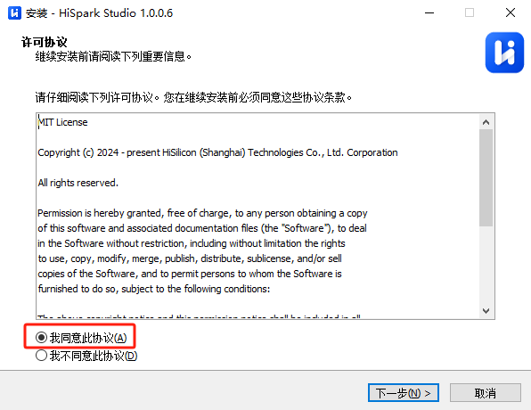

​    

  - 根据用户自身磁盘空间大小，选择对应的磁盘进行安装，选择完成后，点击下一步。（**注意如果你的用户名带中文目录，请安装到D盘、E盘等其他目录**，**这里以D盘为例**）
                                                   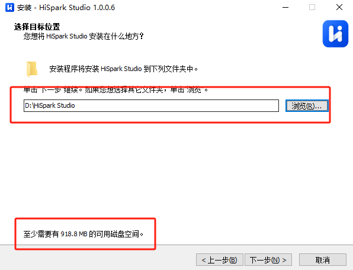

​    

  - 根据用户自身需要勾选附加任务，默认全部勾选，选择完成后，点击下一步。
                                                     
    
  - 点击“安装”，进行工具的安装。
    
    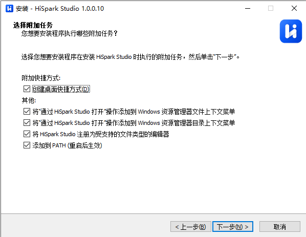
    
  - 安装过程如下，等待安装完成。
                                                         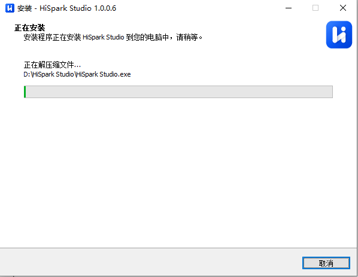
    
  - 如果在安装过程中弹出“python 3.11.4”会自动弹出“python”安装提示，点击“取消”即可
    
      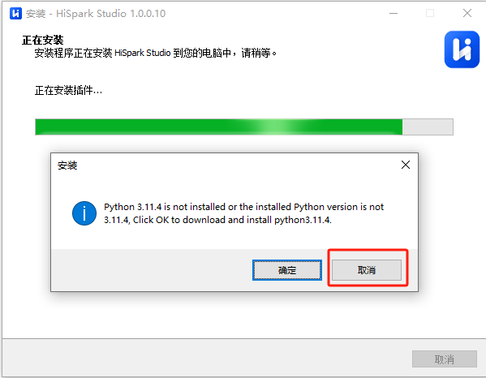
    
  - 出现如下界面代表安装完成，点击完成即可。
    
    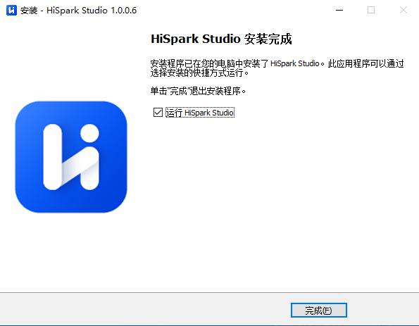
    
  - HiSpark studio打开主页界面如下。
    
    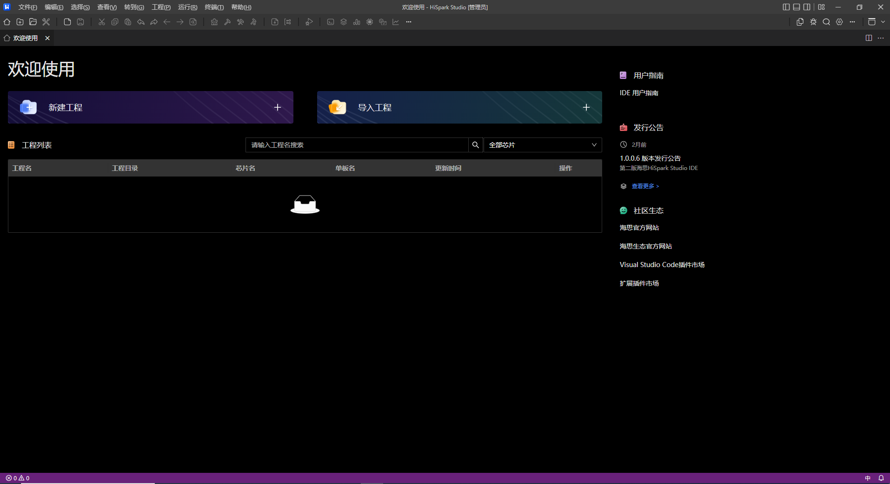
    
##  环境变量添加

  - 工具安装完成后，在电脑系统环境变量中，添加环境变量（这里以win10为例，如果是win11，可以在百度搜索如何添加环境变量），在此电脑鼠标“右键”，点击“属性”
    
      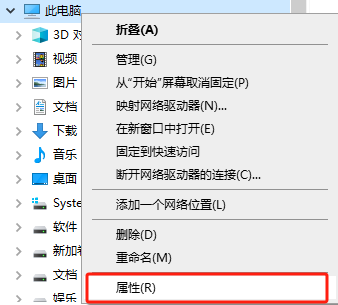
    
  - 弹出系统属性框，点击“环境变量”
    
      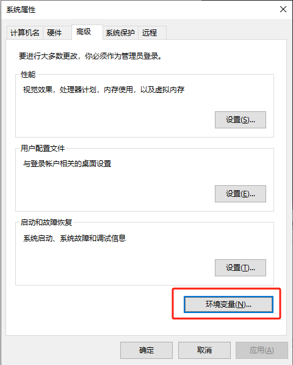
    
  - 在系统环境变量，选择“Path”，双击进入
    
      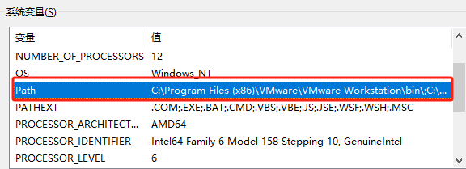
    
  - 在编辑环境变量中添加“xxx\HiSpark Studio\tools\Windows\ninja”、“xxx\HiSpark Studio\tools\Windows\gn”、“xxx\HiSpark Studio\tools\Windows\cc_riscv32_musl_fp_win\bin”在几个环境变量（xxx代表HiSpark Studio安装目录），添加完成后，点击“确定”。
    
      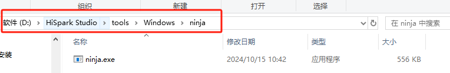
      
      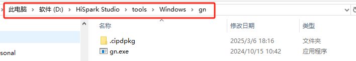
      
      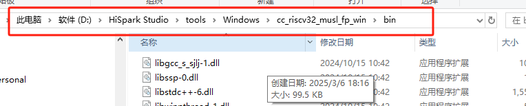
      
      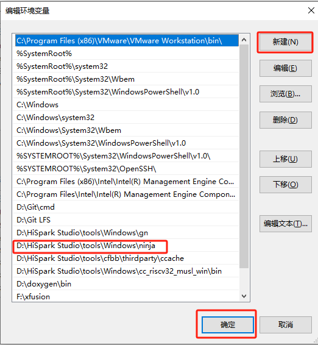
    
  - 环境变量安装完成后，测试是否添加成， 在“命令行窗口分别输入“ninja --version”、“gn -version”、“riscv32-linux-musl-gcc -v”，出现如下图所示版本号代表成功
    
      

## python下载及安装

  - 环境变量配置成功后，下载python（版本：3.11.4），[python下载地址：https://www.python.org/ftp/python/3.11.4/python-3.11.4-amd64.exe](https://www.python.org/ftp/python/3.11.4/python-3.11.4-amd64.exe)
    

       ​                                                                                  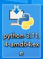
    
  - 下载完成后，点击安装，安装界面勾选“ADD python.exe to PATH”，选择“Customize installation”安装
    
    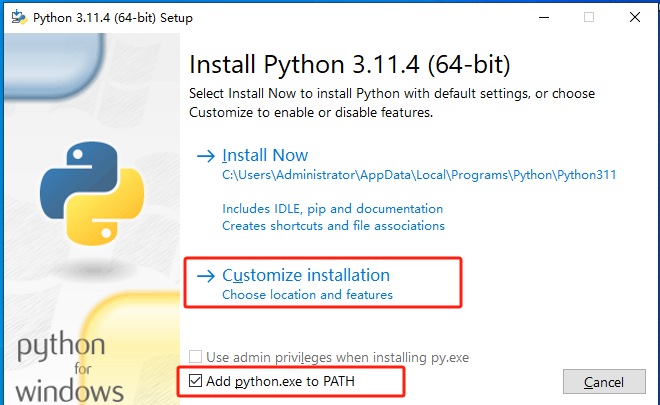
    
 - 点击“next”即可
   

​                                                    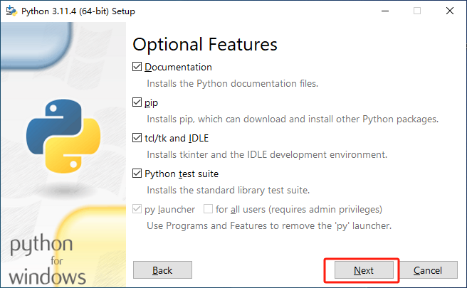
​    
  - 修改安装路径，如果电脑用户名不带中文可以默认安装，如果电脑用户名带中文，请安装其他磁盘（这里以D盘为例），选择好路径以后，点击“install”（**注意：安装目录不要带中文路径**）
    
    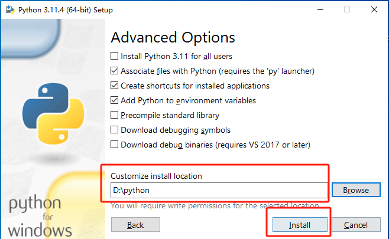
    
  - 等待安装完成即可
    
    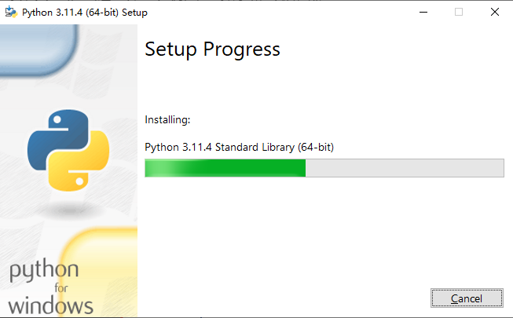
    
  - 安装完成后，点击“close”即可
    
    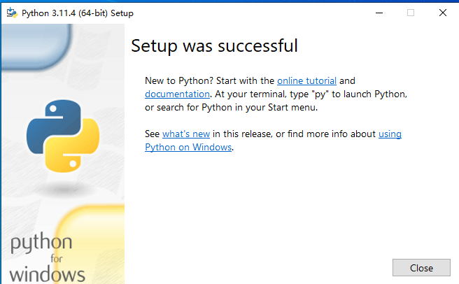
    
  - 打开“命令行窗口”，输入“python”，显示3.11.4即成功
    
    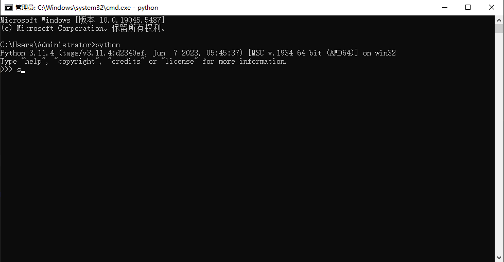
    
## 编译插件安装

  - 下载 [kconfiglib下载链接](https://files.pythonhosted.org/packages/8a/f1/d98a89231e779b079b977590efcc31249d959c8f1d4b5858cad69695ff9c/kconfiglib-14.1.0-py2.py3-none-any.whl) 
    
  - 下载插件 [cmake下载链接](https://files.pythonhosted.org/packages/65/7f/80cf681cd376834b442af8af48e6f17b4197d20b7255aa2f76d8d93a9e44/cmake-3.20.5-py2.py3-none-win_amd64.whl)
    
  - 下载插件 [pycparser下载链接](https://files.pythonhosted.org/packages/62/d5/5f610ebe421e85889f2e55e33b7f9a6795bd982198517d912eb1c76e1a53/pycparser-2.21-py2.py3-none-any.whl) 
    
  - 下载插件 [windows_curses下载链接](https://files.pythonhosted.org/packages/18/1b/e06eb41dad1c74f0d3124218084f258f73a5e76c67112da0ba174162670f/windows_curses-2.3.3-cp311-cp311-win_amd64.whl) 
    
  - 将kconfiglib、cmake、pycparser、windows_curses等文件存放在同一个目录下（**任意目录即可**），在目录文件夹上放输入“cmd”
    
      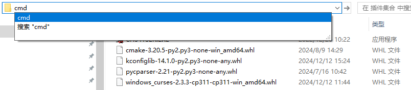
    
  - 在“命令行窗口”输入pip install windows_curses-2.3.3-cp311-cp311-win_amd64.whl
    
      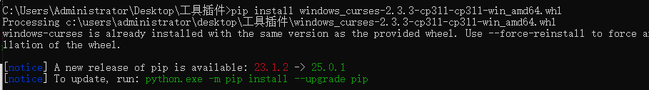
    
  - 在“命令行窗口”输入pip install cmake-3.20.5-py2.py3-none-win_amd64.whl
    
      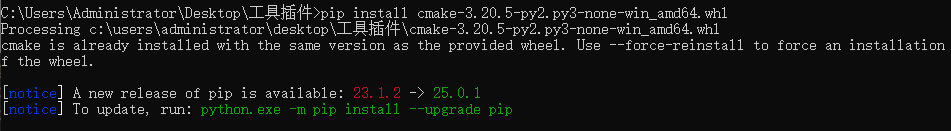
    
  - 在“命令行窗口”输入pip install kconfiglib-14.1.0-py2.py3-none-any.whl
    
      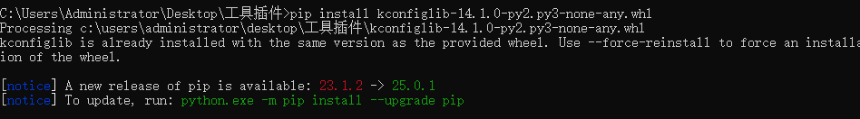
    
  - 在“命令行窗口”输入pip install pycparser-2.21-py2.py3-none-any.whl
    
    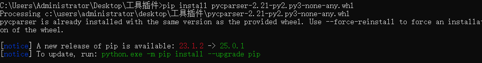
    
## 星闪代码下载

  - 下载SDK代码，目前提供两种方式，第一种方式如下:
    
    - 第一种方式通过git指令下载（在Windows上使用git指令下载代码，需要提前安装git，  [Git下载链接地址：https://git-scm.com/downloads/win](https://git-scm.com/downloads/win)），在xx盘鼠标右键选择“Open Git Bash here”，如下图所所示（**建议在D盘、E盘根目录执行**）
    
      
    
    - 在命令框中输入`git clone https://gitee.com/HiSpark/fbb_ws63.git`指令下载代码，等待下载完成。
    
    
    
    
    
  - 第二种方式ZIP下载方式如下：
    
     - [SDK包下载地址：https://gitee.com/HiSpark/fbb_ws63](https://gitee.com/HiSpark/fbb_ws63)，在主界面上点击“克隆/下载”，选择“下载ZIP”，等待下载，下载完成如下。
     
        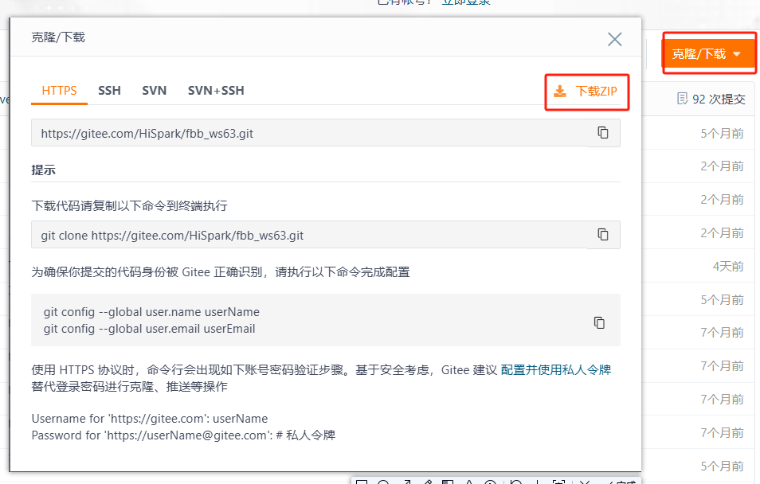

  - 解压“fbb_ws63_master”，**在解压过程中需要关闭电脑杀毒软件**（**防止有些文件当做病毒被删除掉**），解压方式选择“Extract Here”即可（**建议解压到D盘、E盘等根目录，路径不要太深，且不要有中文路径**）
    
      

## 新建工程

  - 代码下载完成后，打开HiSpark studio工具，点击“新建工程”。
    
      
    
  - 新建工程界面中芯片：“WS63”，工程名：“xxx”（用户自定义，但是不能带中文，特殊符号），软件包：“xxx/fbb_ws63/src”（**SDK软件包存放路径，这个地方一定要选到src层级，否则编译会失败**），配置选择完成后，点击“完成按钮”。
    
      
    
  - 点击“build”或者“rebuild”编译（**编译建议关闭杀毒软件，不关可能会导致编译时间长**）
    
      
    
  - 编译完成如下图所示。
    
      

## 镜像烧录

  - 硬件搭建：Typec线将板端与PC端连接
    
      
    
  - 安装驱动“CH341SER驱动”（[CH341SER驱动下载地址](https://www.wch.cn/downloads/CH341SER_EXE.html)，**如果该链接失效或者无法下载，用户自行百度下载即可**），安装CH341SER驱动，安装前单板需要与PC端相连，点击安装即可，显示**驱动安装成功代表成功**，如果出现**驱动预安装成功代表安装失败**
    
      
      
      
    
  - 安装成功后，在HiSpark Studio工具中点击“工程配置”按钮，选择“程序加载”，传输方式选择“serial”，端口选择“comxxx”，com口在设备管理器中查看。
    
      
    
  - 配置完成后，点击工具“程序加载”按钮烧录。
    
      
    
  - 出现“Connecting, please reset device...”字样时，复位开发板，等待烧录结束。
    
      
    
  - 在HiSpark Studio底端选择“监视器”，选择端口（**开发板需要与电脑通过typec连接**），如果没有端口显示可以刷新一下，点击“开始监视”，复位开发板，出现“flashboot version”字样代表编译烧录成功
    
      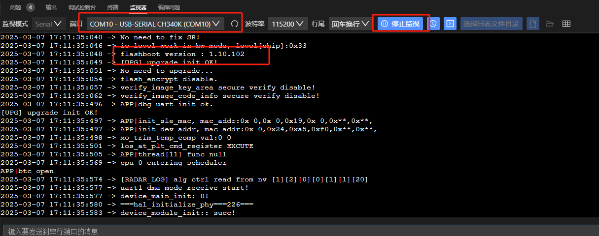

## FAQ

  -  如果根据文档没有编译成功，请参考https://developer.hisilicon.com/postDetail?tid=02110170392979486020
  -  如果根据文档编译成功，但是在编写其他代码后，导致编译失败，可以在论坛提问，论坛链接：https://developer.hisilicon.com/forum/0133146886267870001

# 2、操作系统实验

## 事件

###  介绍

**功能介绍：** 本实验内容实现了任务间的同步，多任务环境下，任务之间往往需要同步操作，一个等待即是一个同步，事件可以提供一对多、多对多的同步操作。

**软件概述：** 写事件时，对指定事件写入指定的事件类型，可以一次同时写多个事件类型。读事件可以选取读取模式，所有事件，读取掩码中所有事件类型，只有读取的所有事件类型都发生，才能读取成功；任一事件，读取掩码中任一事件类型，读取的事件中任一一种类型发生，即可读取成功。

**硬件概述：** 核心板。硬件搭建要求如图所示：

### 约束与限制

#### 支持应用运行的芯片和开发板

本示例支持开发板：HiHope_NearLink_DK3863E_V03

### 支持API版本、SDK版本

本示例支持版本号：1.10.101

### 支持IDE版本、支持配套工具版本

本示例支持IDE版本号：1.0.0.6；

### 效果预览

### 接口介绍

#### osal_event_init()

| **定义：**   | int osal_event_init(osal_event *event_obj); |
| ------------ | ------------------------------------------- |
| **功能：**   | 初始化一个事件控制模块                      |
| **参数：**   | event_obj：事件                             |
| **返回值：** | OSAL_SUCCESS：成功    Other：OSAL_FAILURE   |
| **依赖：**   | kernel\osal\include\event\osal_event.h      |

#### osal_event_read()

| 定义：       | int osal_event_read(osal_event *event_obj, unsigned int mask, unsigned int timeout_ms, unsigned int mode); |
| ------------ | ------------------------------------------------------------ |
| **功能：**   | 阻塞读取指定事件类型，等待超时时间为相对时间，单位：ms       |
| **参数：**   | event_obj：事件 mask：事件掩码  timeout_ms：超时时间 mode：事件类型 |
| **返回值：** | OSAL_SUCCESS：成功    Other：OSAL_FAILURE                    |
| **依赖：**   | kernel\osal\include\event\osal_event.h                       |

#### osal_event_write()

| **定义：**   | int osal_event_write(osal_event *event_obj, unsigned int mask); |
| ------------ | ------------------------------------------------------------ |
| **功能：**   | 写指定的事件类型                                             |
| **参数：**   | event_obj：事件 mask：事件掩码                           |
| **返回值：** | OSAL_SUCCESS：成功    Other：OSAL_FAILURE                    |
| **依赖：**   | kernel\osal\include\event\osal_event.h                       |

#### osal_event_clear()

| **定义：**   | int osal_event_clear(osal_event *event_obj, unsigned int mask); |
| ------------ | ------------------------------------------------------------ |
| **功能：**   | 清除指定的事件类型                                           |
| **参数：**   | event_obj：事件 mask：事件掩码                           |
| **返回值：** | OSAL_SUCCESS：成功    Other：OSAL_FAILURE                    |
| **依赖：**   | kernel\osal\include\event\osal_event.h                       |

#### osal_event_destroy()

| **定义：**   | errcode_t uapi_timer_deinit(void);        |
| ------------ | ----------------------------------------- |
| **功能：**   | 销毁指定的事件控制块                      |
| **参数：**   | void类型                                  |
| **返回值：** | OSAL_SUCCESS：成功    Other：OSAL_FAILURE |
| **依赖：**   | kernel\osal\include\event\osal_event.h    |

### 具体实现

步骤一：调用事件初始化osal_event_init接口，初始化事件等待队列。

步骤二：写事件osal_event_write，配置事件掩码类型。

步骤三：读事件osal_event_read，选择读取模式。

步骤四：清除事件osal_event_clear，清除指定事件类型

### 实验流程

- 步骤一：在xxx\src\application\samples\peripheral文件夹新建一个sample文件夹，在peripheral上右键选择“新建文件夹”，创建Sample文件夹，例如名称”event“。

  

- 步骤二：将xxx\vendor\HiHope_NearLink_DK_WS63E_V03\event文件里面内容拷贝到**步骤一创建的Sample文件夹中”event“**。

  

- 步骤三：在xxx\src\application\samples\peripheral\CMakeLists.txt文件中新增编译案例，具体如下图所示（如果不知道在哪个地方加的，可以在“set(SOURCES "${SOURCES}" PARENT_SCOPE)”上面一行添加）。

  

- 步骤四：在xxx\src\application\samples\peripheral\Kconfig文件中新增编译案例，具体如下图所示（如果不知道在哪个地方加，可以在最后一行添加）。

  

- 步骤五：点击如下图标，选择KConfig，具体选择路径“Application/Enable the Sample of peripheral”，在弹出框中选择“support EVENT Sample”，点击Save，关闭弹窗。

  

- 步骤六：点击“build”或者“rebuild”编译

  

- 步骤七：编译完成如下图所示。

  

- 步骤八：在HiSpark Studio工具中点击“工程配置”按钮，选择“程序加载”，传输方式选择“serial”，端口选择“comxxx”，com口在设备管理器中查看（如果找不到com口，请参考windows环境搭建）。

  

- 步骤九：配置完成后，点击工具“程序加载”按钮烧录。

  

- 步骤十：出现“Connecting, please reset device...”字样时，复位开发板，等待烧录结束。

  

- 步骤十一：软件烧录成功后，按一下开发板的RESET按键复位开发板，烧录完成后，串口打印信息如下。

  

## message

### 介绍

  **功能介绍：** 本实验内容实现了创建一个队列，两个任务，任务1调用发送接口发送消息，任务2通过接收接口接收消息。

  **软件概述：** 队列又称消息队列，是一种常用于任务间通信的数据结构，实现了接收来自任务或中断的不固定长度的消息，接收方根据消息ID读取消息。系统中使用队列数据结构实现任务异步通信工作，具有如下特性：

  - 消息以先进先出方式排队，支持异步读写工作方式。
  - 读队列和写队列都支持超时机制。
  - 发送消息类型由通信双方约定，可以允许不同长度（不超过队列节点最大值）消息。
  - 一个任务能够从任意一个消息队列接收和发送消息。
  - 多个任务能够从同一个消息队列接收和发送消息。
  - 当队列使用结束后，如果是动态申请的内存，需要通过释放内存函数回收。

  **硬件概述：** 核心板。硬件搭建要求如图所示：

  

### 约束与限制

#### 支持应用运行的芯片和开发板

  本示例支持开发板：HiHope_NearLink_DK3863E_V03

#### 支持API版本、SDK版本

  本示例支持版本号：1.10.101

#### 支持IDE版本、支持配套工具版本

  本示例支持IDE版本号：1.0.0.6；

### 效果预览

  

### 接口说明

#### osal_msg_queue_creat()

  | **定义：**   | int osal_msg_queue_create(const char *name, unsigned short queue_len, unsigned long *queue_id, unsigned int flags,unsigned short max_msgsize); |
  | ------------ | ------------------------------------------------------------ |
  | **功能：**   | 创建消息队列                                                 |
  | **参数：**   | name：消息队列名称 queue_len：队列长度。值范围为[1,0xffff] queue_id：成功创建的队列控制结构的ID flags：队列模式 max_msgsize：节点大小。值范围为[1,0xffff]，注意节点不宜过大也不易过小，可以参考代码注释 |
  | **返回值：** | OSAL_SUCCESS：成功    Other：OSAL_FAILURE                    |
  | **依赖：**   | kernel\osal\include\msgqueue\osal_msgqueue.h                 |

  #### osal_msg_queue_delete()

  | 定义：       | void osal_msg_queue_delete(unsigned long queue_id); |
  | ------------ | --------------------------------------------------- |
  | **功能：**   | 删除消息队列                                        |
  | **参数：**   | queue_id：成功创建的队列控制结构的ID                |
  | **返回值：** | OSAL_SUCCESS：成功    Other：OSAL_FAILURE           |
  | **依赖：**   | kernel\osal\include\msgqueue\osal_msgqueue.h        |

  #### osal_msg_queue_write_copy()

  | **定义：**   | int osal_msg_queue_write_copy(unsigned long queue_id, void *buffer_addr, unsigned int buffer_size, unsigned int timeout); |
  | ------------ | ------------------------------------------------------------ |
  | **功能：**   | 发送消息到队列尾部                                           |
  | **参数：**   | queue_id：成功创建的队列控制结构的ID buffer_addr：存储要写入的数据的起始地址 buffer_size：写入数据长度 timeout：超时时间 |
  | **返回值：** | OSAL_SUCCESS：成功    Other：OSAL_FAILURE                    |
  | **依赖：**   | kernel\osal\include\msgqueue\osal_msgqueue.h                 |

  #### osal_msg_queue_read_copy()

  | **定义：**   | int osal_msg_queue_read_copy(unsigned long queue_id, void *buffer_addr, unsigned int *buffer_size,unsigned int timeout); |
  | ------------ | ------------------------------------------------------------ |
  | **功能：**   | 阻塞接收信息，单位：ms                                       |
  | **参数：**   | queue_id：成功创建的队列控制结构的ID buffer_addr：读取数据的起始地址 buffer_size：读取数据长度 timeout：超时时间 |
  | **返回值：** | OSAL_SUCCESS：成功    Other：OSAL_FAILURE                    |
  | **依赖：**   | kernel\osal\include\msgqueue\osal_msgqueue.h                 |

### 具体实现

  步骤一：创建一个队列，两个任务，任务1调用发送接口发送消息，任务二通过接收窗口接收消息。

  步骤二：通过osal_kthread_creat创建任务1和任务2。

  步骤三：通过osal_msg_queue_creat创建一个消息队列。

  步骤四：在任务1调用osal_msg_queue_write_copy发送消息。

  步骤五：在任务2调用osal_msg_queue_read_copy接收消息。

### 实验流程

- 步骤一：在xxx\src\application\samples\peripheral文件夹新建一个sample文件夹，在peripheral上右键选择“新建文件夹”，创建Sample文件夹，例如名称”message“。

    

- 步骤二：将xxx\vendor\HiHope_NearLink_DK_WS63E_V03\message文件里面内容拷贝到**步骤一创建的Sample文件夹中”message“**。

    

- 步骤三：在xxx\src\application\samples\peripheral\CMakeLists.txt文件中新增编译案例，具体如下图所示（如果不知道在哪个地方加的，可以在“set(SOURCES "${SOURCES}" PARENT_SCOPE)”上面一行添加）**。

    

- 步骤四：在xxx\src\application\samples\peripheral\Kconfig文件中新增编译案例，具体如下图所示（如果不知道在哪个地方加，可以在最后一行添加）。

    
- 步骤五：点击如下图标，选择KConfig，具体选择路径“Application/Enable the Sample of peripheral”，在弹出框中选择“support A6_KERNAL_MESSAGE Sample”，点击Save，关闭弹窗。

    

- 步骤六：点击“build”或者“rebuild”编译

    

- 步骤七：编译完成如下图所示。

    

- 步骤八：在HiSpark Studio工具中点击“工程配置”按钮，选择“程序加载”，传输方式选择“serial”，端口选择“comxxx”，com口在设备管理器中查看（如果找不到com口，请参考windows环境搭建）。

    

- 步骤九：配置完成后，点击工具“程序加载”按钮烧录。

    

- 步骤十：出现“Connecting, please reset device...”字样时，复位开发板，等待烧录结束。

    

- 步骤十一：软件烧录成功后，按一下开发板的RESET按键复位开发板，烧录完成后，串口打印信息如下。

    

## mutex
### 介绍
**功能介绍：** 本实验内容实现了防止两个任务在同一时刻访问相同共享资源。
**软件概述：** 互斥锁又称互斥型信号量，是一种特殊的二值性信号量，用于实现对共享资源的独占式处理。任意时刻互斥锁的状态只有两种：闭锁，当有任务持有时，这个任务获得该互斥锁的所有权；开锁，当该任务释放它时，该互斥锁被开锁，任务失去该互斥锁的所有权。当一个任务持有互斥锁时，其他任务将不能再对该互斥锁进行开锁或持有。多任务环境下往往存在多个任务竞争同一共享资源的应用场景，互斥锁可被用于对共享资源的保护从而实现独占式访问。
**硬件概述：** 核心板。硬件搭建要求如图所示：
    

### 约束与限制
#### 支持应用运行的芯片和开发板
本示例支持开发板：HiHope_NearLink_DK3863E_V03
#### 支持API版本、SDK版本
本示例支持版本号：1.10.101
#### 支持IDE版本、支持配套工具版本
本示例支持IDE版本号：1.0.0.6；
### 效果预览

  

### 接口说明

#### osal_mutex_init()

| **定义：**   | int osal_mutex_init(osal_mutex *mutex);   |
| ------------ | ----------------------------------------- |
| **功能：**   | 初始化互斥锁                              |
| **参数：**   | mutex：互斥对象                           |
| **返回值：** | OSAL_SUCCESS：成功    Other：OSAL_FAILURE |
| **依赖：**   | kernel\osal\include\mutex\osal_mutex.h    |

#### osal_mutex_destroy()

| 定义：       | void osal_mutex_destroy(osal_mutex *mutex); |
| ------------ | ------------------------------------------- |
| **功能：**   | 删除指定的互斥锁                            |
| **参数：**   | mutex：互斥对象                             |
| **返回值：** | OSAL_SUCCESS：成功    Other：OSAL_FAILURE   |
| **依赖：**   | kernel\osal\include\mutex\osal_mutex.h      |

#### osal_mutex_lock_timeout()

| **定义：**   | int osal_mutex_lock_timeout(osal_mutex *mutex, unsigned int timeout); |
| ------------ | ------------------------------------------------------------ |
| **功能：**   | 阻塞获取互斥锁，单位：ms                                     |
| **参数：**   | mutex：互斥对象 timeout：超时时间                        |
| **返回值：** | OSAL_SUCCESS：成功    Other：OSAL_FAILURE                    |
| **依赖：**   | kkernel\osal\include\mutex\osal_mutex.h                      |

#### osal_event_unlock()

| **定义：**   | void osal_mutex_unlock(osal_mutex *mutex); |
| ------------ | ------------------------------------------ |
| **功能：**   | 释放指定互斥锁                             |
| **参数：**   | mutex：互斥对象                            |
| **返回值：** | OSAL_SUCCESS：成功    Other：OSAL_FAILURE  |
| **依赖：**   | kernel\osal\include\mutex\osal_mutex.h     |

### 具体实现
步骤一：任务example_task_mux创建一个互斥锁，锁任务调度，创建两个任务example_mutex_task1、example_mutex_task2，example_mutex_task2优先级高于example_mutex_task1，解锁任务调度。
  	 步骤二：example_mutex_task2被调度，永久申请互斥锁，然后任务休眠100ms，example_mutex_task2挂起，example_mutex_task1被唤醒。
 	  步骤三：example_mutex_task1申请互斥锁，等待时间为10ms，因互斥锁仍被example_mutex_task2持有，example_mutex_task1挂起，10ms后未拿到互斥锁，example_mutex_task1被唤醒，试图以永久等待申请互斥锁，example_mutex_task1挂起。
 	 步骤四：100ms后example_mutex_task2唤醒，释放互斥锁后，example_mutex_task1被调度运行后释放互斥锁。
  	步骤五：example_mutex_task1执行完，300ms后，删除互斥锁。

### 实验流程
  - 步骤一：在xxx\src\application\samples\peripheral文件夹新建一个sample文件夹，在peripheral上右键选择“新建文件夹”，创建Sample文件夹，例如名称”mutex“。
      
      
  - 步骤二：将xxx\vendor\HiHope_NearLink_DK_WS63E_V03\mutex文件里面内容拷贝到**步骤一创建的Sample文件夹中”mutex“**。
      
      
  - 步骤三：在xxx\src\application\samples\peripheral\CMakeLists.txt文件中新增编译案例，具体如下图所示（如果不知道在哪个地方加的，可以在“set(SOURCES "${SOURCES}" PARENT_SCOPE)”上面一行添加）。
      
    
  - 步骤四：在xxx\src\application\samples\peripheral\Kconfig文件中新增编译案例，具体如下图所示（如果不知道在哪个地方加，可以在最后一行添加）。
    
      
    
  - 步骤五：点击如下图标，选择KConfig，具体选择路径“Application/Enable the Sample of peripheral”，在弹出框中选择“support MUTEX Sample”，点击Save，关闭弹窗。
      
    
  - 步骤六：点击“build”或者“rebuild”编译
    
      
    
  - 步骤七：编译完成如下图所示。
    
      
    
  - 步骤八：在HiSpark Studio工具中点击“工程配置”按钮，选择“程序加载”，传输方式选择“serial”，端口选择“comxxx”，com口在设备管理器中查看（如果找不到com口，请参考windows环境搭建）。
    
      
    
  - 步骤九：配置完成后，点击工具“程序加载”按钮烧录。
    
      
    
  - 步骤十：出现“Connecting, please reset device...”字样时，复位开发板，等待烧录结束。
    
      
    
  - 步骤十一：软件烧录成功后，按一下开发板的RESET按键复位开发板，烧录完成后，串口打印信息如下。
    
      
      
## semaphore

### 介绍

**功能介绍：** 本实验内容实现了两个任务之间同步获取信号量。

**软件概述：** 信号量（Semaphore）是一种实现任务间通信的机制，实现任务之间同步或临界资源的互斥访问。常用于协助一组相互竞争的任务来访问临界资源。在多任务系统中，各任务之间需要同步或互斥实现临界资源的保护，信号量功能可以为用户提供这方面的支持。通常一个信号量的计数值用于对应有效的资源数表示剩下的可被占用的互斥资源数。

**硬件概述：** 核心板。硬件搭建要求如图所示：

### 约束与限制

#### 支持应用运行的芯片和开发板

本示例支持开发板：HiHope_NearLink_DK3863E_V03

#### 支持API版本、SDK版本

本示例支持版本号：1.10.101

#### 支持IDE版本、支持配套工具版本

本示例支持IDE版本号：1.0.0.6；

### 效果预览

### 接口说明

#### osal_sem_init()

| **定义：**   | int osal_sem_init(osal_semaphore *sem, int val); |
| ------------ | ------------------------------------------------ |
| **功能：**   | 创建信号量                                       |
| **参数：**   | sem：信号量对象 val：可用信号量初始化数量    |
| **返回值：** | OSAL_SUCCESS：成功    Other：OSAL_FAILURE        |
| **依赖：**   | kernel\osal\include\semaphore\osal_semaphore.h   |

#### osal_sem_binary_sem_init()

| 定义：       | int osal_sem_binary_sem_init(osal_semaphore *sem, int val); |
| ------------ | ----------------------------------------------------------- |
| **功能：**   | 创建二进制信号量                                            |
| **参数：**   | sem：信号量对象 val：可用信号量初始化数量，范围[0, 1]   |
| **返回值：** | OSAL_SUCCESS：成功    Other：OSAL_FAILURE                   |
| **依赖：**   | kernel\osal\include\semaphore\osal_semaphore.h              |

#### osal_sem_down_timeout()

| **定义：**   | int osal_sem_down_timeout(osal_semaphore *sem, unsigned int timeout); |
| ------------ | ------------------------------------------------------------ |
| **功能：**   | 阻塞获取指定信号量，单位：ms                                 |
| **参数：**   | sem：信号量对象 timeout：超时时间                        |
| **返回值：** | OSAL_SUCCESS：成功    Other：OSAL_FAILURE                    |
| **依赖：**   | kernel\osal\include\semaphore\osal_semaphore.h               |

#### osal_sem_up()

| **定义：**   | void osal_sem_up(osal_semaphore *sem);         |
| ------------ | ---------------------------------------------- |
| **功能：**   | 释放指定信号量                                 |
| **参数：**   | sem：信号量对象                                |
| **返回值：** | OSAL_SUCCESS：成功    Other：OSAL_FAILURE      |
| **依赖：**   | kernel\osal\include\semaphore\osal_semaphore.h |

### 具体流程

步骤一：创建信号量osal_sem_init或者osal_sem_binary_sem_init.

步骤二：申请信号量osal_sem_down_timeout。

信号量有3种申请模式：

无阻塞模式：任务需要申请信号量，若当前信号量的任务数没有到信号量设定的上限，则申请成功。否则，立即返回申请失败。超时时间设置为0。

永久阻塞模式：任务需要申请信号量，若当前信号量的任务数没有到信号量设定的上限，则申请成功。否则，该任务进入阻塞态，系统切换到就绪任务中优先级高者继续执行。任务进入阻塞态后，直到有其他任务释放该信号 量，阻塞任务才会重新得以执行。超时时间设置为HI_SYS_WAIT_FOREVER。

定时阻塞模式：任务需要申请信号量，若当前信号量的任务数没有到信号量设定的上限，则申请成功。否则，该任务进入阻塞态，系统切换到就绪任务中优先级.高者继续执行。任务进入阻塞态后，指定时间超时前有其他任务 释放该信号量，或者用户指定时间超时后，阻塞任务才会重新得以执行。超时时间设置为合理值。

步骤三：释放信号量osal_sem_up。如果有任务阻塞于指定信号量，则唤醒该信号量阻塞队列上的第一个任务。 该任务进入就绪态，并进行调度。 如果没有任务阻塞于指定信号量，释放信号量成功。

步骤四：删除信号量osal_sem_destroy。

### 实验流程

- 步骤一：在xxx\src\application\samples\peripheral文件夹新建一个sample文件夹，在peripheral上右键选择“新建文件夹”，创建Sample文件夹，例如名称”semaphore“。

  

- 步骤二：将xxx\vendor\HiHope_NearLink_DK_WS63E_V03\semaphore文件里面内容拷贝到**步骤一创建的Sample文件夹中”semaphore“**。

- 步骤三：在xxx\src\application\samples\peripheral\CMakeLists.txt文件中新增编译案例，具体如下图所示（如果不知道在哪个地方加的，可以在“set(SOURCES "${SOURCES}" PARENT_SCOPE)”上面一行添加）。

  

- 步骤四：在xxx\src\application\samples\peripheral\Kconfig文件中新增编译案例，具体如下图所示（如果不知道在哪个地方加，可以在最后一行添加）。

  

- 步骤五：点击如下图标，选择KConfig，具体选择路径“Application/Enable the Sample of peripheral”，在弹出框中选择“support SEMAPHORE Sample”，点击Save，关闭弹窗。

  

- 步骤六：点击“build”或者“rebuild”编译

  

- 步骤七：编译完成如下图所示。

  

- 步骤八：在HiSpark Studio工具中点击“工程配置”按钮，选择“程序加载”，传输方式选择“serial”，端口选择“comxxx”，com口在设备管理器中查看（如果找不到com口，请参考windows环境搭建）。

  

- 步骤九：配置完成后，点击工具“程序加载”按钮烧录。

  

- 步骤十：出现“Connecting, please reset device...”字样时，复位开发板，等待烧录结束。

  

- 步骤十一：软件烧录成功后，按一下开发板的RESET按键复位开发板，烧录完成后，串口打印信息如下。

  

## thread

### 介绍

**功能介绍：** 本实验内容实现了创建两个任务进程task，任务1每1S打印一次“This is Thread1---”，任务二每500ms打印一次“This is Thread2---”。

**软件概述：** 任务是竞争系统资源的最小运行单元。任务可以使用或等待CPU、使用内存空间等系统资源，并独立于其它任务运行。任务模块可以给用户提供多个任务，实现了任务之间的切换和通信，帮助用户管理业务程序流程。

- 支持多任务，一个任务表示一个线程。
- 任务是抢占式调度机制，同时支持时间片轮转调度方式。
- 高优先级的任务可打断低优先级任务，低优先级任务必须在高优先级任务阻塞或结束后才能得到调度。
- 有32个优先级[0, 31],最高优先级为0，最低优先级为31，建议用户使用优先级范围是[10, 30]

**硬件概述：** 核心板。硬件搭建要求如图所示。

### 约束与限制

#### 支持应用运行的芯片和开发板

本示例支持开发板：HiHope_NearLink_DK3863E_V03

#### 支持API版本、SDK版本

本示例支持版本号：1.10.101

#### 支持IDE版本、支持配套工具版本

本示例支持IDE版本号：1.0.0.6；

#### 效果预览

任务1每1S打印一次“This is Thread1----”，任务二每500ms打印一次“This is Thread2----。

### 接口介绍

#### osal_kthread_lock()

| **定义：**   | void osal_kthread_lock(void);            |
| ------------ | ---------------------------------------- |
| **功能：**   | 禁止系统任务调度                         |
| **参数：**   | void类型                                 |
| **返回值：** | 无                                       |
| **依赖：**   | kernel\osal\include\schedule\osal_task.h |

#### osal_kthread_create()

| 定义：       | osal_task *osal_kthread_create(osal_kthread_handler handler, void *data, const char *name, unsigned int stack_size); |
| ------------ | ------------------------------------------------------------ |
| **功能：**   | 创建任务                                                     |
| **参数：**   | handler：线程要处理的函数 data：函数处理程序数据 name：显示的线程名称 stack_size：线程堆栈空间的大小 |
| **返回值：** | ERRCODE_SUCC：成功    Other：失败                            |
| **依赖：**   | kernel\osal\include\schedule\osal_task.h                     |

#### osal_kthread_set_priority()

| **定义：**   | int osal_kthread_set_priority(osal_task *task, unsigned int priority); |
| ------------ | ------------------------------------------------------------ |
| **功能：**   | 设置任务优先级                                               |
| **参数：**   | task：要排定优先级的线程 priority：要设定的优先级        |
| **返回值：** | OSAL_SUCCESS：成功    OSAL_FAILURE：失败                     |
| **依赖：**   | kernel\osal\include\schedule\osal_task.h                     |

#### osal_kthread_unlock()

| **定义：**   | void osal_kthread_unlock(void);          |
| ------------ | ---------------------------------------- |
| **功能：**   | 允许系统任务调度                         |
| **参数：**   | void                                     |
| **返回值：** | 无                                       |
| **依赖：**   | kernel\osal\include\schedule\osal_task.h |

### 具体实现

步骤一：在xxx\src\kernel\liteos\liteos_v208.5.0\Huawei_LiteOS\.config中配置任务数，默认为20，配置LOSCFG_BASE_CORE_TSK_LIMIT系统支持最大任务数需要根据用户需求配置；

步骤二：锁任务osal_kthread_lock，锁住任务，防止高优先级任务调度；

步骤三：创建任务osThreadNew；

步骤四：运行任务app_run()，代码总入口;

步骤五：解锁任务osal_kthread_unlock，让任务按照优先级进行调度；

### 案例实现

- 步骤一：在xxx\src\application\samples\peripheral文件夹新建一个sample文件夹，在peripheral上右键选择“新建文件夹”，创建Sample文件夹，例如名称”thread“。

  

- 步骤二：将xxx\vendor\HiHope_NearLink_DK_WS63E_V03\thread文件里面内容“CMakeList.txt”、“thread_example.c”拷贝到**步骤一创建的Sample文件夹中”thread“**下。

- 步骤三：在xxx\src\application\samples\peripheral\CMakeLists.txt文件中新增编译案例，具体如下图所示（如果不知道在哪个地方加的，可以在“set(SOURCES "${SOURCES}" PARENT_SCOPE)”上面一行添加）。

- 步骤四：在xxx\src\application\samples\peripheral\Kconfig文件中新增编译案例，具体如下图所示（如果不知道在哪个地方加，可以在最后一行添加）。

  

- 步骤五：点击如下图标，选择KConfig，具体选择路径“Application/Enable the Sample of peripheral”，在弹出框中选择“support THREAD Sample”，点击Save，关闭弹窗。

  

- 步骤六：点击“build”或者“rebuild”编译

  

- 步骤七：编译完成如下图所示。

  

- 步骤八：在HiSpark Studio工具中点击“工程配置”按钮，选择“程序加载”，传输方式选择“serial”，端口选择“comxxx”，com口在设备管理器中查看（如果找不到com口，请参考windows环境搭建）。

  

- 步骤九：配置完成后，点击工具“程序加载”按钮烧录。

  

- 步骤十：出现“Connecting, please reset device...”字样时，复位开发板，等待烧录结束。

  

- 步骤十一：软件烧录成功后，按一下开发板的RESET按键复位开发板，烧录完成后，任务1每1S打印一次“This is Thread1----”，任务二每500ms打印一次“This is Thread2。串口打印信息如下。

  

# 3、基础实验

## beep

### 介绍

**功能介绍：** 使用PWM控制蜂鸣器鸣响。

**软件概述：** PWM是脉冲宽度调制缩写，通过调节占空比的变化来调节信号、能量等的变化，占空比就是指在一个周期内，信号处于高电平的时间占据整个信号周期的百分比。

**硬件概述：** 核心板、交通灯板。通过板端丝印可以看出交通灯板的蜂鸣器BEEP与底板的A9相连，底板左边A9对应核心板GPIO 9。硬件搭建要求如图所示：

  参考[核心板原理图](../../../../docs/hardware/HiHope_NearLink_DK_WS63E_V03/HIHOPE_NEARLINK_DK_3863E_V03.pdf)、[交通灯板原理图](../../../../docs/hardware/HiHope_NearLink_DK_WS63E_V03/HiSpark_WiFi_IoT_SSL_VER.A.pdf)、[底板原理图](../../../../docs/hardware/HiHope_NearLink_DK_WS63E_V03/HiSpark_WiFi_IoT_EXB_VER.A.pdf)

  

### 约束与限制

#### 支持应用运行的芯片和开发板

  本示例支持开发板：HiHope_NearLink_DK3863E_V03

#### 支持API版本、SDK版本

  本示例支持版本号：1.10.101

#### 支持IDE版本

  本示例支持IDE版本号：1.0.0.6；

### 效果预览

  蜂鸣器鸣响

### 接口介绍

#### uapi_pwm_open()

| **定义：**   | errcode_t uapi_pwm_open(uint8_t channel, const pwm_config_t *cfg); |
| ------------ | ------------------------------------------------------------ |
| **功能：**   | 打开具有指定配置的PWM设备                                    |
| **参数：**   | channel：使用的pwm设备 cfg：PWM设备的配置信息            |
| **返回值：** | ERROCODE_SUCC：成功    Other：失败                           |
| **依赖：**   | include\driver\pwm.h                                         |

#### uapi_pwm_close()

| 定义：       | errcode_t uapi_pwm_close(uint8_t channel); |
| ------------ | ------------------------------------------ |
| **功能：**   | 关闭指定的PWM。                            |
| **参数：**   | channel：使用的pwm设备                     |
| **返回值：** | ERROCODE_SUCC：成功    Other：失败         |
| **依赖：**   | include\driver\pwm.h                       |

#### uapi_pwm_register_interrupt()

| **定义：**   | errcode_t uapi_pwm_register_interrupt(uint8_t channel, pwm_callback_t callback); |
| ------------ | ------------------------------------------------------------ |
| **功能：**   | 为PWM注册中断回调                                            |
| **参数：**   | channel：使用pwm设备  callback：回调函数                 |
| **返回值：** | ERROCODE_SUCC：成功    Other：失败                           |
| **依赖：**   | include\driver\pwm.h                                         |

#### uapi_pwm_start()

| **定义：**   | errcode_t uapi_pwm_start(uint8_t channel); |
| ------------ | ------------------------------------------ |
| **功能：**   | 开始PWM                                    |
| **参数：**   | channel：使用pwm设备                       |
| **返回值：** | ERROCODE_SUCC：成功    Other：失败         |
| **依赖：**   | include\driver\pwm.h                       |

#### uapi_pwm_set_group()

| **定义：**   | errcode_t uapi_pwm_set_group(uint8_t group, uint16_t channel_id); |
| ------------ | ------------------------------------------------------------ |
| **功能：**   | 为PWM通道分组                                                |
| **参数：**   | group：PWM组 channel_id：分配到同一个组里的所有通道id,channel_id中的每一位bit对应相对应的一个通道 |
| **返回值：** | ERROCODE_SUCC：成功    Other：失败                           |
| **依赖：**   | include\driver\pwm.h                                         |

###  具体实现

  步骤一：初始化PWM，配置PWM参数;

  步骤二：打开指定PWM设备

### 实验流程

- 步骤一：在xxx\src\application\samples\peripheral文件夹新建一个sample文件夹，在peripheral上右键选择“新建文件夹”，创建Sample文件夹，例如名称”beep“。

  

- 步骤二：将xxx\vendor\HiHope_NearLink_DK_WS63E_V03\beep文件里面内容拷贝到**步骤一创建的Sample文件夹中”beep“**。

  

* 步骤三：在xxx\src\application\samples\peripheral\CMakeLists.txt文件中新增编译案例，具体如下图所示（如果不知道在哪个地方加的，可以在“set(SOURCES "${SOURCES}" PARENT_SCOPE)”上面一行添加）。

  

* 步骤四：在xxx\src\application\samples\peripheral\Kconfig文件中新增编译案例，具体如下图所示（如果不知道在哪个地方加，可以在最后一行添加）。

  

- 步骤五：点击如下图标，选择”**系统配置**“，具体选择路径“Application/Enable the Sample of peripheral”，在弹出框中选择“support BEEP Sample”，点击Save，关闭弹窗。

  

- 步骤六：点击“build”或者“rebuild”编译

  

- 步骤七：编译完成如下图所示。

  

- 步骤八：在HiSpark Studio工具中点击“工程配置”按钮，选择“程序加载”，传输方式选择“serial”，端口选择“comxxx”，com口在设备管理器中查看（如果找不到com口，请参考windows环境搭建）。

  

- 步骤九：配置完成后，点击工具“程序加载”按钮烧录。

  

- 步骤十：出现“Connecting, please reset device...”字样时，复位开发板，等待烧录结束。

  

* 步骤十一：烧录完成后，交通灯板上的蜂鸣器鸣响。

## button

### 介绍

  **功能介绍：** 按键控制交通灯板上红色LED灯亮灭。

  **软件概述：** GPIO引脚可以通过软件控制，使得CPU能够读取或写入GPIO引脚的电平值。而GPIO中断控制器则可以通过监测GPIO引脚的状态来检测外部设备的信号，这些信号可以触发中断请求，从而让CPU能够快速响应外部设备的事件。

  **硬件概述：** 核心板、交通灯板。通过交通灯板上丝印可以看出是Switch与底板的MOSI相连，底板左边位置MOSI对应核心板上GPIO14。硬件搭建要求如图所示：

  参考[核心板原理图](../../../../docs/hardware/HiHope_NearLink_DK_WS63E_V03/HIHOPE_NEARLINK_DK_3863E_V03.pdf)、[交通灯板原理图](../../../../docs/hardware/HiHope_NearLink_DK_WS63E_V03/HiSpark_WiFi_IoT_SSL_VER.A.pdf)、[底板原理图](../../../../docs/hardware/HiHope_NearLink_DK_WS63E_V03/HiSpark_WiFi_IoT_EXB_VER.A.pdf)

  

### 约束与限制

#### 支持应用运行的芯片和开发板

  本示例支持开发板：HiHope_NearLink_DK3863E_V03

#### 支持API版本、SDK版本

  本示例支持版本号：1.10.101

#### 支持IDE版本

  本示例支持IDE版本号：1.0.0.6

### 效果预览

  通过交通灯板上的按键控制红色LED灯亮灭

### 接口介绍

#### uapi_gpio_set_dir()
  | **定义：**   | errcode_t uapi_gpio_set_dir(pin_t pin, gpio_direction_t dir); |
  | ------------ | ------------------------------------------------------------ |
  | **功能：**   | 设置GPIO的输入输出方向函数                                   |
  | **参数：**   | pin： io引脚 dir：输入输出方向                           |
  | **返回值：** | ERROCODE_SUCC：成功    Other：失败                           |
  | **依赖：**   | include\driver\gpio.h                                        |

#### 1.4.2 uapi_gpio_set_isr_mode()

  | 定义：       | errcode_t uapi_gpio_set_isr_mode(pin_t pin, uint32_t trigger); |
  | ------------ | ------------------------------------------------------------ |
  | **功能：**   | HAL层GPIO设置中断模式                                        |
  | **参数：**   | pin：io引脚 tigger：GPIO中断类型：1 : 上升沿中断；2 : 下降沿中断；3 : 双边沿中断；4 : 低电平中断；8 : 高电平中断 |
  | **返回值：** | ERROCODE_SUCC：成功    Other：失败                           |
  | **依赖：**   | include\driver\gpio.h                                        |

#### 1.4.3 uapi_gpio_register_isr_func()

  | **定义：**   | errcode_t uapi_gpio_register_isr_func(pin_t pin, uint32_t trigger, gpio_callback_t callback); |
  | ------------ | ------------------------------------------------------------ |
  | **功能：**   | 注册GPIO的中断                                               |
  | **参数：**   | pin：io引脚 tigger：GPIO中断类型：1 : 上升沿中断；2 : 下降沿中断；3 : 双边沿中断；4 : 低电平中断；8 : 高电平中断   callback： 指向回调的指针 |
  | **返回值：** | ERROCODE_SUCC：成功    Other：失败                           |
  | **依赖：**   | include\driver\gpio.h                                        |

#### 1.4.4 uapi_gpio_enable_interrupt()

  | **定义：**   | errcode_t uapi_gpio_enable_interrupt(pin_t pin); |
  | ------------ | ------------------------------------------------ |
  | **功能：**   | 使能GPIO指定端口的中断                           |
  | **参数：**   | pin：io引脚                                      |
  | **返回值：** | ERROCODE_SUCC：成功    Other：失败               |
  | **依赖：**   | include\driver\gpio.h                            |

### 具体实现

  步骤一：设置GPIO为输入模式；

  步骤二：注册中断类型，中断函数等；

  步骤三：根据中断类型不同，判断IO电平是否发生变化，实现按键功能

### 实验流程

  - 步骤一：在xxx\src\application\samples\peripheral文件夹新建一个sample文件夹，在peripheral上右键选择ZeroScript-Sample，创建Sample文件夹，例如名称”buttondemo“。

    

  - 步骤二：将xxx\vendor\HiHope_NearLink_DK_WS63E_V03\buttondemo文件里面内容拷贝到**步骤一创建的Sample文件夹中”buttondemo“**。

    

  - 步骤三：在xxx\src\application\samples\peripheral\CMakeLists.txt文件中新增编译案例，具体如下图所示（如果不知道在哪个地方加的，可以在“set(SOURCES "${SOURCES}" PARENT_SCOPE)”上面一行添加）。

    

  - 步骤四：在xxx\src\application\samples\peripheral\Kconfig文件中新增编译案例，具体如下图所示（如果不知道在哪个地方加，可以在最后一行添加）。

    

  - 步骤五：点击如下图标，选择KConfig，具体选择路径“Application/Enable the Sample of peripheral”，在弹出框中选择“support BUTTON Sample”，点击Save，关闭弹窗。

    

  - 步骤六：点击“build”或者“rebuild”编译

    

  - 步骤七：编译完成如下图所示。

    

  - 步骤八：在HiSpark Studio工具中点击“工程配置”按钮，选择“程序加载”，传输方式选择“serial”，端口选择“comxxx”，com口在设备管理器中查看（如果找不到com口，请参考windows环境搭建）。

    

  - 步骤九：配置完成后，点击工具“程序加载”按钮烧录。

    

  - 步骤十：出现“Connecting, please reset device...”字样时，复位开发板，等待烧录结束。

    

  - 步骤七“软件烧录成功后，按一下开发板的RESET按键复位开发板，可以通过交通灯板上的按键控制红色LED灯亮灭。

## environment

### 介绍

**功能介绍：** 在SSD1306 OLED屏幕实时显示当前环境温湿度。

**软件概述：** I2C是一种串行通信协议，允许将多个设备连接到一条总线上。每个连接到总线上的器件都有唯一地址，任何器件既可作为主机也可以作为从机，但同一时刻只允许有一个主机。

**硬件概述：** 核心板、OLED板，OLED数据手册参考：https://gitee.com/HiSpark/hi3861_hdu_iot_application/issues/I6WPSS?from=project-issue 里面的液晶显示器.pdf。 通过OLED板原理图可以看出OLED板SDA与底板TX、SCL与底板RX，底板左边TX对应核心板TXD1，底板左边RX对应核心板RXD1;环境监测板AHT20数据手册参考https://gitee.com/HiSpark/hi3861_hdu_iot_application/issues/I6WPSS?from=project-issue 里面的AHT20.pdf，通过环境监测板原理图可以看出环境监测板板SDA与底板TX、SCL与底板RX，底板左边TX对应核心板TXD1，底板左边RX对应核心板RXD1;硬件搭建要求如图所示：

参考[核心板板原理图](../../../../docs/hardware/HiHope_NearLink_DK_WS63E_V03/HIHOPE_NEARLINK_DK_3863E_V03.pdf)、[OLED板原理图](../../../../docs/hardware/HiHope_NearLink_DK_WS63E_V03/HiSpark_WiFi_IoT_OLED_VER.A.pdf)、[底板原理图](../../../../docs/hardware/HiHope_NearLink_DK_WS63E_V03/HiSpark_WiFi_IoT_EXB_VER.A.pdf)、[环境监测原理图](../../../../docs/hardware/HiHope_NearLink_DK_WS63E_V03/HiSpark_WiFi_IoT_EM_VER.A.pdf)

#### 支持应用运行的芯片和开发板

本示例支持开发板：HiHope_NearLink_DK3863E_V03

#### 支持API版本、SDK版本

本示例支持版本号：1.10.101

#### 支持IDE版本、支持配套工具版本

本示例支持IDE版本号：1.0.0.6；

### 效果预览

板上小屏幕实时显示环境温度和湿度。

### 接口介绍

#### uapi_i2c_master_read()

| **定义：**   | errcode_t uapi_i2c_master_read(i2c_bus_t bus, uint16_t dev_addr, i2c_data_t *data); |
| ------------ | ------------------------------------------------------------ |
| **功能：**   | 主机接收来自目标I2C从机的数据，有两种方式，一种是手动切换方式，另外一种是自动切换模式，两种方式静态配置，手动切换方式一共有以下三种传输模式，但是不能在同一bus中同时使用 |
| **参数：**   | bus:I2C总线 dev_addr：主机接收数据的目标从机地址   data:接收数据的数据指针 |
| **返回值：** | ERRCODE_SUCC：成功    Other：失败                            |
| **依赖：**   | include\driver\i2c.h                                         |

#### uapi_i2c_master_write()

| 定义：       | errcode_t uapi_i2c_master_write(i2c_bus_t bus, uint16_t dev_addr, i2c_data_t *data); |
| ------------ | ------------------------------------------------------------ |
| **功能：**   | 将数据从主机写入到从机，有两种方式，一种是手动切换方式，另外一种是自动切换模式，两种方式静态配置，手动切换方式一共有以下三种传输模式，但是不能在同一bus中同时使用 |
| **参数：**   | bus:I2C总线 dev_addr：主机接收数据的目标从机地址   data:发送数据的数据指针 |
| **返回值：** | ERRCODE_SUCC：成功    Other：失败                            |
| **依赖：**   | include\driver\i2c.h                                         |

#### uapi_i2c_master_init()

| **定义：**   | errcode_t uapi_i2c_master_init(i2c_bus_t bus, uint32_t baudrate, uint8_t hscode); |
| ------------ | ------------------------------------------------------------ |
| **功能：**   | 根据指定的参数初始化该i2c为主机                              |
| **参数：**   | bus：I2C总线 baudrate：i2c波特率   hscode：i2c高速模式主机码，每个主机有自己唯一的主机码，有效取值范围0~7，仅在高速模式下需要配置 |
| **返回值：** | ERRCODE_SUCC：成功    Other：失败                            |
| **依赖：**   | include\driver\i2c.h                                         |

#### uapi_pin_set_mode()

| **定义：**   | errcode_t uapi_pin_set_mode(pin_t pin, pin_mode_t mode); |
| ------------ | -------------------------------------------------------- |
| **功能：**   | 设置引脚复用模式                                         |
| **参数：**   | pin：io mode：复用模式                               |
| **返回值：** | ERRCODE_SUCC：成功    Other：失败                        |
| **依赖：**   | include\driver\pinctrl.h                                 |

#### ssd1306_SetCursor()

| **定义：**   | void ssd1306_SetCursor(uint8_t x, uint8_t y); |
| ------------ | --------------------------------------------- |
| **功能：**   | 设置字符串显示位置                            |
| **参数：**   | x：横坐标 y：众坐标                       |
| **返回值：** | 无返回值                                      |
| **依赖：**   | oled\ssd1306.h                                |

#### ssd1306_DrawString()

| **定义：**   | char ssd1306_DrawString(char *str, FontDef Font, SSD1306_COLOR color); |
| ------------ | ------------------------------------------------------------ |
| **功能：**   | 设置输出的字符串                                             |
| **参数：**   | str：要输出的字符串 Font：字符串大小  color：颜色    |
| **返回值：** | ERRCODE_SUCC：成功    Other：失败                            |
| **依赖：**   | oled\ssd1306.h                                               |

#### ssd1306_UpdateScreen()

| **定义：**   | void ssd1306_UpdateScreen(void); |
| ------------ | -------------------------------- |
| **功能：**   | 在屏幕显示字符串                 |
| **参数：**   | 无                               |
| **返回值：** | 无                               |
| **依赖：**   | oled\ssd1306.h                   |

### 具体实现

步骤一：初始化I2C设备；

步骤二：I2C通信正常后，初始化OLED；

步骤三：通过数据手册中协议要求，发送数据

### 实验流程

- 步骤一：在xxx\src\application\samples\peripheral文件夹新建一个sample文件夹，在peripheral上右键选择“新建文件夹”，创建Sample文件夹，例如名称”environment“。

  

- 步骤二：将xxx\vendor\HiHope_NearLink_DK_WS63E_V03\environment文件里面内容拷贝到**步骤一创建的Sample文件夹中”environment“**。

  

- 步骤三：在xxx\src\application\samples\peripheral\CMakeLists.txt文件中新增编译案例，具体如下图所示（如果不知道在哪个地方加的，可以在“set(SOURCES "${SOURCES}" PARENT_SCOPE)”上面一行添加）。

  

- 步骤四：在xxx\src\application\samples\peripheral\Kconfig文件中新增编译案例，具体如下图所示（如果不知道在哪个地方加，可以在最后一行添加）。

  

- 步骤五：点击如下图标，选择KConfig，具体选择路径“Application/Enable the Sample of peripheral”，在弹出框中选择“support ENVIRONMENT Sample”，点击Save，关闭弹窗。

  

- 步骤六：点击“build”或者“rebuild”编译

  

- 步骤七：编译完成如下图所示。

  

- 步骤八：在HiSpark Studio工具中点击“工程配置”按钮，选择“程序加载”，传输方式选择“serial”，端口选择“comxxx”，com口在设备管理器中查看（如果找不到com口，请参考windows环境搭建）。

  

- 步骤九：配置完成后，点击工具“程序加载”按钮烧录。

  

- 步骤十：出现“Connecting, please reset device...”字样时，复位开发板，等待烧录结束。

  

- 步骤十一：“软件烧录成功后，按一下开发板的RESET按键复位开发板，板上小屏幕实时显示环境温度和湿度。

  

## gyro

### 介绍

**功能介绍：** 通过陀螺仪模块在SSD1306 OLED屏幕显示当前偏航角、俯仰角、横滚角。

**软件概述：** SPI是一种同步数据通信总线，它支持全双工操作，可配置为3种工作模式：单主单从、单主多从、多主多从。SPI至少需要4根线，分别是主机输入从机输出MISO、时钟SCLK、片选CS，但如果只连接一个从机，则可以省略CS信号。

**硬件概述：** 核心板、OLED板，OLED数据手册参考：https://gitee.com/HiSpark/hi3861_hdu_iot_application/issues/I6WPSS?from=project-issue 里面的液晶显示器.pdf。 通过OLED板原理图可以看出OLED板SDA与底板TX、SCL与底板RX，底板左边TX对应核心板TXD1，底板左边RX对应核心板RXD1;陀螺仪数据手册参考https://gitee.com/HiSpark/hi3861_hdu_iot_application/issues/I6WPSS?from=project-issue 里面的陀螺仪.pdf;硬件搭建要求如图所示：

参考[核心板板原理图](../../../../docs/hardware/HiHope_NearLink_DK_WS63E_V03/HIHOPE_NEARLINK_DK_3863E_V03.pdf)、[OLED板原理图](../../../../docs/hardware/HiHope_NearLink_DK_WS63E_V03/HiSpark_WiFi_IoT_OLED_VER.A.pdf)、[底板原理图](../../../../docs/hardware/HiHope_NearLink_DK_WS63E_V03/HiSpark_WiFi_IoT_EXB_VER.A.pdf)

### 约束与限制

#### 支持应用运行的芯片和开发板

本示例支持开发板：HiHope_NearLink_DK3863E_V03

#### 支持API版本、SDK版本

本示例支持版本号：1.10.101

#### 支持IDE版本、支持配套工具版本

本示例支持IDE版本号：1.0.0.6；

### 效果预览

板上小屏幕实时显示当前偏航角、俯仰角、横滚角。

### 接口介绍

#### uapi_spi_init()

| **定义：**   | eerrcode_t uapi_spi_init(spi_bus_t bus, spi_attr_t *attr, spi_extra_attr_t *extra_attr); |
| ------------ | ------------------------------------------------------------ |
| **功能：**   | 初始化 SPI                                                   |
| **参数：**   | bus：指定的SPI接口 attr：SPI的基础配置参数   extra_attr：SPI的高级配置参数 |
| **返回值：** | ERRCODE_SUCC：成功    Other：失败                            |
| **依赖：**   | include\driver\spi.h                                         |

#### uapi_spi_master_write()

| 定义：       | errcode_t uapi_spi_master_write(spi_bus_t bus, const spi_xfer_data_t *data, uint32_t timeout); |
| ------------ | ------------------------------------------------------------ |
| **功能：**   | 将数据从主机写入到从机。有两种方式,一种是手动切换模式，另外一种是自动切换模式，两种方式是静态配置的 手动切换方式一共有以下三种传输模式，但是不能在同一bus中同时使用。 |
| **参数：**   | bus：指定的SPI接口 data：数据传输指针   timeout：当前传输的超时时间 |
| **返回值：** | ERRCODE_SUCC：成功    Other：失败                            |
| **依赖：**   | include\driver\spi.h                                         |

#### uapi_spi_master_read()

| **定义：**   | errcode_t uapi_spi_master_read(spi_bus_t bus, const spi_xfer_data_t *data, uint32_t timeout); |
| ------------ | ------------------------------------------------------------ |
| **功能：**   | 从slave读取数据。有两种方式,一种是手动切换模式，另外一种是自动切换模式，两种方式是静态配置的。手动切换方式一共有以下三种传输模式，但是不能在同一bus中同时使用bus：I2C总线 |
| **参数：**   | bus：指定的SPI接口 data：数据传输指针   timeout：当前传输的超时时间 |
| **返回值：** | ERRCODE_SUCC：成功    Other：失败                            |
| **依赖：**   | include\driver\spi.h                                         |

#### uapi_spi_master_writeread()

| **定义：**   | errcode_t uapi_spi_master_writeread(spi_bus_t bus, const spi_xfer_data_t *data, uint32_t timeout); |
| ------------ | ------------------------------------------------------------ |
| **功能：**   | 主机写入和读取数据。有两种方式,一种是手动切换模式，另外一种是自动切换模式，两种方式是静态配置的。手动切换方式一共有以下两种种传输模式，但是不能在同一bus中同时使用。 |
| **参数：**   | bus：指定的SPI接口 data：数据传输指针   timeout：当前传输的超时时间 |
| **返回值：** | ERRCODE_SUCC：成功    Other：失败                            |
| **依赖：**   | include\driver\spi.h                                         |

#### uapi_pin_set_mode()

| **定义：**   | errcode_t uapi_pin_set_mode(pin_t pin, pin_mode_t mode); |
| ------------ | -------------------------------------------------------- |
| **功能：**   | 设置引脚复用模式                                         |
| **参数：**   | pin：io mode：复用模式                               |
| **返回值：** | ERRCODE_SUCC：成功    Other：失败                        |
| **依赖：**   | include\driver\pinctrl.h                                 |

#### ssd1306_SetCursor()

| **定义：**   | void ssd1306_SetCursor(uint8_t x, uint8_t y); |
| ------------ | --------------------------------------------- |
| **功能：**   | 设置字符串显示位置                            |
| **参数：**   | x：横坐标 y：众坐标                       |
| **返回值：** | 无返回值                                      |
| **依赖：**   | oled\ssd1306.h                                |

#### ssd1306_DrawString()

| **定义：**   | char ssd1306_DrawString(char *str, FontDef Font, SSD1306_COLOR color); |
| ------------ | ------------------------------------------------------------ |
| **功能：**   | 设置输出的字符串                                             |
| **参数：**   | str：要输出的字符串 Font：字符串大小  color：颜色    |
| **返回值：** | ERRCODE_SUCC：成功    Other：失败                            |
| **依赖：**   | oled\ssd1306.h                                               |

#### ssd1306_UpdateScreen()

| **定义：**   | void ssd1306_UpdateScreen(void); |
| ------------ | -------------------------------- |
| **功能：**   | 在屏幕显示字符串                 |
| **参数：**   | 无                               |
| **返回值：** | 无                               |
| **依赖：**   | oled\ssd1306.h                   |

### 具体实现

步骤一：初始化I2C设备；

步骤二：I2C通信正常后，初始化OLED；

步骤三：通过数据手册中协议要求，发送数据

### 实验流程

- 步骤一：在xxx\src\application\samples\peripheral文件夹新建一个sample文件夹，在peripheral上右键选择“新建文件夹”，创建Sample文件夹，例如名称”gyro“。

  

- 步骤二：将xxx\vendor\HiHope_NearLink_DK_WS63E_V03\gyro文件里面内容拷贝到**步骤一创建的Sample文件夹中”gyro“**。

  

- 步骤三：在xxx\src\application\samples\peripheral\CMakeLists.txt文件中新增编译案例，具体如下图所示（如果不知道在哪个地方加的，可以在“set(SOURCES "${SOURCES}" PARENT_SCOPE)”上面一行添加）。

  

- 步骤四：在xxx\src\application\samples\peripheral\Kconfig文件中新增编译案例，具体如下图所示（如果不知道在哪个地方加，可以在最后一行添加）。

  

- 步骤五：点击如下图标，选择KConfig，具体选择路径“Application/Enable the Sample of peripheral”，在弹出框中选择“support ENVIRONMENT Sample”，点击Save，关闭弹窗。

  

- 步骤六：点击“build”或者“rebuild”编译

  

- 步骤七：编译完成如下图所示。

  

- 步骤八：在HiSpark Studio工具中点击“工程配置”按钮，选择“程序加载”，传输方式选择“serial”，端口选择“comxxx”，com口在设备管理器中查看（如果找不到com口，请参考windows环境搭建）。

  

- 步骤九：配置完成后，点击工具“程序加载”按钮烧录。

  

- 步骤十：出现“Connecting, please reset device...”字样时，复位开发板，等待烧录结束。

  

- 步骤十一：“软件烧录成功后，按一下开发板的RESET按键复位开发板，板上小屏幕实时显示当前偏航角、俯仰角、横滚角。

  

  

## LED

### 介绍

**功能介绍：** 交通灯板上红色LED灯循环闪烁。

**软件概述：** GPIO引脚输出高低电平状态。

**硬件概述：** 核心板、交通灯板。通过交通灯板上丝印可以看出是RED与底板的D10相连，底板左边位置D10对应核心板上GPIO 7。硬件搭建要求如图所示：

参考[核心板原理图](../../../../docs/hardware/HiHope_NearLink_DK_WS63E_V03/HIHOPE_NEARLINK_DK_3863E_V03.pdf)、[交通灯板原理图](../../../../docs/hardware/HiHope_NearLink_DK_WS63E_V03/HiSpark_WiFi_IoT_SSL_VER.A.pdf)、[底板原理图](../../../../docs/hardware/HiHope_NearLink_DK_WS63E_V03/HiSpark_WiFi_IoT_EXB_VER.A.pdf)

### 约束与限制

#### 支持应用运行的芯片和开发板

本示例支持开发板：HiHope_NearLink_DK3863E_V03

#### 支持API版本、SDK版本

本示例支持版本号：1.10.101

#### 支持IDE版本、支持配套工具版本

本示例支持IDE版本号：1.0.0.6；

### 效果预览

通过交通灯板上红色LED灯循环闪烁

### 接口介绍

#### uapi_gpio_set_dir()

| **定义：**   | errcode_t uapi_gpio_set_dir(pin_t pin, gpio_direction_t dir); |
| ------------ | ------------------------------------------------------------ |
| **功能：**   | 设置GPIO的输入输出方向函数                                   |
| **参数：**   | pin： io引脚 dir：输入输出方向                           |
| **返回值：** | ERROCODE_SUCC：成功    Other：失败                           |
| **依赖：**   | include\driver\gpio.h                                        |

#### uapi_gpio_set_val()

| 定义：       | errcode_t uapi_gpio_set_val(pin_t pin, gpio_level_t level); |
| ------------ | ----------------------------------------------------------- |
| **功能：**   | 设置GPIO的输出状态                                          |
| **参数：**   | pin：io引脚 level：设置输出为高或低                     |
| **返回值：** | ERROCODE_SUCC：成功    Other：失败                          |
| **依赖：**   | include\driver\gpio.h                                       |

#### uapi_gpio_toggle()

| **定义：**   | errcode_t uapi_gpio_toggle(pin_t pin); |
| ------------ | -------------------------------------- |
| **功能：**   | 翻转输出GPIO电平状态.                  |
| **参数：**   | pin：io引脚                            |
| **返回值：** | ERROCODE_SUCC：成功    Other：失败     |
| **依赖：**   | include\driver\gpio.h                  |

### 具体实现

步骤一：设置GPIO为输出模式；

步骤二：设置GPIO输出为高或低；

步骤三：翻转输出GPIO电平状态

### 实验流程

- 步骤一：在xxx\src\application\samples\peripheral文件夹新建一个sample文件夹，在peripheral上右键选择“新建文件夹”，创建Sample文件夹，例如名称”led“。

  

- 步骤二：将xxx\vendor\HiHope_NearLink_DK_WS63E_V03\led文件里面内容拷贝到**步骤一创建的Sample文件夹中”led“**。

  

- 步骤三：在xxx\src\application\samples\peripheral\CMakeLists.txt文件中新增编译案例，具体如下图所示（如果不知道在哪个地方加的，可以在“set(SOURCES "${SOURCES}" PARENT_SCOPE)”上面一行添加）。

  

- 步骤四：在xxx\src\application\samples\peripheral\Kconfig文件中新增编译案例，具体如下图所示（如果不知道在哪个地方加，可以在最后一行添加）。

  

- 步骤五：点击如下图标，选择KConfig，具体选择路径“Application/Enable the Sample of peripheral”，在弹出框中选择“support LED Sample”，点击Save，关闭弹窗。

  

- 步骤六：点击“build”或者“rebuild”编译

  

- 步骤七：编译完成如下图所示。

  

- 步骤八：在HiSpark Studio工具中点击“工程配置”按钮，选择“程序加载”，传输方式选择“serial”，端口选择“comxxx”，com口在设备管理器中查看（如果找不到com口，请参考windows环境搭建）。

  

- 步骤九：配置完成后，点击工具“程序加载”按钮烧录。

  

- 步骤十：出现“Connecting, please reset device...”字样时，复位开发板，等待烧录结束。

  

- 步骤十一：“软件烧录成功后，按一下开发板的RESET按键复位开发板，可以通过交通灯板上红色LED灯循环闪烁。

## OLED

###  介绍

**功能介绍：** 在SSD1306 OLED屏幕显示“Hello World”。

**软件概述：** I2C是一种串行通信协议，允许将多个设备连接到一条总线上。每个连接到总线上的器件都有唯一地址，任何器件既可作为主机也可以作为从机，但同一时刻只允许有一个主机。

**硬件概述：** 核心板、OLED板，OLED数据手册参考：https://gitee.com/HiSpark/hi3861_hdu_iot_application/issues/I6WPSS?from=project-issue 里面的液晶显示器.pdf。 通过OLED板原理图可以看出OLED板SDA与底板TX、SCL与底板RX，底板左边TX对应核心板TXD1，底板左边RX对应核心板RXD1。硬件搭建要求如图所示：

参考[核心板板原理图](../../../../docs/hardware/HiHope_NearLink_DK_WS63E_V03/HIHOPE_NEARLINK_DK_3863E_V03.pdf)、[OLED板原理图](../../../../docs/hardware/HiHope_NearLink_DK_WS63E_V03/HiSpark_WiFi_IoT_OLED_VER.A.pdf)、[底板原理图](../../../../docs/hardware/HiHope_NearLink_DK_WS63E_V03/HiSpark_WiFi_IoT_EXB_VER.A.pdf)

### 约束与限制

#### 支持应用运行的芯片和开发板

本示例支持开发板：HiHope_NearLink_DK3863E_V03

#### 支持API版本、SDK版本

本示例支持版本号：1.10.101

####  支持IDE版本、支持配套工具版本

本示例支持IDE版本号：1.0.0.6；

###  效果预览

屏幕上显示“Hello World”。

### 接口介绍

#### uapi_i2c_master_read()

| **定义：**   | errcode_t uapi_i2c_master_read(i2c_bus_t bus, uint16_t dev_addr, i2c_data_t *data); |
| ------------ | ------------------------------------------------------------ |
| **功能：**   | 主机接收来自目标I2C从机的数据，有两种方式，一种是手动切换方式，另外一种是自动切换模式，两种方式静态配置，手动切换方式一共有以下三种传输模式，但是不能在同一bus中同时使用 |
| **参数：**   | bus:I2C总线 dev_addr：主机接收数据的目标从机地址   data:接收数据的数据指针 |
| **返回值：** | ERRCODE_SUCC：成功    Other：失败                            |
| **依赖：**   | include\driver\i2c.h                                         |

#### uapi_i2c_master_write()

| 定义：       | errcode_t uapi_i2c_master_write(i2c_bus_t bus, uint16_t dev_addr, i2c_data_t *data); |
| ------------ | ------------------------------------------------------------ |
| **功能：**   | 将数据从主机写入到从机，有两种方式，一种是手动切换方式，另外一种是自动切换模式，两种方式静态配置，手动切换方式一共有以下三种传输模式，但是不能在同一bus中同时使用 |
| **参数：**   | bus:I2C总线 dev_addr：主机接收数据的目标从机地址   data:发送数据的数据指针 |
| **返回值：** | ERRCODE_SUCC：成功    Other：失败                            |
| **依赖：**   | include\driver\i2c.h                                         |

#### uapi_i2c_master_init()

| **定义：**   | errcode_t uapi_i2c_master_init(i2c_bus_t bus, uint32_t baudrate, uint8_t hscode); |
| ------------ | ------------------------------------------------------------ |
| **功能：**   | 根据指定的参数初始化该i2c为主机                              |
| **参数：**   | bus：I2C总线 baudrate：i2c波特率   hscode：i2c高速模式主机码，每个主机有自己唯一的主机码，有效取值范围0~7，仅在高速模式下需要配置 |
| **返回值：** | ERRCODE_SUCC：成功    Other：失败                            |
| **依赖：**   | include\driver\i2c.h                                         |

#### uapi_pin_set_mode()

| **定义：**   | errcode_t uapi_pin_set_mode(pin_t pin, pin_mode_t mode); |
| ------------ | -------------------------------------------------------- |
| **功能：**   | 设置引脚复用模式                                         |
| **参数：**   | pin：io mode：复用模式                               |
| **返回值：** | ERRCODE_SUCC：成功    Other：失败                        |
| **依赖：**   | include\driver\pinctrl.h                                 |

#### ssd1306_SetCursor()

| **定义：**   | void ssd1306_SetCursor(uint8_t x, uint8_t y); |
| ------------ | --------------------------------------------- |
| **功能：**   | 设置字符串显示位置                            |
| **参数：**   | x：横坐标 y：众坐标                       |
| **返回值：** | 无返回值                                      |
| **依赖：**   | oled\ssd1306.h                                |

#### ssd1306_DrawString()

| **定义：**   | char ssd1306_DrawString(char *str, FontDef Font, SSD1306_COLOR color); |
| ------------ | ------------------------------------------------------------ |
| **功能：**   | 设置输出的字符串                                             |
| **参数：**   | str：要输出的字符串 Font：字符串大小  color：颜色    |
| **返回值：** | ERRCODE_SUCC：成功    Other：失败                            |
| **依赖：**   | oled\ssd1306.h                                               |

#### ssd1306_UpdateScreen()

| **定义：**   | void ssd1306_UpdateScreen(void); |
| ------------ | -------------------------------- |
| **功能：**   | 在屏幕显示字符串                 |
| **参数：**   | 无                               |
| **返回值：** | 无                               |
| **依赖：**   | oled\ssd1306.h                   |

### 具体实现

步骤一：初始化I2C设备；

步骤二：I2C通信正常后，初始化OLED；

步骤三：通过数据手册中协议要求，发送数据

### 实验流程

- 步骤一：在xxx\src\application\samples\peripheral文件夹新建一个sample文件夹，在peripheral上右键选择“新建文件夹”，创建Sample文件夹，例如名称”oled“。

  

- 步骤二：将xxxx\vendor\HiHope_NearLink_DK_WS63E_V03\oled文件里面内容拷贝到**步骤一创建的Sample文件夹中”oled“**。

  

- 步骤三：在xxx\src\application\samples\peripheral\CMakeLists.txt文件中新增编译案例，具体如下图所示（如果不知道在哪个地方加的，可以在“set(SOURCES "${SOURCES}" PARENT_SCOPE)”上面一行添加）。

  

- 步骤四：在xxx\src\application\samples\peripheral\Kconfig文件中新增编译案例，具体如下图所示（如果不知道在哪个地方加，可以在最后一行添加）。

  

- 步骤五：点击如下图标，选择KConfig，具体选择路径“Application/Enable the Sample of peripheral”，在弹出框中选择“support OLED Sample”，点击Save，关闭弹窗。

  

- 步骤六：点击“build”或者“rebuild”编译

  

- 步骤七：编译完成如下图所示。

  

- 步骤八：在HiSpark Studio工具中点击“工程配置”按钮，选择“程序加载”，传输方式选择“serial”，端口选择“comxxx”，com口在设备管理器中查看（如果找不到com口，请参考windows环境搭建）。

  

- 步骤九：配置完成后，点击工具“程序加载”按钮烧录。

  

- 步骤十：出现“Connecting, please reset device...”字样时，复位开发板，等待烧录结束。

  

- 步骤七“软件烧录成功后，按一下开发板的RESET按键复位开发板，屏幕上显示Hello World！！！。

  

  

### radar_led

#### 介绍

**功能介绍：** 雷达运动感知，检测物体在6M以内是否有运动。如果有则亮绿灯，如果检测物体在0M-1M以内，则亮红灯，如果检测物体在1M-2M以内，则亮绿灯。

**硬件概述：** 核心板、交通灯板。通过板端丝印可以看出交通灯板的蜂鸣器BEEP与底板的A9相连，底板左边A9对应核心板GPIO 9。硬件搭建要求如图所示：

参考[核心板原理图](../../../../docs/hardware/HiHope_NearLink_DK_WS63E_V03/HIHOPE_NEARLINK_DK_3863E_V03.pdf)、[交通灯板原理图](../../../../docs/hardware/HiHope_NearLink_DK_WS63E_V03/HiSpark_WiFi_IoT_SSL_VER.A.pdf)、[底板原理图](../../../../docs/hardware/HiHope_NearLink_DK_WS63E_V03/HiSpark_WiFi_IoT_EXB_VER.A.pdf)

### 约束与限制

#### 支持应用运行的芯片和开发板

本示例支持开发板：HiHope_NearLink_DK3863E_V03

#### 支持API版本、SDK版本

本示例支持版本号：1.10.101

#### 支持IDE版本、支持配套工具版本

本示例支持IDE版本号：1.0.0.6；

### 效果预览

检测物体在6M以内是否有运动。如果有则亮绿灯，如果检测物体在0M-1M以内，则亮红灯，如果检测物体在1M-2M以内，则亮绿灯。

### 接口介绍

#### wifi_softap_enable()

| **定义：**   | errcode_t wifi_softap_enable(const softap_config_stru *config); |
| ------------ | ------------------------------------------------------------ |
| **功能：**   | 开启SoftAP                                                   |
| **参数：**   | config：SoftAp的配置                                         |
| **返回值：** | ERROCODE_SUCC：成功    Other：失败                           |
| **依赖：**   | include\middleware\services\wifi\wifi_hotspot.h              |

#### netifapi_netif_set_addr()

| **定义：**   | err_t netifapi_netif_set_addr(struct netif *netif, const ip4_addr_t *ipaddr, const ip4_addr_t *netmask, const ip4_addr_t *gw); |
| ------------ | ------------------------------------------------------------ |
| **功能：**   | 设置网络接口的IP地址                                         |
| **返回值：** | ERROCODE_SUCC：成功    Other：失败                           |
| **依赖：**   | open_source\lwip\lwip_v2.1.3\src\include\lwip\netifapi.h     |

#### netifapi_dhcps_start()

| **定义：**   | err_t netifapi_dhcps_start(struct netif *netif, char *start_ip, u16_t ip_num); |
| ------------ | ------------------------------------------------------------ |
| **功能：**   | 启动dhcp服务                                                 |
| **返回值：** | ERROCODE_SUCC：成功    Other：失败                           |
| **依赖：**   | open_source\lwip\lwip_v2.1.3\src\include\lwip\netifapi.h     |

#### uapi_radar_register_result_cb()

| **定义：**   | errcode_t uapi_radar_register_result_cb(radar_result_cb_t cb); |
| ------------ | ------------------------------------------------------------ |
| **功能：**   | 雷达结果回调注册函数                                         |
| **参数：**   | cb：回调函数                                                 |
| **返回值：** | 执行结果错误码                                               |
| **依赖：**   | include\middleware\services\radar\radar_service.h            |

#### uapi_radar_set_status()

| **定义：**   | errcode_t uapi_radar_set_status(uint8_t sts);     |
| ------------ | ------------------------------------------------- |
| **功能：**   | 设置雷达状态                                      |
| **参数：**   | sts：雷达状态                                     |
| **返回值：** | 执行结果错误码                                    |
| **依赖：**   | include\middleware\services\radar\radar_service.h |

#### uapi_radar_set_delay_time()

| **定义：**   | errcode_t uapi_radar_set_delay_time(uint16_t time); |
| ------------ | --------------------------------------------------- |
| **功能：**   | 设置退出延迟时间                                    |
| **参数：**   | time：退出延迟时间                                  |
| **返回值：** | 执行结果错误码                                      |
| **依赖：**   | include\middleware\services\radar\radar_service.h   |

### 具体实现

步骤一：启动WiFi STA或者WiFi AP模式。

步骤二：启动成功后，初始化雷达参数，并注册雷达结果回调函数。

步骤三：设置雷达状态，并设备雷达退出延迟时间。

### 实验流程

- 步骤一：在xxx\src\application\samples\peripheral文件夹新建一个sample文件夹，在peripheral上右键选择“新建文件夹”，创建Sample文件夹，例如名称”radar_led“。

  

- 步骤二：将xxx\vendor\HiHope_NearLink_DK_WS63E_V03\radar_led文件里面内容拷贝到**步骤一创建的Sample文件夹中”radar_led“**下。

  

- 步骤三：在xxx\src\application\samples\peripheral\CMakeLists.txt文件中新增编译案例，具体如下图所示（如果不知道在哪个地方加的，可以在“set(SOURCES "${SOURCES}" PARENT_SCOPE)”上面一行添加）。

  

- 步骤四：在xxx\src\application\samples\peripheral\Kconfig文件中新增编译案例，具体如下图所示（如果不知道在哪个地方加，可以在最后一行添加）。

  

- 步骤五：点击如下图标，选择KConfig，具体选择路径“Application/Enable Sample ”，如果选择编译RADAR_SOFTAP，在弹出框中选择“support  RADAR_SOFTAP Sample”，点击Save，关闭弹窗；如果选择编译RADAR_STA ，在弹出框中选择“support RADAR_STA Sample”，点击Save，关闭弹窗。（需要准备两块开发板，选择不同的编译选项，烧录不同的镜像）

  

- 步骤六：点击“build”或者“rebuild”编译

  

- 步骤七：编译完成如下图所示。

  

- 步骤八：在HiSpark Studio工具中点击“工程配置”按钮，选择“程序加载”，传输方式选择“serial”，端口选择“comxxx”，com口在设备管理器中查看（如果找不到com口，请参考windows环境搭建）。

  

- 步骤九：配置完成后，点击工具“程序加载”按钮烧录。

  

- 步骤十：出现“Connecting, please reset device...”字样时，复位开发板，等待烧录结束。

  

- 步骤七：检测到物体在6M以内正在移动，亮绿灯，检测到物体在0M-1M以内运动，亮红灯，检测到物体在1M-2M，亮黄灯。

## servo

### 介绍

**功能介绍：** 通过GPIO2控制舵机转动90°、45°、0°、-45°、-90°。。

**软件概述：** GPIO引脚输出高低电平状态。

**硬件概述：** 核心板、交通灯板、SG92R舵机。SG92R频率为50HZ，核心板最小频率不支持50HZ，只能采用GPIO模拟的方式实现舵机转动，SG92R舵机转动要求如下图。硬件搭建要求如图所示：

参考[核心板原理图](../../../../docs/hardware/HiHope_NearLink_DK_WS63E_V03/HIHOPE_NEARLINK_DK_3863E_V03.pdf)、[底板原理图](../../../../docs/hardware/HiHope_NearLink_DK_WS63E_V03/HiSpark_WiFi_IoT_EXB_VER.A.pdf)

  

### 约束与限制

#### 支持应用运行的芯片和开发板

本示例支持开发板：HiHope_NearLink_DK3863E_V03

#### 支持API版本、SDK版本

本示例支持版本号：1.10.101

#### 支持IDE版本、支持配套工具版本

本示例支持IDE版本号：1.0.0.6；

### 效果预览

舵机转动90°、45°、0°、-45°、-90°。

### 接口介绍

#### uapi_gpio_set_dir()

| **定义：**   | errcode_t uapi_gpio_set_dir(pin_t pin, gpio_direction_t dir); |
| ------------ | ------------------------------------------------------------ |
| **功能：**   | 设置GPIO的输入输出方向函数                                   |
| **参数：**   | pin： io引脚 dir：输入输出方向                           |
| **返回值：** | ERROCODE_SUCC：成功    Other：失败                           |
| **依赖：**   | include\driver\gpio.h                                        |

#### uapi_gpio_set_val()

| 定义：       | errcode_t uapi_gpio_set_val(pin_t pin, gpio_level_t level); |
| ------------ | ----------------------------------------------------------- |
| **功能：**   | 设置GPIO的输出状态                                          |
| **参数：**   | pin：io引脚 level：设置输出为高或低                     |
| **返回值：** | ERROCODE_SUCC：成功    Other：失败                          |
| **依赖：**   | include\driver\gpio.h                                       |

#### uapi_gpio_toggle()

| **定义：**   | errcode_t uapi_gpio_toggle(pin_t pin); |
| ------------ | -------------------------------------- |
| **功能：**   | 翻转输出GPIO电平状态.                  |
| **参数：**   | pin：io引脚                            |
| **返回值：** | ERROCODE_SUCC：成功    Other：失败     |
| **依赖：**   | include\driver\gpio.h                  |

### 具体实现

步骤一：设置GPIO为输出模式。

步骤二：设置GPIO输出为高或低。

步骤三：通过输出GPIO高低电平状态并模拟对应PWM波形。

### 实验流程

- 步骤一：在xxx\src\application\samples\peripheral文件夹新建一个sample文件夹，在peripheral上右键选择“新建文件夹”，创建Sample文件夹，例如名称”servo“。

  

- 步骤二：将xxx\vendor\HiHope_NearLink_DK_WS63E_V03\servo文件里面内容拷贝到**步骤一创建的Sample文件夹中”servo“**。

  

- 步骤三：在xxx\src\application\samples\peripheral\CMakeLists.txt文件中新增编译案例，具体如下图所示（如果不知道在哪个地方加的，可以在“set(SOURCES "${SOURCES}" PARENT_SCOPE)”上面一行添加）。

  

- 步骤四：在xxx\src\application\samples\peripheral\Kconfig文件中新增编译案例，具体如下图所示（如果不知道在哪个地方加，可以在最后一行添加）。

  

- 步骤五：点击如下图标，选择KConfig，具体选择路径“Application/Enable the Sample of peripheral”，在弹出框中选择“support SERVO Sample”，点击Save，关闭弹窗。

  

- 步骤六：点击“build”或者“rebuild”编译

  

- 步骤七：编译完成如下图所示。

  

- 步骤八：在HiSpark Studio工具中点击“工程配置”按钮，选择“程序加载”，传输方式选择“serial”，端口选择“comxxx”，com口在设备管理器中查看（如果找不到com口，请参考windows环境搭建）。

  

- 步骤九：配置完成后，点击工具“程序加载”按钮烧录。

  

- 步骤十：出现“Connecting, please reset device...”字样时，复位开发板，等待烧录结束。

  

- 步骤十一：“软件烧录成功后，按一下开发板的RESET按键复位开发板，可以发现舵机转动90°、45°、0°、-45°、-90°。

  

## SLE配网

### 介绍

**功能介绍：** 两块星闪开发板，星闪Server端将第三方热点信息通过SLE发送给client端，client连接热点。

**硬件概述：** 核心板。硬件搭建要求如图所示：

参考[核心板原理图](../../../../docs/hardware/HiHope_NearLink_DK_WS63E_V03/HIHOPE_NEARLINK_DK_3863E_V03.pdf)、[交通灯板原理图](../../../../docs/hardware/HiHope_NearLink_DK_WS63E_V03/HiSpark_WiFi_IoT_SSL_VER.A.pdf)、[底板原理图](../../../../docs/hardware/HiHope_NearLink_DK_WS63E_V03HiSpark_WiFi_IoT_EXB_VER.A.pdf)

### 约束与限制

####  支持应用运行的芯片和开发板

本示例支持开发板：HiHope_NearLink_DK3863E_V03

#### 支持API版本、SDK版本

本示例支持版本号：1.10.101

#### 支持IDE版本

本示例支持IDE版本号：1.0.0.6；

### 效果预览

手机热点（路由器）开启热点SSID：NL_DK63_SLE_Distribute_Network ，密码：my_password，等待SERVER端与CLient端连接，通过server端将账号密码通过SLE发送给Client端，Client连接手机热点。

server端效果

client端效果：

### 接口介绍

#### enable_sle()

| **定义：**   | errcode_t enable_sle(void);                                |
| ------------ | ---------------------------------------------------------- |
| **功能：**   | 使能SLE协议栈                                              |
| **参数：**   |                                                            |
| **返回值：** | ERROCODE_SUCC：成功    Other：失败                         |
| **依赖：**   | include\middleware\services\bts\sle\sle_device_discovery.h |

#### sle_connect_remote_device()

| 定义：       | errcode_t sle_connect_remote_device(const sle_addr_t *addr); |
| ------------ | ------------------------------------------------------------ |
| **功能：**   | 发送连接请求                                                 |
| **参数：**   | addr：地址                                                   |
| **返回值：** | ERROCODE_SUCC：成功    Other：失败                           |
| **依赖：**   | include\middleware\services\bts\sle\sle_connection_manager.  |

#### sle_update_connect_param()

| **定义：**   | errcode_t sle_update_connect_param(sle_connection_param_update_t *params); |
| ------------ | ------------------------------------------------------------ |
| **功能：**   | 发送更新连接参数请求                                         |
| **参数：**   | params：连接参数                                             |
| **返回值：** | ERROCODE_SUCC：成功    Other：失败                           |
| **依赖：**   | include\middleware\services\bts\sle\sle_connection_manager.h |

#### sle_pair_remote_device()

| **定义：**   | errcode_t sle_pair_remote_device(const sle_addr_t *addr);    |
| ------------ | ------------------------------------------------------------ |
| **功能：**   | 发送配对请求                                                 |
| **参数：**   | addr：地址                                                   |
| **返回值：** | ERROCODE_SUCC：成功    Other：失败                           |
| **依赖：**   | include\middleware\services\bts\sle\sle_connection_manager.h |

### 开发流程

Terminal Node：

步骤 1 调用 enable_sle，打开 SLE 开关。

步骤 2 调用 sle_announce_seek_register_callbacks，注册设备公开和设备发现回调函数。

步骤 3 调用 sle_set_local_addr，设置本地设备地址。

步骤 4 调用 sle_set_local_name，设置本地设备名称。

步骤 5 调用 sle_set_announce_param，设置设备公开参数

步骤 6 调用 sle_set_announce_data，设置设备公开数据

步骤 7 调用 sle_start_announce，启动设备公开。

Grant Node： 步骤 1 调用 enable_sle，打开 SLE 开关。

步骤 2 调用 sle_announce_seek_register_callbacks，注册设备公开和设备发现回调函数。

步骤 3 调用 sle_set_local_addr，设置本地设备地址。

步骤 4 调用 sle_set_local_name，设置本地设备名称。

步骤 5 调用 sle_set_seek_param，设置设备发现参数。

步骤 6 调用 sle_start_seek，启动设备发现，并在回调函数中获得正在进行设备公开的设备信 息。

### 使用介绍

* 步骤一：在xxx\src\application\samples\peripheral文件夹新建一个sample文件夹，在peripheral上右键选择“新建文件夹”，创建Sample文件夹，例如名称”sle_distribute_network“。

  

* 步骤二：将xxx\vendor\HiHope_NearLink_DK_WS63E_V03\sle_distribute_network文件里面内容拷贝到**步骤一创建的Sample文件夹中”sle_distribute_network“**下。

  

* 步骤三：在xxx\src\application\samples\peripheral\CMakeLists.txt文件中新增编译案例，具体如下图所示（如果不知道在哪个地方加的，可以在“set(SOURCES "${SOURCES}" PARENT_SCOPE)”上面一行添加）。

  

* 步骤四：在xxx\src\application\samples\peripheral\Kconfig文件中新增编译案例，具体如下图所示（如果不知道在哪个地方加，可以在最后一行添加）。

  

* 步骤五：点击如下图标，选择KConfig，具体选择路径“Application/Enable Sample ”，如果选择编译server端，在弹出框中选择“support  SLE_DISTRIBUTE_NETWORK_SERVER Sample”，点击Save，关闭弹窗；如果选择编译client端，在弹出框中选择“support SLE_DISTRIBUTE_NETWORK_CLIENT Sample”，点击Save，，关闭弹窗。（需要准备两块开发板，选择不同的编译选项，烧录不同的镜像）

  

- 步骤六：点击“build”或者“rebuild”编译

  

- 步骤七：编译完成如下图所示。

  

- 步骤八：在HiSpark Studio工具中点击“工程配置”按钮，选择“程序加载”，传输方式选择“serial”，端口选择“comxxx”，com口在设备管理器中查看（如果找不到com口，请参考windows环境搭建）。

  

- 步骤九：配置完成后，点击工具“程序加载”按钮烧录。

  

- 步骤十：出现“Connecting, please reset device...”字样时，复位开发板，等待烧录结束。

  

* 步骤十一：手机热点（路由器）开启热点SSID：NL_DK63_SLE_Distribute_Network ，密码：my_password，等待SERVER端与CLient端连接，通过server端将账号密码通过SLE发送给Client端，Client连接手机热点。

client端效果：

## SLE_THROUGHT

### 介绍

**功能介绍：** 两块星闪开发板通过SLE发送消息，并显示速率。

**硬件概述：** 核心板。硬件搭建要求如图所示：

参考[核心板原理图](../../../../docs/hardware/HiHope_NearLink_DK_WS63E_V03/HIHOPE_NEARLINK_DK_3863E_V03.pdf)、[交通灯板原理图](../../../../docs/hardware/HiHope_NearLink_DK_WS63E_V03/HiSpark_WiFi_IoT_SSL_VER.A.pdf)、[底板原理图](../../../../docs/hardware/HiHope_NearLink_DK_WS63E_V03/HiSpark_WiFi_IoT_EXB_VER.A.pdf)

### 约束与限制

#### 支持应用运行的芯片和开发板

本示例支持开发板：HiHope_NearLink_DK3863E_V03

#### 支持API版本、SDK版本

本示例支持版本号：1.10.101

#### 支持IDE版本

本示例支持IDE版本号：1.0.0.6；

### 效果预览

### 接口介绍

#### enable_sle()

| **定义：**   | errcode_t enable_sle(void);                                |
| ------------ | ---------------------------------------------------------- |
| **功能：**   | 使能SLE协议栈                                              |
| **参数：**   |                                                            |
| **返回值：** | ERROCODE_SUCC：成功    Other：失败                         |
| **依赖：**   | include\middleware\services\bts\sle\sle_device_discovery.h |

#### sle_connect_remote_device()

| 定义：       | errcode_t sle_connect_remote_device(const sle_addr_t *addr); |
| ------------ | ------------------------------------------------------------ |
| **功能：**   | 发送连接请求                                                 |
| **参数：**   | addr：地址                                                   |
| **返回值：** | ERROCODE_SUCC：成功    Other：失败                           |
| **依赖：**   | include\middleware\services\bts\sle\sle_connection_manager.h |

#### sle_update_connect_param()

| **定义：**   | errcode_t sle_update_connect_param(sle_connection_param_update_t *params); |
| ------------ | ------------------------------------------------------------ |
| **功能：**   | 发送更新连接参数请求                                         |
| **参数：**   | params：连接参数                                             |
| **返回值：** | ERROCODE_SUCC：成功    Other：失败                           |
| **依赖：**   | include\middleware\services\bts\sle\sle_connection_manager.h |

#### sle_pair_remote_device()

| **定义：**   | errcode_t sle_pair_remote_device(const sle_addr_t *addr);    |
| ------------ | ------------------------------------------------------------ |
| **功能：**   | 发送配对请求                                                 |
| **参数：**   | addr：地址                                                   |
| **返回值：** | ERROCODE_SUCC：成功    Other：失败                           |
| **依赖：**   | include\middleware\services\bts\sle\sle_connection_manager.h |

### 开发流程

Terminal Node：

步骤 1 调用 enable_sle，打开 SLE 开关。

步骤 2 调用 sle_announce_seek_register_callbacks，注册设备公开和设备发现回调函数。

步骤 3 调用 sle_set_local_addr，设置本地设备地址。

步骤 4 调用 sle_set_local_name，设置本地设备名称。

步骤 5 调用 sle_set_announce_param，设置设备公开参数

步骤 6 调用 sle_set_announce_data，设置设备公开数据

步骤 7 调用 sle_start_announce，启动设备公开。

Grant Node： 步骤 1 调用 enable_sle，打开 SLE 开关。

步骤 2 调用 sle_announce_seek_register_callbacks，注册设备公开和设备发现回调函数。

步骤 3 调用 sle_set_local_addr，设置本地设备地址。

步骤 4 调用 sle_set_local_name，设置本地设备名称。

步骤 5 调用 sle_set_seek_param，设置设备发现参数。

步骤 6 调用 sle_start_seek，启动设备发现，并在回调函数中获得正在进行设备公开的设备信 息。

### 使用介绍

* 步骤一：在xxx\src\application\samples\peripheral文件夹新建一个sample文件夹，在peripheral上右键选择“新建文件夹”，创建Sample文件夹，例如名称”sle_throughput“。

  

* 步骤二：将xxx\vendor\HiHope_NearLink_DK_WS63E_V03\sle_throughput文件里面内容拷贝到**步骤一创建的Sample文件夹中”sle_throughput“**下。

  

* 步骤三：在xxx\src\application\samples\peripheral\CMakeLists.txt文件中新增编译案例，具体如下图所示（如果不知道在哪个地方加的，可以在“set(SOURCES "${SOURCES}" PARENT_SCOPE)”上面一行添加）。

  

* 步骤四：在xxx\src\application\samples\peripheral\Kconfig文件中新增编译案例，具体如下图所示（如果不知道在哪个地方加，可以在最后一行添加）。

  

* 步骤五：点击如下图标，选择KConfig，具体选择路径“Application/Enable Sample ”，如果选择编译sle_server_speed，在弹出框中选择“support  SLE_SERVER_SPEED Sample”，点击Save，关闭弹窗；如果选择编译sle_client_speed，在弹出框中选择“support SLE_CLIENT_SPEED Sample”，点击Save，，关闭弹窗。（需要准备两块开发板，选择不同的编译选项，烧录不同的镜像）

  

- 步骤六：点击“build”或者“rebuild”编译

  

- 步骤七：编译完成如下图所示。

  

- 步骤八：在HiSpark Studio工具中点击“工程配置”按钮，选择“程序加载”，传输方式选择“serial”，端口选择“comxxx”，com口在设备管理器中查看（如果找不到com口，请参考windows环境搭建）。

  

- 步骤九：配置完成后，点击工具“程序加载”按钮烧录。

  

- 步骤十：出现“Connecting, please reset device...”字样时，复位开发板，等待烧录结束。

  

* 步骤十一：先复位client端，在复位server端（注意这里板子需要离的较近）。

## Wi-Fi/SLE共存

### 介绍

**功能介绍：** 两块星闪开发板，星闪Server端设置为AP模式，星闪AP端设置为STA模式，client端连接server端热点，并通过SLE向server端发送指令信息，控制server端交通灯板红灯亮灭。

**硬件概述：** 核心板。硬件搭建要求如图所示：

参考[核心板原理图](../../../../docs/hardware/HiHope_NearLink_DK_WS63E_V03/HIHOPE_NEARLINK_DK_3863E_V03.pdf)、[交通灯板原理图](../../../../docs/hardware/HiHope_NearLink_DK_WS63E_V03/HiSpark_WiFi_IoT_SSL_VER.A.pdf)、[底板原理图](../../../../docs/hardware/HiHope_NearLink_DK_WS63E_V03/HiSpark_WiFi_IoT_EXB_VER.A.pdf)

### 约束与限制

#### 支持应用运行的芯片和开发板

本示例支持开发板：HiHope_NearLink_DK3863E_V03

#### 支持API版本、SDK版本

本示例支持版本号：1.10.101

#### 支持IDE版本

本示例支持IDE版本号：1.0.0.6；

### 效果预览

Client端：

​	Server端：每隔10秒，Client会通过星闪连接发送消息，来控制Server端交通灯板(gpio7)上的LED灯的亮/灭状态。

### 接口介绍

#### enable_sle()

| **定义：**   | errcode_t enable_sle(void);                                |
| ------------ | ---------------------------------------------------------- |
| **功能：**   | 使能SLE协议栈                                              |
| **参数：**   |                                                            |
| **返回值：** | ERROCODE_SUCC：成功    Other：失败                         |
| **依赖：**   | include\middleware\services\bts\sle\sle_device_discovery.h |

#### sle_connect_remote_device()

| 定义：       | errcode_t sle_connect_remote_device(const sle_addr_t *addr); |
| ------------ | ------------------------------------------------------------ |
| **功能：**   | 发送连接请求                                                 |
| **参数：**   | addr：地址                                                   |
| **返回值：** | ERROCODE_SUCC：成功    Other：失败                           |
| **依赖：**   | include\middleware\services\bts\sle\sle_connection_manager.  |

#### sle_update_connect_param()

| **定义：**   | errcode_t sle_update_connect_param(sle_connection_param_update_t *params); |
| ------------ | ------------------------------------------------------------ |
| **功能：**   | 发送更新连接参数请求                                         |
| **参数：**   | params：连接参数                                             |
| **返回值：** | ERROCODE_SUCC：成功    Other：失败                           |
| **依赖：**   | include\middleware\services\bts\sle\sle_connection_manager.h |

#### sle_pair_remote_device()

| **定义：**   | errcode_t sle_pair_remote_device(const sle_addr_t *addr);    |
| ------------ | ------------------------------------------------------------ |
| **功能：**   | 发送配对请求                                                 |
| **参数：**   | addr：地址                                                   |
| **返回值：** | ERROCODE_SUCC：成功    Other：失败                           |
| **依赖：**   | include\middleware\services\bts\sle\sle_connection_manager.h |

### 开发流程

Terminal Node：

步骤 1 调用 enable_sle，打开 SLE 开关。

步骤 2 调用 sle_announce_seek_register_callbacks，注册设备公开和设备发现回调函数。

步骤 3 调用 sle_set_local_addr，设置本地设备地址。

步骤 4 调用 sle_set_local_name，设置本地设备名称。

步骤 5 调用 sle_set_announce_param，设置设备公开参数

步骤 6 调用 sle_set_announce_data，设置设备公开数据

步骤 7 调用 sle_start_announce，启动设备公开。

Grant Node： 步骤 1 调用 enable_sle，打开 SLE 开关。

步骤 2 调用 sle_announce_seek_register_callbacks，注册设备公开和设备发现回调函数。

步骤 3 调用 sle_set_local_addr，设置本地设备地址。

步骤 4 调用 sle_set_local_name，设置本地设备名称。

步骤 5 调用 sle_set_seek_param，设置设备发现参数。

步骤 6 调用 sle_start_seek，启动设备发现，并在回调函数中获得正在进行设备公开的设备信 息。

### 使用介绍

* 步骤一：在xxx\src\application\samples\peripheral文件夹新建一个sample文件夹，在peripheral上右键选择“新建文件夹”，创建Sample文件夹，例如名称”sle_distribute_network“。

  

* 步骤二：将xxx\vendor\HiHope_NearLink_DK_WS63E_V03\sle_wifi_coexist文件里面内容拷贝到**步骤一创建的Sample文件夹中”sle_wifi_coexist“**下。

  

* 步骤三：在xxx\src\application\samples\peripheral\CMakeLists.txt文件中新增编译案例，具体如下图所示（如果不知道在哪个地方加的，可以在“set(SOURCES "${SOURCES}" PARENT_SCOPE)”上面一行添加）。

  

* 步骤四：在xxx\src\application\samples\peripheral\Kconfig文件中新增编译案例，具体如下图所示（如果不知道在哪个地方加，可以在最后一行添加）。

  

* 步骤五：点击如下图标，选择KConfig，具体选择路径“Application/Enable Sample ”，如果选择编译server端，在弹出框中选择“support  SLE_WiFi_Coexist_Server”，点击Save，关闭弹窗；如果选择编译client端，在弹出框中选择“support SLE_WiFi_Coexist_Client”，点击Save，，关闭弹窗。（需要准备两块开发板，选择不同的编译选项，烧录不同的镜像）

  

- 步骤六：点击“build”或者“rebuild”编译

  

- 步骤七：编译完成如下图所示。

  

- 步骤八：在HiSpark Studio工具中点击“工程配置”按钮，选择“程序加载”，传输方式选择“serial”，端口选择“comxxx”，com口在设备管理器中查看（如果找不到com口，请参考windows环境搭建）。

  

- 步骤九：配置完成后，点击工具“程序加载”按钮烧录。

  

- 步骤十：出现“Connecting, please reset device...”字样时，复位开发板，等待烧录结束。

  

* 步骤十一：手机热点（路由器）开启热点SSID：NL_DK63_SLE_Distribute_Network ，密码：my_password，等待SERVER端与CLient端连接，通过server端将账号密码通过SLE发送给Client端，Client连接手机热点。

Client端：

Server端：每隔10秒，Client会通过星闪连接发送消息，来控制Server端交通灯板(gpio7)上的LED灯的亮/灭状态。

## trafficlight

### 介绍

**功能介绍：** 交通灯板上红、黄、绿三种颜色灯闪烁，同时按键可以控制蜂鸣器鸣响。

**软件概述：** GPIO引脚输出高低电平状态。

**硬件概述：** 核心板、交通灯板。通过交通灯板上丝印可以看出是RED与底板的D10相连，底板左边位置D10对应核心板上GPIO 7，GREEN与底板的A11相连，底板左边位置A11对应核心板上GPIO 11，YELLOW与底板的A12相连，底板左边位置A12对应核心板上GPIO 12，Switch与底板的MOSI相连，底板左边位置MOSI对应核心板上GPIO14，蜂鸣器BEEP与底板的A9相连，底板左边A9对应核心板GPIO 9。硬件搭建要求如图所示：

参考[核心板原理图](../../../../docs/hardware/HiHope_NearLink_DK_WS63E_V03/HIHOPE_NEARLINK_DK_3863E_V03.pdf)、[交通灯板原理图](../../../../docs/hardware/HiHope_NearLink_DK_WS63E_V03/HiSpark_WiFi_IoT_SSL_VER.A.pdf)、[底板原理图](../../../../docs/hardware/HiHope_NearLink_DK_WS63E_V03/HiSpark_WiFi_IoT_EXB_VER.A.pdf)

### 约束与限制

#### 支持应用运行的芯片和开发板

本示例支持开发板：HiHope_NearLink_DK3863E_V03

#### 支持API版本、SDK版本

本示例支持版本号：1.10.101

#### 支持IDE版本、支持配套工具版本

本示例支持IDE版本号：1.0.0.6；

### 效果预览

交通灯板上红、黄、绿三种颜色灯闪烁，同时按键可以控制蜂鸣器鸣响。

### 1.4 接口介绍

#### uapi_pwm_init()

| **定义：**   | errcode_t uapi_pwm_init (void)    |
| ------------ | --------------------------------- |
| **功能：**   | 初始化PWM。                       |
| **参数：**   | 无                                |
| **返回值：** | ERRCODE_SUCC：成功    Other：失败 |
| **依赖：**   | include\driver\pwm.h              |

#### uapi_pwm_open()

| 定义：       | errcode_t uapi_pwm_open(uint8_t channel, const pwm_config_t *cfg); |
| ------------ | ------------------------------------------------------------ |
| **功能：**   | 打开具有指定配置的PWM设备                                    |
| **参数：**   | channel :使用的PWM设备 cfg :PWM设备的配置信息            |
| **返回值：** | ERRCODE_SUCC：成功    Other：失败                            |
| **依赖：**   | include\driver\pwm.h                                         |

#### uapi_pwm_set_group()

| **定义：**   | errcode_t uapi_pwm_set_group(uint8_t group, uint16_t channel_id); |
| ------------ | ------------------------------------------------------------ |
| **功能：**   | 根据指定的参数初始化该i2c为主机                              |
| **参数：**   | group: PWM组 channel_id: 分配到同一个组里的所有通道id,channel_id中的每一位bit对应相对应的一个通道 |
| **返回值：** | ERRCODE_SUCC：成功    Other：失败                            |
| **依赖：**   | include\driver\pwm.h                                         |

#### uapi_pwm_start()

| **定义：**   | errcode_t uapi_pwm_start(uint8_t channel); |
| ------------ | ------------------------------------------ |
| **功能：**   | 开始PWM                                    |
| **参数：**   | channel :使用的PWM设备                     |
| **返回值：** | ERRCODE_SUCC：成功    Other：失败          |
| **依赖：**   | include\driver\pwm.h                       |

#### uapi_pwm_close()

| **定义：**   | errcode_t uapi_pwm_close(uint8_t channel); |
| ------------ | ------------------------------------------ |
| **功能：**   | 关闭指定的PWM。                            |
| **参数：**   | channel :使用的PWM设备。                   |
| **返回值：** | ERRCODE_SUCC：成功    Other：失败          |
| **依赖：**   | include\driver\pwm.h                       |

#### uapi_pin_set_mode()

| **定义：**   | errcode_t uapi_pin_set_mode(pin_t pin, pin_mode_t mode); |
| ------------ | -------------------------------------------------------- |
| **功能：**   | 设置引脚复用模式                                         |
| **参数：**   | pin：io mode：复用模式                               |
| **返回值：** | ERRCODE_SUCC：成功    Other：失败                        |
| **依赖：**   | include\driver\pinctrl.h                                 |

#### uapi_gpio_set_dir()

| **定义：**   | errcode_t uapi_gpio_set_dir(pin_t pin, gpio_direction_t dir); |
| ------------ | ------------------------------------------------------------ |
| **功能：**   | 设置GPIO的输入输出方向                                       |
| **参数：**   | pin：io dir：输入输出方向                                |
| **返回值：** | ERRCODE_SUCC：成功    Other：失败                            |
| **依赖：**   | include\driver\gpio.h                                        |

#### uapi_gpio_register_isr_func()

| **定义：**   | errcode_t uapi_gpio_register_isr_func(pin_t pin, uint32_t trigger, gpio_callback_t callback); |
| ------------ | ------------------------------------------------------------ |
| **功能：**   | 注册GPIO的中断                                               |
| **参数：**   | pin：io trigger： GPIO中断类型： 1 : 上升沿中断   2 : 下降沿中断   3 : 双边沿中断   4 : 低电平中断   8 : 高电平中断   callback 指向回调的指针 |
| **返回值：** | ERRCODE_SUCC：成功    Other：失败                            |
| **依赖：**   | include\driver\gpio.h                                        |

### 具体实现

步骤一：设置GPIO为输出模式；

步骤二：初始化PWM，配置PWM参数;

步骤三：设置GPIO输出为高或低；

步骤四：打开指定PWM设备；

步骤五：翻转输出GPIO电平状态

### 实验流程

- 步骤一：在xxx\src\application\samples\peripheral文件夹新建一个sample文件夹，在peripheral上右键选择“新建文件夹”，创建Sample文件夹，例如名称”trafficlight“。

  

- 步骤二：将xxx\vendor\HiHope_NearLink_DK_WS63E_V03\traffic_demo文件里面内容拷贝到**步骤一创建的Sample文件夹中”trafficlight“**。

- 步骤三：在xxx\src\application\samples\peripheral\CMakeLists.txt文件中新增编译案例，具体如下图所示（如果不知道在哪个地方加的，可以在“set(SOURCES "${SOURCES}" PARENT_SCOPE)”上面一行添加）。

  

- 步骤四：在xxx\src\application\samples\peripheral\Kconfig文件中新增编译案例，具体如下图所示（如果不知道在哪个地方加，可以在最后一行添加）。

  

- 步骤五：点击如下图标，选择KConfig，具体选择路径“Application/Enable the Sample of peripheral”，在弹出框中选择“support TRAFFICLIGHT Sample”，点击Save，关闭弹窗。

  

- 步骤六：点击“build”或者“rebuild”编译

  

- 步骤七：编译完成如下图所示。

  

- 步骤八：在HiSpark Studio工具中点击“工程配置”按钮，选择“程序加载”，传输方式选择“serial”，端口选择“comxxx”，com口在设备管理器中查看（如果找不到com口，请参考windows环境搭建）。

  

- 步骤九：配置完成后，点击工具“程序加载”按钮烧录。

  

- 步骤十：出现“Connecting, please reset device...”字样时，复位开发板，等待烧录结束。

  

- 步骤十一：软件烧录成功后，按一下开发板的RESET按键复位开发板，烧录完成后，板上灯闪烁，通过按键控制蜂鸣器鸣响。

  

## tricolored

### 介绍

**功能介绍：** 通过一个GPIO口控制核心板上SK6812亮绿、红、蓝三色灯。

**软件概述：** 通过GPIO模拟电平高低实现发送不同数据码，控制外设亮不同颜色。

**硬件概述：** 核心板。通过原理图可以看出SK6812 DI脚与核心板GPIO 5相连。SK6812数据手册：https://gitee.com/HiSpark/hi3861_hdu_iot_application/issues/I6WPSS?from=project-issue 里面的SK6812 MINI。硬件搭建要求如图所示：

参考[核心板原理图](../../../../docs/hardware/HiHope_NearLink_DK_WS63E_V03/HIHOPE_NEARLINK_DK_3863E_V03.pdf)

### 约束与限制

#### 支持应用运行的芯片和开发板

本示例支持开发板：HiHope_NearLink_DK3863E_V03

#### 支持API版本、SDK版本

本示例支持版本号：1.10.101

#### 支持IDE版本、支持配套工具版本

本示例支持IDE版本号：1.0.0.6；

#### 效果预览

通过一个GPIO口控制核心板上SK6812亮绿、红、蓝三色灯。

#### 接口介绍

#### uapi_reg_setbit()

| **定义：**   | uapi_reg_setbit(addr, val)         |
| ------------ | ---------------------------------- |
| **功能：**   | 设置GPIO的高低电平                 |
| **参数：**   | pin： io引脚 dir：输入输出方向 |
| **返回值：** | ERROCODE_SUCC：成功    Other：失败 |
| **依赖：**   | include\common_def.h               |

#### uapi_tcxo_delay_count()

| 定义：       | errcode_t uapi_tcxo_delay_count(uint64_t ticks_delay)        |
| ------------ | ------------------------------------------------------------ |
| **功能：**   | 延时ticks                                                    |
| **参数：**   | ticks_delay：延时ticks ，延时time = ticks_delay * （1 / 32000000） |
| **返回值：** | ERROCODE_SUCC：成功    Other：失败                           |
| **依赖：**   | extern errcode_t uapi_tcxo_delay_count(uint16_t ticks_delay); |

#### uapi_reg_read32()

| **定义：**   | uapi_reg_read32(addr, val)         |
| ------------ | ---------------------------------- |
| **功能：**   | 读取GPIO电平值                     |
| **参数：**   | pin：io引脚                        |
| **返回值：** | ERROCODE_SUCC：成功    Other：失败 |
| **依赖：**   | include\common_def.h               |

### 具体实现

步骤一：设置GPIO为输出模式。

步骤二：设置GPIO输出为高或低。

步骤三：通过uapi_tcxo_delay_count设置延时，模拟1码，0码数据。

### 实验流程

- 步骤一：在xxx\src\application\samples\peripheral文件夹新建一个sample文件夹，在peripheral上右键选择“新建文件夹”，创建Sample文件夹，例如名称”tricolored“。

  

- 步骤二：将xxx\vendor\HiHope_NearLink_DK_WS63E_V03\tricolored文件里面内容拷贝到**步骤一创建的Sample文件夹中”tricolored“**。

  

- 步骤三：在xxx\src\application\samples\peripheral\CMakeLists.txt文件中新增编译案例，具体如下图所示（如果不知道在哪个地方加的，可以在“set(SOURCES "${SOURCES}" PARENT_SCOPE)”上面一行添加）。

  

- 步骤四：在xxx\src\application\samples\peripheral\Kconfig文件中新增编译案例，具体如下图所示（如果不知道在哪个地方加，可以在最后一行添加）。

  

- 步骤五：点击如下图标，选择KConfig，具体选择路径“Application/Enable the Sample of peripheral”，在弹出框中选择“support TRICOLORED Sample”，点击Save，关闭弹窗。

  

- 步骤六：点击“build”或者“rebuild”编译

  

- 步骤七：编译完成如下图所示。

  

- 步骤八：在HiSpark Studio工具中点击“工程配置”按钮，选择“程序加载”，传输方式选择“serial”，端口选择“comxxx”，com口在设备管理器中查看（如果找不到com口，请参考windows环境搭建）。

  

- 步骤九：配置完成后，点击工具“程序加载”按钮烧录。

  

- 步骤十：出现“Connecting, please reset device...”字样时，复位开发板，等待烧录结束。

  

- 步骤十一：“软件烧录成功后，按一下开发板的RESET按键复位开发板， 通过一个GPIO口控制核心板上SK6812亮绿、红、蓝三色灯。

  

## uartdemo

### 介绍

**功能介绍：** 本实验GPIO 15,GPIO 16复用为UART功能，板端TX与RX通过跳线帽连接，实现轮询方式数据的发送与接收和中断方式数据接收与发送。

**软件概述：** GPIO引脚输出高低电平状态。

**硬件概述：** 核心板、底板。核心板主板插在底板上，查看底板左侧，通过查看主板丝印核心板TXD1对应底板TX，在底板右侧寻找TX硬件接口，使用杜邦线（跳线帽）将TX与RX相连，核心板主板插在底板上，查看底板左侧，通过查看主板丝印核心板RXD1对应底板RX，在底板右侧寻找RX硬件接口，使用杜邦线（跳线帽）将TX与RX相连。一般情况下两块UART设备（A和B）通信，硬件接线方式为A板TX接B板RX，A板RX接B板TX，这里由于硬件数量有限，使用一块单板验证，单板的TX与RX通过杜邦线或者跳线帽相连。硬件搭建要求如图所示：

参考[核心板原理图](../../../../docs/hardware/HiHope_NearLink_DK_WS63E_V03/HIHOPE_NEARLINK_DK_3863E_V03.pdf)、[底板原理图](../../../../docs/hardware/HiHope_NearLink_DK_WS63E_V03/HiSpark_WiFi_IoT_EXB_VER.A.pdf)

### 约束与限制

#### 支持应用运行的芯片和开发板

本示例支持开发板：HiHope_NearLink_DK3863E_V03

#### 支持API版本、SDK版本

本示例支持版本号：1.10.101

#### 支持IDE版本、支持配套工具版本

本示例支持IDE版本号：1.0.0.6；

### 效果预览

每隔5S串口循环打印“hello uart1”。

### 接口说明

#### uapi_pin_set_mode()

| **定义：**   | errcode_t uapi_pin_set_mode(pin_t pin, pin_mode_t mode); |
| ------------ | -------------------------------------------------------- |
| **功能：**   | 设置引脚复用模式                                         |
| **参数：**   | pin：io mode：复用模式                               |
| **返回值：** | ERRCODE_SUCC：成功    Other：失败                        |
| **依赖：**   | include\driver\pinctrl.h                                 |

#### uapi_uart_init()

| **定义：**   | errcode_t uapi_uart_init(uart_bus_t bus,  const uart_pin_config_t  *pins, const uart_attr_t  *attr,   const uart_extra_attr_t       *extra_attr, uart_buffer_config_t *uart_buffer_config); |
| ------------ | ------------------------------------------------------------ |
| **功能：**   | 初始化指定的串口                                             |
| **参数：**   | bus：串口号 pins：UART中使用的PIN，包括TX, RX, RTS和CTS attr：UART的基础配置参数 extra_attr ：UART的高级配置参数 uart_buffer_config：指定UART的接收Buffer |
| **返回值：** | ERRCODE_SUCC：成功    Other：失败                            |
| **依赖：**   | include\driver\uart.h                                        |

#### uapi_uart_deinit()

| **定义：**   | errcode_t uapi_uart_deinit(uart_bus_t bus); |
| ------------ | ------------------------------------------- |
| **功能：**   | 去初始化指定的串口                          |
| **参数：**   | bus：串口号                                 |
| **返回值：** | ERRCODE_SUCC：成功    Other：失败           |
| **依赖：**   | include\driver\uart.h                       |

#### uapi_uart_write()

| **定义：**   | int32_t uapi_uart_write(uart_bus_t bus, const uint8_t *buffer, uint32_t length, uint32_t timeout); |
| ------------ | ------------------------------------------------------------ |
| **功能：**   | 将数据发送到已经打开的UART上，使用直接发送的方式             |
| **参数：**   | bus：串口号 buffer： 要发送的数据Buffer   length：要发送的数据Buffer长度   timeout：超时时间 |
| **返回值：** | ERRCODE_SUCC：成功    Other：失败                            |
| **依赖：**   | iinclude\driver\uart.h                                       |

#### uapi_uart_write_int()

| **定义：**   | errcode_t uapi_uart_write_int(uart_bus_t bus, const uint8_t *buffer, uint32_t length,void *params, uart_tx_callback_t finished_with_buffer_func); |
| ------------ | ------------------------------------------------------------ |
| **功能：**   | 使用中断模式将数据发送到已经打开的UART上，当数据发送完成，会调用回调函数 |
| **参数：**   | bus：串口号 buffer： 要发送的数据Buffer   length：要发送的数据Buffer长度   params：传递到完成传输的回调函数的参数 finished_with_buffer_func：数据发送完成的回调函数 |
| **返回值：** | ERRCODE_SUCC：成功    Other：失败                            |
| **依赖：**   | include\driver\uart.h                                        |

#### uapi_uart_read()

| **定义：**   | int32_t uapi_uart_read(uart_bus_t bus, const uint8_t *buffer, uint32_t length, uint32_t timeout); |
| ------------ | ------------------------------------------------------------ |
| **功能：**   | 从UART读取数据                                               |
| **参数：**   | bus：串口号 buffer： 存储接收数据的Buffer   length：存储接收数据Buffer长度   timeout：超时时间 |
| **返回值：** | ERRCODE_SUCC：成功    Other：失败                            |
| **依赖：**   | include\driver\uart.h                                        |

#### uapi_uart_register_rx_callback()

| **定义：**   | errcode_t uapi_uart_register_rx_callback(uart_bus_t bus, uart_rx_condition_t condition, uint32_t size, uart_rx_callback_t callback); |
| ------------ | ------------------------------------------------------------ |
| **功能：**   | 注册接收回调函数，这个回调函数会根据触发条件和Size触发。     |
| **参数：**   | bus：串口号 condition：回调触发的条件   size：如果触发条件涉及到数据长度，这个参数就表示需要的数据长度  callback：接收数据的回调函数 |
| **返回值：** | ERRCODE_SUCC：成功    Other：失败                            |
| **依赖：**   | include\driver\uart.h                                        |

### 具体实现

步骤一：设置GPIO复用uart功能。

步骤二：配置uart参数，例如波特率、数据位、停止位、校验位等。

步骤三：初始化uart设备。

步骤四：通过uapi_uart_write函数写数据。

步骤五：通过uapi_uart_read函数读数据。

### 实验流程

- 步骤一：在xxx\src\application\samples\peripheral文件夹新建一个sample文件夹，在peripheral上右键选择“新建文件夹”，创建Sample文件夹，例如名称”uartdemo“。

  

- 步骤二：将xxx\vendor\HiHope_NearLink_DK_WS63E_V03\uartdemo文件里面内容拷贝到**步骤一创建的Sample文件夹中”uartdemo“**。

  

- 步骤三：在xxx\src\application\samples\peripheral\CMakeLists.txt文件中新增编译案例，具体如下图所示（如果不知道在哪个地方加的，可以在“set(SOURCES "${SOURCES}" PARENT_SCOPE)”上面一行添加）。

  

- 步骤四：在xxx\src\application\samples\peripheral\Kconfig文件中新增编译案例，具体如下图所示（如果不知道在哪个地方加，可以在最后一行添加）。

  

- 步骤五：点击如下图标，选择KConfig，具体选择路径“Application/Enable the Sample of peripheral”，在弹出框中选择“support UARTDEMO Sample”，点击Save，关闭弹窗。

  

- 步骤六：点击“build”或者“rebuild”编译

  

- 步骤七：编译完成如下图所示。

  

- 步骤八：在HiSpark Studio工具中点击“工程配置”按钮，选择“程序加载”，传输方式选择“serial”，端口选择“comxxx”，com口在设备管理器中查看（如果找不到com口，请参考windows环境搭建）。

  

- 步骤九：配置完成后，点击工具“程序加载”按钮烧录。

  

- 步骤十：出现“Connecting, please reset device...”字样时，复位开发板，等待烧录结束。

  

- 步骤十一：软件烧录成功后，按一下开发板的RESET按键复位开发板，烧录完成后，每隔5S串口循环打印“hello uart1”。

  

## hcsr04

### 介绍

**功能介绍：** 本实验实现了通过GPIO 00和 GPIO 01实现超声波测距，并在屏幕上显示距离。

**软件概述：** GPIO引脚输出高低电平状态。

**硬件概述：** 核心板、交通灯板、HCSR04超声波。超声波数据手册参考https://gitee.com/HiSpark/hi3861_hdu_iot_application/issues/I6WPSS?from=project-issue 里面的HCSR04超声波模块。 超声波(TRIG)插在底板SDA位置，在底板左端寻找SDA，并通过核心板丝印可以看出SDA对应核心板GPIO 00;以超声波ECHO为参考：超声波(ECHO)插在底板SCK位置，在底板左端寻找SCK，并通过核心板丝印可以看出SCK对应核心板GPIO 01硬件搭建要求如图所示：

参考[核心板原理图](../../../../docs/hardware/HiHope_NearLink_DK_WS63E_V03/HIHOPE_NEARLINK_DK_3863E_V03.pdf)、[底板原理图](../../../../docs/hardware/HiHope_NearLink_DK_WS63E_V03/HiSpark_WiFi_IoT_EXB_VER.A.pdf)

### 约束与限制

#### 支持应用运行的芯片和开发板

本示例支持开发板：HiHope_NearLink_DK3863E_V03

#### 支持API版本、SDK版本

本示例支持版本号：1.10.101

#### 支持IDE版本、支持配套工具版本

本示例支持IDE版本号：1.0.0.6；

### 效果预览

本实验实现了通过GPIO 00和 GPIO 01实现超声波测距，并在屏幕上显示距离。

### 接口介绍

#### uapi_gpio_set_dir()

| **定义：**   | errcode_t uapi_gpio_set_dir(pin_t pin, gpio_direction_t dir); |
| ------------ | ------------------------------------------------------------ |
| **功能：**   | 设置GPIO的输入输出方向函数                                   |
| **参数：**   | pin： io引脚 dir：输入输出方向                           |
| **返回值：** | ERROCODE_SUCC：成功    Other：失败                           |
| **依赖：**   | include\driver\gpio.h                                        |

#### uapi_gpio_set_val()

| 定义：       | errcode_t uapi_gpio_set_val(pin_t pin, gpio_level_t level); |
| ------------ | ----------------------------------------------------------- |
| **功能：**   | 设置GPIO的输出状态                                          |
| **参数：**   | pin：io引脚 level：设置输出为高或低                     |
| **返回值：** | ERROCODE_SUCC：成功    Other：失败                          |
| **依赖：**   | include\driver\gpio.h                                       |

#### uapi_pin_set_mode()

| **定义：**   | errcode_t uapi_pin_set_mode(pin_t pin, pin_mode_t mode); |
| ------------ | -------------------------------------------------------- |
| **功能：**   | 设置引脚复用模式                                         |
| **参数：**   | pin：io mode：复用模式                               |
| **返回值：** | ERRCODE_SUCC：成功    Other：失败                        |
| **依赖：**   | include\driver\pinctrl.h                                 |

#### uapi_gpio_get_val()

| **定义：**   | gpio_level_t uapi_gpio_get_val(pin_t pin); |
| ------------ | ------------------------------------------ |
| **功能：**   | 读取GPIO的输入状态                         |
| **参数：**   | pin：io                                    |
| **返回值：** | GPIO输入电平值                             |
| **依赖：**   | include\driver\gpio.h                      |

### 具体实现

步骤一：设置GPIO为输出模式。

步骤二：设置GPIO输出为高或低。

步骤三：通过输出GPIO高低电平状态并模拟对应PWM波形。

### 实验流程

- 步骤一：在xxx\src\application\samples\peripheral文件夹新建一个sample文件夹，在peripheral上右键选择“新建文件夹”，创建Sample文件夹，例如名称”ultrasonic“。

  

- 步骤二：将xxxx\vendor\HiHope_NearLink_DK_WS63E_V03\ultrasonic文件里面内容拷贝到**步骤一创建的Sample文件夹中”ultrasonic“**。

  

- 步骤三：在xxx\src\application\samples\peripheral\CMakeLists.txt文件中新增编译案例，具体如下图所示（如果不知道在哪个地方加的，可以在“set(SOURCES "${SOURCES}" PARENT_SCOPE)”上面一行添加）。

  

- 步骤四：在xxx\src\application\samples\peripheral\Kconfig文件中新增编译案例，具体如下图所示（如果不知道在哪个地方加，可以在最后一行添加）。

  

- 步骤五：点击如下图标，选择KConfig，具体选择路径“Application/Enable the Sample of peripheral”，在弹出框中选择“support  ULTRASONIC Sample”，点击Save，关闭弹窗。

  

- 步骤六：点击“build”或者“rebuild”编译

  

- 步骤七：编译完成如下图所示。

  

- 步骤八：在HiSpark Studio工具中点击“工程配置”按钮，选择“程序加载”，传输方式选择“serial”，端口选择“comxxx”，com口在设备管理器中查看（如果找不到com口，请参考windows环境搭建）。

  

- 步骤九：配置完成后，点击工具“程序加载”按钮烧录。

  

- 步骤十：出现“Connecting, please reset device...”字样时，复位开发板，等待烧录结束。

  

- 步骤十一:“软件烧录成功后，按一下开发板的RESET按键复位开发板，在屏幕上显示对应距离。

  

## wifiap

###  介绍

**功能介绍：** 实现手机等其他设备连接核心板热点，案例核心板热点需要设置为SSID：H， 密码：12345678。

**硬件概述：** 核心板。硬件搭建要求如图所示：

### 约束与限制

#### 支持应用运行的芯片和开发板

本示例支持开发板：HiHope_NearLink_DK3863E_V03

#### 支持API版本、SDK版本

本示例支持版本号：1.10.101

#### 支持IDE版本、支持配套工具版本

本示例支持IDE版本号：1.0.0.6；

### 效果预览

手机WLAN搜索热点H，搜索成功后，输入密码：”12345678“进行连接。

### 接口介绍

#### wifi_softap_enable()

| **定义：**   | errcode_t wifi_softap_enable(const softap_config_stru *config); |
| ------------ | ------------------------------------------------------------ |
| **功能：**   | 开启SoftAP                                                   |
| **参数：**   | config：SoftAp的配置                                         |
| **返回值：** | ERROCODE_SUCC：成功    Other：失败                           |
| **依赖：**   | include\middleware\services\wifi\wifi_hotspot.h              |

#### netifapi_netif_set_addr()

| **定义：**   | err_t netifapi_netif_set_addr(struct netif *netif, const ip4_addr_t *ipaddr, const ip4_addr_t *netmask, const ip4_addr_t *gw); |
| ------------ | ------------------------------------------------------------ |
| **功能：**   | 设置网络接口的IP地址                                         |
| **返回值：** | ERROCODE_SUCC：成功    Other：失败                           |
| **依赖：**   | open_source\lwip\lwip_v2.1.3\src\include\lwip\netifapi.h     |

#### netifapi_dhcps_start()

| **定义：**   | err_t netifapi_dhcps_start(struct netif *netif, char *start_ip, u16_t ip_num); |
| ------------ | ------------------------------------------------------------ |
| **功能：**   | 启动dhcp服务                                                 |
| **返回值：** | ERROCODE_SUCC：成功    Other：失败                           |
| **依赖：**   | open_source\lwip\lwip_v2.1.3\src\include\lwip\netifapi.h     |

### 具体实现

步骤一：初始化WiFi。

步骤二：启动WiFi AP模式。

步骤三：配置DHCP服务器。

### 实验流程

- 步骤一：在xxx\src\application\samples\peripheral文件夹新建一个sample文件夹，在peripheral上右键选择“新建文件夹”，创建Sample文件夹，例如名称”wifiap“。

  

- 步骤二：将xxx\vendor\HiHope_NearLink_DK_WS63E_V03\wifiap文件里面内容拷贝到**步骤一创建的Sample文件夹中”wifiap“**下。

  

- 步骤三：在xxx\src\application\samples\peripheral\CMakeLists.txt文件中新增编译案例，具体如下图所示（如果不知道在哪个地方加的，可以在“set(SOURCES "${SOURCES}" PARENT_SCOPE)”上面一行添加）。

  

- 步骤四：在xxx\src\application\samples\peripheral\Kconfig文件中新增编译案例，具体如下图所示（如果不知道在哪个地方加，可以在最后一行添加）。

  

- 步骤五：点击如下图标，选择KConfig，具体选择路径“Application/Enable the Sample of peripheral”，在弹出框中选择“support WIFIAP Sample”，点击Save，关闭弹窗。

  

- 步骤六：点击“build”或者“rebuild”编译

  

- 步骤七：编译完成如下图所示。

  

- 步骤八：在HiSpark Studio工具中点击“工程配置”按钮，选择“程序加载”，传输方式选择“serial”，端口选择“comxxx”，com口在设备管理器中查看（如果找不到com口，请参考windows环境搭建）。

  

- 步骤九：配置完成后，点击工具“程序加载”按钮烧录。

  

- 步骤十：出现“Connecting, please reset device...”字样时，复位开发板，等待烧录结束。

  

- 步骤十一：手机WLAN搜索热点H，搜索成功后，输入密码：”12345678“进行连接。

  

## wifista

### 介绍

**功能介绍：** 实现核心板连接路由器热点或者手机热点，案例中手机或者路由器热点需要设置为SSID：H， 密码：12345678。

**硬件概述：** 核心板。硬件搭建要求如图所示：

### 约束与限制

#### 支持应用运行的芯片和开发板

本示例支持开发板：HiHope_NearLink_DK3863E_V03

#### 支持API版本、SDK版本

本示例支持版本号：1.10.101

#### 支持IDE版本、支持配套工具版本

本示例支持IDE版本号：1.0.0.6；

### 效果预览

连接上热点后，可以看到addr：192.168.43.194为本机IP地址，server_id：192.168.43.1为服务端IP地址,使用AT+PING=“服务端IP地址”。

### 接口介绍

#### wifi_sta_enable()

| **定义：**   | errcode_t wifi_sta_enable(void);                |
| ------------ | ----------------------------------------------- |
| **功能：**   | 开启SoftAP                                      |
| **参数：**   | config：SoftAp的配置                            |
| **返回值：** | ERROCODE_SUCC：成功    Other：失败              |
| **依赖：**   | include\middleware\services\wifi\wifi_hotspot.h |

#### netifapi_netif_set_addr()

| **定义：**   | err_t netifapi_netif_set_addr(struct netif *netif, const ip4_addr_t *ipaddr, const ip4_addr_t *netmask, const ip4_addr_t *gw); |
| ------------ | ------------------------------------------------------------ |
| **功能：**   | 设置网络接口的IP地址                                         |
| **返回值：** | ERROCODE_SUCC：成功    Other：失败                           |
| **依赖：**   | open_source\lwip\lwip_v2.1.3\src\include\lwip\netifapi.h     |

#### netifapi_dhcps_start()

| **定义：**   | err_t netifapi_dhcps_start(struct netif *netif, char *start_ip, u16_t ip_num); |
| ------------ | ------------------------------------------------------------ |
| **功能：**   | 启动dhcp服务                                                 |
| **返回值：** | ERROCODE_SUCC：成功    Other：失败                           |
| **依赖：**   | open_source\lwip\lwip_v2.1.3\src\include\lwip\netifapi.h     |

#### wifi_sta_scan()

| **定义：**   | errcode_t wifi_sta_scan(void);                 |
| ------------ | ---------------------------------------------- |
| **功能：**   | 进行全信道基础扫描                             |
| **参数：**   | void类型                                       |
| **返回值：** | ERRCODE_SUCC：成功   Other：失败               |
| **依赖：**   | include\middleware\services\wifi\wifi_device.h |

#### wifi_sta_connect()

| **定义：**   | errcode_t wifi_sta_connect(const wifi_sta_config_stru *config); |
| ------------ | ------------------------------------------------------------ |
| **功能：**   | 进行连接网络                                                 |
| **参数：**   | config：连接的网络参数                                       |
| **返回值：** | ERRCODE_SUCC：成功   Other：失败                             |
| **依赖：**   | include\middleware\services\wifi\wifi_device.h               |

#### wifi_sta_get_ap_info()

| **定义：**   | errcode_t wifi_sta_get_ap_info(wifi_linked_info_stru *result); |
| ------------ | ------------------------------------------------------------ |
| **功能：**   | 获取station连接的网络状态                                    |
| **参数：**   | result：连接状态                                             |
| **返回值：** | ERRCODE_SUCC：成功   Other：失败                             |
| **依赖：**   | include\middleware\services\radar\radar_service.h            |

### 具体实现

步骤一：初始化wifi。

步骤二：启动STA扫描，获取等待连接的网络。

步骤三：DHCP获取IP地址，并PING主机。

### 实验流程

- 步骤一：在xxx\src\application\samples\peripheral文件夹新建一个sample文件夹，在peripheral上右键选择“新建文件夹”，创建Sample文件夹，例如名称”wifista“。

  

- 步骤二：将xxx\vendor\HiHope_NearLink_DK_WS63E_V03\wifista文件里面内容拷贝到**步骤一创建的Sample文件夹中”wifista“**下。

  

- 步骤三：在xxx\src\application\samples\peripheral\CMakeLists.txt文件中新增编译案例，具体如下图所示（如果不知道在哪个地方加的，可以在“set(SOURCES "${SOURCES}" PARENT_SCOPE)”上面一行添加）。

  

- 步骤四：在xxx\src\application\samples\peripheral\Kconfig文件中新增编译案例，具体如下图所示（如果不知道在哪个地方加，可以在最后一行添加）。

  

- 步骤五：点击如下图标，选择KConfig，具体选择路径“Application/Enable the Sample of peripheral”，在弹出框中选择“support WIFISTA Sample”，点击Save，关闭弹窗。

  

- 步骤六：点击“build”或者“rebuild”编译

  

- 步骤七：编译完成如下图所示。

  

- 步骤八：在HiSpark Studio工具中点击“工程配置”按钮，选择“程序加载”，传输方式选择“serial”，端口选择“comxxx”，com口在设备管理器中查看（如果找不到com口，请参考windows环境搭建）。

  

- 步骤九：配置完成后，点击工具“程序加载”按钮烧录。

  

- 步骤十：出现“Connecting, please reset device...”字样时，复位开发板，等待烧录结束。

  

- 步骤十一：连接上热点后，可以看到addr：192.168.43.194为本机IP地址，server_id：192.168.43.1为服务端IP地址,使用AT+PING=“服务端IP地址”。

  