# 目录

[第1章 Windows开发环境搭建 [1](#windows开发环境搭建)](#windows开发环境搭建)

> [1.2 安装Python环境 [2](#安装python环境)](#安装python环境)
>
> [1.3 安装Hispark Studio [2](#安装hispark-studio)](#安装hispark-studio)
>
> [1.4 获取SDK [6](#获取sdk)](#获取sdk)
>
> [1.5 配置工程 [9](#配置工程)](#配置工程)

[第2章 MQTT环境搭建 [13](#mqtt环境搭建)](#mqtt环境搭建)

> [2.1 Mosquitto消息代理安装 [13](#mosquitto消息代理安装)](#mosquitto消息代理安装)
>
> [2.2 MQTT.fx工具软件安装 [15](#mqtt.fx工具软件安装)](#mqtt.fx工具软件安装)
>
> [2.3 MQTT.fx工具软件使用 [16](#mqtt.fx工具软件使用)](#mqtt.fx工具软件使用)

[第3章 硬件资源介绍 [19](#硬件资源介绍)](#硬件资源介绍)

[第4章 如何添加实验案例 [20](#如何添加实验案例)](#如何添加实验案例)

> [4.1 LED灯实验案例添加 [20](#led灯实验案例添加)](#led灯实验案例添加)

[第5章 操作系统实验 [22](#操作系统实验)](#操作系统实验)

> [5.1 函数接口 [22](#函数接口)](#函数接口)
>
> [5.2 LiteOS之任务实验 [23](#liteos之任务实验)](#liteos之任务实验)
>
> [5.3 LiteOS之定时器实验 [28](#liteos之定时器实验)](#liteos之定时器实验)
>
> [5.4 LiteOS之事件实验 [32](#liteos之事件实验)](#liteos之事件实验)
>
> [5.5 LiteOS之互斥锁实验 [37](#liteos之互斥锁实验)](#liteos之互斥锁实验)
>
> [5.6 LiteOS之互斥信号量实验 [42](#liteos之互斥信号量实验)](#liteos之互斥信号量实验)
>
> [5.7 LiteOS之同步型信号量试验 [45](#liteos之同步型信号量试验)](#liteos之同步型信号量试验)
>
> [5.8 LiteOS之计数型信号量试验 [48](#liteos之计数型信号量试验)](#liteos之计数型信号量试验)
>
> [5.9 LiteOS之消息队列实验 [52](#liteos之消息队列实验)](#liteos之消息队列实验)
>
> [5.10 LiteOS之NV系统存储实验 [56](#liteos之nv系统存储实验)](#liteos之nv系统存储实验)

[第6章 基础实验 [59](#基础实验)](#基础实验)

> [6.1 串口收发实验 [59](#串口收发实验)](#串口收发实验)
>
> [6.2 SSD1306屏幕实验 [66](#ssd1306屏幕实验)](#ssd1306屏幕实验)
>
> [6.3 RGB灯实验 [74](#rgb灯实验)](#rgb灯实验)
>
> [6.4 SHT20温湿度读取实验 [77](#sht20温湿度读取实验)](#sht20温湿度读取实验)
>
> [6.5 AP3216传感器实验 [81](#ap3216传感器实验)](#ap3216传感器实验)
>
> [6.6 NFC实验 [84](#nfc实验)](#nfc实验)
>
> [6.7 LCD屏显示实验 [90](#lcd屏显示实验)](#lcd屏显示实验)
>
> [6.8 LCD屏触摸实验 [103](#lcd屏触摸实验)](#lcd屏触摸实验)

[第7章 WIFI网络实验 [110](#wifi网络实验)](#wifi网络实验)

> [7.1 WiFi之连接热点 [110](#wifi之连接热点)](#wifi之连接热点)
>
> [7.2 WiFi之创建热点 [114](#wifi之创建热点)](#wifi之创建热点)
>
> [7.3 WiFi之UDP通信 [118](#wifi之udp通信)](#wifi之udp通信)
>
> [7.4 WiFi 之TCP通信 [123](#wifi-之tcp通信)](#wifi-之tcp通信)
>
> [7.5 WiFi之本地MQTT回环测试实验 [128](#wifi之本地mqtt回环测试实验)](#wifi之本地mqtt回环测试实验)
>
> [7.6 WiFi之华为云实验 [134](#wifi之华为云实验)](#wifi之华为云实验)

[第8章 BLE通信 [145](#ble通信)](#ble通信)

> [8.1 BLE基础 [145](#ble基础)](#ble基础)
>
> [8.2 BLE透传实验 [148](#ble透传实验)](#ble透传实验)

[第9章 SLE通信 [156](#sle通信)](#sle通信)

> [9.1 SLE基础 [156](#sle基础)](#sle基础)
>
> [9.2 SLE透传实验 [159](#sle透传实验)](#sle透传实验)

# Windows开发环境搭建

HiSpark Studio面向智能设备开发者提供一站式集成开发环境，支持代码编辑、编译、烧录和调试等功能，支持C/C++语言，支持64位Windows10或Windows11操作系统。

- 工具特点：

  1.  支持代码查找、代码高亮、代码自动补齐、代码输入提示、代码检查等，开发者可以轻松、高效编码。

  2.  支持单步调试和查看内存、变量、调用栈、寄存器、汇编等调试信息。

  3.  支持自动检测各芯片/开发板依赖的工具链是否完备，并提供一键下载和安装缺失工具链。
- HiSpark Studio工具主要分为以下7个功能区域：

  1.  菜单栏：提供文件、编辑、视图、调试、工程等菜单选项。
2.  工具栏：提供常用功能按钮。新建工程、打开工程、清除、编译、烧录、MCU配置、变量监控等功能。
  3.  侧边栏：提供打开工程区、设置、搜索和调试功能。
4.  工程区：展示侧边栏中的具体功能，如资源管理器、搜索、调试等。
  5.  代码编辑区：提供代码的查看、编写、跳转、高亮等功能。
6.  输出控制台：提供操作日志的打印、调试命令的输入及命令行工具等功能。


- 安装要求：

  1.  硬盘要求：至少有900MB的硬盘空间来安装HiSpark Studio。

  2.  内存要求：HiSpark Stsudio最低要求为1GB RAM，建议至少有4GB RAM来安装运行。

  3.  CPU：HiSpark Studio最低要求为1.6GHz或者更高的处理器。

  4.  C盘空间要求：HiSpark Studio默认会在用户的C盘文件夹中创建一个“HiSpark Studio”的

缓存目录，用于存储用户的设置、插件等缓存，建议至少有1GB的C盘剩余空间。

## 安装Python环境

可先在命令行中查看自己电脑的Python版本，开发Ws63要求版本为3.11.4，如果没有安装或者版本不符合要求则需要重新安装。

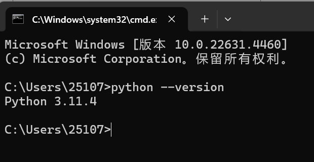

1.  在光盘资料中获取python3.11.4版本，资料路径【FS_Ws63光盘资料\工具软件】：


该文件来源于官方网站<https://www.python.org/>。

2.  打开可执行文件，勾选添加Python的环境路径，然后点击install now进行安装：

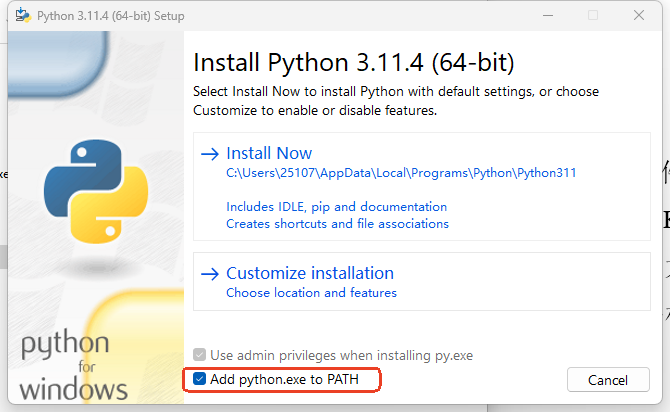

3.  等待安装完成即可：


## 安装Hispark Studio

下面介绍在Windows系统下搭建开发环境的方式。

1.  点击海思官网<https://developer.hisilicon.com/devCenter/index?id=9dfafc50-7189-4fb4-a>获取IDE工具。

2.  注册账号进行工具的下载：


3.  下载后将压缩包解压;


4.  双击可执行文件进行工具的安装：


5.  安装界面如下，选择同意点击下一步:

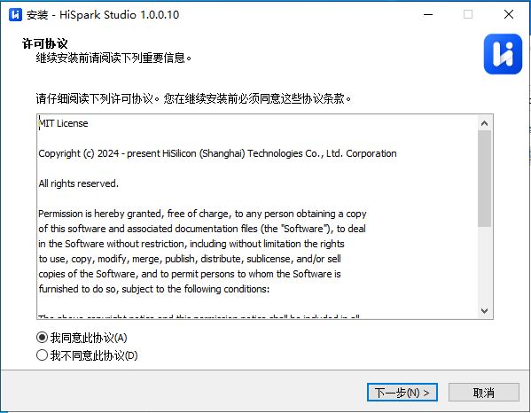

6.  根据用户磁盘大小选择安装路径：

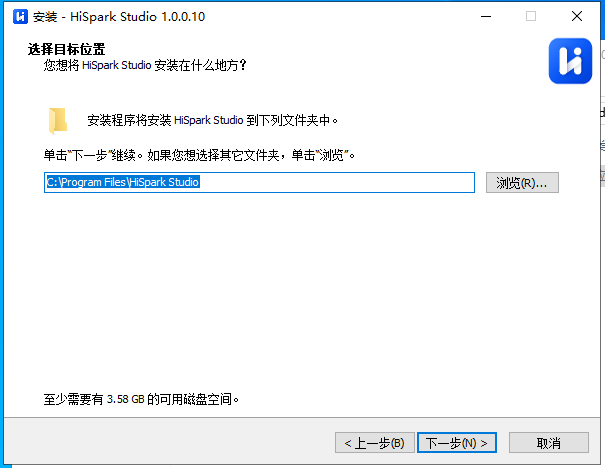

7.  默认全部勾选点击下一步：

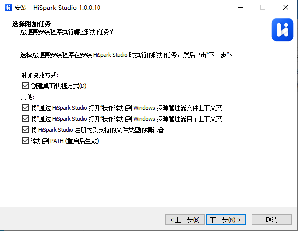

8.  点击安装：

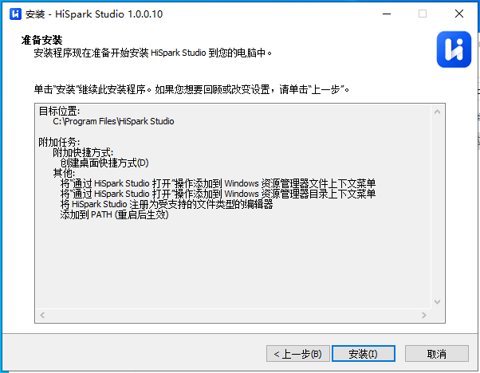

9.  等待工具安装完成：

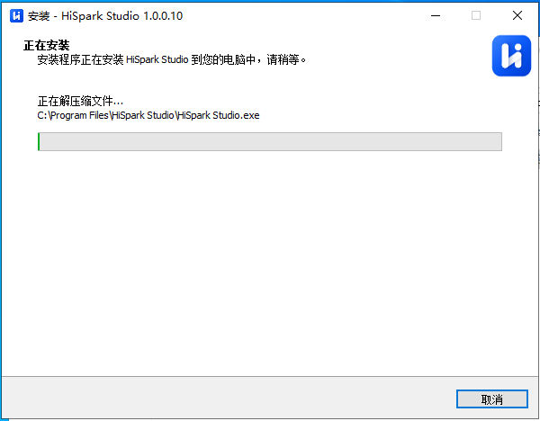

10. 打开Hispark studio界面如下：

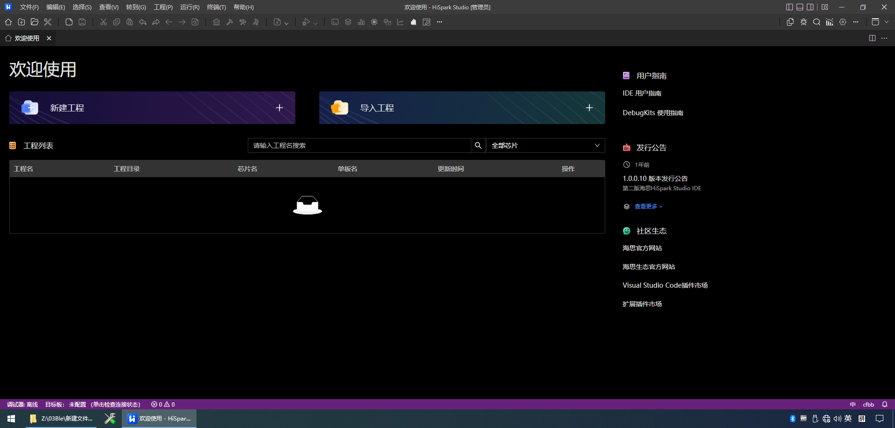

11. 在工具软件路径中【FS_Ws63光盘资料\工具软件\whl包】找到python预编译二进制包，在此文件夹中右键鼠标选择在终端中打开，执行pip install windows_curses-2.3.3-cp311-cp311-win_amd64.whl命令：

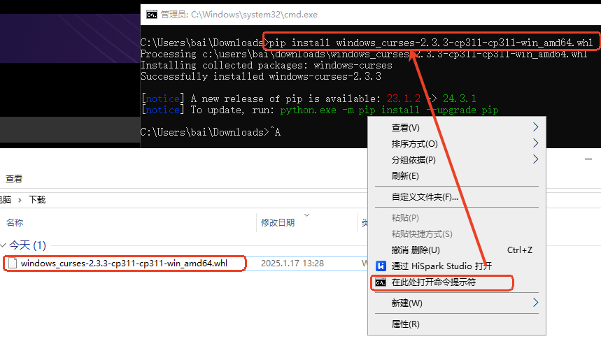

12. 按照上一步骤，继续执行pip install kconfiglib-14.1.0-py2.py3-none-any.whl命令：

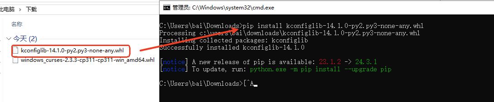

13. 继续执行pip install pycparser-2.21-py2.py3-none-any.wh和pip install cmake-3.20.5-py2.py3-none-win_amd64.whl命令：

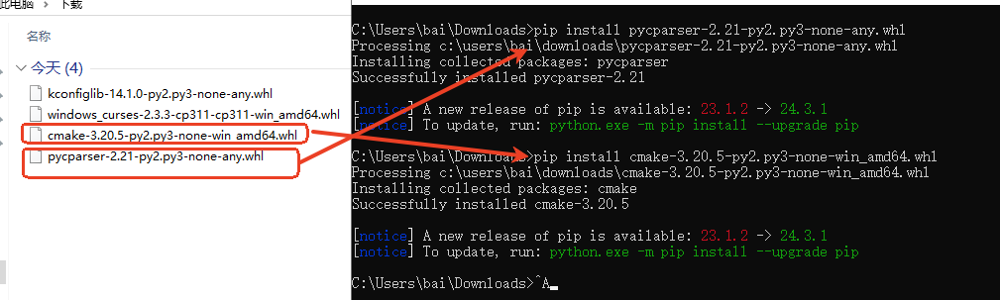

执行完这些命令后，重启Hispark studio即可。

## 获取SDK

下载SDK代码，目前提供3种方式。

1.  **通过git方式获取**

git指令下载（在Windows上使用git指令下载代码，需要提前安装git，这部分用户自行百度学习），在xx盘鼠标右键选择“Open Git Bash here”，如下图所所示：

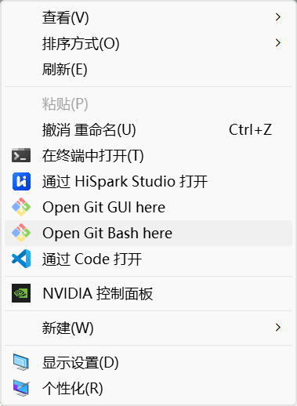

在命令框中输入git clone https://gitee.com/HiSpark/fbb_ws63.git指令下载代码，等待下载完成：

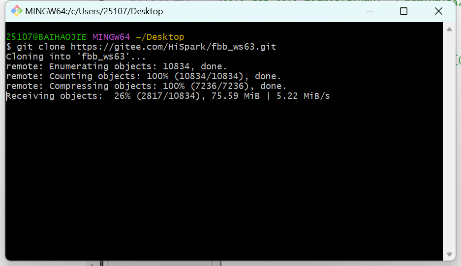

2.  **通过代码仓下载zip**

下载地址：<https://gitee.com/HiSpark/fbb_ws63>。在主界面上点击“克隆/下载”，选择“下载ZIP”，等待下载：

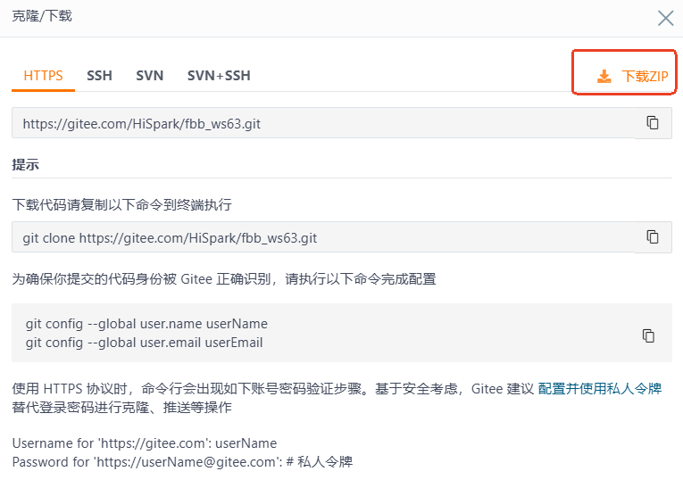

下载完成如下：


通过前两个步骤获取的代码是官方默认的工程，我们需要对其进行修改以便能够编译我们的代码。

若fbb_ws63\src\application\samples目录下没有Farsight文件夹，如下图所示：

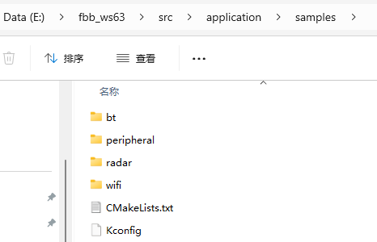

我们需要将我们的开发板的例程文件复制进去，如下图所示：

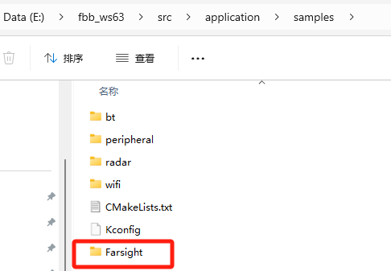

在Farsight文件夹中是我们的开发板的例程：

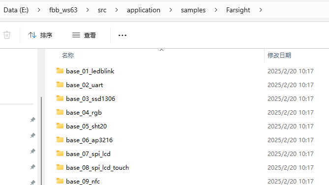

然后需要修改fbb_ws63\src\application\samples目录下的CMakeLists.txt文件，在该文件中添加如下代码：

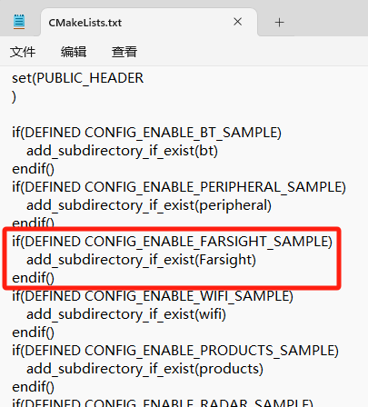

然后修改fbb_ws63\src\application\samples目录下的Kconfig文件，在该文件中添加如下代码：

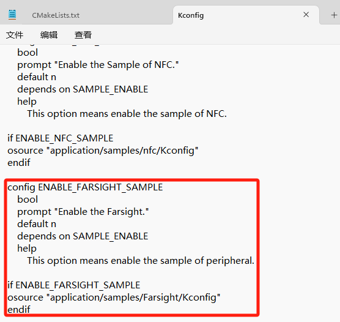

3.  **通过光盘资料获取（推荐）**

光盘资料中的SDK路径为【FS_Ws63光盘资料\程序源码】：


建议使用资料中的代码，以便于和教程内容保持一致。

> 注意：由于编译路径长度限制，应将获取到的SDK进行解压并拷贝到磁盘**根目录**下。

## 配置工程

在安装完开发环境的情况下，并且已经获取到SDK，可以打开开发工具将获取到的SDK导入。

### 新建工程

1.  点击新建工程：

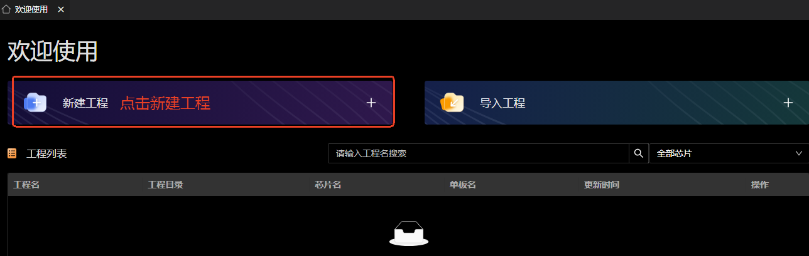

2.  选择芯片和SDK路径，这里使用的是光盘资料中的SDK。按照下图进行配置，然后点击完成：

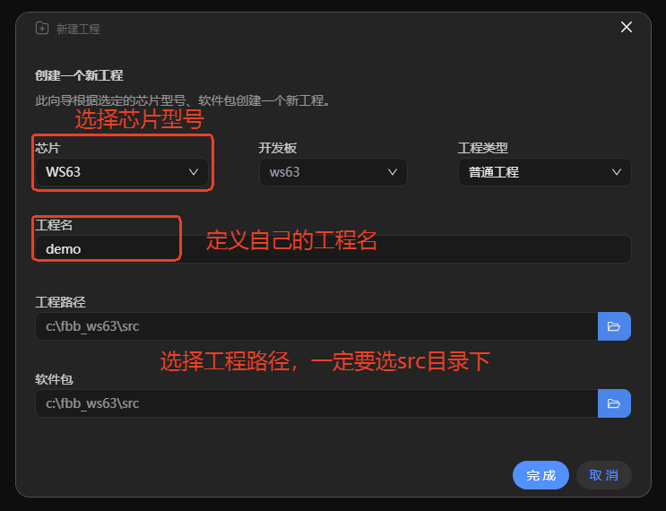

3.  此时可以在侧边栏看到整个工程代码目录：

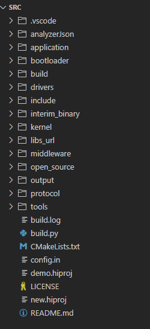

### 选择编译案例

1.  点击系统配置按钮，此时如果没有安装Python，这里也会提示你安装对应版本Python：


2.  此时展开目录可以看到所有的实验案例，这里选择编译LEDBLINK实验案例，然后保存配置并关闭：

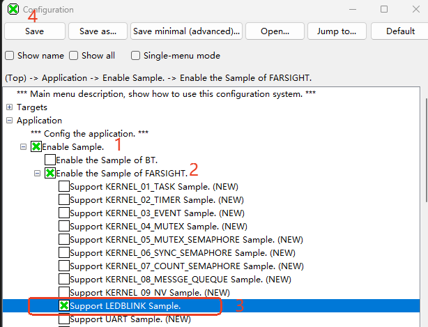

### 编译工程

1.  编译工程：


2.  等待工程编译完成，首次编译时间比较久（大于三分钟）：

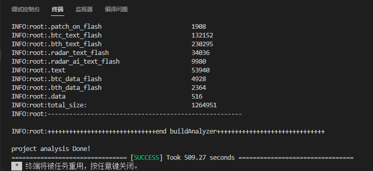

### 选择烧录调试端口

1.  点击工程配置按钮：

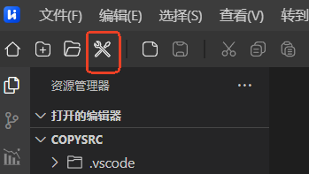

2.  选择烧录端口，根据自己的端口号进行选择和配置（注意需要先连接开发板并且开发板处于上电状态）：

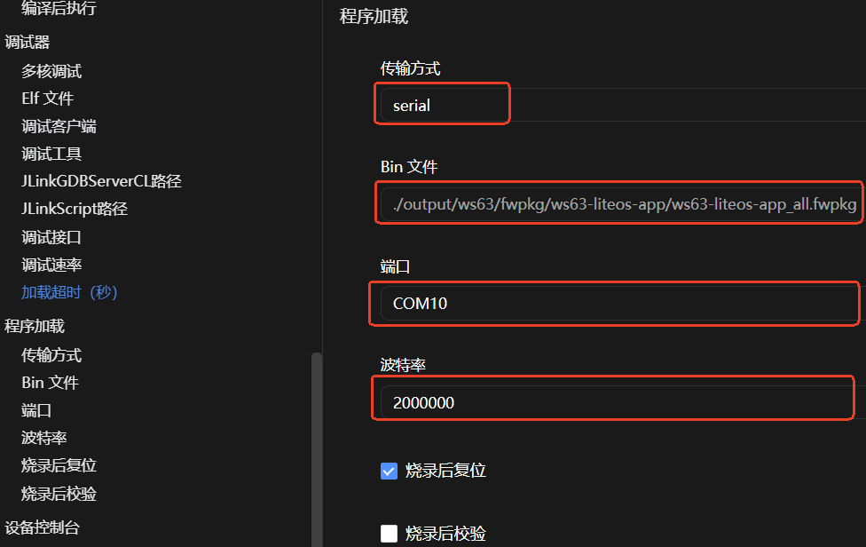

### 代码烧录

代码烧录方式有两种：

1.  在开发工具中直接使用USB串口进行烧录；

2.  使用烧录工具Burntool烧录编译好的文件。

#### 开发工具内烧录

1.  配置完成后点击烧录按钮：

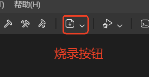

2.  按照提示将开发板复位进行烧录，等待进度条到达百分之百即可：

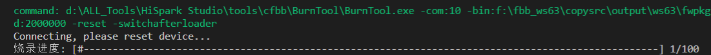

#### 使用Burntool烧录

1.  打开工具软件中的烧录工具，路径【FS_Ws63光盘资料\工具软件\BurnTool_H3863】：

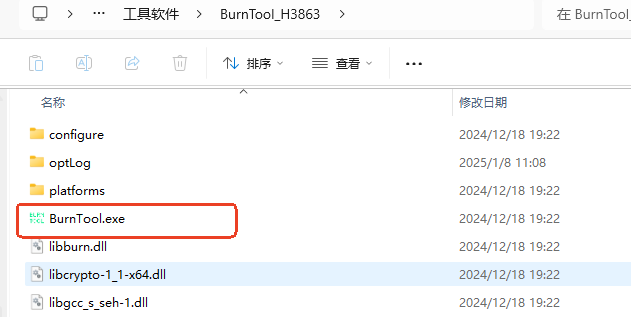

2.  选择要烧录的文件，编译好的文件在路径【fbb_ws63\src\output\ws63\fwpkg\ws63-liteos-app】：

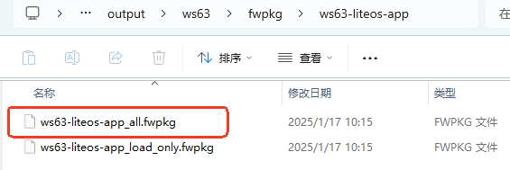

3.  在工具中选择编译好的文件：勾选auto burn和auto disconnect，连接connect连接到开发板，然后按下开发板上的复位按键进行烧录：

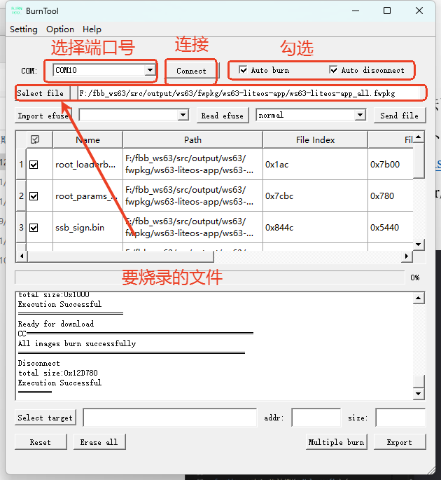

### 实验现象

烧录完成后，复位开发板即可看到当前实验现象：LED2绿色灯闪烁。

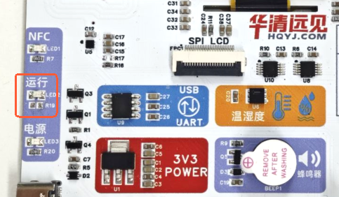

# MQTT环境搭建

## Mosquitto消息代理安装

Eclipse Mosquitto是一个开源消息代理，实现了MQTT协议版本3.1和3.1.1。Mosquitto轻量，适用于低功耗单板计算机到完整服务器的所有设备。Mosquitto项目还提供了用于实现MQTT客户端的C库以及非常受欢迎的mosquitto_pub和mosquitto_sub命令行MQTT客户端。

在安装之前需要在Windows电脑中安装一个MQTT消息代理的服务，在光盘资料中提供了64位Windows版本，安装软件位置在【FS_Ws63光盘资料\工具软件】。

1.  打开软件安装包后，出现软件的安装界面，然后点击“Next”。

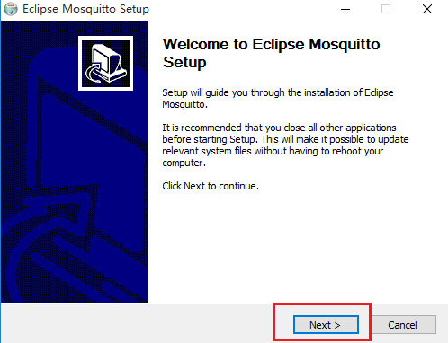

1.  选择默认配置，然后点击“Next”

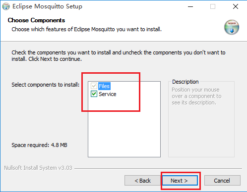

2.  选择安装路径（默认路径），然后点击“Install”进行安装：

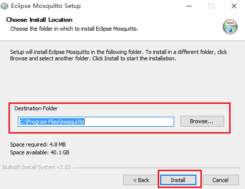

3.  安装完成。

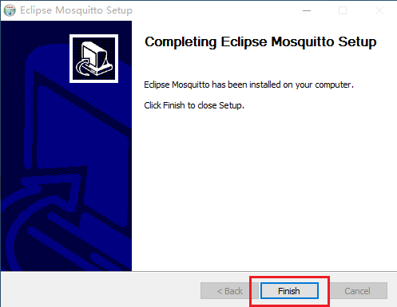

## MQTT.fx工具软件安装

MQTT.fx是一款基于Eclipse Paho，使用Java语言编写的MQTT客户端工具。支持通过Topic订阅和发布消息，用来前期和物理云平台调试非常方便。

可登陆MQTT.fx官网下载合适版本并安装http://www.jensd.de/apps/mqttfx/1.7.1/，光盘资料中提供了64位Windows版本，软件的位置在【FS_Ws63光盘资料\工具软件\mqttfx-1.7.1-windows-x64.exe】。

1.  打开软件安装包后，出现软件的安装界面，然后点击“Next”进行安装：

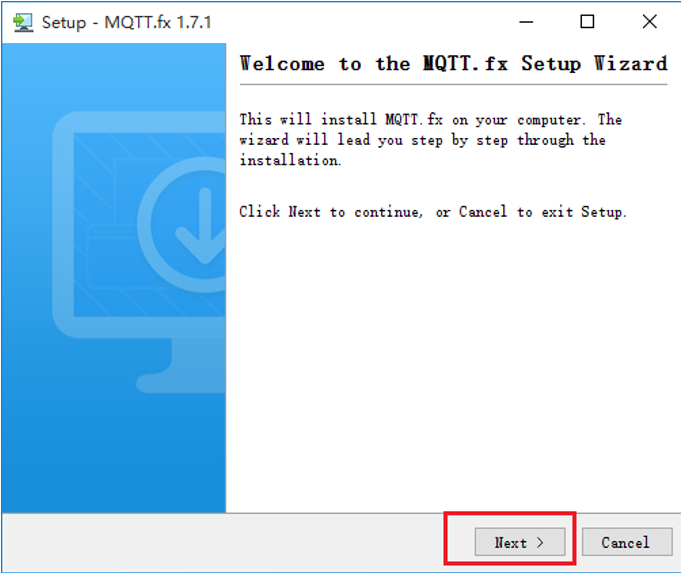

2.  选择安装路径，然后点击“Next”：

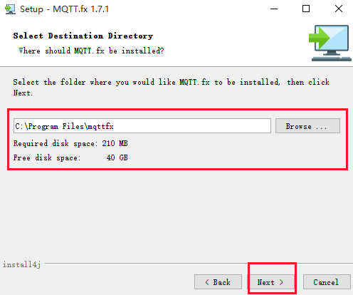

3.  用默认选项，不需要修改，然后点击“Next”：

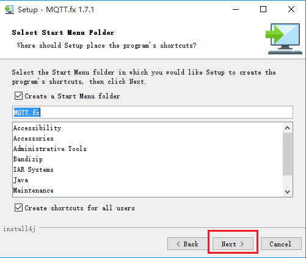

4.  点击“Finish”，应用安装完成：

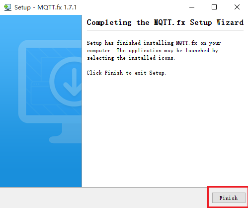

## MQTT.fx工具软件使用

1.  安装完成之后，点击MQTT.fx图标打开软件进行配置和使用，点击软件界面中的小齿轮图片，进行设置：

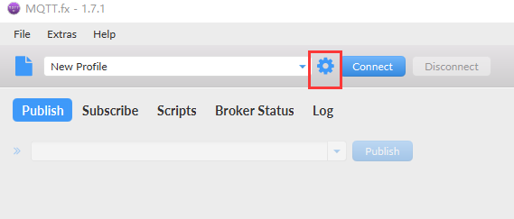

2.  点击配置界面的左下角“＋”，进行添加新的配置：

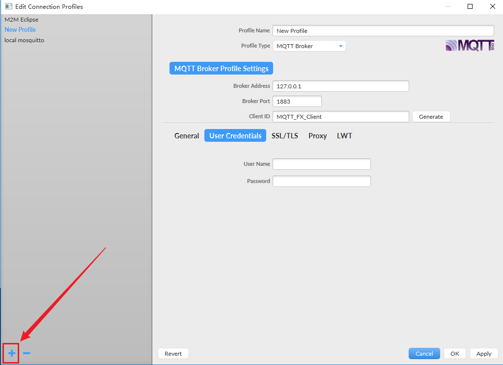

3.  按照下图信息进行配置。这里我们使用127.0.0.1这个地址是为了在本机上做回环测试。实际应用中请根据服务平台要求配置。配置完成之后，点击右下角的OK按钮：

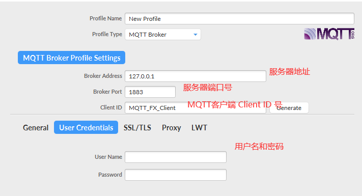

4.  打开之前安装的mosquitto.exe代理程序：

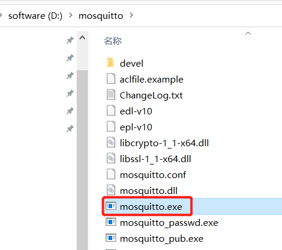

5.  点击Connect进行连接服务器，连接成功之后，我们来订阅一个topic：

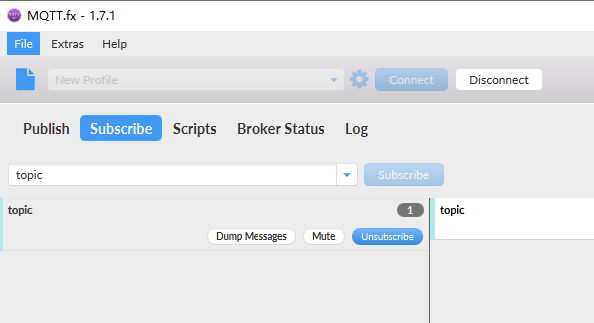

6.  然后在“Publish”界面中，向topic主题中发布一条消息：


7.  这时就可以在订阅窗口就可以看到所发布的消息内容：

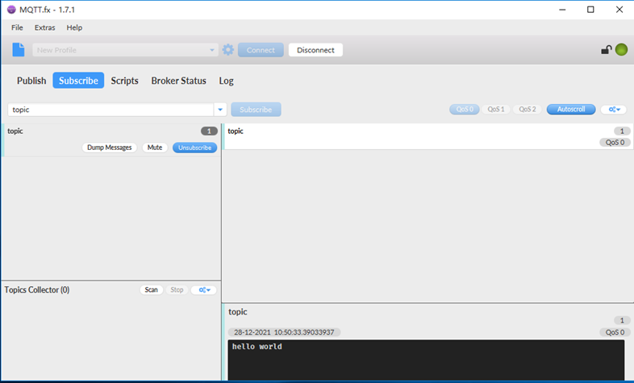

# 硬件资源介绍

### 整体资源

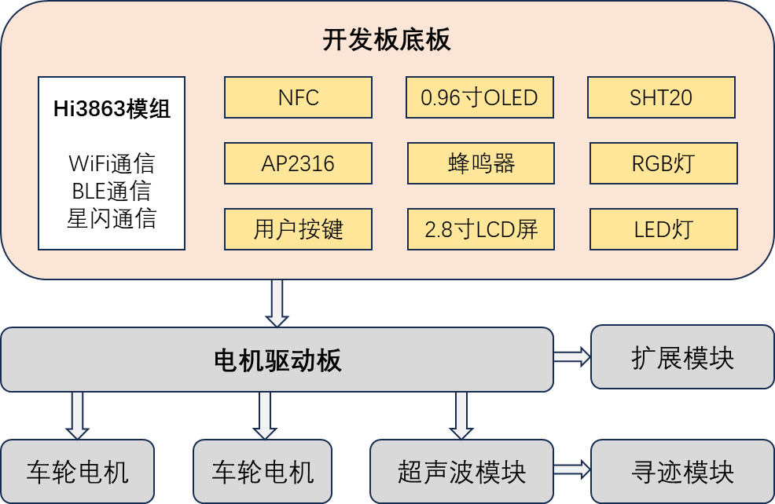

### 实物图


购买链接：https://item.taobao.com/item.htm?id=892481769813

# 如何添加实验案例

## LED灯实验案例添加

在ws63的SDK中，我们如果需要添加自己的实验案例，需要对Kconfig文件和CMakeLists.txt文件进行修改。

1.  首先在src目录下找到application文件夹，在此文件夹中就是存放我们用户代码的地方：

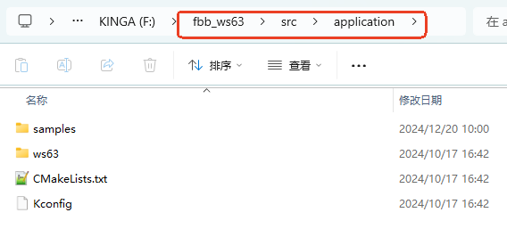

2.  打开samples文件夹，创建存放我们自己工程的文件夹，这里我创建的文件名为Farsight，以后我们的所有实验案例都会放在这个文件夹里：

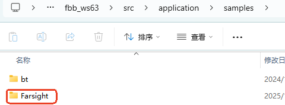

3.  打开\src\application\samples\CMakeLists.txt文件，将Farsight文件夹增加到编译目录中：

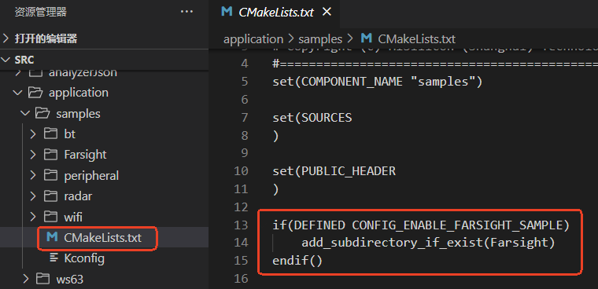

4.  打开\src\application\samples\Kconfig文件，将Farsight文件夹增加到编译目录中：

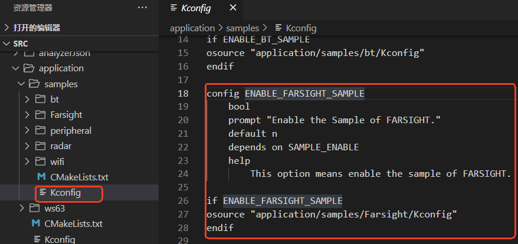

5.  将光盘资料【FS_Ws63光盘资料\vendor\Hqyj_Ws63\Farsight\实验案例】中led灯实验源码、Kconfig和CMakeLists.txt文件拷贝到Farsight文件夹中：

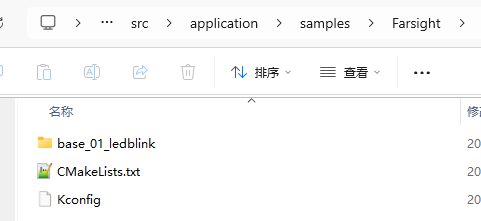

此时我们自己的实验案例就成功的添加到了SDK中。

6.  接下来在工程配置中勾选LED灯实验案例：

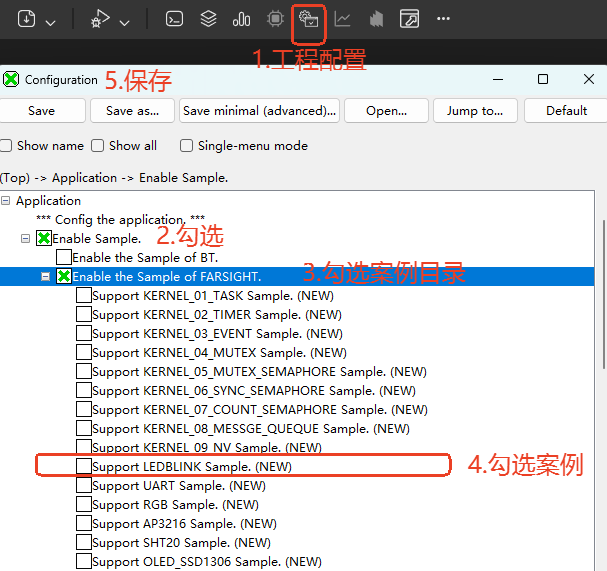

7.  然后就可以点击编译按钮编译工程：


8.  编译完成后，即可按照 代码烧录 章节操作烧录程序。

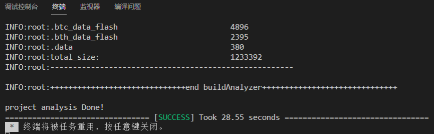

# 操作系统实验

## 函数接口

在 Ws63 的开发环境中，开发者可以使用 CMSIS-RTOS 和OSAL内核API标准来进行应用开发，实现任务调度、通信和同步等功能。

CMSIS（Cortex Microcontroller Software Interface Standard）是一套由ARM公司制定的软件接口标准，旨在为基于ARM Cortex-M系列处理器的嵌入式系统开发提供标准化的接口和工具支持。CMSIS-RTOS API提供了一套标准化的接口，使得应用程序可以在不同的RTOS实现和硬件平台上运行，而无需修改代码。这种硬件无关性极大地提高了代码的可移植性，降低了对特定RTOS或硬件平台的依赖。

CMSIS标准API头文件路径：【src\kernel\liteos\liteos_v208.5.0\Huawei_LiteOS\open_source\CMSIS\\ CMSIS\RTOS2\Include\cmsis_os2.h】。

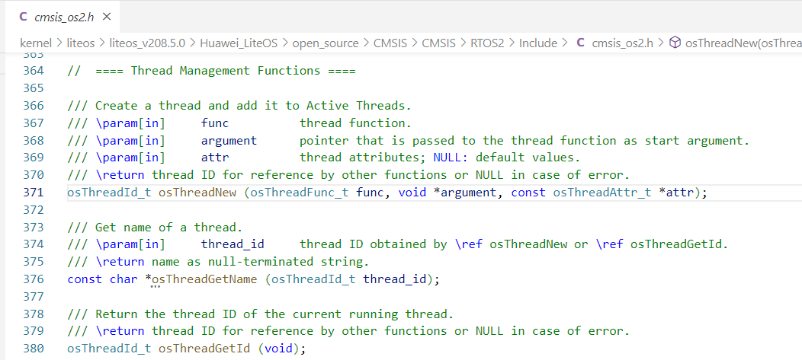

为了提升驱动代码在不同内核子系统间的可复用能力，OpenHarmony HDF（Hardware Driver Foundation）驱动框架提供了OSAL(Operating System Abstraction Layer)操作系统抽象层接口。OSAL为驱动程序提供了任务、定时器、互斥锁、信号量等基础库相关接口，使驱动相关的实现不再依赖于具体的内核或POSIX接口，是实现驱动可迁移的基石。

OSAL内核标准API头文件路径：【src\kernel\osal\include\schedule\osal_task.h】，该路径为SDK中头文件路径，在光盘资料中【FS_Ws63光盘资料\器件手册】的官方文档ws63-Document-Cn.chm中也可以进行查阅：

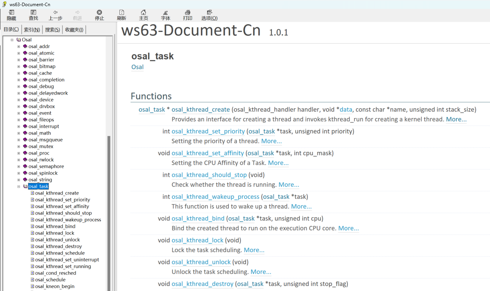

总而言之，这两个标准的API接口都是为了使系统后期便于在各个平台进行移植而准备的，无论我们采用哪种方式进行开发，都可以实现相同的功能。在系统实验章节，我们使用了CMSIS-RTOS准化接口,在后续的基础实验中，我们也会使用OSAL来进行任务的创建和使用。

## LiteOS之任务实验

### 实验目的

1.  熟悉LiteOS系统下任务相关函数的使用。

2.  熟悉如何使用Hispark Studio。

3.  熟悉LiteOS系统的编译流程和设计步骤，能够进行设计、编程、调试。

4.  检测搭建的软件及硬件环境是否可正常使用。

### 实验要求

创建两个任务，任务1正常执行，每隔一秒打印一次内容；任务2每隔5秒钟会恢复和挂起任务1。

### 实验环境

硬件环境：FS_Ws63开发板、USB线。

软件环境：Windows系统、Hispark Studio。

源码位置：【vendor\Hqyj_Ws63\Farsight\kernel_01_task】

### 实验原理

OpenHarmony LiteOS-M内核是面向IoT领域构建的轻量级物联网操作系统内核，具有小体积、低功耗、高性能的特点。其代码结构简单，主要包括内核最小功能集、内核抽象层、可选组件以及工程目录等。

OpenHarmony LiteOS-M内核架构包含硬件相关层以及硬件无关层，如下图所示，其中硬件相关层按不同编译工具链、芯片架构分类，提供统一的HAL（Hardware Abstraction Layer）接口，提升了硬件易适配性，满足AIoT类型丰富的硬件和编译工具链的拓展；其他模块属于硬件无关层，其中基础内核模块提供基础能力，扩展模块提供网络、文件系统等组件能力，还提供错误处理、调测等能力，KAL（Kernel Abstraction Layer）模块提供统一的标准接口。

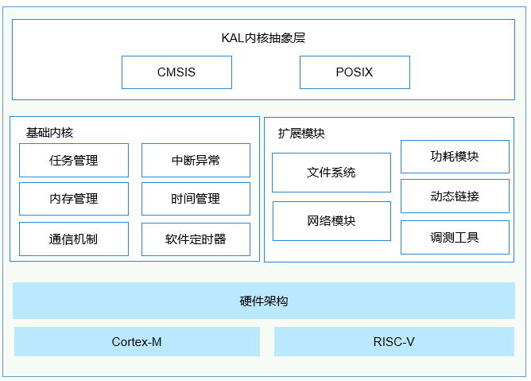

CMSIS-RTOS2（CMSIS-RTOS API Version2）是Arm®Cortex®-M处理器的通用的RTOS接口。为需要RTOS功能的软件组件提供了标准化的API。

从系统的角度看，任务是竞争系统资源的最小运行单元，OpenHarmony LiteOS-M的任务模块可以给用户提供多个任务，实现任务间的切换。

1.  任务模块特性

    1.  支持多任务运行。

    2.  一个任务表示一个线程。

    3.  抢占式任务调度机制，高优先级任务可以打断低优先级任务，低优先级任务必须在高优先级任务阻塞或结束后才能得到调度运行。

    4.  相同优先级任务支持时间片轮转调度方式。

    5.  共有32个优先级\[0-31\]，最高优先级为0，最低优先级为31。

2.  任务运行状态。

    1.  就绪态（Ready）：该任务在就绪队列中，等待CPU运行。

    2.  运行态（Running）：该任务正在执行。

    3.  阻塞态（Blocked）：该任务不在就绪队列中。还有任务被挂起、任务被延时、任务正在等待信号量、读写队列或者等待读写事件等，都会处于阻塞状态。

    4.  退出态（Dead）：该任务运行结束，等待系统回收资源。

3.  任务状态切换

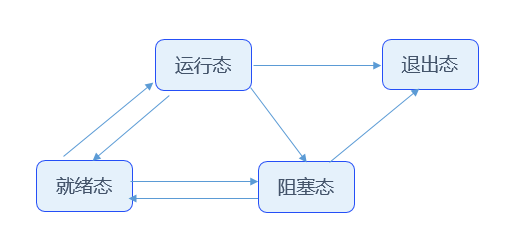

任务状态切换说明：

- 就绪态→运行态

任务创建后进入就绪态，发生任务切换时，就绪队列中最高优先级的任务被执行，从而进入运行态，同时该任务从就绪队列中移出。

- 运行态→阻塞态

正在运行的任务发生阻塞（挂起、延时、读信号量等）时，将该任务插入到对应的阻塞队列中，任务状态由运行态变成阻塞态，然后发生任务切换，运行就绪队列中最高优先级任务。

- 阻塞态→就绪态（阻塞态→运行态）

阻塞的任务被恢复后（任务恢复、延时时间超时、读信号量超时或读到信号量等），此时被恢复的任务会被加入就绪队列，从而由阻塞态变成就绪态；此时如果被恢复任务的优先级高于正在运行任务的优先级，则会发生任务切换，该任务由就绪态变成运行态。

- 就绪态→阻塞态

任务也有可能在就绪态时被阻塞（挂起），此时任务状态由就绪态变为阻塞态，该任务从就绪队列中删除，不会参与任务调度，直到该任务被恢复。

- 运行态→就绪态

有更高优先级任务创建或者恢复后，会发生任务调度，此刻就绪队列中最高优先级任务变为运行态，那么原先运行的任务由运行态变为就绪态，依然在就绪队列中。

- 运行态→退出态

运行中的任务运行结束，任务状态由运行态变为退出态。退出态包含任务运行结束的正常退出状态以及Invalid状态。例如，任务运行结束但是没有自删除，对外呈现的就是Invalid状态，即退出态。

- 阻塞态→退出态

阻塞的任务调用删除接口，任务状态由阻塞态变为退出态。

在LiteOS中，有以下一些函数是任务和线程的接口函数：

线程创建函数：

| **定义：** | **osThreadId_t osThreadNew (osThreadFunc_t func, void \*argument,const osThreadAttr_t \*attr);** |
|:---|:---|
| 功能 | 创建一个线程并将其添加到活动线程 |
| 参数 | func：线程函数 |
|  | argument：参数指针，作为开始参数传递给线程函数 |
|  | attr:线程属性；NULL：默认值 |
| 返回值 | 创建成功：返回线程ID 创建失败：返回NULL |
| 依赖 | //third_party/cmsis/CMSIS/RTOS2/Include/cmsis_os2.h |

线程挂起函数：

| **定义** | **osStatus_t osThreadSuspend (osThreadId_t thread_id);** |
|:---|:---|
| 功能 | 挂起指定线程的执行 |
| 参数 | thread_id:线程的id号 |
|  |  |
| 返回值 | 函数的执行状态 |
| 依赖 | kernel\liteos\liteos_v208.5.0\Huawei_LiteOS\open_source\CMSIS\CMSIS\RTOS2\Include\cmsis_os2.h |

线程恢复函数：

| **定义** | **osStatus_t osThreadResume (osThreadId_t thread_id);** |
|:---|:---|
| 功能 | 恢复挂起的指定线程的执行 |
| 参数 | thread_id:线程的id号 |
|  |  |
| 返回值 | 函数的执行状态 |
| 依赖 | kernel\liteos\liteos_v208.5.0\Huawei_LiteOS\open_source\CMSIS\CMSIS\RTOS2\Include\cmsis_os2.h |

### 实验代码

1.  实验源码目录：【fbb_ws63\vendor\Hqyj_Ws63\Farsight\kernel_01_task】。

    注意：下面显示出主要代码，其余的请查看源码。

2.  目录下kernel_01_task.c文件用于存放用户代码；CMakeLists.txt文件用于指定源文件和头文件的路径。

3.  目录下kernel_01_task.c文件中的用户代码讲解：

首先我们需要先定义我们的任务句柄，以便在需要时可以对任务进行操作，然后编写我们的任务函数。

Task1函数：每一秒钟打印一次“Task 1”语句；

Task2函数：每5秒钟挂起一次Task1任务5秒，然后恢复Task1任务。

```
/**
 * @description: 任务1为低优先级任务
 * @param {*}
 * @return {*}
 */
void Task1(void *argument) 
{
    unused(argument);
    while (1)
    {
        printf("Task 1.......\n");
        osDelay(100);  
    }
}
/**
 * @description: 任务2为高优先级任务
 * @param {*}
 * @return {*}
 */
void Task2(void *argument)
{
    unused(argument);
    while (1) 
    {
        printf("Task 2: 挂起task1\n");
        osThreadSuspend(Task1_ID);      // 挂起任务1
        osDelay(500);            // 延时5秒钟

        printf("Task 2: 恢复task1\n");
        osThreadResume(Task1_ID);      // 恢复任务1
        osDelay(500);            // 延时5秒钟
    }
}
```

4.  kernel_task_example函数为用户自己编写，作用是为以上Task任务创建不同的任务线程。结构体“osThreadAttr”中的成员用来定义线程属性，包括任务名、堆栈空间大小等等。定义好线程属性后，即可使用“osThreadNew”函数创建线程用来运行“Task1、Task2”等任务；

```
static void kernel_task_example(void)
{
    osThreadAttr_t attr;
    attr.name       = "Task1";   // 任务的名字
    attr.attr_bits  = 0U;        // 属性位
    attr.cb_mem     = NULL;      // 堆空间地址
    attr.cb_size    = 0U;        // 堆空间大小
    attr.stack_mem  = NULL;      // 栈空间地址
    attr.stack_size = 0x1000;    // 栈空间大小 单位:字节
    attr.priority   = osPriorityNormal; // 任务的优先级，数据越大，优先级越高
    
    Task1_ID=osThreadNew((osThreadFunc_t)Task1, NULL, &attr); // 创建任务1
    if(Task1_ID != NULL) {
           printf("ID = %d, Create Task1_ID is OK!\n", Task1_ID);      
    }
    attr.name = "Task2"; 
    attr.priority = osPriorityNormal1;
    Task2_ID=osThreadNew((osThreadFunc_t)Task2, NULL, &attr);  // 创建任务2
    if(Task2_ID != NULL) {
           printf("ID = %d, Create Task2_ID is OK!\n", Task2_ID);
    }
}
```

5.  目录下CMakeLists.txt文件用来指定组件的相关源文件和头文件路径。

SOURCES：当前组件的源文件列表，其中CMAKE_CURRENT_SOURCE_DIR变量标识当前CMakeLists.txt所在的路径。

| set(SOURCES "\${SOURCES}" "\${CMAKE_CURRENT_SOURCE_DIR}/kernel_01_task.c" PARENT_SCOPE) |
|----|

### 编译烧录

1.  点击系统配置选项：


2.  选中相对应的案例：

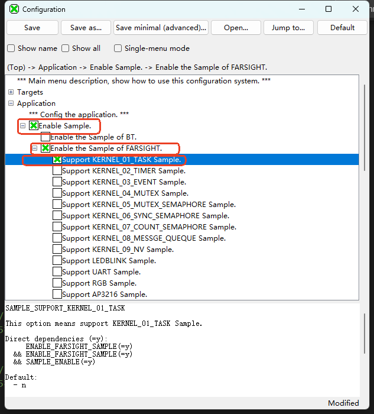

3.  点击全编译按钮进行编译：


4.  编译完成后，使用USB线连接开发板，点击烧录按钮烧录程序：


### 实验现象

重启Ws63开发板之后，首先在任务2中执行挂起任务1，等待5秒后，在任务2中执行恢复任务1，等待5秒钟，此时任务1将每隔1秒打印输出一句话，等待5秒钟后，任务2将任务1再次挂起。

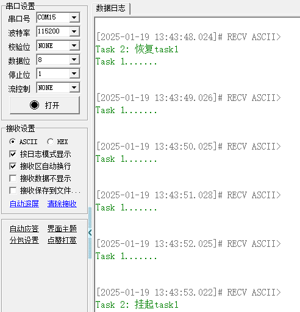

## LiteOS之定时器实验

### 实验目的

1.  熟悉LiteOS系统下任务相关函数的使用。

2.  熟悉如何使用Hispark Studio。

3.  熟悉LiteOS系统的编译流程和设计步骤，能够进行设计、编程、调试。

4.  检测搭建的软件及硬件环境是否可正常使用。

### 实验要求

创建一个任务和一个软件定时器，任务1会每隔1秒钟打印输出一句话；软件定时器会每隔3秒钟打印输出一句话。

### 实验环境

硬件环境：FS_Ws63开发板、USB线。

软件环境：Windows系统、Hispark Studio。

源码位置：【vendor\Hqyj_Ws63\Farsight\kernel_02_timer】

### 实验原理

软件定时器，是基于系统Tick时钟中断且由软件来模拟的定时器，当经过设定的Tick时钟计数值后会触发用户定义的回调函数。定时精度与系统Tick时钟的周期有关。

硬件定时器受硬件的限制，数量上不足以满足用户的实际需求，因此为了满足用户需求，提供更多的定时器，OpenHarmony LiteOS-M内核提供软件定时器功能。软件定时器扩展了定时器的数量，允许创建更多的定时业务。

软件定时器功能上支持：

1.  静态裁剪：能通过宏关闭软件定时器功能。

2.  软件定时器创建。

3.  软件定时器启动。

4.  软件定时器停止。

5.  软件定时器删除。

6.  软件定时器剩余Tick数获取。

软件定时器是系统资源，在模块初始化的时候已经分配了一块连续的内存，系统支持的最大定时器个数由los_config.h中的LOSCFG_BASE_CORE_SWTMR_LIMIT宏配置。

软件定时器使用了系统的一个队列和一个任务资源，软件定时器的触发遵循队列规则，先进先出。定时短的定时器总是比定时长的靠近队列头，满足优先被触发的准则。

软件定时器以Tick为基本计时单位，当用户创建并启动一个软件定时器时，OpenHarmony LiteOS-M内核会根据当前系统Tick时间及用户设置的定时间隔确定该定时器的到期Tick时间，并将该定时器控制结构挂入计时全局链表。

当Tick中断到来时，在Tick中断处理函数中扫描软件定时器的计时全局链表，看是否有定时器超时，若有则将超时的定时器记录下来。

Tick中断处理函数结束后，软件定时器任务（优先级为最高）被唤醒，在该任务中调用之前记录下来的定时器的超时回调函数。

LiteOS涉及到的定时器函数接口有：

| **定义：** | **osTimerId_t osTimerNew (osTimerFunc_t func, osTimerType_t type,void \*argument, const osTimerAttr_t \*attr);** |
|----|----|
| **功能：** | 创建并初始化计时器 |
| **参数：** | func：指向回调函数的指针 |
|  | type：osTimerOnce表示一次触发, osTimerPeriodic表示周期性行为 |
|  | argument：计数器回调函数的参数 attr ：定时器属性；NULL：默认值 |
| **返回值：** | 创建成功：返回定时器ID 创建失败：返回NULL |
| **依赖：** | kernel\liteos\liteos_v208.5.0\Huawei_LiteOS\open_source\CMSIS\CMSIS\RTOS2\Include\cmsis_os2.h |

| **定义：** | **const char \*osTimerGetName (osTimerId_t timer_id);** |
|----|----|
| **功能：** | 获取定时器的名称 |
| **参数：** | timer_id：定时器ID |
| **返回值：** | 创建成功：将名称返回以null结尾的字符串 创建失败：返回NULL |
| **依赖：** | kernel\liteos\liteos_v208.5.0\Huawei_LiteOS\open_source\CMSIS\CMSIS\RTOS2\Include\cmsis_os2.h |

| **定义：** | **osStatus_t osTimerStop (osTimerId_t timer_id);** |
|----|----|
| **功能：** | 停止定时器 |
| **参数：** | timer_id：定时器ID |
| **返回值：** | 返回指示函数执行状态的状态码 |
| **依赖：** | kernel\liteos\liteos_v208.5.0\Huawei_LiteOS\open_source\CMSIS\CMSIS\RTOS2\Include\cmsis_os2.h |

| **定义：** | **osStatus_t osTimerDelete (osTimerId_t timer_id);** |
|----|----|
| **功能：** | 删除定时器 |
| **参数：** | timer_id：定时器ID |
| **返回值：** | 返回指示函数执行状态的状态码 |
| **依赖：** | kernel\liteos\liteos_v208.5.0\Huawei_LiteOS\open_source\CMSIS\CMSIS\RTOS2\Include\cmsis_os2.h |

### 实验代码

1.  实验源码目录：【fbb_ws63\vendor\Hqyj_Ws63\Farsight\kernel_02_timer】。

    注意：下面显示出主要代码，其余的请查看源码。

2.  目录下kernel_02_timer.c文件用于存放用户代码；CMakeLists.txt文件用于指定源文件和头文件的路径。

3.  目录下kernel_02_timer.c文件中的用户代码讲解：

首先我们需要先定义我们的任务句柄，以便在需要时可以对任务进行操作，然后编写我们的任务函数。

Task1函数：每一秒钟打印一次“enter Task 1”语句；

timer1_Callback函数：软件定时器回调函数，超时打印“enter timer1_Callback”语句；

```
/**
 * @description: 任务1
 * @param {*}
 * @return {*}
 */
void Task1(void *argument) 
{
    unused(argument);
    while (1)
    {
        printf("enter Task 1.......\n");
        osDelay(100);  
    }
}
/**
 * @description: 定时器1回调函数
 * @param {*}
 * @return {*}
 */
void timer1_Callback(void *argument)
{
    unused(argument);
    printf("enter timer1_Callback.......\n");
}
```

4.  目录下CMakeLists.txt文件用来指定组件的相关源文件和头文件路径。

SOURCES：当前组件的源文件列表，其中CMAKE_CURRENT_SOURCE_DIR变量标识当前CMakeLists.txt所在的路径。

| set(SOURCES "\${SOURCES}" "\${CMAKE_CURRENT_SOURCE_DIR}/kernel_02_timer.c" PARENT_SCOPE) |
|----|

### 编译烧录

1.  点击系统配置选项：


2.  选中相对应的案例：

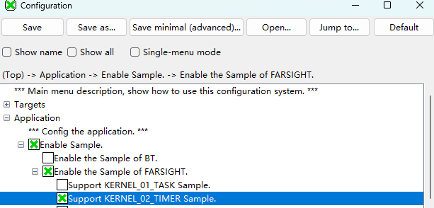

3.  点击全编译按钮进行编译：


4.  编译完成后，使用USB线连接开发板，点击烧录按钮烧录程序：


### 实验现象

重启Ws63开发板之后，任务1会每隔1秒钟打印输出一句话，而定时器会每隔3秒会进入到定时器的回调函数。

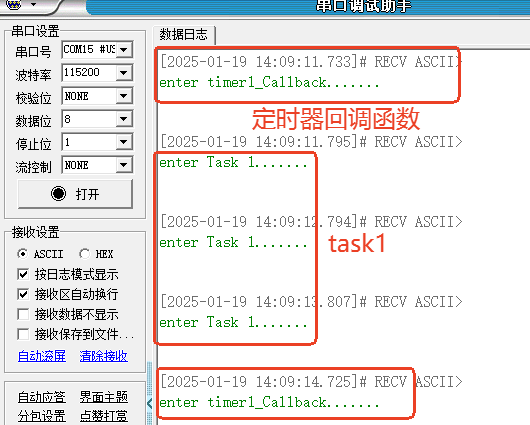

## LiteOS之事件实验

### 实验目的

1.  熟悉LiteOS系统下任务相关函数的使用。

2.  熟悉如何使用Hispark Studio。

3.  熟悉LiteOS系统的编译流程和设计步骤，能够进行设计、编程、调试。

4.  检测搭建的软件及硬件环境是否可正常使用。

### 实验要求

创建两个任务，任务1每隔1秒钟设置一个事件标志位，总共设置3个事件标志位；任务2阻塞等待是否接收到3个事件标志位，如果接收到了，打印输出。

### 实验环境

硬件环境：FS_Ws63开发板、USB线。

软件环境：Windows系统、Hispark Studio。

源码位置：【vendor\Hqyj_Ws63\Farsight\kernel_03_event】

### 实验原理

事件（Event）是一种任务间的通信机制，可用于任务间的同步操作，但事件通信只能是事件类型的通信，无数据传输。事件的特点是：

1.  任务间的事件同步，可以一对多，也可以多对多。一对多表示一个任务可以等待多个事件，多对多表示多个任务可以等待多个事件。

2.  事件不与任务关联，事件相互独立，一个32位的变量，用于标识该任务发生的事件类型，其中每一位表示一种事件类型（0表示该事件类型未发生，1表示该事件类型已经发生），一共31种事件类型（第25位保留）。

3.  事件读超时机制。

4.  只做任务间同步，不传输具体数据。

5.  事件无排他性，即多次向任务设置同一事件（如果任务还未来得及读走），等效于只设置一次。

6.  允许多个任务对同一事件进行读写操作。

> 下面为事件的工作机制：


事件集合用32位无符号整型变量uwEventID 来表示，每一位代表一个事件。任务通过创建**事件控制块**来实现对事件的触发和等待操作，任务通过“逻辑与”或“逻辑或”与一个事件或多个事件建立关联，形成一个事件集合（事件组），事件的“逻辑或”也称为独立型同步，事件的“逻辑与”也称为关联型同步。事件控制块如下：

```
typedef struct tagEvent
{
    UINT32 uwEventID;            /**标识发生的事件类型位，事件掩码*/
    LOS_DL_LIST    stEventList;  /**读取事件任务链表*/
} EVENT_CB_S, *PEVENT_CB_S;
```

uwEventID用于标识该任务发生的事件类型，其中每一位表示一种事件类型（0表示该事件类型未发生、1表示该事件类型已经发生），一共31种事件类型，第25位系统保留。

链表stEventList 用来记录等待事件的任务，所有在等待此事件的任务均会被挂载在事件阻塞列表stEventList 上。

在用osEventFlagsWait(osEventFlagsId_t ef_id, uint32_t flags, uint32_t options, uint32_t timeout)读事件（获取事件）时，可以在options参数中设置读取模式，来选择用户感兴趣的事件，读取模式如下：

所有事件，LOS_WAITMODE_AND（逻辑与）：读取掩码中所有事件类型，只有读取的所有事件类型都发生了，才能读取成功。

任一事件，LOS_WAITMODE_OR（逻辑或）：读取掩码中任一事件类型，读取的事件中任意一种事件类型发生了，就可以读取成功了。

清除事件，LOS_WAITMODE_CLR：下面两种方法表示事件读取成功后，对应事件类型位会自动清除：

LOS_WAITMODE_AND \| LOS_WAITMODE_CLR

LOS_WAITMODE_OR\| LOS_WAITMODE_CLR

事件能够在一定程度上代替信号量，用于任务与任务，中断与任务间的同步，但与信号量不同的是：

（1）事件的发送操作是不可累计的，而信号量的释放动作时可以累计的。

（2）事件接收任务可以等待多种事件，信号量只能识别单一同步动作，而不能同时等待多个事件的同步。

（3）各个事件可以分别发送或一起发送给事件对象。

LiteOS中的事件涉及到如下接口函数：

| **定义：** | **osEventFlagsId_t osEventFlagsNew (const osEventFlagsAttr_t \*attr);** |
|----|----|
| **功能：** | 创建并初始化一个事件标志对象，用于跨线程发送事件。 |
| **参数：** | Attr：事件标志属性;空:默认值。 |
| **返回值：** | 事件标志可供其他函数引用的ID，如果发生错误则为NULL。 |
| **依赖：** | kernel\liteos\liteos_v208.5.0\Huawei_LiteOS\open_source\CMSIS\CMSIS\RTOS2\Include\cmsis_os2.h |

| **定义：**   | **uint32_t  osEventFlagsSet (osEventFlagsId_t ef_id, uint32_t flags);** |
| ------------ | ------------------------------------------------------------ |
| **功能：**   | 设置由参数flags指定的事件标记。                              |
| **参数：**   | ef_id：事件标志由osEventFlagsNew获得的ID。  flags：指定设置的标志。 |
| **返回值：** | 设置后的事件标志或错误码。                                   |
| **依赖：**   | kernel\liteos\liteos_v208.5.0\Huawei_LiteOS\open_source\CMSIS\CMSIS\RTOS2\Include\cmsis_os2.h |

| **定义：**   | **uint32_t  osEventFlagsWait (osEventFlagsId_t ef_id, uint32_t flags, uint32_t options,  uint32_t timeout);** |
| :----------- | ------------------------------------------------------------ |
| **功能：**   | 等待一个或多个事件标志发出信号，直到设置了由参数ef_id指定的事件对象中的任何或所有由参数flags指定的事件标志。当这些事件标志被设置，函数立即返回。否则，线程将被置于阻塞状态。 |
| **参数：**   | ef_id：事件标志由osEventFlagsNew获得的ID。  flags：指定要等待的标志。  options：指定标记选项。  timeout：超时时间，0代表没有超时时间. |
| **返回值：** | 设置后的事件标志或错误码。                                   |
| **依赖：**   | kernel\liteos\liteos_v208.5.0\Huawei_LiteOS\open_source\CMSIS\CMSIS\RTOS2\Include\cmsis_os2.h |

### 实验代码

1.  实验源码目录：【fbb_ws63\vendor\Hqyj_Ws63\Farsight\kernel_03_event】。

    注意：下面显示出主要代码，其余的请查看源码。

2.  目录下kernel_03_event.c文件用于存放用户代码；CMakeLists.txt文件用于指定源文件和头文件的路径。

3.  目录下kernel_03_event.c文件中的用户代码讲解：

首先定义任务ID和事件ID，再定义事件掩码变量，每一位代表一个事件，共三个事件；

```
osThreadId_t Task1_ID; //  任务1 ID
osThreadId_t Task2_ID; //  任务2 ID
osEventFlagsId_t event_ID;  // 事件 ID
uint32_t event1_Flags = 0x00000001U;  // 事件掩码 每一位代表一个事件
uint32_t event2_Flags = 0x00000002U;  // 事件掩码 每一位代表一个事件
uint32_t event3_Flags = 0x00000004U;  // 事件掩码 每一位代表一个事件
```

Task1函数：每秒钟对事件event_ID设置不同的事件标记位（上面定义的3个事件掩码）；

Task2函数：永远等待事件标记触发，当接收到 event1_Flags 和 event2_Flags 和 event3_Flags时才会执行printf函数，否则线程会一直处于阻塞态，osFlagsWaitAll ：全部事件标志位接收到 osFlagsWaitAny: 任意一个事件标志位接收到（当只有一个事件的时候，事件的类型选择哪个都可以）。

```
/**
 * @description: 任务1
 * @param {*}
 * @return {*}
 */
void Task1(void *argument) 
{
    unused(argument);
    while (1)
    {
        printf("enter Task 1.......\n");
        osEventFlagsSet(event_ID, event1_Flags);        // 设置事件标记 
        printf("send eventFlag1.......\n");
        osDelay(100); // 1秒
        osEventFlagsSet(event_ID, event2_Flags);        // 设置事件标记 
        printf("send eventFlag2.......\n");
        osDelay(100); // 1秒
        osEventFlagsSet(event_ID, event3_Flags);        // 设置事件标记 
        printf("send eventFlag3.......\n");
        osDelay(100); // 1秒
    }
}
/**
 * @description: 任务2 用于接受事件
 * @param {*}
 * @return {*}
 */
void Task2(void *argument)
{
    unused(argument);
    uint32_t flags = 0;
    while (1)
    {
        flags = osEventFlagsWait(event_ID,  event1_Flags | event2_Flags | event3_Flags, osFlagsWaitAll, osWaitForever);
        printf("receive event is OK %d\n",flags);        // 事件已经标记 0x07 ->0111 
    }
}
```

4.  目录下CMakeLists.txt文件用来指定组件的相关源文件和头文件路径。

SOURCES：当前组件的源文件列表，其中CMAKE_CURRENT_SOURCE_DIR变量标识当前CMakeLists.txt所在的路径。

| set(SOURCES "\${SOURCES}" "\${CMAKE_CURRENT_SOURCE_DIR}/kernel_03_event.c" PARENT_SCOPE) |
|----|

### 编译烧录

1.  点击系统配置选项：


2.  选中相对应的案例：

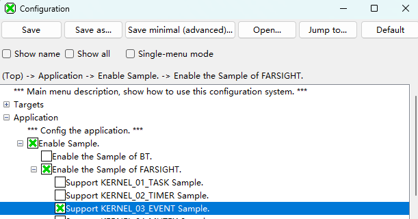

3.  点击全编译按钮进行编译：


4.  编译完成后，使用USB线连接开发板，点击烧录按钮烧录程序：


### 实验现象

重启Ws63开发板之后，首先进入到任务1中，这个时候任务2在等待3个事件全部触发的时候，才会执行。然后在任务1中，每隔1S中设置一个事件标志位，发送了3个事件，任务2接收到了3个事件标志位，开始执行打印信息ok。

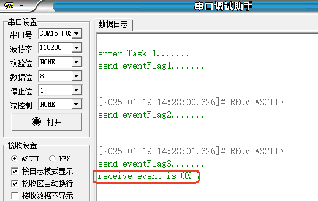

## LiteOS之互斥锁实验

### 实验目的

1.  熟悉LiteOS系统下任务相关函数的使用。

2.  熟悉如何使用Hispark Studio。

3.  熟悉LiteOS系统的编译流程和设计步骤，能够进行设计、编程、调试。

4.  检测搭建的软件及硬件环境是否可正常使用。

### 实验要求

创建两个任务，任务1向全局数组中存入数据，此时在任务2中不能读数据；任务2读全局数组中的数据，此时在任务1中不能写数据。

### 实验环境

硬件环境：FS_Ws63开发板、USB线。

软件环境：Windows系统、Hispark Studio。

源码位置：【vendor\Hqyj_Ws63\Farsight\kernel_04_mutex】

### 实验原理

互斥锁又称互斥型信号量，是一种特殊的二值性信号量，用于实现对共享资源的独占式处理。任意时刻互斥锁的状态只有两种，开锁或闭锁。当有任务持有时，互斥锁处于闭锁状态，这个任务获得该互斥锁的所有权。当该任务释放它时，该互斥锁被开锁，任务失去该互斥锁的所有权。当一个任务持有互斥锁时，其他任务将不能再对该互斥锁进行开锁或持有。

多任务环境下往往存在多个任务竞争同一共享资源的应用场景，互斥锁可被用于对共享资源的保护从而实现独占式访问。另外互斥锁可以解决信号量存在的优先级翻转问题。

多任务环境下会存在多个任务访问同一公共资源的场景，而有些公共资源是非共享的，需要任务进行独占式处理。互斥锁怎样来避免这种冲突呢？

用互斥锁处理非共享资源的同步访问时，如果有任务访问该资源，则互斥锁为加锁状态。此时其他任务如果想访问这个公共资源则会被阻塞，直到互斥锁被持有该锁的任务释放后，其他任务才能重新访问该公共资源，此时互斥锁再次上锁，如此确保同一时刻只有一个任务正在访问这个公共资源，保证了公共资源操作的完整性。

运行机制如下图所示：


LiteOS 的互斥锁模块为用户提供下面几种功能，接口详细信息可以查看API参考。

|  **功能分类**   |  **接口名**   |    **描述**    |
|:---------------:|:-------------:|:--------------:|
| 创建/删除互斥锁 | LOS_MuxCreate |   创建互斥锁   |
|                 | LOS_MuxDelete | 删除指定互斥锁 |
| 申请/释放互斥锁 |  LOS_MuxPend  | 申请指定互斥锁 |
|                 |  LOS_MuxPost  | 释放指定互斥锁 |

说明：申请互斥锁有三种模式：无阻塞模式、永久阻塞模式、定时阻塞模式。

无阻塞模式：即任务申请互斥锁时，入参timeout等于0。若当前没有任务持有该互斥锁，或者持有该互斥锁的任务和申请该互斥锁的任务为同一个任务，则申请成功，否则立即返回申请失败。

永久阻塞模式：即任务申请互斥锁时，入参timeout等于0xFFFFFFFF。若当前没有任务持有该互斥锁，则申请成功。否则，任务进入阻塞态，系统切换到就绪任务中优先级最高者继续执行。任务进入阻塞态后，直到有其他任务释放该互斥锁，阻塞任务才会重新得以执行。

定时阻塞模式：即任务申请互斥锁时，0\<timeout\<0xFFFFFFFF。若当前没有任务持有该互斥锁，则申请成功。否则该任务进入阻塞态，系统切换到就绪任务中优先级最高者继续执行。任务进入阻塞态后，超时前如果有其他任务释放该互斥锁，则该任务可成功获取互斥锁继续执行，若超时前未获取到该互斥锁，接口将返回超时错误码。

可以通过设置相关的配置项来对互斥锁功能进行裁剪和设置。

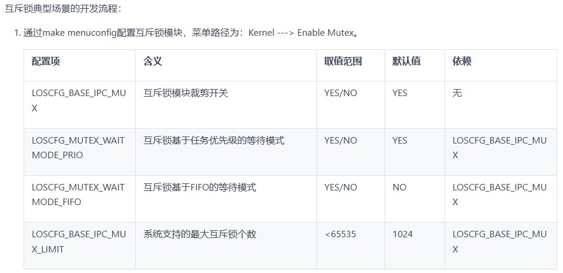

### 实验代码

1.  实验源码目录：【fbb_ws63\vendor\Hqyj_Ws63\Farsight\kernel_04_mutex】。

    注意：下面显示出主要代码，其余的请查看源码。

2.  目录下kernel_04\_ mutex.c文件用于存放用户代码；CMakeLists.txt文件用于指定源文件和头文件的路径。

3.  目录下kernel_04\_ mutex.c文件中的用户代码讲解：

首先我们需要先定义我们的任务句柄，以便在需要时可以对任务进行操作。定义互斥锁和一个共享资源。

Task1线程：进行共享资源的数据写入；

Task2线程：进行数据的读取。

```
/**
 * @description: 任务1
 * @param {*}
 * @return {*}
 */
void Task1(void *argument) 
{
     unused(argument);
    static int j = 0;
    printf("enter Task 1.......\n");
    while (1)
    {
        osMutexAcquire(Mutex_ID, osWaitForever);    // 请求互斥锁
        // 操作共享数据 写数据
        printf("start write Buff \n");
        for (size_t i = 0; i < sizeof(buff); i++){
            buff[i] =   j++;;
        }
        printf("\n");
        osMutexRelease(Mutex_ID);   // 释放互斥锁
        osDelay(100);
    }
}
/**
 * @description: 任务2 用于接受事件
 * @param {*}
 * @return {*}
 */
void Task2(void *argument)
{
     unused(argument);
    printf("enter Task 2.......\n");
    while (1)
    {
        osMutexAcquire(Mutex_ID, osWaitForever);    // 请求互斥锁
        // 操作共享数据 读数据
        printf("read Buff Data: \n");
        for (size_t i = 0; i < sizeof(buff); i++) {
            printf("%d ", buff[i]);
        }
        printf("\n");
        osMutexRelease(Mutex_ID);   // 释放互斥锁
        osDelay(100);
    }
}
```

4.  目录下CMakeLists.txt文件用来指定组件的相关源文件和头文件路径。

SOURCES：当前组件的源文件列表，其中CMAKE_CURRENT_SOURCE_DIR变量标识当前CMakeLists.txt所在的路径。

| set(SOURCES "\${SOURCES}" "\${CMAKE_CURRENT_SOURCE_DIR}/kernel_04_mutex.c" PARENT_SCOPE) |
|----|

### 编译烧录

1.  点击系统配置选项：


2.  选中相对应的案例：

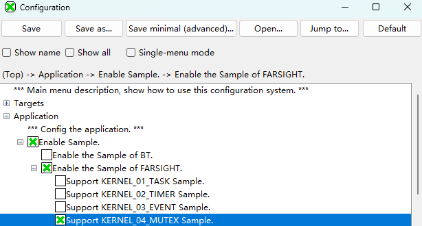

3.  点击全编译按钮进行编译：


4.  编译完成后，使用USB线连接开发板，点击烧录按钮烧录程序：


### 实验现象

重启Ws63开发板，任务1和任务2都会去访问同一块空间数据，在任务1中写数据时，任务2被挂起不能读数据，当任务1写数据完成释放互斥锁，任务2开始执行，读出共享空间中的数据，再次释放互斥锁。循环往复进行执行。

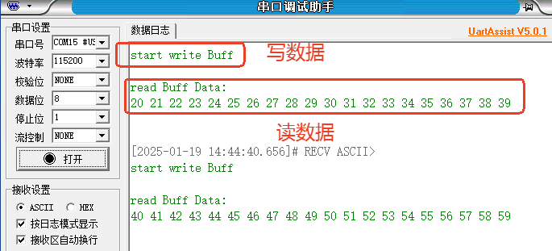

## LiteOS之互斥信号量实验

### 实验目的

1.  熟悉LiteOS系统下任务相关函数的使用。

2.  熟悉如何使用Hispark Studio。

3.  熟悉LiteOS系统的编译流程和设计步骤，能够进行设计、编程、调试。

4.  检测搭建的软件及硬件环境是否可正常使用。

### 实验要求

创建两个任务，任务1向全局数组中存入数据，此时在任务2中不能读数据；任务2读全局数组中的数据，此时在任务1中不能写数据。

### 实验环境

硬件环境：FS_Ws63开发板、USB线。

软件环境：Windows系统、Hispark Studio。

源码位置：【vendor\Hqyj_Ws63\Farsight\kernel_05_mutex_semaphore】

### 实验原理

信号量（Semaphore）是一种实现任务间通信的机制，可以实现任务间同步或共享资源的互斥访问。

一个信号量的数据结构中，通常有一个计数值用于对有效资源数的计数，表示剩下的可被使用的共享资源数，其值的含义分两种情况：

1.  表示该信号量当前不可获取，因此可能存在正在等待该信号量的任务。

2.  正值，表示该信号量当前可被获取。

当任务申请信号量时，如果申请成功，则信号量的计数值递减，如果申请失败，则挂起在该信号量的等待任务队列上，一旦有任务释放该信号量时，则等待任务队列中的任务被唤醒开始执行。

运行机制如下图所示：


信号量还有一些应用场景，可以用做多种场合中，比如可以实现互斥锁、同步、资源技术等功能，也能方便用于任务与任务，中断与任务的同步中。

- 互斥锁

用做互斥时，信号量在创建的时候，将最大值设置为1，初始值设置为1，可以实现两个任务之间的资源进行互斥。如果想要使用临界资源时，先申请信号量，使其变为0，这样其他任务就会因为无法申请到信号量而阻塞，从而保证了临界资源的安全，在使用完临界资源之后，进行释放信号量。

### 实验代码

1.  实验源码目录：【fbb_ws63\vendor\Hqyj_Ws63\Farsight\\ kernel_05_mutex_semaphore】。

    注意：下面显示出主要代码，其余的请查看源码。

2.  目录下kernel_05_mutex_semaphore.c文件用于存放用户代码；CMakeLists.txt文件用于指定源文件和头文件的路径。

3.  目录下kernel_05_mutex_semaphore.c文件中的用户代码讲解：

首先我们需要先定义我们的任务句柄，以便在需要时可以对任务进行操作。定义信号量和一个共享资源。

Task1线程：进行共享资源的数据写入；

Task2线程：进行数据的读取。

```
/**
 * @description: 任务1
 * @param {*}
 * @return {*}
 */
void Task1(void *argument) 
{
    unused(argument);
    static int j = 0;
    printf("enter Task 1.......\n");
    while (1)
    {
        osSemaphoreAcquire(Semaphore_ID, osWaitForever); // 请求信号量 -1
        // 操作共享数据 写数据
        printf("start write Buff \n");
        for (size_t i = 0; i < sizeof(buff); i++) {
            buff[i] =   j++;;
        }
        printf("\n");
        osSemaphoreRelease(Semaphore_ID); // 释放信号量 +1
        osDelay(100);
    }
}
/**
 * @description: 任务2
 * @param {*}
 * @return {*}
 */
void Task2(void *argument)
{
    unused(argument);
    printf("enter Task 2.......\n");
    while (1)
    {
         osSemaphoreAcquire(Semaphore_ID, osWaitForever); // 请求信号量 -1
        // 操作共享数据 读数据
        printf("read Buff Data: \n");
        for (size_t i = 0; i < sizeof(buff); i++){
            printf("%d ", buff[i]);
        }
        printf("\n");
        osSemaphoreRelease(Semaphore_ID); // 释放信号量 +1
        osDelay(100);
    }
}
```

4.  目录下CMakeLists.txt文件用来指定组件的相关源文件和头文件路径。

SOURCES：当前组件的源文件列表，其中CMAKE_CURRENT_SOURCE_DIR变量标识当前CMakeLists.txt所在的路径。

| set(SOURCES "\${SOURCES}" "\${CMAKE_CURRENT_SOURCE_DIR}/ kernel_05_mutex_semaphore.c" PARENT_SCOPE) |
|----|

### 编译烧录

1.  点击系统配置选项：


2.  选中相对应的案例：


3.  点击全编译按钮进行编译：


4.  编译完成后，使用USB线连接开发板，点击烧录按钮烧录程序：


### 实验现象

重启Ws63开发板，任务1写数据，任务2读数据，这是一个顺序执行的过程。

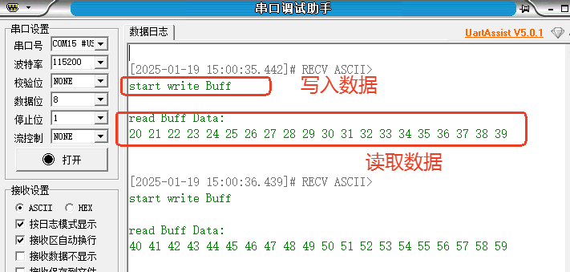

## LiteOS之同步型信号量试验

### 实验目的

1.  熟悉LiteOS系统下任务相关函数的使用。

2.  熟悉如何使用Hispark Studio。

3.  熟悉LiteOS系统的编译流程和设计步骤，能够进行设计、编程、调试。

4.  检测搭建的软件及硬件环境是否可正常使用。

### 实验要求

创建两个任务，任务1请求信号量，任务2释放信号量。

### 实验环境

硬件环境：FS_Ws63开发板、USB线。

软件环境：Windows系统、Hispark Studio。

源码位置：【vendor\Hqyj_Ws63\Farsight\kernel_06_sync_Semaphore】

### 实验原理

信号量（Semaphore）是一种实现任务间通信的机制，可以实现任务间同步或共享资源的互斥访问。

一个信号量的数据结构中，通常有一个计数值用于对有效资源数的计数，表示剩下的可被使用的共享资源数，其值的含义分两种情况：

1.  表示该信号量当前不可获取，因此可能存在正在等待该信号量的任务。

2.  正值，表示该信号量当前可被获取。

当任务申请信号量时，如果申请成功，则信号量的计数值递减，如果申请失败，则挂起在该信号量的等待任务队列上，一旦有任务释放该信号量时，则等待任务队列中的任务被唤醒开始执行。

运行机制如下图所示：


信号量还有一些应用场景，可以用做多种场合中，比如可以实现互斥锁、同步、资源技术等功能，也能方便用于任务与任务，中断与任务的同步中。

- 任务与任务之间同步

用做同步时，信号量在创建时初始值设置为0，任务1要申请信号量而阻塞，任务2可以释放信号量，于是任务1得以进入等待态和运行态，从而达到了两个任务间的同步。

### 实验代码

1.  实验源码目录：【fbb_ws63\vendor\Hqyj_Ws63\Farsight\kernel_06_sync_Semaphore】。

    注意：下面显示出主要代码，其余的请查看源码。

2.  目录下kernel_06_sync_Semaphore.c文件用于存放用户代码；CMakeLists.txt文件用于指定源文件和头文件的路径。

3.  目录下kernel_06_sync_Semaphore.c文件中的用户代码讲解：

首先我们需要先定义我们的任务句柄，以便在需要时可以对任务进行操作。定义信号量。

Task1函数：请求信号量，然后打印字符串“Task 1……”

Tsak2函数：释放信号量，然后打印字符串“Task 2……”

```
/**
 * @description: 任务1
 * @param {*}
 * @return {*}
 */
void Task1(void *argument) 
{
    unused(argument);
    while (1)
    {
        osSemaphoreAcquire(Semaphore_ID, osWaitForever);    // 请求信号量 -1
       printf("Task 1 osSemaphore Acquire <=====\n");
       osDelay(100);
    }
}
/**
 * @description: 任务2 
 * @param {*}
 * @return {*}
 */
void Task2(void *argument)
{
    unused(argument);
    while (1)
    {
        osSemaphoreRelease(Semaphore_ID);   // 释放信号量 +1
       printf("Task 2 osSemaphore Release =====>\n");
        osDelay(200);
    }
}
```

4.  目录下CMakeLists.txt文件用来指定组件的相关源文件和头文件路径。

SOURCES：当前组件的源文件列表，其中CMAKE_CURRENT_SOURCE_DIR变量标识当前CMakeLists.txt所在的路径。

| set(SOURCES "\${SOURCES}" "\${CMAKE_CURRENT_SOURCE_DIR}/ kernel_06_sync\_Semaphore.c" PARENT_SCOPE) |
|----|

### 编译烧录

1.  点击系统配置选项：


2.  选中相对应的案例：


3.  点击全编译按钮进行编译：


4.  编译完成后，使用USB线连接开发板，点击烧录按钮烧录程序：


### 实验现象

重启Ws63开发板，任务1请求信号量，任务2释放信号量。

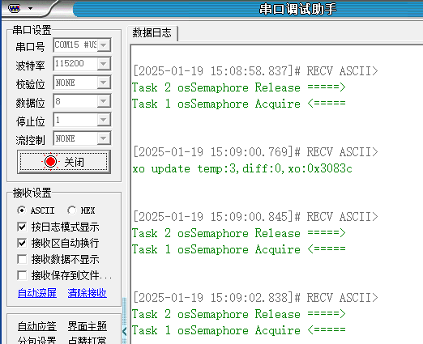

## LiteOS之计数型信号量试验

### 实验目的

1.  熟悉LiteOS系统下任务相关函数的使用。

2.  熟悉如何使用Hispark Studio。

3.  熟悉LiteOS系统的编译流程和设计步骤，能够进行设计、编程、调试。

4.  检测搭建的软件及硬件环境是否可正常使用。

### 实验要求

创建两个任务，模拟一个停车场，停车场的容量为10个，任务1中每隔一秒申请信号量，信号量的计数值会减1（相当于进入了一辆车）；任务2中每隔两秒钟释放信号量，信号量的计数值会加1（相当于出去了1辆车）。

### 实验环境

硬件环境：FS_Ws63开发板、USB线。

软件环境：Windows系统、Hispark Studio。

源码位置：【vendor\Hqyj_Ws63\Farsight\kernel_07_count_Semaphore】

### 实验原理

信号量（Semaphore）是一种实现任务间通信的机制，可以实现任务间同步或共享资源的互斥访问。

一个信号量的数据结构中，通常有一个计数值用于对有效资源数的计数，表示剩下的可被使用的共享资源数，其值的含义分两种情况：

1.  表示该信号量当前不可获取，因此可能存在正在等待该信号量的任务。

2.  正值，表示该信号量当前可被获取。

当任务申请信号量时，如果申请成功，则信号量的计数值递减，如果申请失败，则挂起在该信号量的等待任务队列上，一旦有任务释放该信号量时，则等待任务队列中的任务被唤醒开始执行。

运行机制如下图所示：


信号量还有一些应用场景，可以用做多种场合中，比如可以实现互斥锁、同步、资源技术等功能，也能方便用于任务与任务，中断与任务的同步中。

- 任务与任务之间同步

用做资源计数时，信号量的作用是一个特殊的计数器，可以递增或递减，但是此值不能为负值，典型的应用场景是生产者与消费者的场景中。

### 实验代码

1.  实验源码目录：【fbb_ws63\vendor\Hqyj_Ws63\Farsight\kernel_07_count_Semaphore】。

    注意：下面显示出主要代码，其余的请查看源码。

2.  目录下kernel_07_count_Semaphore.c文件用于存放用户代码；CMakeLists.txt文件用于指定源文件和头文件的路径。

3.  目录下kernel_07_count_Semaphore.c文件中的用户代码讲解：

首先我们需要先定义我们的任务句柄，以便在需要时可以对任务进行操作。定义信号量。

Task1函数：请求信号量，然后打印字符串“Task 1……”

Tsak2函数：释放信号量，然后打印字符串“Task 2……”

```
/**
 * @description: 任务1 模拟停车场的入口
 *  每隔一秒钟，停车场就会进入一辆车
 * @param {*}
 * @return {*}
 */
void Task1(void *argument) 
{
  unused(argument);
  while (1)
  {
    if (osSemaphoreGetCount(Semaphore_ID) )
    {
      if (osSemaphoreAcquire(Semaphore_ID,0xff) == osOK) // 信号量 -1
        printf("[进入%d辆车, 停车场容量: %d] 信号量-1.\n",10 - osSemaphoreGetCount(Semaphore_ID), SEM_MAX_COUNT);
    }
    else  printf("[进入停车场失败, 请等待...]\n");
    osDelay(100);
  }
}
/**
 * @description: 任务2 每隔两秒钟，停车场就会出去一辆车
 * @param {*}
 * @return {*}
 */
void Task2(void *argument)
{
  unused(argument);
  while (1)
  {
    if (osSemaphoreRelease(Semaphore_ID) == osOK) // 信号量 +1
      printf("[出去1辆车, 剩余停车场容量: %d] 信号量+1.\n", osSemaphoreGetCount(Semaphore_ID));
    else  printf("[出停车场失败]\n");
    osDelay(200);
  }
}
```

4.  目录下CMakeLists.txt文件用来指定组件的相关源文件和头文件路径。

SOURCES：当前组件的源文件列表，其中CMAKE_CURRENT_SOURCE_DIR变量标识当前CMakeLists.txt所在的路径。

| set(SOURCES "\${SOURCES}" "\${CMAKE_CURRENT_SOURCE_DIR}/ kernel_07_count_Semaphore.c" PARENT_SCOPE) |
|----|

### 编译烧录

1.  点击系统配置选项：


2.  选中相对应的案例：

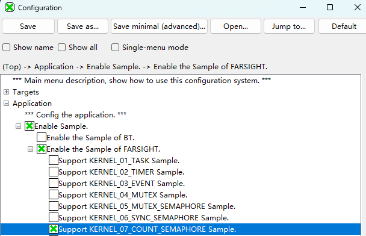

3.  点击全编译按钮进行编译：


4.  编译完成后，使用USB线连接开发板，点击烧录按钮烧录程序：


### 实验现象

重启Ws63开发板，刚开始的时候，可申请信号量为10，任务1每隔1秒申请一次信号量，每隔两秒释放一次信号量，直到信号量消耗完。

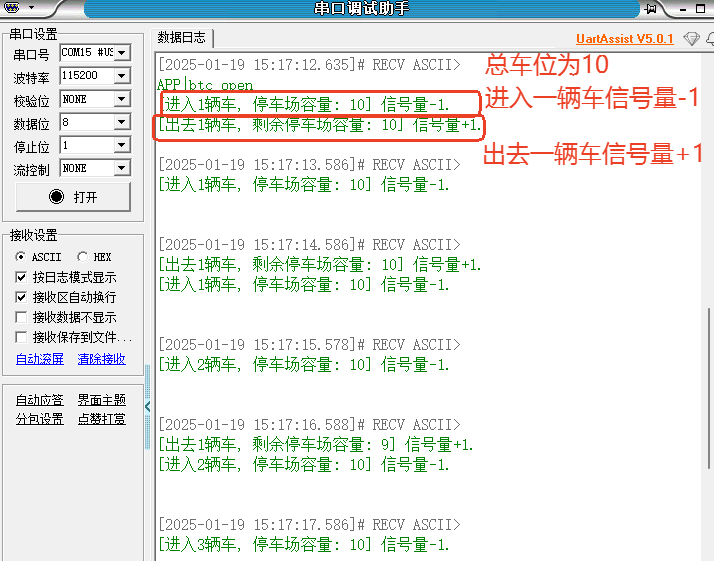

## LiteOS之消息队列实验

### 实验目的

1.  熟悉LiteOS系统下任务相关函数的使用。

2.  熟悉如何使用Hispark Studio。

3.  熟悉LiteOS系统的编译流程和设计步骤，能够进行设计、编程、调试。

4.  检测搭建的软件及硬件环境是否可正常使用。

### 实验要求

创建两个任务，任务1将数据放进消息队列中，任务2如果数据了，会将消息队列中的数据进行出队，出队之后，打印信息。

### 实验环境

硬件环境：FS_Ws63开发板、USB线。

软件环境：Windows系统、Hispark Studio。

源码位置：【vendor\Hqyj_Ws63\Farsight\kernel_08_messge_queue】

### 实验原理

队列又称消息队列，是一种常用于任务间通信的数据结构。队列接收来自任务或中断的不固定长度消息，并根据不同的接口确定传递的消息是否存放在队列空间中。

任务能够从队列里面读取消息，当队列中的消息为空时，挂起读取任务；当队列中有新消息时，挂起的读取任务被唤醒并处理新消息。任务也能够往队列里写入消息，当队列已经写满消息时，挂起写入任务；当队列中有空闲消息节点时，挂起的写入任务被唤醒并写入消息。

可以通过调整读队列和写队列的超时时间来调整读写接口的阻塞模式，如果将读队列和写队列的超时时间设置为0，就不会挂起任务，接口会直接返回，这就是非阻塞模式。反之，如果将读队列和写队列的超时时间设置为大于0的时间，就会以阻塞模式运行。

消息队列提供了异步处理机制，允许将一个消息放入队列，但不立即处理。同时队列还有缓冲消息的作用，可以使用队列实现任务异步通信，队列具有如下特性：

1.  消息以先进先出的方式排队，支持异步读写。

2.  读队列和写队列都支持超时机制。

3.  每读取一条消息，就会将该消息节点设置为空闲。

4.  发送消息类型由通信双方约定，可以允许不同长度（不超过队列的消息节点大小）的消息。

5.  一个任务能够从任意一个消息队列接收和发送消息。

6.  多个任务能够从同一个消息队列接收和发送消息。

7.  创建队列时所需的队列空间，接口内系统自行动态申请内存。

运行机制如下图所示：


### 实验代码

1.  实验源码目录：【fbb_ws63\vendor\Hqyj_Ws63\Farsight\kernel_08_messge_queue】。

    注意：下面显示出主要代码，其余的请查看源码。

2.  目录下kernel_08_messge_queue.c文件用于存放用户代码；CMakeLists.txt文件用于指定源文件和头文件的路径。

3.  目录下kernel_08_messge_queue.c文件中的用户代码讲解：

首先我们需要先定义我们的任务句柄，以便在需要时可以对任务进行操作。然后定义信号量和消息队列ID。宏定义MsgQueueObjectNumber是消息队列的长度，结构体msg_people_t是我们学要写的数据内容。

创建消息队列：

```
  // 创建消息队列                     消息队列中的消息个数，消息队列中的消息大小，属性
    MsgQueue_ID = osMessageQueueNew(MsgQueueObjectNumber, sizeof(msg_people_t), NULL);     
    if(MsgQueue_ID != NULL)
    {
        printf("ID = %d, Create MsgQueue_ID is OK!\n", MsgQueue_ID);
    }

```

Task1线程：进行结构体成员的初始化，通过osMessageQueuePut函数将数据放入消息队列；

Task2线程：使用osMessageQueueGet函数将任务1写入的数据从消息队列中读出并打印。

```
osThreadId_t Task1_ID;   //  任务1 ID
osThreadId_t Task2_ID; //  任务2 ID
osMessageQueueId_t MsgQueue_ID; // 消息队列的ID

#define MsgQueueObjectNumber 16       // 定义消息队列对象的个数
typedef struct message_people
{
    uint8_t id;     // ID
    uint8_t age;    // 年龄
    char *name;     // 名字
}msg_people_t;
msg_people_t msg_people;
/**
 * @description: 任务1 发送消息
 * @param {*}
 * @return {*}
 */
void Task1(void *argument) 
{
    unused(argument);
    osStatus_t msgStatus;
    static uint8_t i=0,j=0;
    while (1)
    {
        printf("enter Task 1.......\n");
        msg_people.id = i++;
        msg_people.age = j++;
        msg_people.name = "xiao_ming";
        msgStatus = osMessageQueuePut(MsgQueue_ID, &msg_people, 0, 100);
        if(msgStatus == osOK)
        {
            printf("osMessageQueuePut is ok.\n");
        }
            osDelay(100);
    }
}
/**
 * @description: 任务2 
 * @param {*}
 * @return {*}
 */
void Task2(void *argument)
{
    unused(argument);
   osStatus_t msgStatus;
    while (1)
    {
        printf("enter Task 2.......\n");
        msgStatus = osMessageQueueGet(MsgQueue_ID, &msg_people, 0, 100);
        if(msgStatus == osOK)
        {
            printf("osMessageQueueGet is ok.\n");
            printf("Recv: id = %d, age = %d, name = %s\n", msg_people.id, msg_people.age, msg_people.name);
        }
    }
}
```

4.  目录下CMakeLists.txt文件用来指定组件的相关源文件和头文件路径。

SOURCES：当前组件的源文件列表，其中CMAKE_CURRENT_SOURCE_DIR变量标识当前CMakeLists.txt所在的路径。

| set(SOURCES "\${SOURCES}" "\${CMAKE_CURRENT_SOURCE_DIR}/ kernel_08_message_queue.c" PARENT_SCOPE) |
|----|

### 编译烧录

1.  点击系统配置选项：


2.  选中相对应的案例：

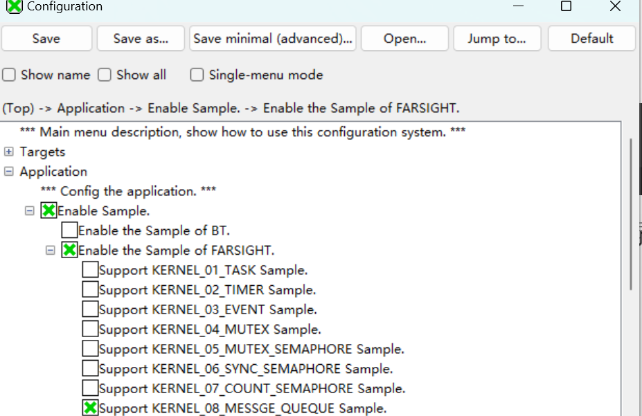

3.  点击全编译按钮进行编译：


4.  编译完成后，使用USB线连接开发板，点击烧录按钮烧录程序：


### 实验现象

重启Ws63开发板，任务1中，将数据放进消息队列中，在任务2中，如果数据了，会将消息队列中的数据进行出队，出队之后，打印信息。

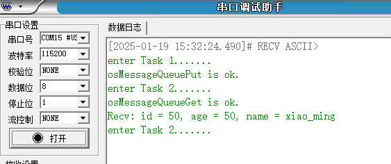

## LiteOS之NV系统存储实验

### 实验目的

1.  熟悉LiteOS系统下任务相关函数的使用。

2.  熟悉如何使用Hispark Studio。

3.  熟悉LiteOS系统的编译流程和设计步骤，能够进行设计、编程、调试。

4.  检测搭建的软件及硬件环境是否可正常使用。

### 实验要求

在掉电后，存储传感器的阈值信息，然后将开发板再次重启，在串口调试助手中显示读取到的信息。

### 实验环境

硬件环境：FS_Ws63开发板、USB线。

软件环境：Windows系统、Hispark Studio。

源码位置：【vendor\Hqyj_Ws63\Farsight\kernel_09_nv】

### 实验原理

NV模块用于本地存储器中存储非易失性数据。NV中的每项数据以类似key-value的方式进行定义，数据项中包含唯一的索引key和自定义数据类型的value。

在Ws63中，NV项可通过两种方式进行存储：编译预置和API写入。

- 编译预置是指开发者可在代码编译阶段，通过修改NV头文件和NV配置文件的方式生成客制化的NV镜像，在镜像烧录的过程中统一烧录到存储介质中。预置的NV在代码运行阶段可通过API接口进行读取和更新。

- API写入是指用户可直接在代码中调用API接口写入新的NV项。

### 实验代码

1.  实验源码目录：【fbb_ws63\vendor\Hqyj_Ws63\Farsight\kernel_09_nv】。

    注意：下面显示出主要代码，其余的请查看源码。

2.  目录下kernel_09_nv.c文件用于存放用户代码；CMakeLists.txt文件用于指定源文件和头文件的路径。

3.  目录下kernel_09_nv.c文件中的用户代码讲解：

nv_write_fun：该函数使用api接口函数将buf数组的值保存在flash中；

nv_read_fun：该函数使用api接口读取特定NV项ID的数据，并将读取到的数据打印出来，然后更新buf数组中的数值；

```
static int nv_write_func(void)
{
    printf("[write data]: ");
    for (size_t i = 0; i < sizeof(buf); i++) {
        /* code */
        printf("%x ", buf[i]);
    }
    printf("\r\n");
    uint16_t key = KEYID;
    uint16_t key_len = sizeof(mytest_config_t);
    uint8_t *product_config = osal_vmalloc(key_len);
    memcpy(product_config, buf, sizeof(buf));
    int ret = uapi_nv_write(key, product_config, key_len);
    osal_vfree(product_config);
    product_config = NULL;
    if (ret == 0) {
        return 1;
    } else {
        return 0;
    }
}

static int nv_read_func(void)
{
    uint16_t key = KEYID;
    uint16_t key_len = sizeof(mytest_config_t);
    uint16_t real_len = 0;
    uint8_t *read_value = osal_vmalloc(key_len);
    int ret = uapi_nv_read(key, key_len, &real_len, read_value);
    if (ret == 0) {
        printf("[get data]: ");
        for (size_t i = 0; i < sizeof(buf); i++) {
            /* code */
            printf("%x ", read_value[i]);
        }
        printf("\r\n");
        for (size_t i = 0; i < sizeof(buf); i++) {
            buf[i] += read_value[i];
        }
        osal_vfree(read_value);
        read_value = NULL;
        return 1;
    } else {
        osal_vfree(read_value);
        read_value = NULL;
        return 0;
    }
}
```

Task1:延时三秒钟，等待用户打开串口，首先读取flash中的数据并打印出来，然后将flash中的数据更新，下次上电重启后可以读取新的值。

```
/**
 * @description: 任务1
 * @param {*}
 * @return {*}
 */
void task1(const char *argument)
{
    unused(argument);
    osDelay(DELAY_TIME_MS); // 等待你打开串口
    printf("----------------------------------!\n");
    uint8_t ret = nv_read_func();
    if (ret) {
        printf("nv read ok!\n");
    } else {
        printf("nv read fail!\n");
    }
    osDelay(DELAY_TIME_MS);
    ret = nv_write_func();
    if (ret) {
        printf("nv write ok!\n");
    } else {
        printf("nv write fail!\n");
    }
}
```

4.  目录下CMakeLists.txt文件用来指定组件的相关源文件和头文件路径。

SOURCES：当前组件的源文件列表，其中CMAKE_CURRENT_SOURCE_DIR变量标识当前CMakeLists.txt所在的路径。

| set(SOURCES "\${SOURCES}" "\${CMAKE_CURRENT_SOURCE_DIR}/ kernel_09_nv.c" PARENT_SCOPE) |
|----|

### 编译烧录

1.  点击系统配置选项：


2.  选中相对应的案例：

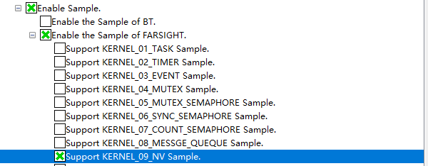

3.  点击全编译按钮进行编译：


4.  编译完成后，使用USB线连接开发板，点击烧录按钮烧录程序：


### 实验现象

重启Ws63开发板，发现首次向flash中写入数据，重新开关开发板，可以看到上次写入的数据被保存并读取了出来。


# 基础实验

## 串口收发实验

### 串口基础

#### 串口简介

设备之间往往需要通过有线的方式进行通信。按照不同的通信方式，可以将现有的通信协议分为几个类别。本章主要介绍其中的一种常见的有线通信方式——串口通信。串口通信广泛应用于各种计算机系统和外部设备之间的数据交换与通信，它通过串行传输数据位来实现信息的传输，是一种简单、可靠的通信方式。在单片机中，串口通信一般指的是用通用同步/异步收发器（Universal Synchronous/Asynchronous Receiver/Transmitter，USART）进行通信，采用的方式是串行通信方式。

#### 串口分类

- 按照连接方式分类，通信方式分为并行、串行两种。

并行通信中存在多条数据线，因此可以在同一时刻并行传输多个数据位，如下图所示。其优点为：数据传输速度快，能够同时传输多个比特数据。其缺点为：对线路长度敏感，可能存在信号完整性和延迟问题，线路成本高，消耗引脚较多。


串行通信最少仅需要一根数据线进行发送或接收，数据用二进制位按照顺序一位一位地发送到接收方，如下图所示。其优点为：使用较少的线路来传输数据，传输距离远，抗干扰性好，功耗低，可以轻松增加新的设备或连接点。其缺点为：传输速度较低。


- 按照数据的同步方式，通信可分为同步通信和异步通信。

在同步通信中，发送方和接收方的时钟是相互同步的，数据的发送和接收都在时钟信号的控制下进行，如下图所示。发送方提供同步时钟和数据信号，接收方通过同步时钟确保数据的准确传输。在一些通信协议下，发送方在发送数据之前会等待接收方的确认信号或者使用预定的时序来发送数据。接收方在接收到数据后会发送确认信号或者按照预定的时序进行数据处理。

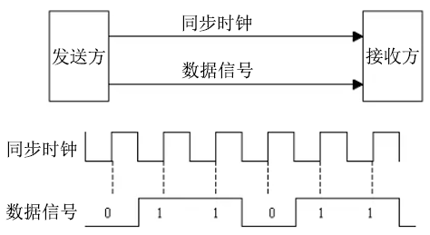

在异步通信中，发送方和接收方的时钟不是相互同步的，收发双方数据的发送和接收是独立进行的，没有统一的时钟信号来控制数据传输，如下图所示。发送方和接收方之间一般没有明确的同步机制，数据的发送和接收是根据开始和结束标记来识别的。发送方发送数据时，在数据之间会插入起始和结束标记，接收方通过检测这些标记来识别数据的起止。


- 按照数据的传输方向，通信可分为单工、全双工与半双工通信。

在单工通信中，数据只能单向传输，即数据流只能在一个方向上传输，而不能在两个方向上同时传输。典型的例子是广播电台传输，其中信息只能由发送方传输到接收方，接收方无法向发送方发送任何信息。单工通信类似于单行道，数据只能在一个方向上移动。

在全双工通信中，数据可以在两个方向上同时传输，允许发送方和接收方之间的双向通信。这意味着发送方和接收方都可以同时发送和接收数据，就像电话通信中的双向通话一样。

在半双工通信中，数据传输在两个方向上进行，但不能同时进行。发送方和接收方之间只能在不同的时间段内交替发送和接收数据，而不能同时进行发送和接收。

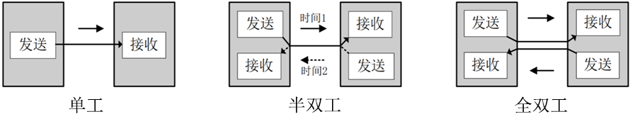

#### 波特率

在通信中经常用波特率来衡量通信的速率。波特率是指在系统中单位时间内传输的码元个数。对于USART而言，码元可以用高低电平两个状态来表示，一个码元只能传递1 bit的信息，所以波特率和比特率在数值上是相等的。例如，当波特率为115200时，实质就是UART串口每秒传输115200 bit的数据量，传输一个bit的时间等于1/115200秒。对于某些采用了4个电平等级的码元进行编码的方案而言，一个码元可以表示两个比特的信息，所以在数值上比特率是波特率的两倍。

#### USART的数据帧格式

USART的数据帧格式如下图所示。


时钟线上是使用USART时钟信号的时序，\*\*代表一个可被设置为产生或不产生的时钟信号，由LBCL 位控制。如果使用UART，则没有时钟线。

可通过对 USART_CR1 寄存器中的 M 位进行编程来选择 8 位或 9 位的字长。当选择8位字长且不使能奇偶校验位时，一帧里面包含的数据是8位的。

数据包从起始位开始，到停止位结束。一般来说起始位为低电平，停止位为高电平。停止位长度的典型值为1 、1.5和2位。停止位的存在使得接收端可以确定数据帧的传输结束，并为下一个数据帧的开始做好准备。

可以配置数据帧中是否包含奇偶校验位。数据帧中使能这一位后，使得“1”的个数应为偶数（偶校验）或奇数（奇校验），以此来校验资料传送的正确性。

### 实验目的

1.  熟悉如何使用Hispark Studio。

2.  熟悉LiteOS系统的编译流程和设计步骤，能够进行设计、编程、调试。

3.  检测搭建的软件及硬件环境是否可正常使用。

### 实验要求

初始化串口，使UART0可以在中断模式或者轮询模式下进行收发数据。

### 实验环境

硬件环境：FS_Ws63开发板、USB线。

软件环境：Windows系统、Hispark Studio。

源码位置：【vendor\Hqyj_Ws63\Farsight\base_02_uart】

### 实验原理

通用异步收发器UART是一个异步串行的通信接口，UART主要用于和外部芯片的UART进行对接，实现两芯片间的通信，此芯片提供3个UART单元。

规格如下：

- 支持可编程数据位(5-8bit)、可编程停止位(1-2bit)、可编程校验位(奇/偶校验，无校验)

- UART支持无流控，RTS/CTS流控模式

- 提供64×8的TX，64×8的RX FIFO

- 支持接收FIFO中断、发送FIFO中断、接收超时中断、错误中断等中断屏蔽与响应

- 支持DMA数据搬移方式

由原理图可知：

当拨码开关拨到0时，USB接口接到了UART0，开发板上的RX和TX引脚接到了UART2；

当拨码开关拨到1时，USB没有接任何串口，开发板上的RX和TX引脚接到了UART0；

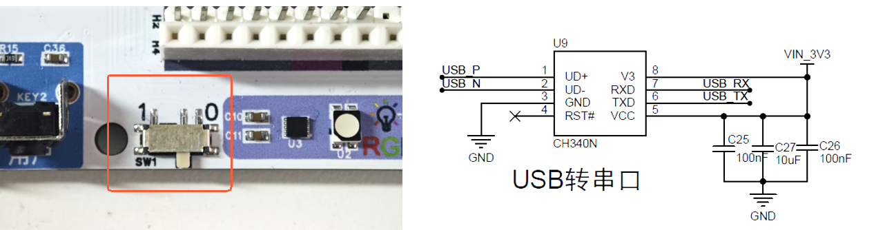

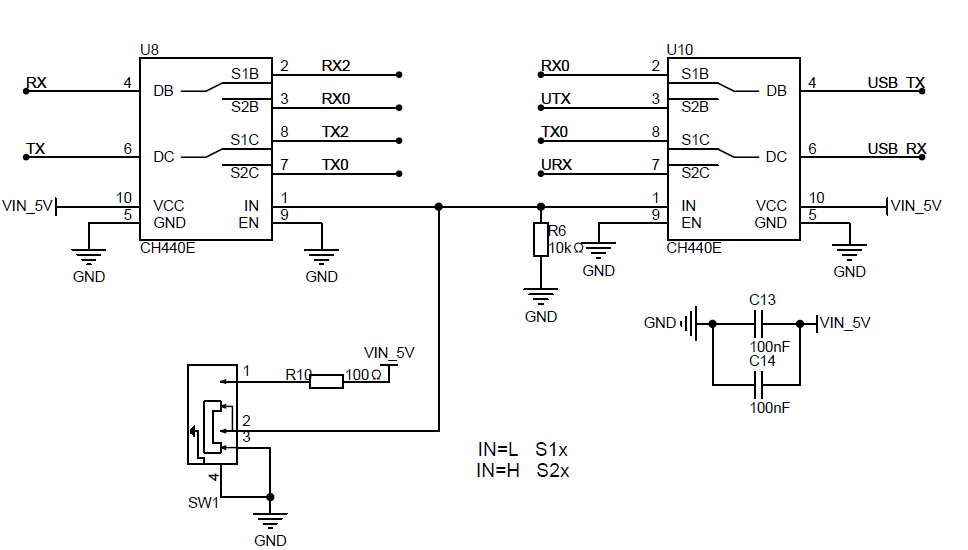

IO复用关系：

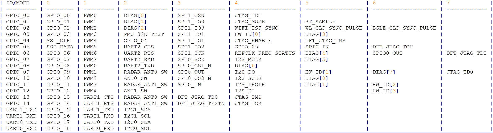

通常我们使用USB连接的串口进行调试，所以我们将拨码拨到0来使用UART0。通过IO复用关系表，我们可以得知UART0的TX和RX使用的是GPIO17和GPIO18，我们需要将这两个引脚配置为串口模式，并且串口配置为8位数据位，无校验位，1位停止位，波特率为115200。

### 实验代码

1.  实验源码目录：【fbb_ws63\vendor\Hqyj_Ws63\Farsight\base_02_uart】。

    注意：下面显示出主要代码，其余的请查看源码。

2.  目录下uart_demo.c文件用于存放用户代码；CMakeLists.txt文件用于指定源文件和头文件的路径。

3.  目录下uart_demo.c文件中的用户代码讲解：

首先编写串口初始化函数，将串口引脚配置为复用模式，并配置串口的波特率的等参数：

```
static void app_uart_init_pin(void)
{
    uapi_pin_set_mode(CONFIG_UART1_TXD_PIN, CONFIG_UART1_PIN_MODE);
    uapi_pin_set_mode(CONFIG_UART1_RXD_PIN, CONFIG_UART1_PIN_MODE);
}

static void app_uart_init_config(void)
{
    uart_attr_t attr = {.baud_rate = UART_BAUDRATE,
                        .data_bits = UART_DATA_BITS,
                        .stop_bits = UART_STOP_BITS,
                        .parity = UART_PARITY_BIT};

    uart_pin_config_t pin_config = {.tx_pin = S_MGPIO0, .rx_pin = S_MGPIO1, .cts_pin = PIN_NONE, .rts_pin = PIN_NONE};
    uapi_uart_deinit(UART_BUS_0); // 重点，UART初始化之前需要去初始化，否则会报0x80001044
    int res = uapi_uart_init(UART_BUS_0, &pin_config, &attr, NULL, &g_app_uart_buffer_config);
    if (res != 0) {
        printf("uart init failed res = %02x\r\n", res);
    }
}
```

在使用中断接收数据时，需要注册接收回调函数，接下来在uart_task任务中初始化串口，使用串口中断收发数据：

```
static void app_uart_read_int_handler(const void *buffer, uint16_t length, bool error)
{
    unused(error);
    if (buffer == NULL || length == 0) {
        osal_printk("uart%d int mode transfer illegal data!\r\n", UART_BUS_0);
        return;
    }
    if (memcpy_s(g_app_uart_rx_buff, length, buffer, length) != EOK) {
        osal_printk("uart%d int mode data copy fail!\r\n", UART_BUS_0);
        return;
    } 
    g_app_uart_int_rx_flag = 1;
}
void *uart_task(const char *arg)
{
    unused(arg);
    /* UART pinmux. */
    app_uart_init_pin();
    /* UART init config. */
    app_uart_init_config();
    osal_printk("uart%d int mode register receive callback start!\r\n", UART_BUS_0);
    if (uapi_uart_register_rx_callback(0, UART_RX_CONDITION_MASK_IDLE, 1, app_uart_read_int_handler) == ERRCODE_SUCC) {
        osal_printk("uart%d int mode register receive callback succ!\r\n", UART_BUS_0);
    }

    while (1) {
        while (g_app_uart_int_rx_flag != 1) {
            osal_msleep(CONFIG_UART_INT_WAIT_MS);
        }
        g_app_uart_int_rx_flag = 0;
        osal_printk("uart rx data = [%s]\r\n", g_app_uart_rx_buff);
        memset(g_app_uart_rx_buff,0,UART_TRANSFER_SIZE);

    }
    return NULL;
}
```

用户可以根据宏定义UART_INT_MODE来决定使用轮询接收或者中断模式接收。

4.  目录下CMakeLists.txt文件用来指定组件的相关源文件和头文件路径。

SOURCES：当前组件的源文件列表，其中CMAKE_CURRENT_SOURCE_DIR变量标识当前CMakeLists.txt所在的路径。

| set(SOURCES "\${SOURCES}" "\${CMAKE_CURRENT_SOURCE_DIR}/ uart_demo.c" PARENT_SCOPE) |
|----|

### 编译烧录

1.  点击系统配置选项：


2.  选中相对应的案例：

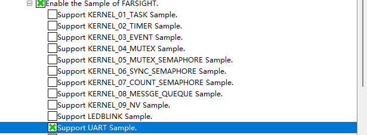

3.  点击全编译按钮进行编译：


4.  编译完成后，使用USB线连接开发板，点击烧录按钮烧录程序：


### 实验现象

重启Ws63开发板，使用USB数据线连接开发板，打开串口助手发送数据，可以看到看开发板收到数据后将数据重新发送回来。

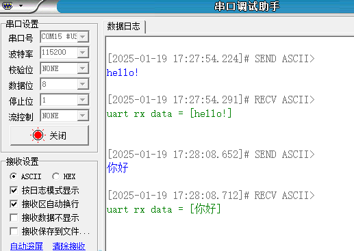

## SSD1306屏幕实验

### I2C基础

#### I2C简介

I2C（也常写作IIC），全称为Inter-Integrated Circuit Bus（内部集成电路总线），用于在集成电路之间进行短距离数据传输。它由Philips（现在的NXP半导体）公司于20世纪80年代初开发，并成为一种广泛应用于电子设备之间通信的标准。I2C协议简单、灵活且广泛支持，常用于连接传感器、存储器、显示屏和其他外设到微控制器、微处理器或其他集成电路上。这是一种简单的双向双线总线，非常适合用于微控制器与外设之间，或者多个微控制器之间的高效互连控制。

I2C的两条线包括SDA（串行数据线）和SCL（串行时钟线），分别用于传输数据和同步时钟。I2C只需要这两根线进行通信，这可以节约引脚资源。

在I2C总线中，设备可以扮演主设备（Master）或从设备（Slave）的角色。主设备负责发起和管理通信，而从设备则被动地响应主设备的指令。并且每个I2C设备都有一个唯一的7位或10位地址，用于标识设备。主设备通过发送设备地址来选择要通信的特定设备。I2C总线支持多种通信速率，最常用的模式有标准模式（100 kbit/s）、快速模式（400 kbit/s）。此外I2C总线还支持多主设备的连接，允许多个主设备共享同一条总线。

#### 电路原理

下图展示了一个典型的用于嵌入式系统中的I2C总线，总线上挂载了多种从设备。I2C的主设备为MCU \#1和MCU \#2，这两个主设备不能同时使用。主设备可以控制LCD、EEPROM、ADC等多个从设备。所有这些设备只需要通过来自主机的两根引脚来控制。I2C总线中的器件引脚只具有拉低电平的能力，不具有拉高电平的能力。在器件想拉高电平时或保持静默时，其引脚会变为高阻态，利用I2C总线中的上拉电阻来保证总线状态为高电平。这可以防止干扰总线、短路和保持电压一致。


#### I2C接口通讯时序

I2C总线是一种双向接口，使用被称为主机的控制器与从设备进行通讯。从机不会主动传输任何数据，除非被主机寻址。每个处于I2C总线上的设备有唯一的设备地址，用于与位于同一总线上的其他设备做区分。很多从机需要在启动后进行配置以设置设备行为。这通常在主机访问从机的内部寄存器映射时完成，这些寄存器均有独有的寄存器地址。单个设备可以具有一个或多个寄存器，这些寄存器可以用来存储或读写数据。

I2C总线的物理接口由串行时钟线（SCL）和串行数据线（SDA）组成。SCL和SDA均需要通过上拉电阻连接到Vcc。只有当总线处于空闲状态时，才可以启动数据传输。如果SDA和SCL在一个STOP标志后均处于高电平状态，这时可以认为总线处在空闲状态。主机访问从机设备的一般过程如下:

1.  如果主机想要向从机发送数据：

    1.  主机发送START条件并寻址从机设备。

    2.  主机向从机设备发送数据。

    3.  主机用STOP条件终止传输。

2.  如果主机想要从从机接收/读取数据：

    1.  主机发送一个START条件并向从机设备寻址。

    2.  主机将请求的寄存器发送给从机设备。

    3.  主机接收从机设备的数据。

    4.  主机使用STOP条件终止传输。

3.  START与STOP标志

主机可以通过发送START标志初始化与设备的I2C通讯，或者发送STOP标志结束通讯。当SCL处于高电平时，SDA上的下降沿意味着一个START标志，而SDA上的上升沿意味着一个STOP标志。

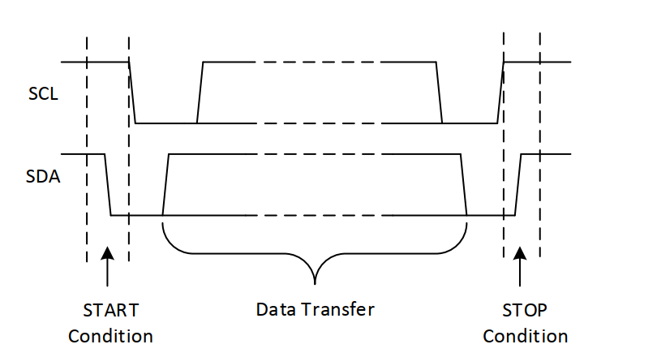

4.  重复的START标志

重复的START标志与通常的START标志作用类似，其用于STOP标志后紧接START标志的情况时，用于代替这两者。它看上去与START标志一致，但是与START标志不同的是，重复的START标志在STOP标志之前出现（也就是总线不处于空闲状态时）。当主机希望开始一次新的通讯，但又不希望发送STOP标志使总线进入空闲状态时这会非常管用，这样可以防止当前主机的总线控制权被其他主机抢夺（当处于多主机环境下）。

5.  数据有效性与字节格式

数据位伴随着SCL上的每一个时钟脉冲被传输。单个字节由SDA线上的8位数据组成，其可以是设备地址、寄存器地址或者读取/写入设备的数据。数据以大端在前（MSB）的方式传输。在START标志与STOP标志之间可以传输任意数量的数据字节。SDA线上的数据必须在时钟电平为高时保持稳定，因为SCL线为高时，SDA线上的变动将会被当作控制指令（START或STOP）。

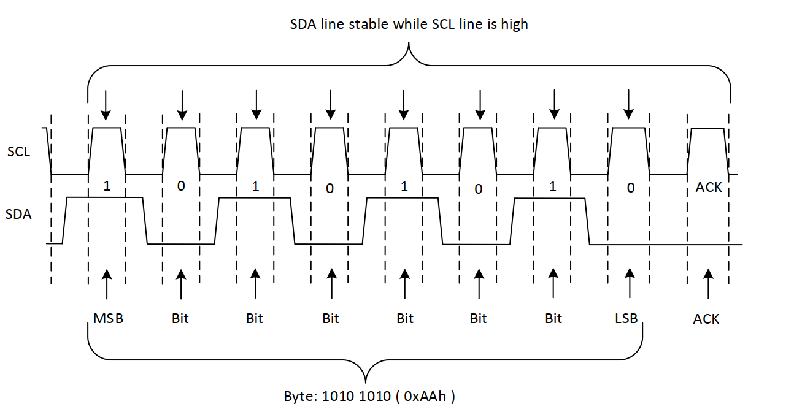

6.  应答（ACK）和非应答（NACK）

数据的每一字节（包括地址字节）后总是伴随着来自接收方的1位ACK位。ACK位使得接收方可以告知发送方当前字节已成功接收，并且可以发送下一字节。

在接收方发送ACK位前，发送方必须释放总线。接收方通过在ACK/NACK时钟周期（第9时钟周期）的低电平相位拉低SDA线来发送一个ACK位，如此一来，SDA线将会在ACK/NACK时钟周期的高电平相位保持为低电平。设置与保持时间必须着重注意。

如果SDA线在ACK/NACK时钟周期保持为高电平，这将会被作为NACK，有几种状态将会导致NACK的产生：

1.  接收方无法接收或发送，因为它正在执行一些实时功能，还没有准备好开始与主机通信。

2.  在传输过程中，接收方得到它不理解的数据或命令。

3.  在传输过程中，接收方不能再接收任何数据字节。

4.  主接收方完成读取数据，并通过NACK将此指示给从端。

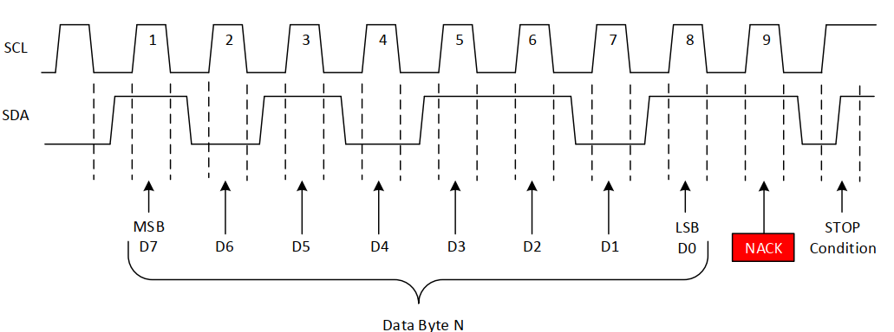

#### I2C总线数据

可以向从设备写入/读取数据，这是通过读写从设备内部的寄存器完成的。

包含信息的寄存器处于从设备的内存中，无论这些信息是配置信息还是一些需要回发给主机的采样数据。为了指示从设备去执行某一任务，主机必须向这些寄存器内写入信息。

通常来说I2C从设备是具有多个寄存器的（但需要注意的是，并不是所有从机都是这样）。对于一个只具有单个寄存器的简易从设备来说，可以通过在从设备地址后直接发送数据的方式来直接写这个单一的寄存器，而不需要再对寄存器进行寻址。一个通过I2C总线控制的8位I2C开关可以很好的作为单寄存器设备的例子。由于它通过1位来使能/失能一个通道，因此只需要1个寄存器，主机可以在从机地址后直接写入寄存器数据，跳过寄存器编码部分。

**写位于I2C总线上的从机**

要在I2C总线上执行写操作，主机会发送一个START标志以及从机地址到总线上，并且将最后1位（读写位）设为0以表明这是写操作。当从机发送应答位之后，主机便发送希望写入的寄存器地址。从机再一次应答，通知主机从机已准备好。这之后，主机开始发送寄存器数据到从机。当主机发送完所有需要发送的数据（有时只是一个字节），其将会通过发送STOP标志结束通讯。

下图展示了一个写入单个字节到从机寄存器的例子。

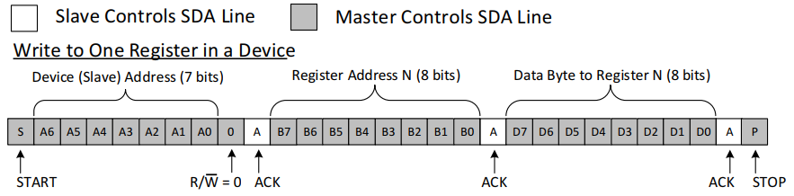

**读取位于I2C总线上的从机**

读取从机的数据与写入数据类似，但是有一些额外的步骤。为了读取从机，主机必须先指示从机自己想要读取哪个寄存器。这一步通过执行与写操作类似的开始通讯步骤完成，发送读写位为0的设备地址（意味着一次写操作），紧跟着希望读的寄存器的地址。一旦从机应答了此地址，主机将会再一次发送START标志，并发送读写位为1的设备地址（意味着一次读操作）。这时，从机将会应答读请求，同时主机释放总线但是保持到从机的时钟供应。在通讯流程的这一部分，主机将会作为接收方主机，同时从机将会作为发送方从机。

主机将会继续发送时钟脉冲，但是会释放SDA线以便于从机传输数据。在每个字节数据的结尾，主机将会发送一个ACK到从机，让从机知道主机准备好接收更多的数据。一旦主机接收完成期待的字节数量，它将会发送一个NACK，通知从机终止通讯并要求从机释放总线。紧接着主机将会发送一个STOP标志结束通讯。

下图展示了读取从机寄存器单个字节的例子。

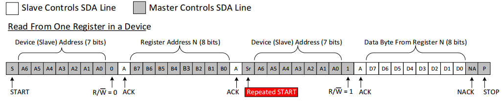

**I2C总线通信速率**

I2C总线可以工作在以下5种速率模式下，不同的器件可能支持不同的速率。

- 标准模式(Standard)：100kbps。

- 快速模式(Fast)：400kbps。

- 快速模式+(Fast-Plus)：1Mbps。

I2C速率模式【bps：bit/s，SCL的频率】其中超快模式是单向数据传输，通常用于LED、LCD等不需要应答的器件，和正常的I2C操作时序类似，但是只进行写数据，不需要考虑ACK应答信号。

**7 位寻址模式**

I2C 总线的寻址过程是通常在起始条件后的第一个字节决定了主机选择哪一个从机。例外的情况是可以寻址所有器件的“广播呼叫”地址。使用这个地址时，理论上所有器件都会发出一个响应。但是也可以使器件忽略这个地址。广播呼叫地址的第二个字节定义了要采取的行动。广播呼叫地址过程与10 位寻址模式由于案例未涉及。

**7 位寻址模式第一个字节的位定义**

第一个字节的头 7 位组成了从机地址（详见下图）。最低位 LSB 是第 8 位。它决定了报文的方向。第一个字节的最低位是0表示主机会写信息到被选中的从机。1表示主机会向从机读信息。

当发送了一个地址后，系统中的每个器件都在起始条件后将头 7 位与它自己的地址比较。如果一样，器件会任务它被主机寻址，至于是从机-接收器还是从机-发送器都由 R/ W 位决定。


从机地址由一个固定和一个可编程的部分构成。由于很可能在一个系统中有几个同样的器件，从机地址的可编程部分使最大数量的这些器件可以连接到 I2C 总线上。器件可编程地址位的数量由它可使用的管脚决定。例如，如果器件有 4 个固定的地址位和 3 个可编程的地址位，那么相同的总线上共可以连接 8 个相同的器件。

I2C总线委员会协调 I2C 地址的分配。保留的两组 8 位地址 0000XXX 和 1111XXX 的用途见下图。从机地址的 11110XX 位组合保留给 10 位寻址。

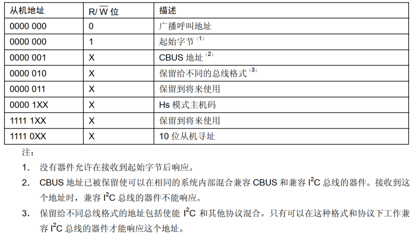

### 实验目的

1.  熟悉如何使用Hispark Studio。

2.  熟悉LiteOS系统的编译流程和设计步骤，能够进行设计、编程、调试。

3.  检测搭建的软件及硬件环境是否可正常使用。

4.  学会I2C总线与ssd1306芯片进行通信。

5.  熟悉LiteOS系统下I2C通信和相关函数的使用。

### 实验要求

在OLED显示屏上显示一个模拟时钟。

### 实验环境

硬件环境：FS_Ws63开发板、USB线。

软件环境：Windows系统、Hispark Studio。

源码位置：【vendor\Hqyj_Ws63\Farsight\\base_03_ssd1306】

### 实验原理

在本实验中，使用I2C总线与SSD1306进行通信，控制在0.96寸显示屏上显示数据。下面给出了硬件连接图：


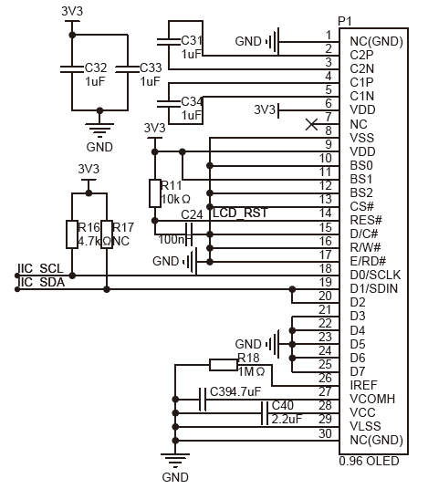

1.  根据ssd1306的芯片手册，可以得到驱动的相关数据。

    1.  I2C通信的从机地址，如下图所示，可以得知，当D/C#引脚接VDD（3.3V）时，从机地址为0x3D，否则从机地址为0x3C


IO复用关系：


通过IO复用关系表，我们可以得知IO15和IO16引脚可以复用为IIC模式，分别是数据线和时钟线。

### 实验代码

1.  实验源码目录：【fbb_ws63\vendor\Hqyj_Ws63\Farsight\\ base_03_ssd1306】。

    注意：下面显示出主要代码，其余的请查看源码。

2.  目录下base_ssd1306_demo.c文件用于存放用户代码；CMakeLists.txt文件用于指定源文件和头文件的路径。

3.  目录下base_ssd1306\_demo.c文件中的用户代码讲解：

Task1:该线程用来初始化IIC总线，并在屏幕上显示一个时钟。

```
void Task1(void)
{
    char displayBuff[20] = {0};
    uint8_t hour = 10, min = 30, sec = 0;
    printf("SSD1306_Init!\r\n");
    SSD1306_Init(); // OLED 显示屏初始化
    SSD1306_CLS(); // 清屏
    SSD1306_ShowStr(OLED_TEXT16_COLUMN_0, OLED_TEXT16_LINE_0, "  Analog Clock ", TEXT_SIZE_16);
    SSD1306_ShowStr(OLED_TEXT16_COLUMN_0, OLED_TEXT16_LINE_3, "   2025-01-01  ", TEXT_SIZE_16);

    while (1) {
        sec++;
        if (sec > (SEC_MAX - 1)) {
            sec = 0;
            min++;
        }
        if (min > (MIN_MAX - 1)) {
            min = 0;
            hour++;
        }
        if (hour > (HOUR_MAX - 1)) {
            hour = 0;
        }
        memset_s(displayBuff, sizeof(displayBuff), 0, sizeof(displayBuff));
        if (sprintf_s(displayBuff, sizeof(displayBuff), "    %02d:%02d:%02d   ", hour, min, sec) > 0) {
          SSD1306_ShowStr(OLED_TEXT16_COLUMN_0, OLED_TEXT16_LINE_2, displayBuff, TEXT_SIZE_16);
        }
        osal_msleep(1000);
    }
}
```

4.  目录下CMakeLists.txt文件用来指定组件的相关源文件和头文件路径。

SOURCES_LIST：当前组件的源文件列表，其中CMAKE_CURRENT_SOURCE_DIR变量标识当前CMakeLists.txt所在的路径。

HEADER_LIST：当前组件头文件列表，其中CMAKE_CURRENT_SOURCE_DIR变量标识当前CMakeLists.txt所在的路径。

PUBLIC_HEADER：当前组件需要对外提供的头文件的路径。SOURCES：当前组件的C文件列表。

```
set(SOURCES_LIST
    ${CMAKE_CURRENT_SOURCE_DIR}/hal_bsp_oled/hal_bsp_ssd1306.c
    ${CMAKE_CURRENT_SOURCE_DIR}/base_ssd1306_demo.c
)
set(HEADER_LIST ${CMAKE_CURRENT_SOURCE_DIR}/hal_bsp_oled)

set(SOURCES "${SOURCES}" ${SOURCES_LIST} PARENT_SCOPE)
set(PUBLIC_HEADER "${PUBLIC_HEADER}" ${HEADER_LIST} PARENT_SCOPE)
```

### 编译烧录

1.  点击系统配置选项：


2.  选中相对应的案例：

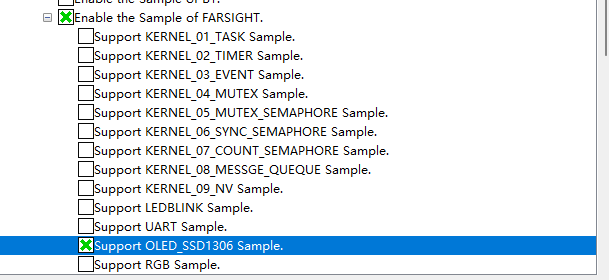

3.  点击全编译按钮进行编译：


4.  编译完成后，使用USB线连接开发板，点击烧录按钮烧录程序：


### 实验现象

重启Ws63开发板，可以看到屏幕上显示一个正在运行的时钟。


## RGB灯实验

### 实验目的

1.  熟悉如何使用Hispark Studio。

2.  熟悉LiteOS系统的编译流程和设计步骤，能够进行设计、编程、调试。

3.  检测搭建的软件及硬件环境是否可正常使用。

4.  学会I2C总线与AW2013芯片进行通信。

5.  熟悉LiteOS系统下I2C通信和相关函数的使用。

### 实验要求

RGB灯的三种颜色开始循环点亮。

### 实验环境

硬件环境：FS_Ws63开发板、USB线。

软件环境：Windows系统、Hispark Studio。

源码位置：【vendor\Hqyj_Ws63\Farsight\base_04_rgb】

### 实验原理

在本实验中，使用I2C总线与AW2013进行通信，AW2013可以控制RGB三色灯的亮灭程度。下面给出了硬件连接图：


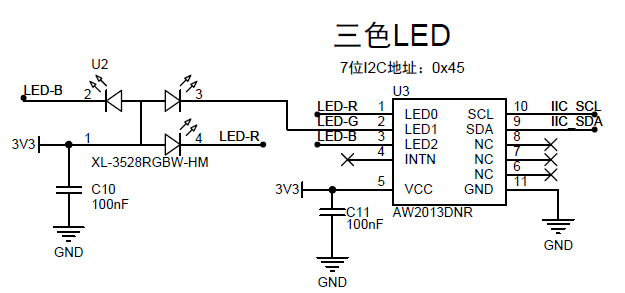

1.  根据AW2013芯片手册，找到所需要的数据。

    1.  可以找到AW2013芯片的从机地址，如下图所示：

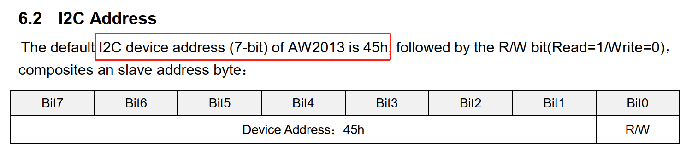

IO复用关系：


通过IO复用关系表，我们可以得知IO15和IO16引脚可以复用为IIC模式，分别是数据线和时钟线。

### 实验代码

1.  实验源码目录：【fbb_ws63\vendor\Hqyj_Ws63\Farsight\\ base_04_rgb】。

    注意：下面显示出主要代码，其余的请查看源码。

2.  目录下base_rgb_demo.c文件用于存放用户代码；CMakeLists.txt文件用于指定源文件和头文件的路径。

3.  目录下base_rgb_demo.c文件中的用户代码讲解：

Task1:该线程用来初始化IIC总线，并让rgb灯不断地变换颜色。

```
void Task1(void)
{
    AW2013_Init(); // 三色LED灯的初始化
    AW2013_Control_Red(RGB_OFF);
    AW2013_Control_Green(RGB_OFF);
    AW2013_Control_Blue(RGB_OFF);
    while (1) 
    {
        AW2013_Control_Red(RGB_ON);
        AW2013_Control_Green(RGB_OFF);
        AW2013_Control_Blue(RGB_OFF);
        osal_msleep(TASK_DELAY_TIME);

        AW2013_Control_Red(RGB_OFF);
        AW2013_Control_Green(RGB_ON);
        AW2013_Control_Blue(RGB_OFF);
        osal_msleep(TASK_DELAY_TIME);

        AW2013_Control_Red(RGB_OFF);
        AW2013_Control_Green(RGB_OFF);
        AW2013_Control_Blue(RGB_ON);
        osal_msleep(TASK_DELAY_TIME);
    }
}
```

4.  目录下CMakeLists.txt文件用来指定组件的相关源文件和头文件路径。

SOURCES_LIST：当前组件的源文件列表，其中CMAKE_CURRENT_SOURCE_DIR变量标识当前CMakeLists.txt所在的路径。

HEADER_LIST：当前组件头文件列表，其中CMAKE_CURRENT_SOURCE_DIR变量标识当前CMakeLists.txt所在的路径。

PUBLIC_HEADER：当前组件需要对外提供的头文件的路径。SOURCES：当前组件的C文件列表。

```
set(SOURCES_LIST
    ${CMAKE_CURRENT_SOURCE_DIR}/hal_bsp_rgb/hal_bsp_AW2013.c
    ${CMAKE_CURRENT_SOURCE_DIR}/base_rgb_demo.c
)
set(HEADER_LIST ${CMAKE_CURRENT_SOURCE_DIR}/hal_bsp_rgb)

set(SOURCES "${SOURCES}" ${SOURCES_LIST} PARENT_SCOPE)
set(PUBLIC_HEADER "${PUBLIC_HEADER}" ${HEADER_LIST} PARENT_SCOPE)
```

### 编译烧录

1.  点击系统配置选项：


2.  选中相对应的案例：

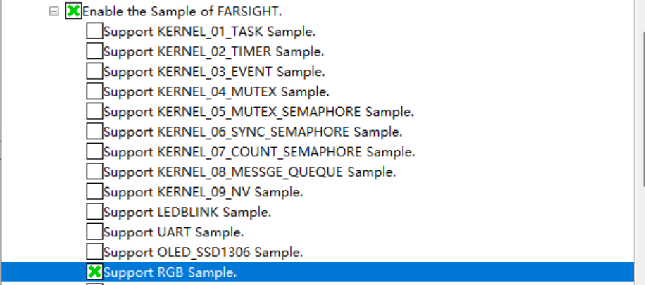

3.  点击全编译按钮进行编译：


4.  编译完成后，使用USB线连接开发板，点击烧录按钮烧录程序：


### 实验现象

重启Ws63开发板，可以看到RGB彩色灯在不断的变换颜色。


## SHT20温湿度读取实验

### 实验目的

1.  熟悉如何使用Hispark Studio。

2.  熟悉LiteOS系统的编译流程和设计步骤，能够进行设计、编程、调试。

3.  检测搭建的软件及硬件环境是否可正常使用。

4.  学会I2C总线与SHT20芯片进行通信。

5.  熟悉LiteOS系统下I2C通信和相关函数的使用。

### 实验要求

RGB灯的三种颜色开始循环点亮。

### 实验环境

硬件环境：FS_Ws63开发板、USB线。

软件环境：Windows系统、Hispark Studio。

源码位置：【vendor\Hqyj_Ws63\Farsight\base_05_sht20】

### 实验原理

在本实验中，使用I2C总线与SHT20温湿度传感器进行通信，读取当前空气温湿度的数据。下面给出了硬件连接图：


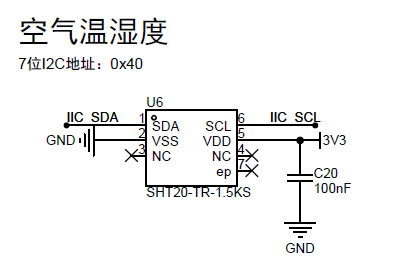

1.  根据SHT20芯片手册，找到所需要的数据。

    1.  可以找到SHT20芯片的从机地址为0X40，如下图所示：

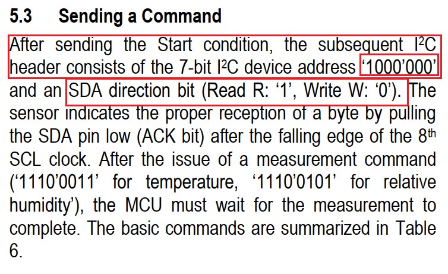

2.  SHT20芯片的写时序和读时序，先向芯片写命令，根据AD的分辨率得出采样时间，进行等待时间，然后再读取数据。

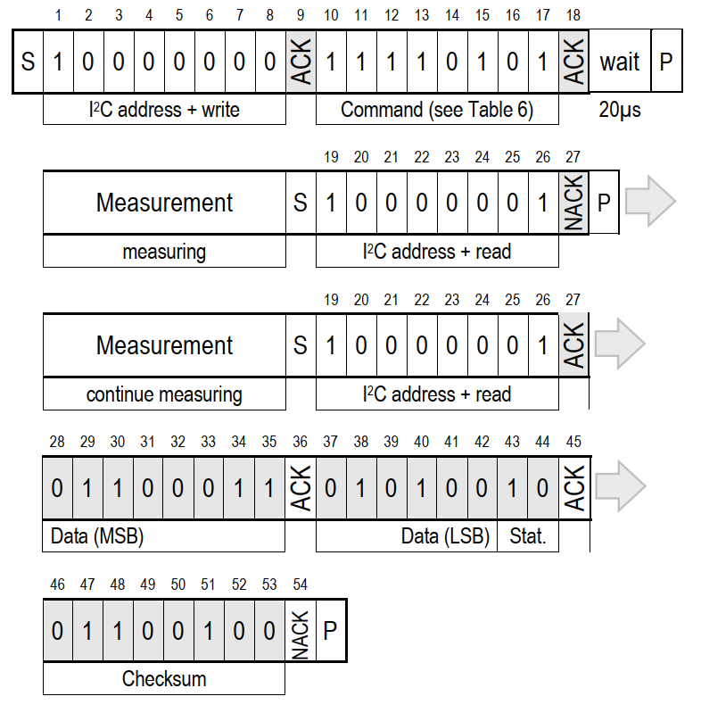

3.  采样的延时时间计算，如下图所示，SHT20芯片默认配置：湿度检测分辨率为12位，温度检测分辨率位14位。然后再看左侧的图标可以看到最大的延时时间：湿度检测最大延时时间为29ms，湿度检测最大延时时间为85ms。

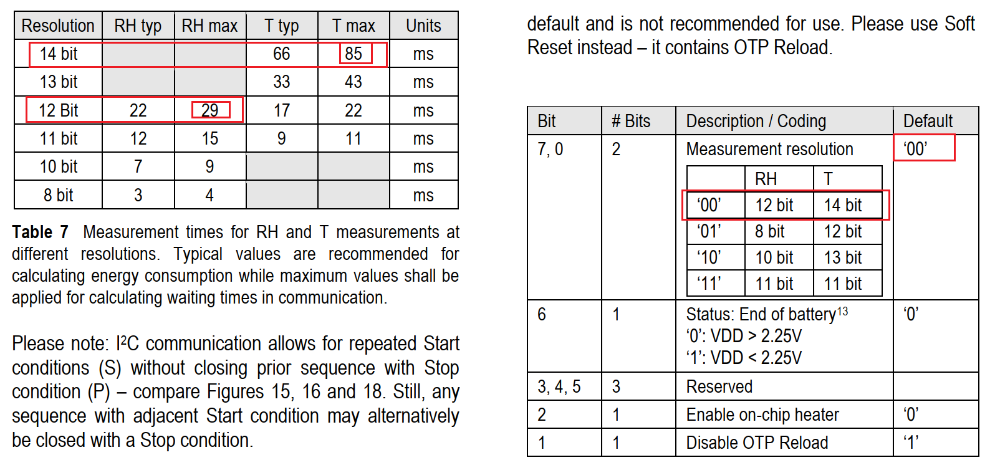

IO复用关系：


通过IO复用关系表，我们可以得知IO15和IO16引脚可以复用为IIC模式，分别是数据线和时钟线。

### 实验代码

1.  实验源码目录：【fbb_ws63\vendor\Hqyj_Ws63\Farsight\\ base\_05_sht20】。

    注意：下面显示出主要代码，其余的请查看源码。

2.  目录下base_sht20_demo.c文件用于存放用户代码；CMakeLists.txt文件用于指定源文件和头文件的路径。

3.  目录下base_sht20_demo.c文件中的用户代码讲解：

Task1:该线程用来初始化IIC总线。

```
void task1(void)
{
    float temperature = 0;
    float humidity = 0;
    SHT20_Init(); // SHT20初始化

    while (1) {
        SHT20_ReadData(&temperature, &humidity);

        printf("temperature = %d  humidity = %d\r\n", (int)temperature, (int)humidity);
        osDelay(DELAY_TIME_MS);
    }
}
```

4.  目录下CMakeLists.txt文件用来指定组件的相关源文件和头文件路径。

SOURCES_LIST：当前组件的源文件列表，其中CMAKE_CURRENT_SOURCE_DIR变量标识当前CMakeLists.txt所在的路径。

HEADER_LIST：当前组件头文件列表，其中CMAKE_CURRENT_SOURCE_DIR变量标识当前CMakeLists.txt所在的路径。

PUBLIC_HEADER：当前组件需要对外提供的头文件的路径。SOURCES：当前组件的C文件列表。

```
set(SOURCES_LIST
    ${CMAKE_CURRENT_SOURCE_DIR}/sht20/hal_bsp_sht20.c
    ${CMAKE_CURRENT_SOURCE_DIR}/base_sht20_demo.c
)
set(HEADER_LIST ${CMAKE_CURRENT_SOURCE_DIR}/sht20)

set(SOURCES "${SOURCES}" ${SOURCES_LIST} PARENT_SCOPE)
set(PUBLIC_HEADER "${PUBLIC_HEADER}" ${HEADER_LIST} PARENT_SCOPE)
```

### 编译烧录

1.  点击系统配置选项：


2.  选中相对应的案例：

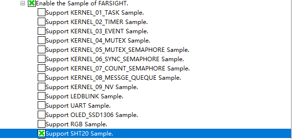

3.  点击全编译按钮进行编译：


4.  编译完成后，使用USB线连接开发板，点击烧录按钮烧录程序：


### 实验现象

重启Ws63开发板，打开串口可以看到当前环境温度和湿度数据。

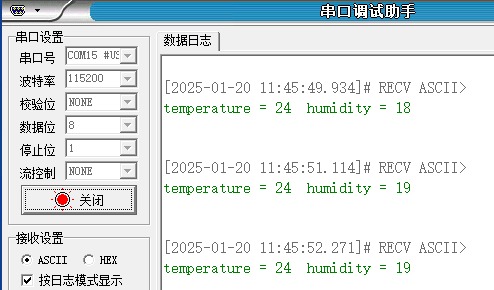

## AP3216传感器实验

### 实验目的

1.  熟悉如何使用Hispark Studio。

2.  熟悉LiteOS系统的编译流程和设计步骤，能够进行设计、编程、调试。

3.  检测搭建的软件及硬件环境是否可正常使用。

4.  学会I2C总线与AP3216C芯片进行通信。

5.  熟悉LiteOS系统下I2C通信和相关函数的使用。

### 实验要求

使用I2C去驱动AP3216C芯片，读取光照强度值、物体接近检测值、人体红外检测值，然后使用串口调试助手将这三个信息每隔一秒中打印出来。

### 实验环境

硬件环境：FS_Ws63开发板、USB线。

软件环境：Windows系统、Hispark Studio。

源码位置：【vendor\Hqyj_Ws63\Farsight\base_06_ap3216】

### 实验原理

在本实验中，使用I2C总线与AP3216C三合一传感器进行通信，读取当前的光照强度、红外、接近的数据。下面给出了硬件连接图：


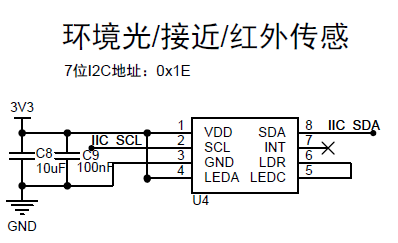

1.  根据AP3216C芯片手册，找到所需要的数据。

    1.  可以找到从机地址为0X1E，如下图所示：


2.  写时序：


3.  读时序：


IO复用关系：


通过IO复用关系表，我们可以得知IO15和IO16引脚可以复用为IIC模式，分别是数据线和时钟线。

### 实验代码

1.  实验源码目录：【fbb_ws63\vendor\Hqyj_Ws63\Farsight\\ base_06\_ap3216】。

    注意：下面显示出主要代码，其余的请查看源码。

2.  目录下base_ap3216_demo.c文件用于存放用户代码；CMakeLists.txt文件用于指定源文件和头文件的路径。

3.  目录下base_ap3216_demo.c文件中的用户代码讲解：

Task1:该线程用来初始化IIC总线，并读取传感器状态，通过串口打印出来。

```
void Task1(void)
{
    uint16_t ir = 0, als = 0, ps = 0; // 人体红外传感器 接近传感器 光照强度传感器
    AP3216C_Init();
    while (1) 
    {
        AP3216C_ReadData(&ir, &als, &ps);
        printf("ir = %d    als = %d    ps = %d\r\n", ir, als, ps);
        osal_msleep(1000);
    }
}
```

4.  目录下CMakeLists.txt文件用来指定组件的相关源文件和头文件路径。

SOURCES_LIST：当前组件的源文件列表，其中CMAKE_CURRENT_SOURCE_DIR变量标识当前CMakeLists.txt所在的路径。

HEADER_LIST：当前组件头文件列表，其中CMAKE_CURRENT_SOURCE_DIR变量标识当前CMakeLists.txt所在的路径。

PUBLIC_HEADER：当前组件需要对外提供的头文件的路径。SOURCES：当前组件的C文件列表。

```
set(SOURCES_LIST
    ${CMAKE_CURRENT_SOURCE_DIR}/hal_bsp_ap3216/hal_bsp_ap3216.c
    ${CMAKE_CURRENT_SOURCE_DIR}/base_ap3216_demo.c
)
set(HEADER_LIST ${CMAKE_CURRENT_SOURCE_DIR}/hal_bsp_ap3216)

set(SOURCES "${SOURCES}" ${SOURCES_LIST} PARENT_SCOPE)
set(PUBLIC_HEADER "${PUBLIC_HEADER}" ${HEADER_LIST} PARENT_SCOPE)
```

### 编译烧录

1.  点击系统配置选项：


2.  选中相对应的案例：

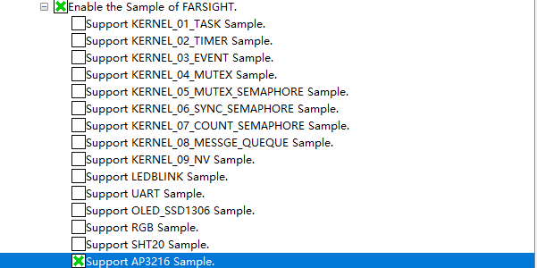

3.  点击全编译按钮进行编译：


4.  编译完成后，使用USB线连接开发板，点击烧录按钮烧录程序：


### 实验现象

重启Ws63开发板，可以看到串口助手打印红外、可见光、人体感应数据。

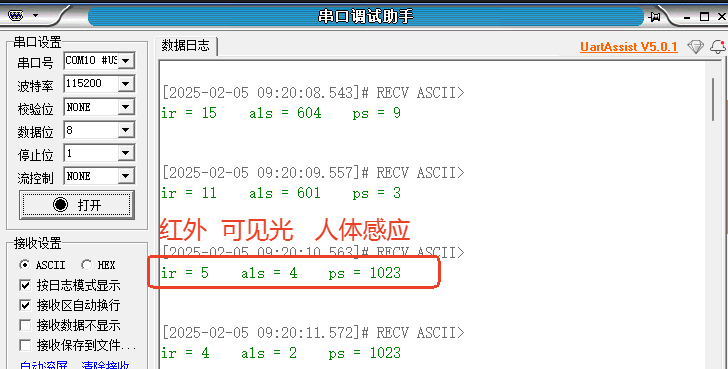

## NFC实验

### 实验目的

1.  熟悉如何使用Hispark Studio。

2.  熟悉LiteOS系统的编译流程和设计步骤，能够进行设计、编程、调试。

3.  检测搭建的软件及硬件环境是否可正常使用。

4.  学会I2C总线与NFC标签进行通信。

5.  熟悉LiteOS系统下I2C通信和相关函数的使用。

### 实验要求

向NFC标签中写入数据，并且读取NFC标签中的数据。

### 实验环境

硬件环境：FS_Ws63开发板、USB线。

软件环境：Windows系统、Hispark Studio。

源码位置：【vendor\Hqyj_Ws63\Farsight\base_07_nfc】

### 实验原理

在本实验中，使用I2C总线与NFC进行通信，读取NFC标签数据。下面给出了硬件连接图：


通过使用手机上的“NFC标签助手”APP进行写入标签数据，写入成功之后，复位开发板，将NFC标签中的数据读取出来，然后进行解析。

测试案例：

1.  使用NFC标签助手写入文本数据，文本数据内容“123456”。

&nbsp;

1.  在串口调试助手中查看打印的信息：

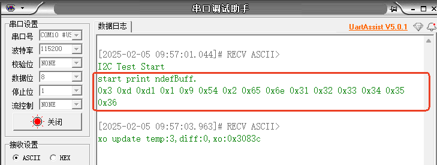

2.  解析数据：


IO复用关系：


通过IO复用关系表，我们可以得知IO15和IO16引脚可以复用为IIC模式，分别是数据线和时钟线。

### 实验代码

1.  实验源码目录：【fbb_ws63\vendor\Hqyj_Ws63\Farsight\\ base_06_nfc】。

    注意：下面显示出主要代码，其余的请查看源码。

2.  目录下base_nfc_demo.c文件用于存放用户代码；CMakeLists.txt文件用于指定源文件和头文件的路径。

3.  目录下base_nfc_demo.c文件中的用户代码讲解：

Task1:初始化IIC，并读取NFC标签数据。

```
void Task1(void)
{
    uint8_t ndefLen = 0;      // ndef包的长度
    uint8_t ndef_Header = 0;  // ndef消息开始标志位-用不到
    size_t i = 0;
    nfc_Init();
    osal_msleep(TASK_DELAY_TIME);
    printf("I2C Test Start\r\n");
     // 读整个数据的包头部分，读出整个数据的长度
    if (  NT3HReadHeaderNfc(&ndefLen, &ndef_Header) != true) {
        printf("NT3HReadHeaderNfc is failed.\r\n");
        return;
    }

    ndefLen += NDEF_HEADER_SIZE; // 加上头部字节
    if (ndefLen <= NDEF_HEADER_SIZE) {
        printf("ndefLen <= 2\r\n");
        return;
    }
    uint8_t *ndefBuff = (uint8_t *)malloc(ndefLen + 1);
    if (ndefBuff == NULL) {
        printf("ndefBuff malloc is Falied!\r\n");
        return;
    }

    if ( get_NDEFDataPackage(ndefBuff, ndefLen) != ERRCODE_SUCC) {
        printf("get_NDEFDataPackage is failed. \r\n");
        return;
    }

    printf("start print ndefBuff.\r\n");
    for (i = 0; i < ndefLen; i++) {
        printf("0x%x ", ndefBuff[i]);
    }

    while (1) {
        osal_msleep(TASK_DELAY_TIME);
    }
}
```

4.  目录下CMakeLists.txt文件用来指定组件的相关源文件和头文件路径。

SOURCES_LIST：当前组件的源文件列表，其中CMAKE_CURRENT_SOURCE_DIR变量标识当前CMakeLists.txt所在的路径。

HEADER_LIST：当前组件头文件列表，其中CMAKE_CURRENT_SOURCE_DIR变量标识当前CMakeLists.txt所在的路径。

PUBLIC_HEADER：当前组件需要对外提供的头文件的路径。SOURCES：当前组件的C文件列表。

```
set(SOURCES_LIST
    ${CMAKE_CURRENT_SOURCE_DIR}/hal_bsp_nfc/hal_bsp_nfc.c
    ${CMAKE_CURRENT_SOURCE_DIR}/hal_bsp_nfc/NT3H.c
    ${CMAKE_CURRENT_SOURCE_DIR}/hal_bsp_nfc/nfc.c
    ${CMAKE_CURRENT_SOURCE_DIR}/hal_bsp_nfc/nfcForum.c
    ${CMAKE_CURRENT_SOURCE_DIR}/hal_bsp_nfc/rtdText.c
    ${CMAKE_CURRENT_SOURCE_DIR}/hal_bsp_nfc/rtdUri.c
    ${CMAKE_CURRENT_SOURCE_DIR}/hal_bsp_nfc/ndef.c 
    ${CMAKE_CURRENT_SOURCE_DIR}/hal_bsp_nfc/rtdText.c
    ${CMAKE_CURRENT_SOURCE_DIR}/base_nfc_demo.c
)
set(HEADER_LIST 
    ${CMAKE_CURRENT_SOURCE_DIR}/hal_bsp_nfc
)

set(SOURCES "${SOURCES}" ${SOURCES_LIST} PARENT_SCOPE)
set(PUBLIC_HEADER "${PUBLIC_HEADER}" ${HEADER_LIST} PARENT_SCOPE)
```

### 编译烧录

1.  点击系统配置选项：


2.  选中相对应的案例：

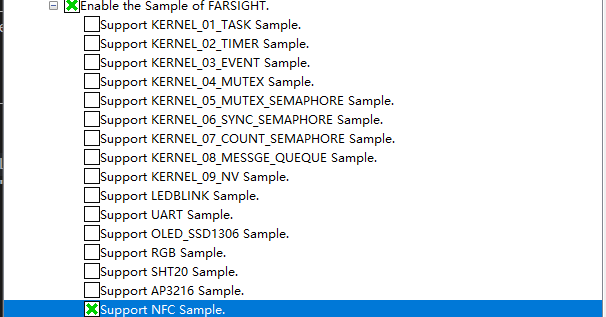

3.  点击全编译按钮进行编译：


4.  编译完成后，使用USB线连接开发板，点击烧录按钮烧录程序：


### 实验现象

1.  在手机端下载并打开“NFC标签助手APP”，点击“NFC标签助手APP”的“写入”选项。

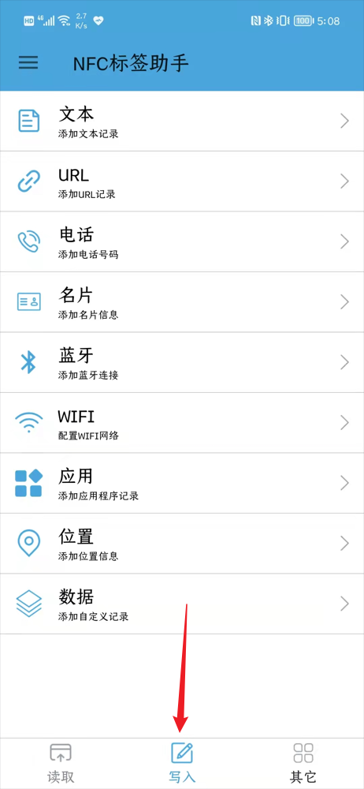

2.  然后点击“文本”，添加一条记录


3.  输入框中输入数据“123456”，然后点击“确定”。

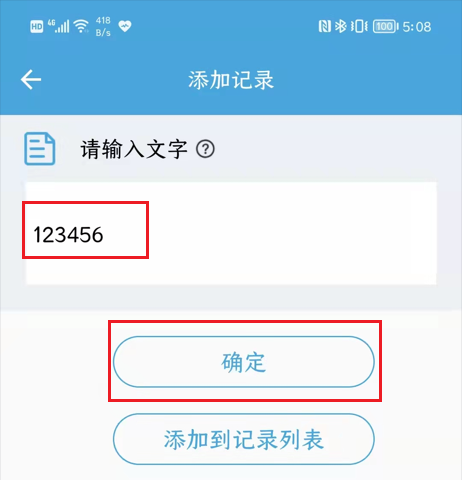

4.  此时会弹出“靠近NFC标签”的提示，然后将手机靠近开发板中的NFC区域。

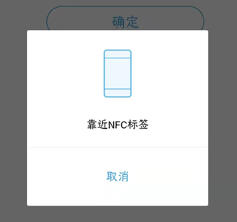

5.  烧写标签完成之后，我们可以点击“读取”选项卡，然后手机靠近NFC标签进行读取。


6.  读取成功之后，会在此窗口中显示出当前NFC标签中的数据。此时我们点击“详细数据”，查看详细数据。


7.  重启开发板，在串口调试助手中可以看到，所打印的信息，如下图所示：。


## LCD屏显示实验

### SPI基础

SPI (Serial Peripheral Interface)是一种用于短距离通信的全双工同步串行通信接口通常用于电路板不同模块之间的通信。

在电路中，各模块实现不同的功能（模数转换、数模转换），模块与主设备之间需要进行通信，以实现模块的配置与监控。


#### 通信传输基础-位传输

数字信号是指在取值上是离散的、不连续的信号，是在模拟信号的基础上经过采样、量化和编码而形成的。在数字逻辑电路中，数字信号是二进制的，只有0和1两个数字逻辑值。电平的高低是指电路的状态，在正逻辑中，通常用逻辑值‘1’表示电路的高电平状态，用逻辑值‘0’表示电路的低电平状态。

在电路中，模块间的通信以二进制传输，由位构造，这些位可以用十六进制数表示。


#### 并行传输与串行传输区别

电路中相互连接的模块，数据位的传输可以采用并行或者串行形式。并行传输通常采用8位、16位、32位同时传输。并行传输的优势是传输速度快，缺点是费物理端口，传输距离有限，通常用于芯片内部总线传输，或高速数据传输场合(DRAM）。

串行传输是将数据的每位根据时钟逐位发送（单边沿或双边沿），优点是物理端口占用量少，实际电路中串行传输的从设备很多，例如外部的传感器、存储器、触摸控制等。

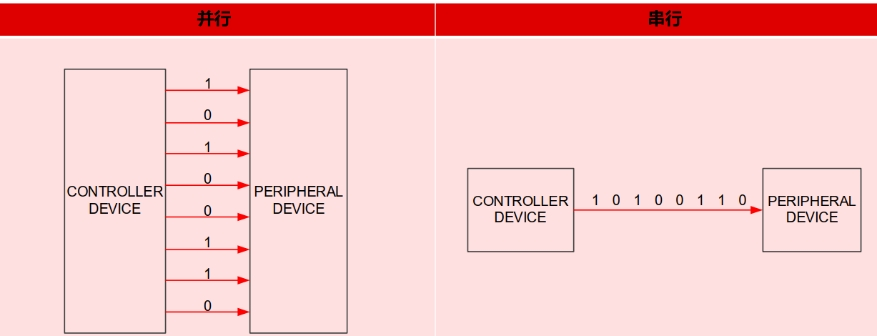

#### 模块**间连接-电平转换**

模块间物理端口的连接，存在电平不一致的情况（可以查询芯片数据手册的电气特性部分），例如微控制器的电压可能是1.8V、3.3V或者5V，在这种情况下，设备的端口不能直接相互连接（永久损坏或者逻辑错误），需要增加电平转换电路。


#### 数据传输的时钟信号

数据传输采用同步方式时，主设备需要提供时钟用于数据的传输同步，数据的采样可以是在上升沿或者下降沿，或者双边沿(存储器件)。

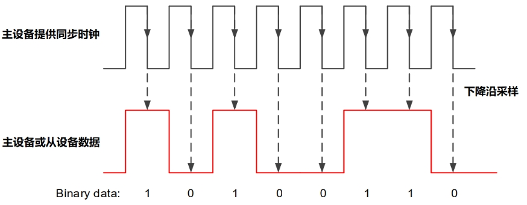

#### 串行外设**接口（SPI）**

SPl被称为四线总线，它需要四根线进行通信，如下所示。

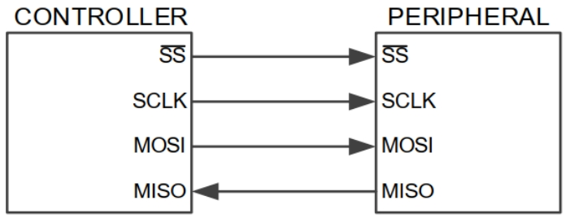

SPl主从通讯的几个特点：

1.  主机控制外设选择和串行时钟。

2.  SPl总线只能有一个主设备，可以有多个从设备。

3.  每个从设备都有一个独立控制的片选。

4.  数据可以从主设备输到从设备，或从从设备传输到主设备，可以用作全双工通信。

SPl的四根信号线作用：

5.  MISO(Master Input Slave Output)：主设备数据输入，从设备数据输出。

6.  MOSI( Master Output Slave Input)：主设备数据输出，从设备数据输入。

7.  SCLK (Serial Clock)：时钟信号，由主设备产生。

8.  CS/SS (Chip Select)：从设备使能信号，由主设备控制。

与其他串行通信接口(如UART、I2C等)相比，SPl具有相对非常简单的硬件。它的操作基于移位寄存器(通常是8位)，每个设备(主设备和从设备)使用移位寄存器将数据移进和移出系统。

如下图所示，主设备和从设备中的移位寄存器连接在一起，这样就形成了一个循环缓冲区。这些寄存器以串行输入/串行输出(SISO)模式操作。一个寄存器的输出连接到另一个寄存器的输入，反之亦然。可以看到时钟信号是由主设备产生的。

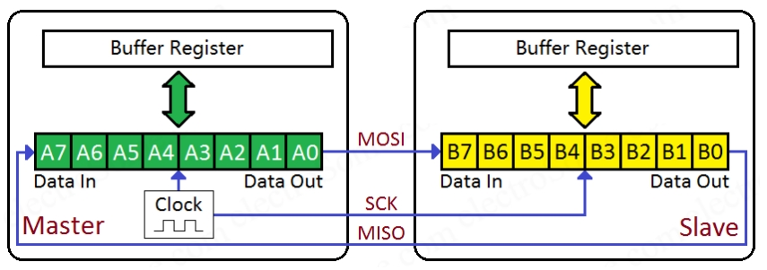

当主设备想要向从设备写入数据时，主设备将生成时钟。经过8个时钟脉冲后，主设备(A7- A0)的数据被传输到从设备，从设备(B7 – B0)的数据被传输到主设备。

通常SPI的移位寄存器不能直接访问。如果需要进行数据传输，数据将写入缓冲区寄存器。因此，当它空闲时，它会自动写入移位寄存器，并开始传输。同样，移位寄存器中接收到的数据一旦接收完成就自动传输到缓冲寄存器，可以很容易的从缓冲区寄存器读取数据。

#### SPI时钟极性和相位

用于数据传输的时钟是由SPI主设备产生的，主设备可以设置传输的时钟频率。除此之外，时钟极性和时钟相位也需要设置，这必须与SPI从设备相匹配才能进行正确的数据传输。SPI的时钟极性（Clock Polarity）和时钟相位（Clock Phase），最常见的写法是CPOL（CKP）和CPHA（CKE：Clock Edge）。

1.  **Clock Polarity (CKP) = 0：**

时钟信号的初始值为0。这表示空闲状态是0，活动状态是1。

- Clock Edge (CKE) = 0：数据传输发生在空闲状态0到活动状态1，即时钟上升沿。

- Clock Edge (CKE) = 1：数据传输发生在活动状态1到空闲状态0，即时钟下降沿

2.  **Clock Polarity (CKP) = 1：**

> 时钟信号的初始值为1。这表示空闲状态是1，活动状态是0。

- Clock Edge (CKE) = 0：数据传输发生在空闲状态1到活动状态0，即时钟下降沿。

- Clock Edge (CKE) = 1：数据传输发生在活动状态0到空闲状态1，即时钟上升沿。

SPI时钟相位，CPHA = 0：

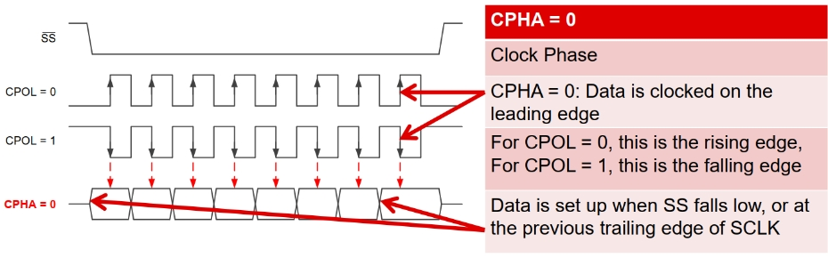

SPI时钟相位，CPHA = 1：

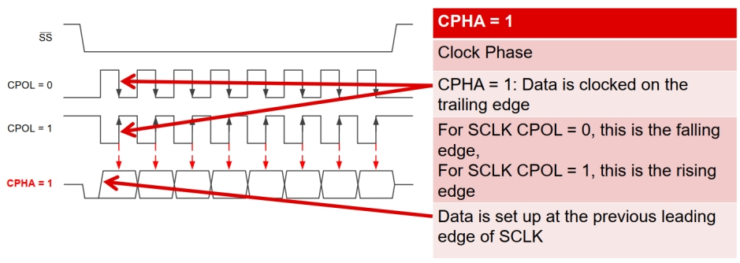

这些不同的时钟配置可以被认为是SPI的不同模式，如下所示。

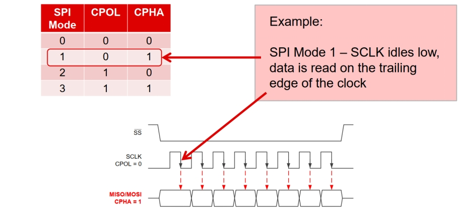

#### SPI多从机的连接方式

SPl总线虽然只能有一个主设备，但可以有多个从设备，多从设备的连接有两种方式，多片选或菊花链形式，如下图所示：

采用多个从机片选线：

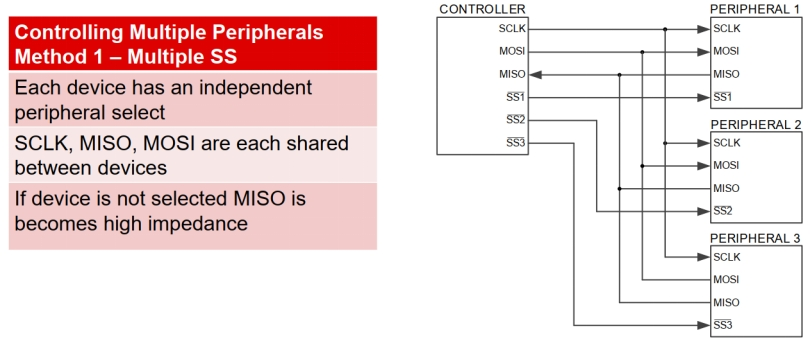

菊花链连接：


实际电路中采用多片选的方式采用较多，需要注意的是由于共用SCLK、MOSI、MISO信号线，从设备的数量以及通信速率会受到一定的影响。

### 实验目的

1.  熟悉如何使用Hispark Studio。

2.  熟悉LiteOS系统的编译流程和设计步骤，能够进行设计、编程、调试。

3.  检测搭建的软件及硬件环境是否可正常使用。

4.  学会SPI总线与LCD屏进行通信。

5.  熟悉LiteOS系统下SPI通信和相关函数的使用。

### 实验要求

使用SPI去驱动LCD屏幕，将屏幕背光调成白色，并显示中文、英文字符。

### 实验环境

硬件环境：FS_Ws63开发板、USB线、2.8寸LCD屏。

软件环境：Windows系统、Hispark Studio

源码位置：【vendor\Hqyj_Ws63\Farsight\base_08_spi_lcd】

### 屏幕驱动原理

- ILI9341驱动芯片

  1.  ILI9341是一个支持分辨率为240RGBx320点阵的a-TFT LCD 的262144色单片驱动器。这个单片驱动器包含了一个720通道的源极驱动器（source driver)，一个320通道的栅极驱动器（gate driver），172800字节的GRAM用于显示240RGBx320分辨率的图片数据，一套电源支持电路。

  2.  ILI9341提供8位/9位/16位/18位的并行MCU数据总线，6位/16位/18位RGB接口数据总线以及3或4线SPI接口（serial peripheral interface）。通过窗口地址函数，显示区域被指定在GRAM内。这个指定的窗口区域可以被有选择地更新，因此显示区域能够同事被显示在静态图像的区域内。

  3.  ILI9341的IO接口电压工作于1.65V-3.3V。一种合并的电压跟随电路，用以产生驱动液晶显示器的电压电平。ILI9341支持full color ，8-color显示模式，支持由软件控制的精确电源睡眠模式。这些功能使ILI9341成为类似于移动电话，小电话，MP3需要电池长效工作的中等或小尺寸便携产品的理想驱动器。


- 电源支持引脚

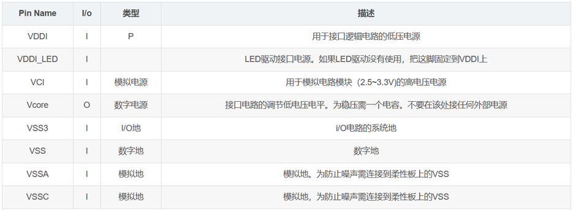

- 接口逻辑信号

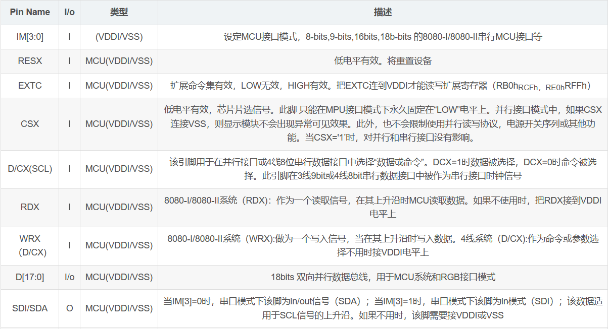

- LCD驱动器input/output

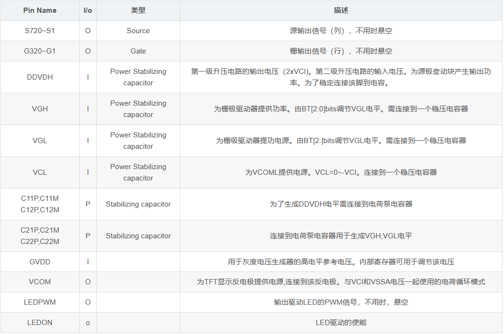

### 指令说明

1.  空指令（00h）

此命令为空命令;对显示模块没有任何影响。但是它可以用来终止帧内存写或读在RAMWR(内存写)和RAMRD(内存读)命令中描述。

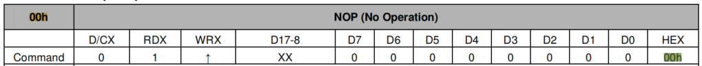

2.  软件复位（01h）

当软件复位命令被写入时，它会导致软件复位。它将命令和参数重置为它们的S/W重置默认值。


3.  读取显示标识信息（04h）

这个读字节返回24位显示标识信息。 第1个参数是虚拟数据。 第2个参数(ID1 \[7:0\]): LCD模块的制造商ID。 第3个参数(ID2 \[7:0\]): LCD模块/驱动版本ID。 第4个参数(ID3 \[7:0\]): LCD模块/驱动ID。

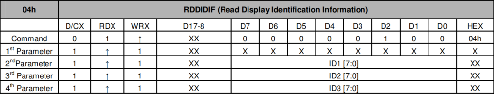

4.  读取显示状态(09h)

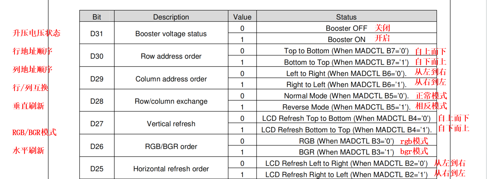

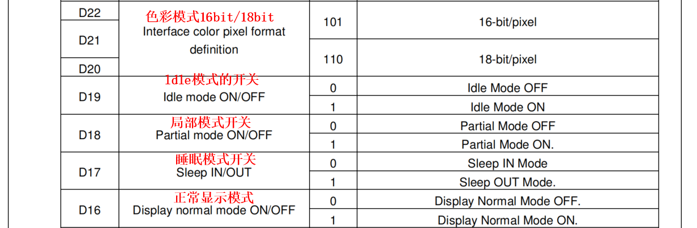

### LCD的配置和模式

1.  进入睡眠模式(10h)

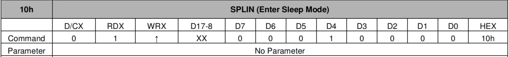

2.  退出睡眠模式（11h）


3.  部分模式开启(12h)

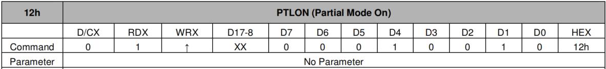

4.  正常显示模式ON（13h）


5.  显示反转关闭(20h)

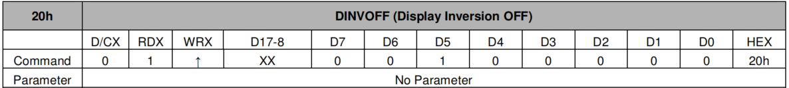

6.  显示反转ON (21h)


7.  Gamma设定(26h)


8.  显示关闭(28 h)


9.  开启显示（29h）


10. 列地址设定（2Ah）

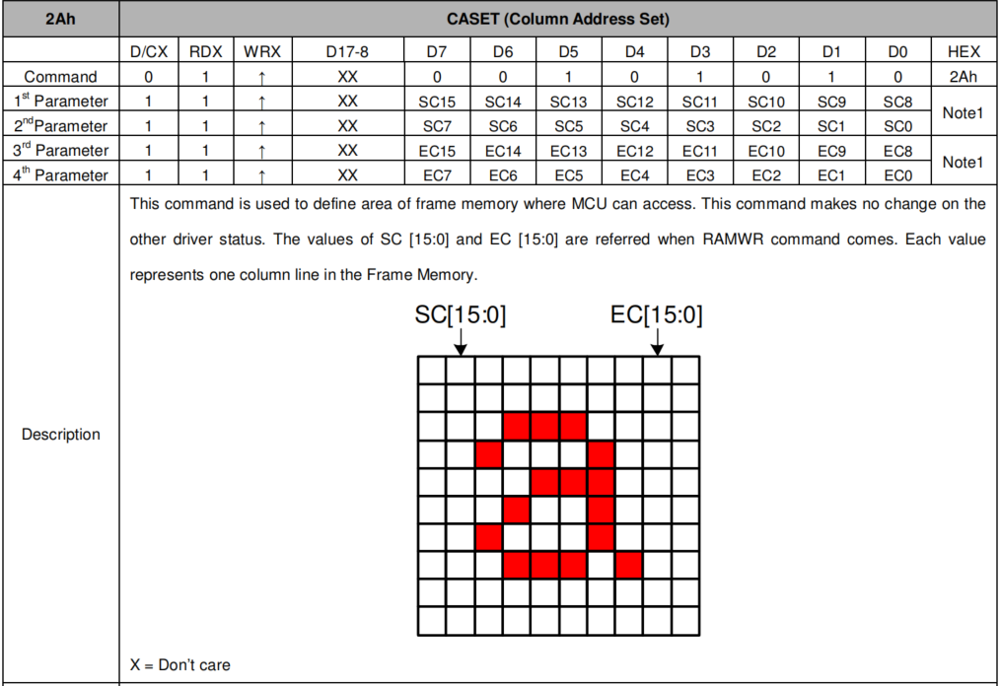

11. 页地址设定（2dh）

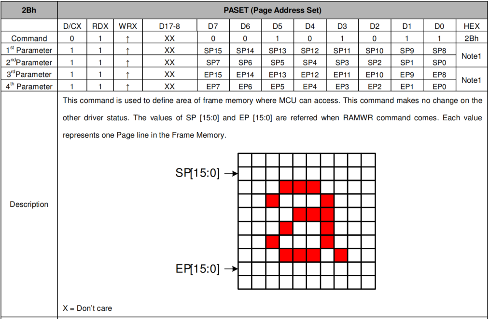

12. 颜色设置（2dh）

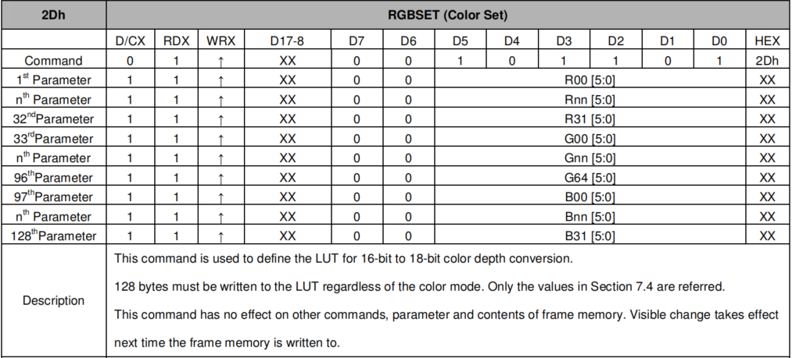

### 实验原理

下图为屏幕的接口原理图：

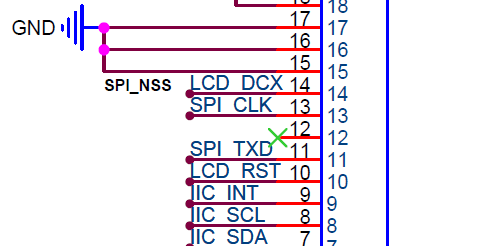 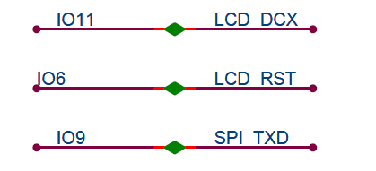


IO复用关系：


通过IO复用关系表，我们可以得知:

|       模式        | 引脚 |      功能      |
|:-----------------:|:----:|:--------------:|
|      SPI_SCK      | IO7  |   SPI时钟线    |
| SPI_TXD(SPI_MOSI) | IO9  |   SPI输出线    |
|      LCD_DCX      | IO11 |   数据命令线   |
|      LCD_RST      | IO6  |   屏幕复位线   |
|      LCD_BL       | IO5  | 屏幕背光调节线 |

由于屏幕的片选线已在内部拉低，所以在这里我们不用再去控制片选线了，同时我们也不需要接收屏幕的数据，所以MISO数据线也不需要理会。

### 实验代码

1.  实验源码目录：【fbb_ws63\vendor\Hqyj_Ws63\Farsight\\ base_08_spi_lcd】。

    注意：下面显示出主要代码，其余的请查看源码。

2.  目录下base_lcd_demo.c文件用于存放用户代码；CMakeLists.txt文件用于指定源文件和头文件的路径。

3.  目录下base_lcd_demo.c文件中的用户代码讲解：

Task1：初始化SPI总线，将SPI配置为master模式，调用屏幕驱动接口将要显示的数据刷新到屏幕上。

```
void Task1(void)
{
    osal_msleep(TASK_DELAY_TIME);
    char str[]="1234567890*#&| ABCD abcd !";
    app_spi_init_pin();
    app_spi_master_init_config();
    printf("Enter ILI9341_Init()!\r\n");
    ILI9341_Init();  

    while (1) {
        LCD_DrawPicture( 0, 0,240, 320, (uint8_t *)gImage_1);
        LCD_ShowString(0, 24, strlen(str), 24,  (uint8_t*)str);
        osal_msleep(TASK_DELAY_TIME);
    }
 }
```

4.  目录下CMakeLists.txt文件用来指定组件的相关源文件和头文件路径。

SOURCES_LIST：当前组件的源文件列表，其中CMAKE_CURRENT_SOURCE_DIR变量标识当前CMakeLists.txt所在的路径。

HEADER_LIST：当前组件头文件列表，其中CMAKE_CURRENT_SOURCE_DIR变量标识当前CMakeLists.txt所在的路径。

PUBLIC_HEADER：当前组件需要对外提供的头文件的路径。SOURCES：当前组件的C文件列表。

```
set(SOURCES_LIST
    ${CMAKE_CURRENT_SOURCE_DIR}/hal_bsp_lcd/bsp_ili9341_4line.c
    ${CMAKE_CURRENT_SOURCE_DIR}/hal_bsp_lcd/font.c
    ${CMAKE_CURRENT_SOURCE_DIR}/base_lcd_demo.c
)
set(HEADER_LIST 
    ${CMAKE_CURRENT_SOURCE_DIR}/hal_bsp_lcd
)
```

### 编译烧录

1.  点击系统配置选项：


2.  选中相对应的案例：


3.  点击全编译按钮进行编译：


4.  编译完成后，使用USB线连接开发板，点击烧录按钮烧录程序：


### 实验现象

使用排线将LCD屏幕与底板连接，重启Ws63开发板，可以看到LCD屏幕将背景颜色刷新为白色，随即开始显示图片和字符。


## LCD屏触摸实验

### 触摸屏原理

常接触的触控屏分为两种：电阻式触摸屏，电容式触摸屏。电阻触摸屏简单来说就是个传感器，利用压力感应原理来实现触摸。

1.  电阻触摸屏原理：

当人的手指按压触摸屏表面时，弹性PET薄膜会向下弯曲，使上下ITO涂层能够相互接触形成触摸点，采用ADC检测该点的电压，来计算出计算X、Y轴坐标值。电阻触摸屏通常采用四线、五线、七线或八线来产生屏幕偏置电压，回读报点。在这里主要以四线为例，原理如下：

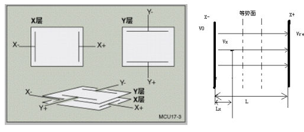

2.  电容式触摸屏原理：

电容屏通过任何持有电荷的物体包括人体皮肤工作。（人体所带的电荷）电容式触摸屏是由诸如合金或是铟锡氧化物(ITO)这样的材料构成，电荷存储在一根根比头发还要细的微型静电网中。当手指点击屏幕会从接触点吸收小量电流，造成角落电极的压降，利用感应人体微弱电流的方式来达到触控的目的。


3.  电容式触摸屏结构

检测触摸的坐标时，第1 条X 轴的电极发出激励信号，而所有Y 轴的电极同时接收信号，通过检测充电时间可检测出各个Y 轴与第1 条X 轴相交的各个电容的大小，每个X 轴依次发出激励信号，重复上述步骤，即可得到整个触摸屏二维平面的所有电容大小。 当手指接近时，会导致局部电容改变，根据得到的触摸屏电容量变化的二维数据表，可以得知每个触摸点的坐标，因此电容触摸屏支持多点触控。 其实电容触摸屏可看作是多个电容按键组合而成，就像机械按键中独立按键和矩阵按键的关系一样，甚至电容触摸屏的坐标扫描方式与矩阵按键都是很相似的。


### FT6336芯片简介

1.  触摸屏接口电路：

AFE控制器的主要功能是与触摸屏接口通信。通过扫描面板，并对从面板接收到的信号进行处理。所以它同时支持驱动和传感器功能。

2.  外部接口包含：

    1.  I2C:与主机交换数据的接口

    2.  INT:一个中断信号，通知主机处理器触摸数据准备好读取

    3.  RSTN:外部低信号复位芯片。

    4.  实现看门狗定时器，保证芯片的稳定性。

    5.  电压调节器，从输入VDDA电源产生1.5V的数字电路。

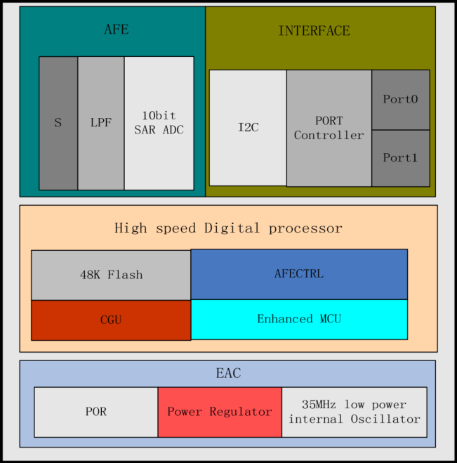

3.  硬件接口图

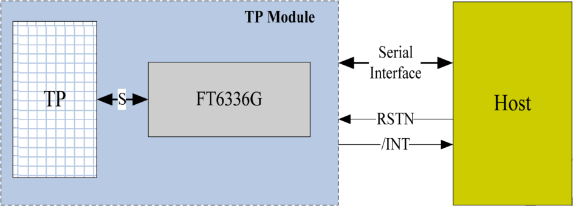

1.  FT6336G的串行接口为I2C。

2.  中断信号(INT)用于FT6336G，以通知主机数据已准备好供主机接收。

3.  RSTN信号用于主机复位FT6336G。

### FT6336相关寄存器讲解

MODE_SWITCH(这是设备模式寄存器，它被配置为确定芯片的当前模式)

> 
>
> TD_STATUS(这个寄存器是触摸数据状态寄存器)
>
> Pn_XH (n:1-2)(这个寄存器描述了第n个接触点的X坐标的MSB和相应的事件标志)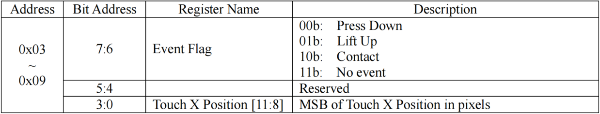
>
> Pn_XL (n:1-2)(这个寄存器描述了第n个接触点的X坐标的LSB)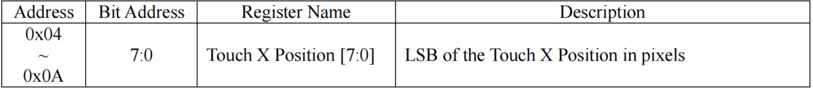
>
> Pn_WEIGHT (n:1-2)(这个寄存器描述了第n个接触点的重量)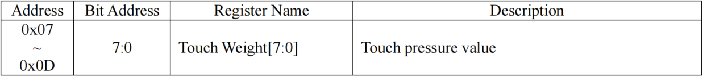
>
> Pn_MISC (n:1-2)(这个寄存器描述了第n个接触点的各种信息)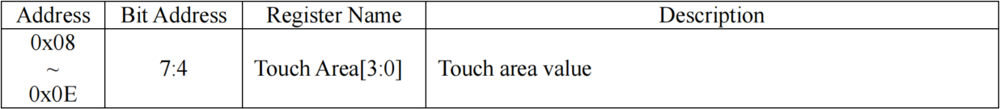

### 实验目的

1.  熟悉如何使用Hispark Studio。

2.  熟悉LiteOS系统的编译流程和设计步骤，能够进行设计、编程、调试。

3.  检测搭建的软件及硬件环境是否可正常使用。

4.  学会I2C总线与FT6336触摸芯片进行通信。

5.  熟悉LiteOS系统下I2C通信和相关函数的使用。

### 实验要求

FT6336是一款支持I2C通信的电容式触摸屏控制器，广泛应用于各种触摸屏设备中。它支持多点触控，能够准确检测和报告触摸位置。本实验旨在通过Ws63芯片利用I2C接口驱动FT6336，实现触摸屏的基本操作。

### 实验环境

硬件环境：FS_Ws63开发板、USB线、2.8寸LCD屏。

软件环境：Windows系统、Hispark Studio。

源码位置：【vendor\Hqyj_Ws63\Farsight\base_09_spi_lcd_touch】

### 实验原理

在本实验中，使用I2C总线与FT6336触摸传感器进行通信，读取当前屏幕按下的坐标。下面给出了硬件连接图：

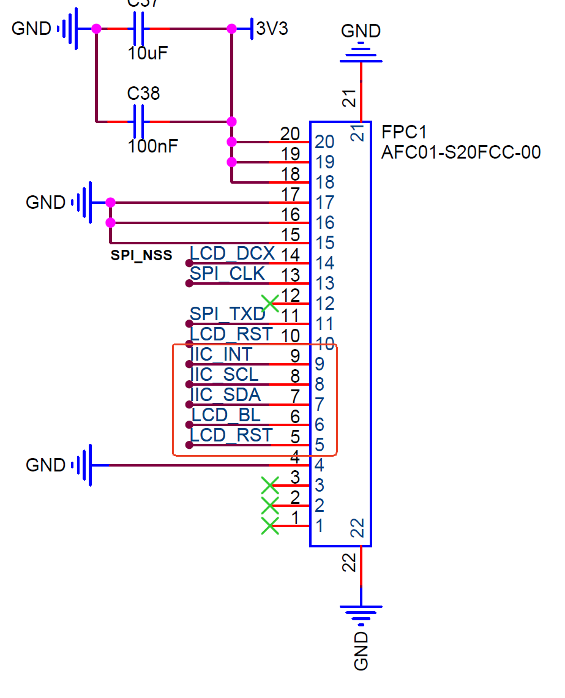 

I2C时钟控制引脚为IO16，数据线控制引脚为IO15，触屏触发中断引脚为IO14：

|  模式   | 引脚 |      功能      |
|:-------:|:----:|:--------------:|
| I2C_SCL | IO16 | 触摸芯片时钟线 |
| I2C_SDA | IO15 | 触摸芯片数据线 |
|   INT   | IO14 |  触摸芯片中断  |

LCD_RST为触摸芯片和屏幕公用复位引脚。

IO复用关系：


通过IO复用关系表，我们可以得知IO15和IO16引脚可以复用为IIC模式，分别是数据线和时钟线，并将IO14配置为中断输入模式。

### 实验代码

1.  实验源码目录：【fbb_ws63\vendor\Hqyj_Ws63\Farsight\\ base_09_spi_lcd_touch】。

    注意：下面显示出主要代码，其余的请查看源码。

2.  目录下base_lcd_touch_demo.c文件用于存放用户代码；CMakeLists.txt文件用于指定源文件和头文件的路径。

3.  目录下base_lcd_touch_demo.c文件中的用户代码讲解：

Task1:该线程用来初始化IIC总线，并读取触摸芯片返回的屏幕坐标。

使用宏定义“TOUCH_INT”来决定返回坐标信息是由中断触发模式还是轮询扫描模式。

```
void Task1(void)
{
    osal_msleep(TASK_DELAY_TIME);
    FT6336_init();
    app_spi_init_pin();
    app_spi_master_init_config();
    printf("Enter ILI9341_Init()!\r\n");
    ILI9341_Init();  

    while (1) {
       
#if (TOUCH_INT)
        osal_msleep(100);
#else
        FT6336_scan(); //FT6336 触摸点读取
        osal_msleep(100);
#endif
    }
  }
```

4.  目录下CMakeLists.txt文件用来指定组件的相关源文件和头文件路径。

SOURCES_LIST：当前组件的源文件列表，其中CMAKE_CURRENT_SOURCE_DIR变量标识当前CMakeLists.txt所在的路径。

HEADER_LIST：当前组件头文件列表，其中CMAKE_CURRENT_SOURCE_DIR变量标识当前CMakeLists.txt所在的路径。

PUBLIC_HEADER：当前组件需要对外提供的头文件的路径。SOURCES：当前组件的C文件列表。

```
set(SOURCES_LIST
    ${CMAKE_CURRENT_SOURCE_DIR}/hal_bsp_lcd/bsp_ili9341_4line.c
    ${CMAKE_CURRENT_SOURCE_DIR}/hal_bsp_lcd/font.c
    ${CMAKE_CURRENT_SOURCE_DIR}/hal_bsp_lcd/bsp_ft6336.c
    ${CMAKE_CURRENT_SOURCE_DIR}/base_lcd_touch_demo.c
)
set(HEADER_LIST 
    ${CMAKE_CURRENT_SOURCE_DIR}/hal_bsp_lcd
)
set(SOURCES "${SOURCES}" ${SOURCES_LIST} PARENT_SCOPE)
set(PUBLIC_HEADER "${PUBLIC_HEADER}" ${HEADER_LIST} PARENT_SCOPE)
```

### 编译烧录

1.  点击系统配置选项：


2.  选中相对应的案例：


3.  点击全编译按钮进行编译：


4.  编译完成后，使用USB线连接开发板，点击烧录按钮烧录程序：


### 实验现象

重启Ws63开发板，打开串口助手，等待屏幕初始化完成后，我们可以使用手指在屏幕上点击，同时串口助手将会输出手指按下的坐标。

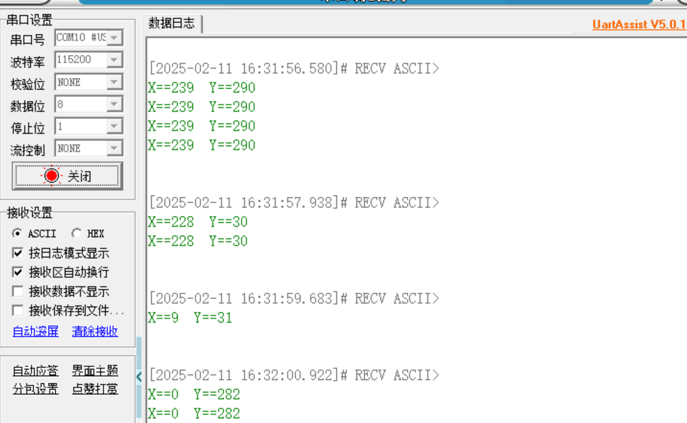

# WIFI网络实验

Ws63V100系列是2.4GHz Wi-Fi 6 星闪多模IoT SoC芯片，集成IEEE 802.11 b/g/n/ax基带和RF电路，包括功率放大器PA、低噪声放大器LNA、RF balun、天线开关以及电源管理模块。Wi-Fi 6支持OFDMA、空分复用技术（SR）和BSS Coloring等新技术，有效减低同频干扰，提升用户并发度。Wi-Fi 6支持更高的调制和更小的子载波，提供更高的速率。支持MU-MIMO，通过网关侧波束赋形和多用户配对，支持更大的用户并发数和更远的覆盖。除了标准的Wi-Fi带宽外，该产品还支持动态窄带Wi-Fi，通过缩小Wi-Fi的频谱带宽在用户速率较低情况下提供更远的覆盖。

下图是Ws63芯片的WiFi特性：

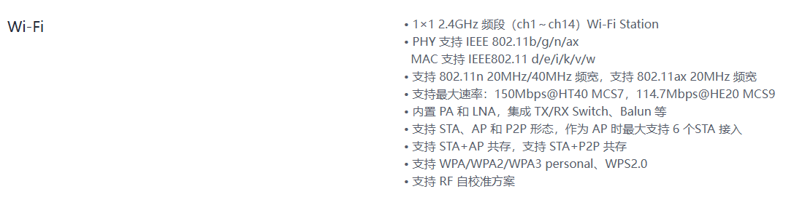

## WiFi之连接热点

### 实验目的

1.  熟悉如何使用Hispark Studio。

2.  熟悉LiteOS系统的编译流程和设计步骤，能够进行设计、编程、调试。

3.  检测搭建的软件及硬件环境是否可正常使用。

4.  学会连接WiFi热点。

### 实验要求

连接附近的WiFi热点，然后在串口调试助手中打印出设备的连接信息。

### 实验环境

硬件环境：FS_Ws63开发板、USB线。

软件环境：Windows系统、Hispark Studio。

源码位置：【vendor\Hqyj_Ws63\Farsight\wifi_01_sta】

### 实验原理

当模组单独处于STA模式下，模块通过无线路由器连接互联网、手机或电脑，并可以和无线连接终端设备进行TCP、UDP连接，实现数据传输。通过互联网实现对设备的远程控制。

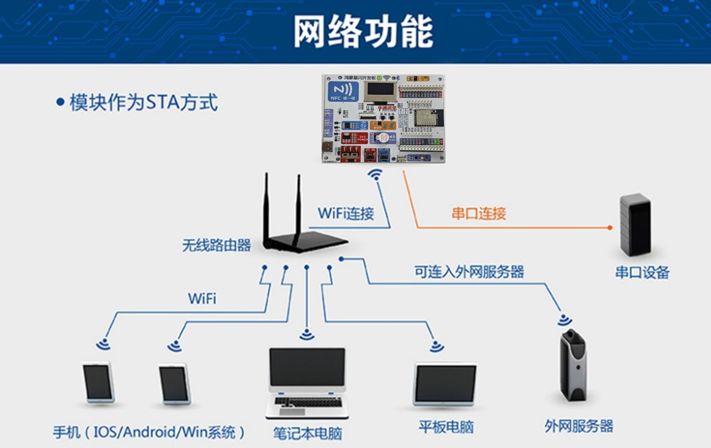

### 实验代码

1.  实验源码目录：【fbb_ws63\vendor\Hqyj_Ws63\Farsight\\ wifi_01_sta】。

    注意：下面显示出主要代码，其余的请查看源码。

2.  目录下wifi_sta_sample.c文件用于存放用户代码；CMakeLists.txt文件用于指定源文件和头文件的路径。

3.  在目录下wifi_sta_sample.c文件中编写驱动程序：

连接热点：

```
static errcode_t example_sta_function(void)
{
    char ifname[WIFI_IFNAME_MAX_SIZE + 1] = "wlan0"; /* WiFi STA 网络设备名 */
    wifi_sta_config_stru expected_bss = {0};         /* 连接请求信息 */
    const char expected_ssid[] = "HQYJ_H3863";
    const char key[] = "123456789"; /* 待连接的网络接入密码 */
    struct netif *netif_p = NULL;
    wifi_linked_info_stru wifi_status;
    uint8_t index = 0;

    /* 启动STA */
    if (wifi_sta_enable() != ERRCODE_SUCC) {
        printf("STA enbale fail !\r\n");
        return ERRCODE_FAIL;
    }
    printf("STA enable succ.\r\n");
  
   ......
            /* 连接成功 */
            printf("STA connect success.\r\n");
            return ERRCODE_SUCC;
        }
    }
    printf("STA connect fail.\r\n");
    return ERRCODE_FAIL;
}
```

初始化设备：

```
int sta_sample_init(void *argument)
{
    argument = argument;
    /* 等待wifi初始化完成 */
    while (wifi_is_wifi_inited() == 0) {
        (void)osDelay(10); 
    }
    example_sta_function();
    return 0;
}
```

4.  目录下CMakeLists.txt文件用来指定组件的相关源文件和头文件路径。

SOURCES：当前组件的源文件，其中CMAKE_CURRENT_SOURCE_DIR变量标识当前CMakeLists.txt所在的路径。

```
set(SOURCES "${SOURCES}" "${CMAKE_CURRENT_SOURCE_DIR}/wifi_sta_sample.c" PARENT_SCOPE)
```

### 编译烧录

1.  点击系统配置选项：


2.  选中相对应的案例：


3.  点击全编译按钮进行编译：


4.  编译完成后，使用USB线连接开发板，点击烧录按钮烧录程序：


### 实验现象

重启Ws63开发板，当附近有可连接的热点时，模组将会自动连接相应热点，可以在串口助手中看到模组已经连接wifi热点，并打印ip信息。

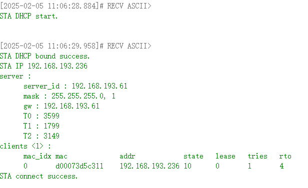

## WiFi之创建热点

### 实验目的

1.  熟悉如何使用Hispark Studio。

2.  熟悉LiteOS系统的编译流程和设计步骤，能够进行设计、编程、调试。

3.  检测搭建的软件及硬件环境是否可正常使用。

4.  学会创建WiFi热点。

### 实验要求

建立好WiFi热点之后，手机可以连接这个节点，然后在串口调试助手中打印出设备的连接信息。

### 实验环境

硬件环境：FS_Ws63开发板、USB线。

软件环境：Windows系统、Hispark Studio。

源码位置：【vendor\Hqyj_Ws63\Farsight\wifi_02_ap】

### 实验原理

当模组单独处于AP模式下，可以被认为是一个无法访问外网的局域网WiFi路由器节点，它可以接受各类设备的无线连接请求。并可以和无线连接终端设备进行TCP、UDP连接，实现数据传输。在局域物联网的设计中可以承担数据的收发节点的作用。

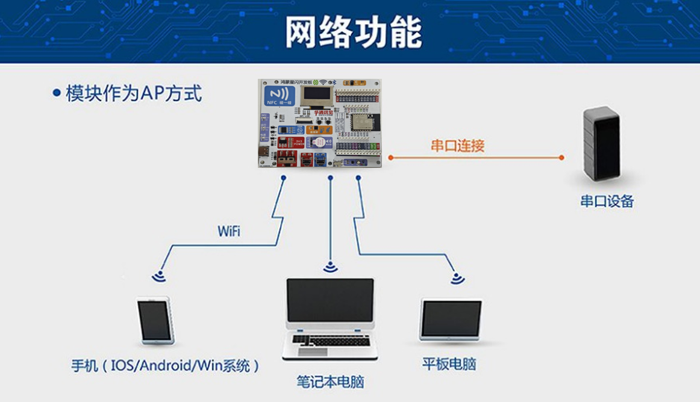

### 实验代码

1.  实验源码目录：【fbb_ws63\vendor\Hqyj_Ws63\Farsight\\ wifi_02_ap】。

    注意：下面显示出主要代码，其余的请查看源码。

2.  目录下wifi_ap_sample.c文件用于存放用户代码；CMakeLists.txt文件用于指定源文件和头文件的路径。

3.  在目录下wifi_ap_sample.c文件中编写驱动程序：

创建wifi热点：

```
errcode_t example_softap_function(td_void)
{
    /* SoftAp接口的信息 */
    td_char ssid[WIFI_MAX_SSID_LEN] = "HQYJ_H3863";
    td_char pre_shared_key[WIFI_MAX_KEY_LEN] = "123456789";
    softap_config_stru hapd_conf = {0};
    softap_config_advance_stru config = {0};
    td_char ifname[WIFI_IFNAME_MAX_SIZE + 1] = "ap0"; /* 创建的SoftAp接口名 */
    struct netif *netif_p = TD_NULL;
    ip4_addr_t   st_gw;
    ip4_addr_t   st_ipaddr;
    ip4_addr_t   st_netmask;
      IP4_ADDR(&st_ipaddr, 192, 168, 5, 1);       /* IP地址设置：192.168.5.1 */
    IP4_ADDR(&st_netmask, 255, 255, 255, 0);    /* 子网掩码设置：255.255.255.0 */
    IP4_ADDR(&st_gw, 192, 168, 5, 2);           /* 网关地址设置：192.168.5.2 */


    /* 配置SoftAp基本参数 */
    (td_void)memcpy_s(hapd_conf.ssid, sizeof(hapd_conf.ssid), ssid, sizeof(ssid));
    (td_void)memcpy_s(hapd_conf.pre_shared_key, WIFI_MAX_KEY_LEN, pre_shared_key, WIFI_MAX_KEY_LEN);
    hapd_conf.security_type = 3; /* 3: 加密方式设置为WPA_WPA2_PSK */
    hapd_conf.channel_num = 6; /* 13：工作信道设置为6信道 */
    hapd_conf.wifi_psk_type = 0;

    /* 配置SoftAp网络参数 */
    config.beacon_interval = 100; /* 100：Beacon周期设置为100ms */
    config.dtim_period = 2; /* 2：DTIM周期设置为2 */
    config.gi = 0; /* 0：short GI默认关闭 */
    config.group_rekey = 86400; /* 86400：组播秘钥更新时间设置为1天 */
    config.protocol_mode = 4; /* 4：协议类型设置为802.11b + 802.11g + 802.11n + 802.11ax */
    config.hidden_ssid_flag = 1; /* 1：不隐藏SSID */
    if (wifi_set_softap_config_advance(&config) != 0) {
        return ERRCODE_FAIL;
    }
    /* 启动SoftAp接口 */
    if (wifi_softap_enable(&hapd_conf) != 0) {
        return ERRCODE_FAIL;
    }
    /* 配置DHCP服务器 */
    netif_p = netif_find(ifname);
    if (netif_p == TD_NULL) {
        (td_void)wifi_softap_disable();
        return ERRCODE_FAIL;
    }
    if (netifapi_netif_set_addr(netif_p, &st_ipaddr, &st_netmask, &st_gw) != 0) {
        (td_void)wifi_softap_disable();
        return ERRCODE_FAIL;
    }
    if (netifapi_dhcps_start(netif_p, NULL, 0) != 0) {
        (td_void)wifi_softap_disable();
        return ERRCODE_FAIL;
    }
    PRINT("SoftAp start success.\r\n");
    return ERRCODE_SUCC;
}

int softap_sample_init(void *argument)
{
    argument = argument;

    /* 等待wifi初始化完成 */
   while (wifi_is_wifi_inited() == 0) {
        (void)osDelay(10); 
    }
    if (example_softap_function() != 0) {
        PRINT("softap_function fail.\r\n");
        return -1;
    }
    return 0;
}
```

4.  目录下CMakeLists.txt文件用来指定组件的相关源文件和头文件路径。

SOURCES：当前组件的源文件，其中CMAKE_CURRENT_SOURCE_DIR变量标识当前CMakeLists.txt所在的路径。

```
set(SOURCES "\${SOURCES}" "\${CMAKE_CURRENT_SOURCE_DIR}/wifi_ap_sample.c" PARENT_SCOPE)
```

### 编译烧录

1.  点击系统配置选项：


2.  选中相对应的案例：


3.  点击全编译按钮进行编译：


4.  编译完成后，使用USB线连接开发板，点击烧录按钮烧录程序：


### 实验现象

重启Ws63开发板，打开手机的wifi功能，连接模组创建的热点，在串口助手上可以看到提示有设备端连接热点。

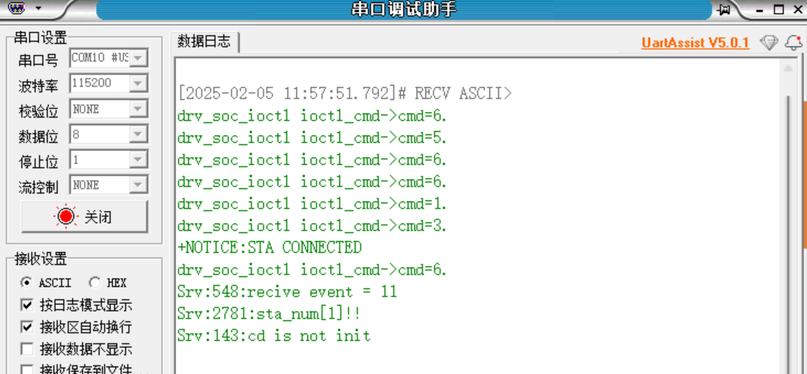

## WiFi之UDP通信

### 实验目的

1.  熟悉如何使用Hispark Studio。

2.  熟悉LiteOS系统的编译流程和设计步骤，能够进行设计、编程、调试。

3.  检测搭建的软件及硬件环境是否可正常使用。

4.  学会UDP通信流程。

### 实验要求

在Ws63模块内部建立UDP客户端，去连接电脑端的UDP服务器端。

### 实验环境

硬件环境：FS_Ws63开发板、USB线。

软件环境：Windows系统、Hispark Studio。

源码位置：【vendor\Hqyj_Ws63\Farsight\wifi_03_udp】

### 实验原理

在TCP/IP网络体系结构中，TCP（传输控制协议，Transport Control Protocol、UDP（用户数据报协议，User Data Protocol）是传输层最重要的两种协议，为上层用户提供级别的通信可靠性。

用户数据报协议（UDP）：UDP（用户数据报协议）是一个简单的面向数据报的传输层协议。提供的是非面向连接的、不可靠的数据流传输。UDP不提供可靠性，也不提供报文到达确认、排序以及流量控制等功能。它只是把应用程序传给IP层的数据报发送出去，但是并不能保证它们能到达目的地。因此报文可能会丢失、重复以及乱序等。但由于UDP在传输数据报前不用在客户和服务器之间建立一个连接，且没有超时重发等机制，故而传输速度很快。

- 使用Socket接口搭建UDP服务器流程

socket 🡪 bind 🡪 recvfrom 🡪 sendto 🡪 close

- 使用Socket接口搭建UDP客户端流程

> socket 🡪 bind 🡪 recvfrom 🡪 sendto 🡪 close

### 实验代码

1.  实验源码目录：【fbb_ws63\vendor\Hqyj_Ws63\Farsight\\ wifi_03_udp】。

    注意：下面显示出主要代码，其余的请查看源码。

2.  目录下wifi_udp_sample.c文件用于存放用户代码；CMakeLists.txt文件用于指定源文件和头文件的路径。

3.  在目录下wifi_udp_sample.c文件中编写驱动程序：

添加要连接的热点信息以及要连接的服务器端口CONFIG_SERVER_IP（电脑上的ip地址）：

```
#define CONFIG_WIFI_SSID            "HQYJ_H3863"                       // 要连接的WiFi 热点账号
#define CONFIG_WIFI_PWD             "123456789"                        // 要连接的WiFi 热点密码
#define CONFIG_SERVER_IP            "192.168.193.230"                  // 要连接的服务器IP
#define CONFIG_SERVER_PORT          6789                               // 要连接的服务器端口

static const char *send_data = "UDP Test!\r\n";
```

连接热点：

```
static errcode_t wifi_connect(void)
{
    char ifname[WIFI_IFNAME_MAX_SIZE + 1] = "wlan0"; /* WiFi STA 网络设备名 */
    wifi_sta_config_stru expected_bss = {0};         /* 连接请求信息 */
    const char expected_ssid[] = CONFIG_WIFI_SSID;
    const char key[] = CONFIG_WIFI_PWD; /* 待连接的网络接入密码 */
    struct netif *netif_p = NULL;
    wifi_linked_info_stru wifi_status;
    uint8_t index = 0;

    /* 创建STA */
    if (wifi_sta_enable() != ERRCODE_SUCC) {
        printf("STA enbale fail !\r\n");
        return ERRCODE_FAIL;
    }
	......
                      /* 连接成功 */
            printf("STA connect success.\r\n");
            return ERRCODE_SUCC;
        }
    }
    printf("STA connect fail.\r\n");
    return ERRCODE_FAIL;
}

```

开启udp通信：

```
int sta_sample_init(void *argument)
{
    argument = argument;
    int sock_fd;
    // 服务器的地址信息
    struct sockaddr_in send_addr;
    socklen_t addr_length = sizeof(send_addr);
    char recvBuf[512];

    wifi_event_stru wifi_event_cb = { 0 };

    wifi_event_cb.wifi_event_scan_state_changed = wifi_scan_state_changed;
    wifi_event_cb.wifi_event_connection_changed = wifi_connection_changed;
     /* 注册事件回调 */
    if (wifi_register_event_cb(&wifi_event_cb) != 0) {
        printf("wifi_event_cb register fail.\r\n");
        return -1;
    }
    printf("wifi_event_cb register succ.\r\n");

    /* 等待wifi初始化完成 */
    while (wifi_is_wifi_inited() == 0) {
        (void)osDelay(10); 
    }
    wifi_connect();

    printf("create socket start! \r\n");
     if ((sock_fd = socket(AF_INET, SOCK_DGRAM, 0)) != ERRCODE_SUCC) {
        printf("create socket failed!\r\n");
        return 0;
    }
    printf("create socket succ!\r\n");

    /* 初始化预连接的服务端地址 */
    send_addr.sin_family = AF_INET;
    send_addr.sin_port = htons(CONFIG_SERVER_PORT);
    send_addr.sin_addr.s_addr = inet_addr(CONFIG_SERVER_IP);
    addr_length = sizeof(send_addr);
    while (1) {
        memset(recvBuf, 0, sizeof(recvBuf));
        /* 发送数据到服务远端 */
        printf("sendto...\r\n");
        sendto(sock_fd, send_data, strlen(send_data) 0, (struct sockaddr *)&send_addr, addr_length);
         osDelay(100);
        /* 接收服务端返回的字符串 */
        recvfrom(sock_fd, recvBuf, sizeof(recvBuf), 0, (struct sockaddr *)&send_addr, &addr_length);
       printf("recvfrom:%s\n", recvBuf);
    }
    lwip_close(sock_fd);
    return 0;
}

```

4.  目录下CMakeLists.txt文件用来指定组件的相关源文件和头文件路径。

SOURCES：当前组件的源文件，其中CMAKE_CURRENT_SOURCE_DIR变量标识当前CMakeLists.txt所在的路径。

```
set(SOURCES "${SOURCES}" "${CMAKE_CURRENT_SOURCE_DIR}/wifi_udp_sample.c" PARENT_SCOPE)
```

### 编译烧录

1.  点击系统配置选项：


2.  选中相对应的案例：


3.  点击全编译按钮进行编译：


4.  编译完成后，使用USB线连接开发板，点击烧录按钮烧录程序：


### 实验现象

重启Ws63开发板，使开发板和电脑连接到同一wifi，查看电脑ip：


打开网络调试助手：

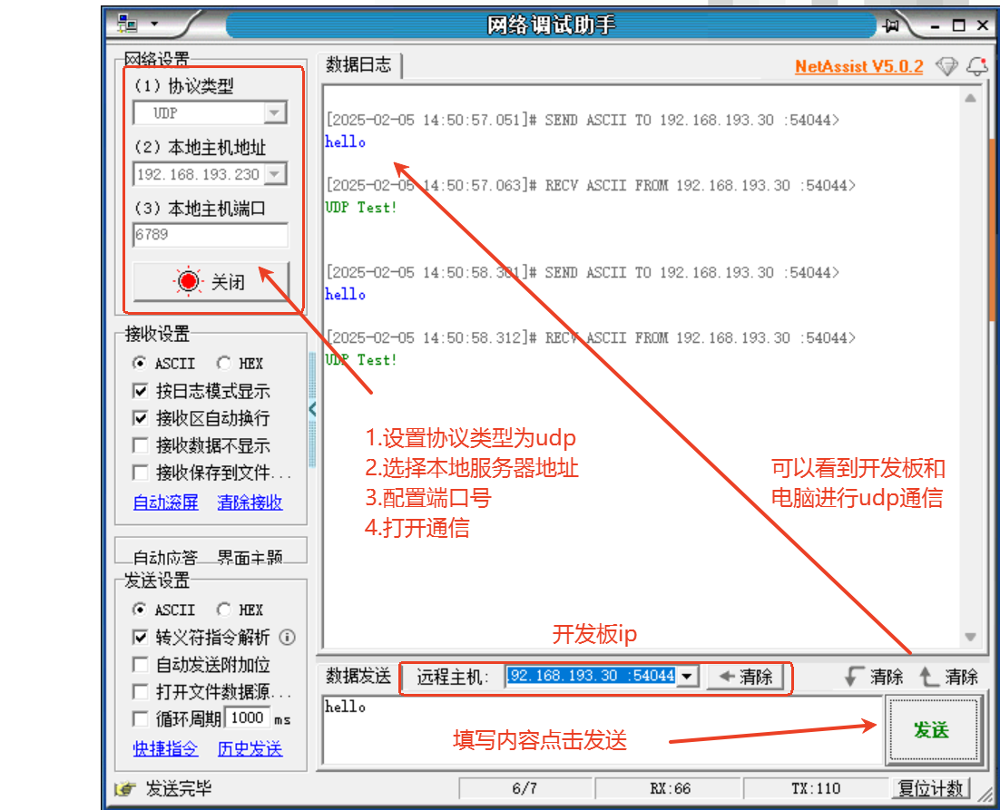

在开发板连接到服务器后，首先会发送字符串“UDP test！”，然后我们回复任意内容，即可重复进行通信。

## WiFi 之TCP通信

### 实验目的

1.  熟悉如何使用Hispark Studio。

2.  熟悉LiteOS系统的编译流程和设计步骤，能够进行设计、编程、调试。

3.  检测搭建的软件及硬件环境是否可正常使用。

4.  学会TCP通信流程。

### 实验要求

在Ws63模块内部建立TCP客户端，去连接电脑端的TCP服务器端。

### 实验环境

硬件环境：FS_Ws63开发板、USB线。

软件环境：Windows系统、Hispark Studio。

源码位置：【vendor\Hqyj_Ws63\Farsight\wifi_04_tcp】

### 实验原理

在TCP/IP网络体系结构中，TCP（传输控制协议，Transport Control Protocol、UDP（用户数据报协议，User Data Protocol）是传输层最重要的两种协议，为上层用户提供级别的通信可靠性。

传输控制协议（TCP）：TCP（传输控制协议）定义了两台计算机之间进行可靠的传输而交换的数据和确认信息的格式，以及计算机为了确保数据的正确到达而采取的措施。协议规定了TCP软件怎样识别给定计算机上的多个目的进程如何对分组重复这类差错进行恢复。协议还规定了两台计算机如何初始化一个TCP数据流传输以及如何结束这一传输。TCP最大的特点就是提供的是面向连接、可靠的字节流服务。

1.  搭建TCP服务器端流程

> socket 🡪 bind 🡪 listen 🡪 accept 🡪 recv/send 🡪 close

2.  搭建TCP客户端流程

> socket 🡪 connect 🡪 recv/send 🡪 close

### 实验代码

1.  实验源码目录：【fbb_ws63\vendor\Hqyj_Ws63\Farsight\\ wifi_04_tcp】。

    注意：下面显示出主要代码，其余的请查看源码。

2.  目录下wifi_tcp_sample.c文件用于存放用户代码；CMakeLists.txt文件用于指定源文件和头文件的路径。

3.  在目录下wifi_tcp_sample.c文件中编写驱动程序：

添加要连接的热点信息以及要连接的服务器端口CONFIG_SERVER_IP（电脑上的ip地址）：

```
#define CONFIG_WIFI_SSID            "HQYJ_H3863"                       // 要连接的WiFi 热点账号
#define CONFIG_WIFI_PWD             "123456789"                        // 要连接的WiFi 热点密码
#define CONFIG_SERVER_IP            "192.168.193.230"                  // 要连接的服务器IP
#define CONFIG_SERVER_PORT          6789                               // 要连接的服务器端口

static const char *send_data = "TCP Test!\r\n";
```

连接热点：

```
errcode_t wifi_connect(void)
{
    char ifname[WIFI_IFNAME_MAX_SIZE + 1] = "wlan0"; /* WiFi STA 网络设备名 */
    wifi_sta_config_stru expected_bss = {0};         /* 连接请求信息 */
    const char expected_ssid[] = CONFIG_WIFI_SSID;
    const char key[] =CONFIG_WIFI_PWD; /* 待连接的网络接入密码 */
    struct netif *netif_p = NULL;
    wifi_linked_info_stru wifi_status;
    uint8_t index = 0;

     /* 等待wifi初始化完成 */
    while (wifi_is_wifi_inited() == 0) {
        (void)osDelay(10); 
    }
    /* 创建STA */
    if (wifi_sta_enable() != ERRCODE_SUCC) {
        printf("STA enbale fail !\r\n");
        return ERRCODE_FAIL;
    }
 	......
            /* 连接成功 */
            printf("STA connect success.\r\n");
            return ERRCODE_SUCC;
        }
    }
    printf("STA connect fail.\r\n");
    return ERRCODE_FAIL;
}

```

开启TCP通信：

```
int sta_sample_init(void *argument)
{
    argument = argument;
    int sock_fd;
    // 服务器的地址信息
    struct sockaddr_in send_addr;
    char recvBuf[512];
    wifi_event_stru wifi_event_cb = { 0 };

    wifi_event_cb.wifi_event_scan_state_changed = wifi_scan_state_changed;
    wifi_event_cb.wifi_event_connection_changed = wifi_connection_changed;
     /* 注册事件回调 */
    if (wifi_register_event_cb(&wifi_event_cb) != 0) {
        printf("wifi_event_cb register fail.\r\n");
        return -1;
    }
    printf("wifi_event_cb register succ.\r\n");
    wifi_connect();
    printf("create socket start! \r\n");
     if ((sock_fd = socket(AF_INET, SOCK_STREAM, 0)) != ERRCODE_SUCC) {
        printf("create socket failed!\r\n");
        return 0;
    }
    printf("create socket succ!\r\n");
    /* 初始化预连接的服务端地址 */
    send_addr.sin_family = AF_INET;
    send_addr.sin_port = htons(CONFIG_SERVER_PORT);
    send_addr.sin_addr.s_addr = inet_addr(CONFIG_SERVER_IP);
    if(connect(sock_fd, (struct sockaddr *)&send_addr, sizeof(send_addr)) != 0) 
    {
        printf("Failed to connect to the server\n");
        return 0;
    }
    printf("Connection to server successful\n");
      /* 初始化预连接的服务端地址 */
    send_addr.sin_family = AF_INET;
    send_addr.sin_port = htons(CONFIG_SERVER_PORT);
    send_addr.sin_addr.s_addr = inet_addr(CONFIG_SERVER_IP);

    while (1) {
        memset(recvBuf, 0, sizeof(recvBuf));
        /* 发送数据到服务远端 */
        printf("sendto...\r\n");
        send(sock_fd, send_data, strlen(send_data), 0);
         osDelay(100);

        /* 接收服务端返回的字符串 */
        recv(sock_fd, recvBuf, sizeof(recvBuf), 0);
       printf("recvfrom:%s\n", recvBuf);
    }
    lwip_close(sock_fd);
    return 0;
}
```

4.  目录下CMakeLists.txt文件用来指定组件的相关源文件和头文件路径。

SOURCES：当前组件的源文件，其中CMAKE_CURRENT_SOURCE_DIR变量标识当前CMakeLists.txt所在的路径。

```
set(SOURCES "\${SOURCES}" "\${CMAKE_CURRENT_SOURCE_DIR}/wifi_tcp_sample.c" PARENT_SCOPE)
```

### 编译烧录

1.  点击系统配置选项：


2.  选中相对应的案例：


3.  点击全编译按钮进行编译：


4.  编译完成后，使用USB线连接开发板，点击烧录按钮烧录程序：


### 实验现象

重启Ws63开发板，使开发板和电脑连接到同一wifi，查看电脑ip：


打开网络调试助手：


## WiFi之本地MQTT回环测试实验

### 实验目的

1.  熟悉如何使用Hispark Studio。

2.  熟悉LiteOS系统的编译流程和设计步骤，能够进行设计、编程、调试。

3.  检测搭建的软件及硬件环境是否可正常使用。

4.  学会使用mqtt协议。

### 实验要求

连接PC端的MQTT服务器，然后进行订阅主题和发布主题。

### 实验环境

硬件环境：FS_Ws63开发板、USB线。

软件环境：Windows系统、Hispark Studio。

源码位置：【vendor\Hqyj_Ws63\Farsight\wifi_05_mqtt】

### 实验原理

MQTT是机器对机器(M2M)/物联网(IoT)连接协议。它被设计为一个极其轻量级的发布/订阅消息传输协议。对于需要较小代码占用空间和/或网络带宽非常宝贵的远程连接非常有用，是专为受限设备和低带宽、高延迟或不可靠的网络而设计。这些原则也使该协议成为新兴的“机器到机器”(M2M)或物联网(IoT)世界的连接设备，以及带宽和电池功率非常高的移动应用的理想选择。例如，它已被用于通过卫星链路与代理通信的传感器、与医疗服务提供者的拨号连接，以及一系列家庭自动化和小型设备场景。它也是移动应用的理想选择，因为它体积小，功耗低，数据包最小，并且可以有效地将信息分配给一个或多个接收器。MQTT通信模型如下图所示：

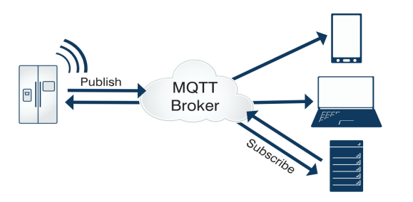

- 特点：

  1.  开放消息协议，简单易实现；

  2.  发布订阅模式，一对多消息发布；

  3.  基于TCP/IP网络连接，提供有序，无损，双向连接；

  4.  1字节固定报头，2字节心跳报文，最小化传输开销和协议交换，有效减少网络流量；

  5.  消息QoS支持，可靠传输保证；

- 应用：

MQTT协议广泛应用于物联网、移动互联网、智能硬件、车联网、电力能源等领域。物联网M2M通信，物联网大数据采集；Android消息推送，WEB消息推送；移动即时消息，例如Facebook Messenger；智能硬件、智能家具、智能电器；车联网通信，电动车站桩采集。

### 实验代码

1.  实验源码目录：【fbb_ws63\vendor\Hqyj_Ws63\Farsight\\ wifi_05_mqtt】。

    注意：下面显示出主要代码，其余的请查看源码。

2.  目录下mqtt_demo.c文件用于存放用户代码；CMakeLists.txt文件用于指定源文件和头文件的路径。

3.  在目录下mqtt_demo.c文件中编写驱动程序：

编写需要连接的wifi信息，定义订阅和发布消息的主题，定义需要发送的字符串数据：

```
#define SERVER_IP_ADDR  "192.168.193.230"    
#define SERVER_IP_PORT  1883
#define CLIENT_ID       "ADMIN"

#define MQTT_TOPIC_SUB  "subTopic"
#define MQTT_TOPIC_PUB  "pubTopic"

char* msg = "hello!";
```

连接mqtt服务器，注册回调函数，并订阅相对应的主题，成功后开始循环项服务器发送数据：

```
/* 回调函数，处理消息到达 */
void delivered(void *context, MQTTClient_deliveryToken dt) {
    unused(context);
    printf("Message with token value %d delivery confirmed\n", dt);
    deliveredToken = dt;
}

/* 回调函数，处理接收到的消息 */
int messageArrived(void *context, char *topicName, int topicLen, MQTTClient_message *message) {
    unused(context);
    unused(topicLen);
    printf("Message arrived on topic: %s\n", topicName);
    printf("Message: %.*s\n", message->payloadlen, (char*)message->payload);
    return 1;  // 表示消息已被处理
}

/* 回调函数，处理连接丢失 */
void connlost(void *context, char *cause) 
{
    unused(context);
    printf("Connection lost: %s\n", cause);
}
/* 消息订阅 */
int mqtt_subscribe(const char *topic)
{
    printf("subscribe start\r\n");
    MQTTClient_subscribe(client, topic, 1);
    return 0;
}
int mqtt_publish(const char *topic, char* msg) 
{
    MQTTClient_message pubmsg = MQTTClient_message_initializer;
    MQTTClient_deliveryToken token;
    int ret = 0;
    pubmsg.payload = msg; 
    pubmsg.payloadlen = (int)strlen(msg); 
    pubmsg.qos = 1; 
    pubmsg.retained = 0; 
    ret = MQTTClient_publishMessage(client, topic, &pubmsg, &token);
    if (ret != MQTTCLIENT_SUCCESS) {
        printf("mqtt_publish failed\r\n");
    }
    printf("mqtt_publish(), the payload is %s, the topic is %s\r\n", msg, topic);
    return ret;
}
static errcode_t mqtt_connect(void)
{
    int ret;
    MQTTClient_connectOptions conn_opts = MQTTClient_connectOptions_initializer;
    /* 初始化MQTT客户端 */
    MQTTClient_init();
    /* 创建 MQTT 客户端 */
    ret = MQTTClient_create(&client, SERVER_IP_ADDR, CLIENT_ID, MQTTCLIENT_PERSISTENCE_NONE, NULL);
    if (ret != MQTTCLIENT_SUCCESS) {
        printf("Failed to create MQTT client, return code %d\n", ret);
        return ERRCODE_FAIL;
    }
    conn_opts.keepAliveInterval = 120;
    conn_opts.cleansession = 1;
    // conn_opts.username = username;
    // conn_opts.password = password;
    //绑定回调函数
    MQTTClient_setCallbacks(client, NULL, connlost, messageArrived, delivered);
    // 尝试连接
    if ((ret = MQTTClient_connect(client, &conn_opts)) != MQTTCLIENT_SUCCESS) {
        printf("Failed to connect, return code %d\n", ret);
        MQTTClient_destroy(&client);  // 连接失败时销毁客户端
        return ERRCODE_FAIL;
    }
    printf("Connected to MQTT broker!\n");
    osDelay(200);
     //订阅MQTT主题
     mqtt_subscribe(MQTT_TOPIC_SUB);
    while (1) {
        osDelay(100); // 等待连接成功
        mqtt_publish(MQTT_TOPIC_PUB,msg);
    }
     return ERRCODE_SUCC;
}
```

4.  目录下CMakeLists.txt文件用来指定组件的相关源文件和头文件路径。

SOURCES：当前组件的源文件，其中CMAKE_CURRENT_SOURCE_DIR变量标识当前CMakeLists.txt所在的路径。

```
set(SOURCES "\${SOURCES}" "\${CMAKE_CURRENT_SOURCE_DIR}/wifi_tcp_sample.c" PARENT_SCOPE)
```

### 编译烧录

1.  点击系统配置选项：


2.  选中相对应的案例：


3.  点击全编译按钮进行编译：


4.  编译完成后，使用USB线连接开发板，点击烧录按钮烧录程序：


### 实验现象

打开MQTT.fx软件，将相关连接参数填写：

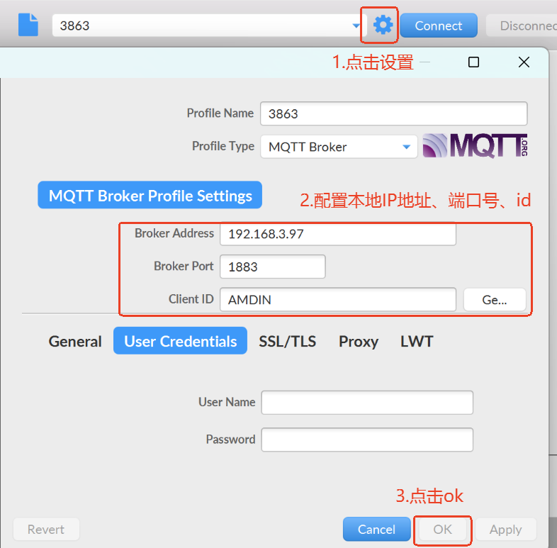

配置完后，点击connect按钮进行连接，订阅主题：


然后复位开发板，等待开发板连接，连接后开发板将循环向本地mqtt服务器发送数据：

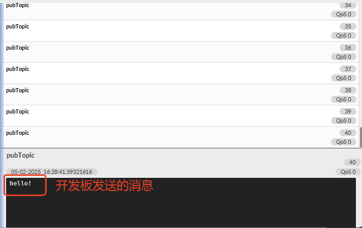

向开发板发送字符串数据：


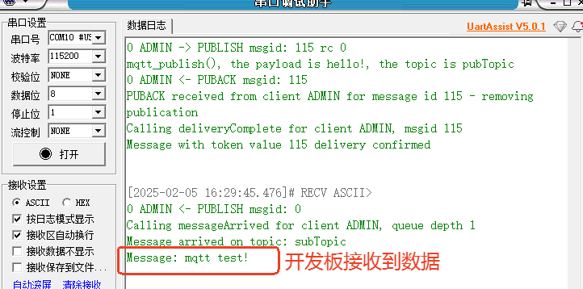

注意：如果接收不到数据请关闭防火墙。

## WiFi之华为云实验

### 实验目的

1.  熟悉如何使用Hispark Studio。

2.  熟悉LiteOS系统的编译流程和设计步骤，能够进行设计、编程、调试。

3.  检测搭建的软件及硬件环境是否可正常使用。

4.  学会使用mqtt协议连接华为云平台。

### 实验要求

连接华为云，实现云端控制开发板上的蜂鸣器。

### 实验环境

硬件环境：FS_Ws63开发板、USB线。

软件环境：Windows系统、Hispark Studio。

源码位置：【vendor\Hqyj_Ws63\Farsight\wifi_06_huawei_iot】

### 实验原理

华为云物联网平台（IoT 设备接入云服务）提供海量设备的接入和管理能力，可以将自己的IoT设备联接到华为云，支撑设备数据采集上云和云端下发命令给设备进行远程控制，配合华为云物联网平台的服务实现设备与设备之间的控制，设备与物联网平台之间的数据信息交互。

在本实验中，将板载资源上的传感器数据传到华为云物联网平台与上并且可以下发指令控制板载资源蜂鸣器。查看相关文档可以查看华为云官网：<https://support.huaweicloud.com/iothub/> 下面让我们开始吧！

### 云平台配置

#### 注册并登录华为云账号

1.  打开华为云物联网平台的网址[*https://www.huaweicloud.com/*](https://www.huaweicloud.com/)，打开网址之后，点击右上角的“注册”。


2.  登陆成功之后点击控制台：


3.  找到“设备接入 IoTDA”：

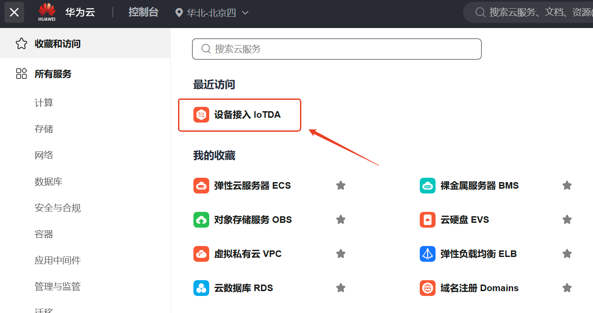

4.  点击开通免费单元：

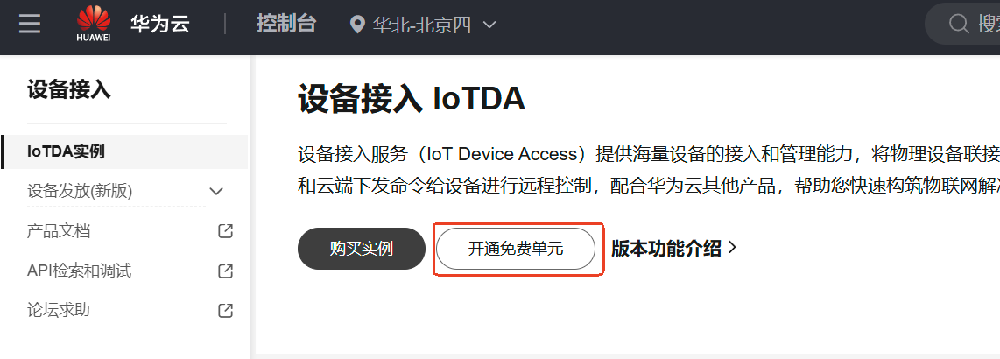

创建实例：


创建好以后我们可以在“IoTDA实例”中找到我们的实例：

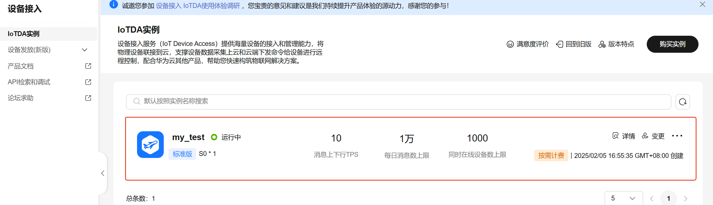

点击详情按钮，可以找到设备接入地址，这里后面要用到：

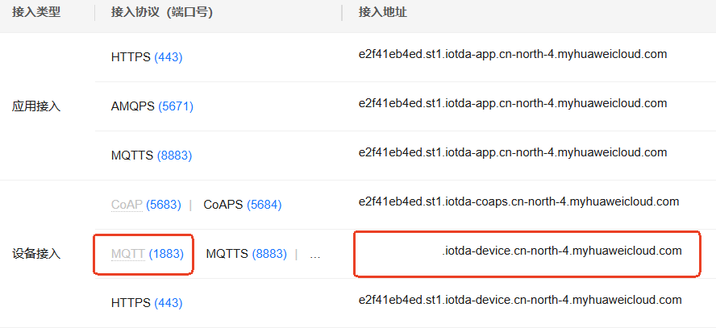

点击“my_test”进入实例：可以看到实例总览：

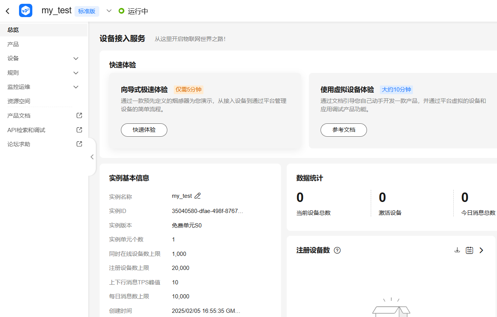

#### 创建产品

在总览中点击侧边栏的产品，并创建产品。按照下图填写产品相关参数，最后点击确定：

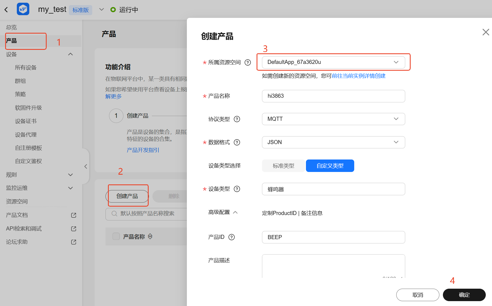

进入产品详情：


添加服务：


添加完服务后，再次服务中新增属性设置：

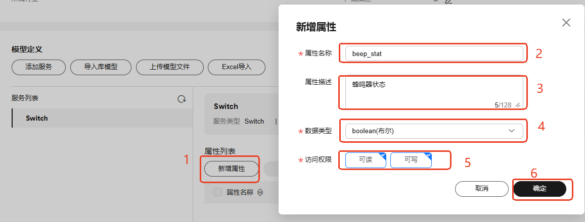

点击新增命令，命令类型为布尔：

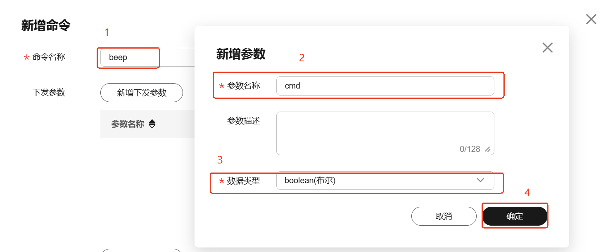

新增后的属性和命令：

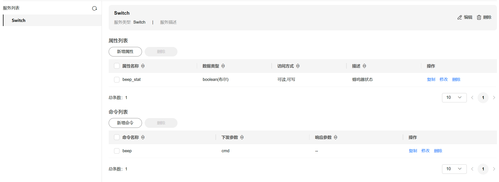

#### 创建设备

注册新设备：

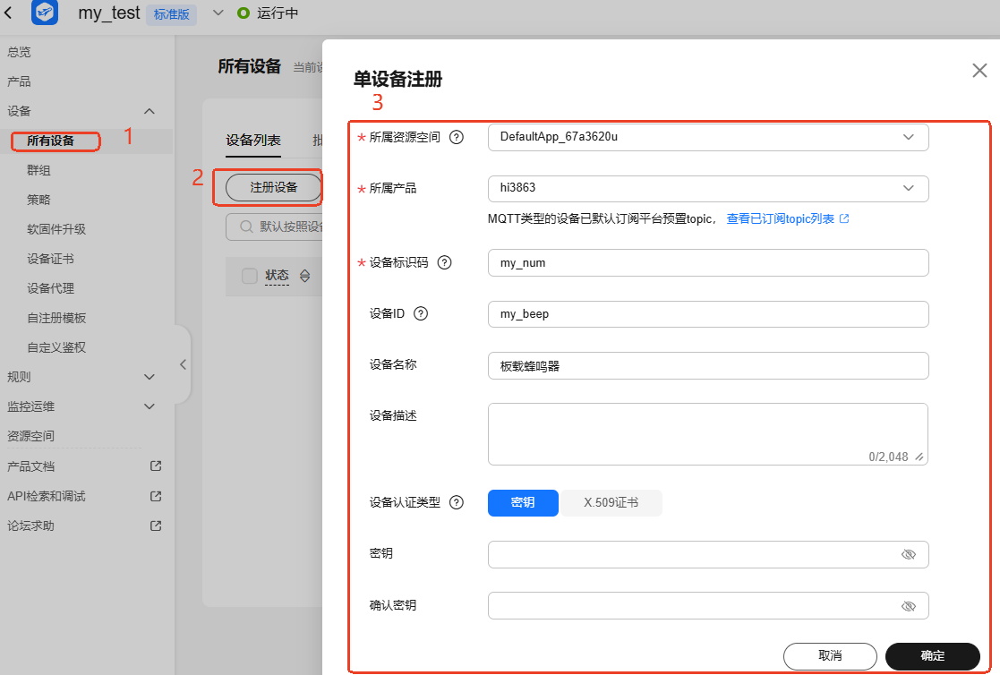

注册后得到设备id和设备秘钥：


最后进入设备详情：

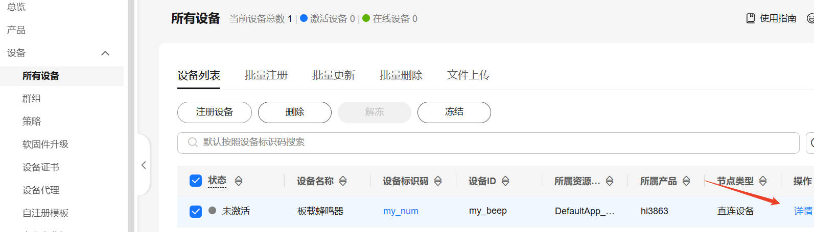

查看此设备的连接参数，包括用户名和秘钥等等信息：

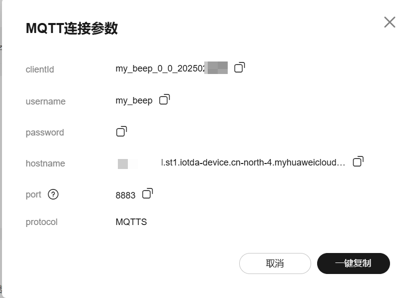

#### 接入平台

打开工程源码，找到【src\fbb_ws63\vendor\Hqyj_Ws63\Farsight\wifi_06_huawei_iot\wifi\wifi_connect.h】文件，修改wifi热点为自己可连接的热点：

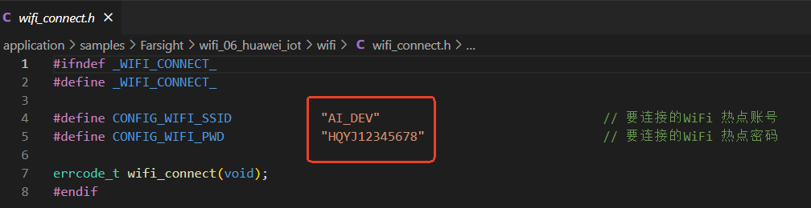

找到【src\fbb_ws63\vendor\Hqyj_Ws63\Farsight\wifi_06_huawei_iot\huawei_iot.c】文件，修改自己的连接信息，具体可以参考下图找到设备的接入信息：

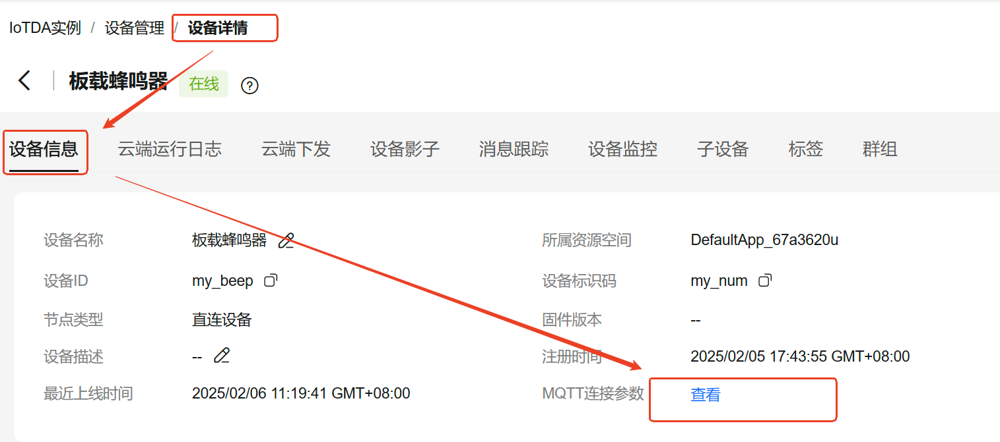

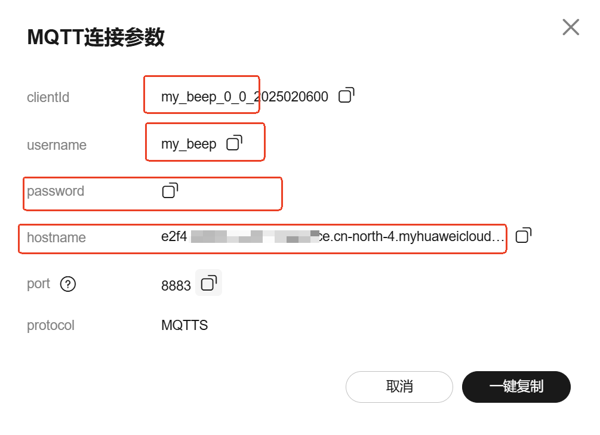

将上图获取到的参数填写到源码中：

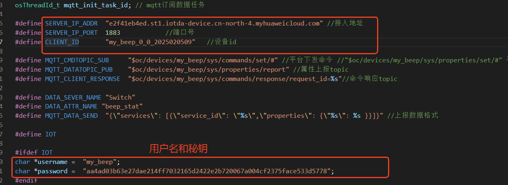

将以上信息全部替换后（如果其他参数都按照教程则只需要修改红框中的地方），编译程序，将代码下载到开发板中。

等待开发板连接成功后，即可在平台看到设备在线，并持续上报蜂鸣器状态：

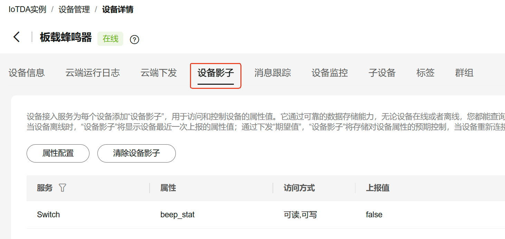

### 实验代码

1.  实验源码目录：【fbb_ws63\vendor\Hqyj_Ws63\Farsight\\ wifi_06_huawei_iot】。

    注意：下面显示出主要代码，其余的请查看源码。

2.  目录下huawei_iot.c文件用于存放用户代码；CMakeLists.txt文件用于指定源文件和头文件的路径。

3.  在目录下huawei_iot.c文件中编写驱动程序：

使用MQTT连接华为云平台，并将传感器状态上报至平台：

```
static errcode_t mqtt_connect(void)
{
    int ret;
    MQTTClient_connectOptions conn_opts = MQTTClient_connectOptions_initializer;
    /* 初始化MQTT客户端 */
    MQTTClient_init();
    /* 创建 MQTT 客户端 */
    ret = MQTTClient_create(&client, SERVER_IP_ADDR, CLIENT_ID, MQTTCLIENT_PERSISTENCE_NONE, NULL);
    if (ret != MQTTCLIENT_SUCCESS) {
        printf("Failed to create MQTT client, return code %d\n", ret);
        return ERRCODE_FAIL;
    }
    conn_opts.keepAliveInterval = 120;
    conn_opts.cleansession = 1;
    #ifdef IOT
     conn_opts.username = username;
     conn_opts.password = password;
    #endif
    //绑定回调函数
    MQTTClient_setCallbacks(client, NULL, connlost, messageArrived, delivered);
    // 尝试连接
    if ((ret = MQTTClient_connect(client, &conn_opts)) != MQTTCLIENT_SUCCESS) {
        printf("Failed to connect, return code %d\n", ret);
        MQTTClient_destroy(&client);  // 连接失败时销毁客户端
        return ERRCODE_FAIL;
    }
    printf("Connected to MQTT broker!\n");
    osDelay(200);
     //订阅MQTT主题
     mqtt_subscribe(MQTT_CMDTOPIC_SUB);
    while (1) {
        //响应平台命令部分
        osDelay(200);//需要延时 否则会发布失败
        if(cmd_flag) 
        {
            sprintf(send_buff,MQTT_CLIENT_RESPONSE,response_id); 
            //设备响应命令
            mqtt_publish(send_buff,response_buf);
            cmd_flag=0;
            memset(response_id,0,sizeof(response_id)/sizeof(response_id[0]));
        }
        //属性上报部分
        osDelay(200);
        memset(send_buff,0,sizeof(send_buff)/sizeof(send_buff[0]));
        sprintf(send_buff,MQTT_DATA_SEND,DATA_SEVER_NAME,DATA_ATTR_NAME,my_io_readval(sensor_io)?"true":"false"); 
        mqtt_publish(MQTT_DATATOPIC_PUB,send_buff);
        memset(send_buff,0,sizeof(send_buff)/sizeof(send_buff[0]));
      
    }
      return ERRCODE_SUCC;
}
```

4.  目录下CMakeLists.txt文件用来指定组件的相关源文件和头文件路径。

SOURCES_LIST：当前组件的源文件列表，其中CMAKE_CURRENT_SOURCE_DIR变量标识当前CMakeLists.txt所在的路径。

HEADER_LIST：当前组件头文件列表，其中CMAKE_CURRENT_SOURCE_DIR变量标识当前CMakeLists.txt所在的路径。

PUBLIC_HEADER：当前组件需要对外提供的头文件的路径。SOURCES：当前组件的C文件列表。

```
set(SOURCES_LIST
    ${CMAKE_CURRENT_SOURCE_DIR}/wifi/wifi_connect.c
    ${CMAKE_CURRENT_SOURCE_DIR}/bsp/bsp.c
    ${CMAKE_CURRENT_SOURCE_DIR}/huawei_iot.c
)
set(HEADER_LIST 
    ${CMAKE_CURRENT_SOURCE_DIR}/wifi
    ${CMAKE_CURRENT_SOURCE_DIR}/bsp
)

set(SOURCES "${SOURCES}" ${SOURCES_LIST} PARENT_SCOPE)
set(PUBLIC_HEADER "${PUBLIC_HEADER}" ${HEADER_LIST} PARENT_SCOPE)
```

### 编译烧录

1.  点击系统配置选项：


2.  选中相对应的案例：


3.  点击全编译按钮进行编译：


4.  编译完成后，使用USB线连接开发板，点击烧录按钮烧录程序：


### 实验现象

在设备列表中选择设备调试：


进行蜂鸣器的控制：

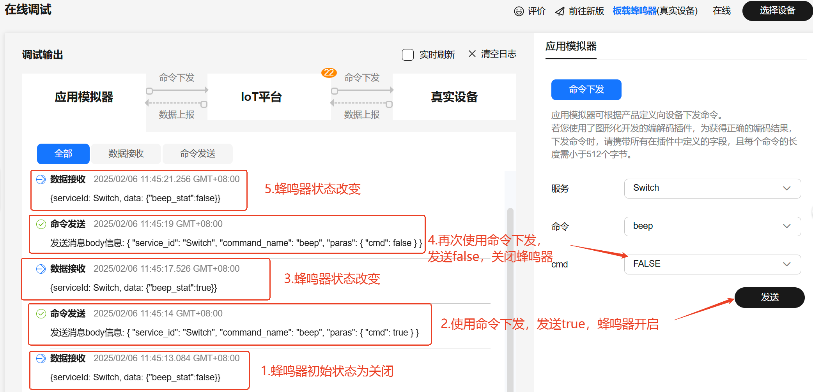

在经过上述步骤后，用平台上的控制选项，可以控制蜂鸣器的开关。

# BLE通信

## BLE基础

BLE（Bluetooth Low Energy），也称为Bluetooth Smart，是一种专为低功耗设备设计的无线通信技术。它首次出现在蓝牙4.0规范中（2010年发布），旨在解决传统蓝牙在某些应用场景下能耗过高的问题。BLE工作在2.4GHz的ISM频段，使用跳频扩频（FHSS）技术进行数据传输，以避免干扰并提高信号的稳定性和安全性。

1.  **BLE基本协议层**

下图是BLE协议的架构：

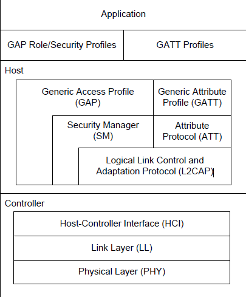

物理层（Physical Layer）：协议栈中的最低层，它定义了蓝牙信号的物理特性，如频率、调制方式等，在免征的2.4GHz频段负责无线电信号的发送和接收。

链路层（Link Layer）：为BLE设备之间的通信提供了基础的链路功能，当两个BLE设备决定建立持续连接时，LL负责初始化、维护和断开这些连接。也就是说LL规定了蓝牙设备是如何建立连接的。LL操作基于状态机，其中主要的状态包括就绪、广播、扫描、初始化和连接。

主机控制接口层（Host Controller Interface）：为主机和控制器之间提供一个标准通信接口。使得主机能够向控制器发送指令，控制器能够向主机报告事件。

逻辑链路控制及自适应协议层（L2CAP）：为上层提供数据封装服务，允许逻辑上的点对多点数据通信。

安全管理层（SM）：顾名思义安全管理协议主要负责BLE设备间的配对和绑定过程，以及安全性相关的功能。其中配对是一个过程，其中两个BLE设备交换安全密钥以建立受保护的连接。绑定则是一个更长期的过程，其中密钥被持久化存储在设备中，以便将来可以重新建立安全连接，而无需再次配对。

属性协议层（ATT）：该协议是BLE设备用于存储和访问数据的协议。ATT定义了一种结构化的方法来组织和访问数据，这些数据以"属性"的形式存储。每个属性都有一个唯一的句柄、一个UUID（Universally Unique Identifier）来标识其类型、权限、值以及其他可能的元数据。在ATT中，存在两种设备角色：服务器和客户端。服务器存储属性，而客户端请求或修改这些属性。ATT定义了一系列的操作，使客户端能够与服务器交互。这些操作包括读、写、查找属性等。其中每个属性都可以设置不同的访问权限，如只读、只写或加密读写。

通用属性配置文件层（GATT）：定义了使用ATT的服务框架。GATT规定了配置文件（profiles）的结构。在BLE中，所有被profile或服务用到的数据块都称之为“特征”。两个建立连接的设备之间的所有数据通信都是通过GATT子程序处理。应用程序和profiles直接使用GATT层。GATT负责处理向上与应用打交道，其关键工作是为检索工作提供合适的profile结构，而profile由检索关键词（characteristics）组成。

通用访问配置文件层（GAP）：是直接与应用程序或配置文件（profiles）通信的接口，处理设备发现和连接相关服务。另外还处理安全特性的初始化。对上级，提供应用程序接口；对下级，管理各级职能部门，尤其是指示LL层控制器5种状态切换，指导保卫处做好机要工作。

### 配置文件层

BLE协议栈配置文件层包括GAP/安全配置文件、GATT配置文件两部分，处于协议栈的顶层部分，配置文件将协议栈和应用紧密地联系在一起。这使得开发者即使对协议栈底层的原理没有深入的了解。

1.  通用属性配置文件（Generic Attribute profile）

蓝牙采用基于属性协议（ATT）的服务结构，所有低功耗数据通信都是通过通用属性配置文件（GATT）运行。从GATT角度来看，当两个设备建立连接后，他们处于两个状态——GATT服务器和GATT客户端。如果应用或另一个配置文件使用GATT配置文件，那么客户端和服务器可以有序的方式进行互动。

GATT服务器——它是为GATT客户端提供读写数据服务的设备。

GATT客户端——它是从GATT服务器读写应用数据的设备。

特别注意的是，GATT角色中的客户端和服务器与链路层角色的主机和从机是两个完全独立的概念。一个从机可以是GATT客户端或GATT服务器；主机也可以是GATT客户端和GATT服务器。

服务器包含一个或多个GATT服务，GATT服务是完成特定功能的一系列数据的集合。而GATT配置文件定义如何利用属性协议发现、读取、编写和获取指示。这些功能支持基于服务的结构。所采用的服务在配置文件规格中有所界定。GATT使你能了解配置文件规格所界定的服务和特征。

GATT配置文件定义了如何使用属性协议（ATT）来组织和传输数据。它通过服务和特征的形式，将数据组织成一个层次结构。GATT的核心概念包括服务、特征和描述符，它们用于定义两个BLE设备之间如何通过服务（Services）和特征（Characteristics）进行通信。

GATT配置文件的层次结构从上到下依次为：

- Profile（配置文件）：最顶层，由一个或多个服务组成，用于实现特定的用例。

- Service（服务）：服务是功能相关的数据集合，每个服务包含一个或多个特征。服务分为两种类型：主服务（Primary Service）和二级服务（Secondary Service）。

- Characteristic（特征）：特征是服务中的具体数据点，包含一个值和可能的描述符。

- Descriptor（描述符）：描述符提供关于特征值的额外信息，例如单位、最大值等。

GATT支持以下基本操作：

- Discover（发现）：客户端发现服务器上的服务和特征。

- Read（读取）：客户端读取特征值。

- Write（写入）：客户端写入特征值。

- Notify（通知）：服务器主动向客户端发送特征值的更新。

- Indicate（指示）：类似于通知，但需要客户端确认。

> 通过GATT配置文件，BLE设备能够高效地组织、存储和交换数据，实现各种复杂的通信场景。

### GATT应用示例

> GATT配置文件的示例：
>
> 假设有一个BLE设备（如智能手环）和一个客户端设备（如手机）：

1.  服务和特征的发现：

> 手机作为客户端，发送发现服务的命令，请求智能手环列出所有支持的服务。
>
> 智能手环返回支持的服务列表，例如心率服务（UUID：0x180D）和设备信息服务（UUID：0x180A）。
>
> 手机继续发现心率服务中的特征，例如心率测量特征（UUID：0x2A37）。

2.  读取和写入操作：

> 手机读取心率测量特征的值，获取当前的心率数据。
>
> 手机写入设备名称特征的值，更新设备的名称。

3.  通知和指示操作：

> 手机启用心率测量特征的通知。
>
> 智能手环在心率数据更新时，主动通知手机。

## BLE透传实验

### BLE透传之SERVER端

#### 实验目的

1.  熟悉如何使用Hispark Studio。

2.  熟悉LiteOS系统的编译流程和设计步骤，能够进行设计、编程、调试。

3.  检测搭建的软件及硬件环境是否可正常使用。

4.  学会Ws63的BLE通信流程。

#### 实验要求

在Ws63模块内，开启BLE功能，并添加服务端的特征值，将特征值权限设置为可读、可写、可通知，使用串口进行数据的收发。

#### 实验环境

硬件环境：FS_Ws63开发板、USB线。

软件环境：Windows系统、Hispark Studio。

源码位置：【vendor\Hqyj_Ws63\Farsight\ble_01_trans_server】

#### 实验原理

BLE（Bluetooth Low Energy，蓝牙低功耗）是一种低功耗、短距离无线通信技术，主要用于移动设备之间的数据传输。本实验通过在server端的蓝牙协议栈中添加自己的特征值，实现无线透明传输。

#### 实验代码

1.  实验源码目录：【fbb_ws63\vendor\Hqyj_Ws63\Farsight\ble_01_trans_server】。

    注意：下面显示出主要代码，其余的请查看源码。

2.  目录下ble_server.c文件用于存放用户代码；CMakeLists.txt文件用于指定源文件和头文件的路径。

3.  在目录下ble_server.c文件中编写驱动程序：

定义蓝牙的设备地址，client通过扫描设备地址来连接我们的server：

| static uint8_t g_ble_uart_server_addr\[\] = { 0x12, 0x34, 0x56, 0x78, 0x90, 0x00 }; |
|----|

给自己的蓝牙起一个名字：

| uint8_t g_local_name\[ NAME_MAX_LENGTH\] = { 'b', 'l', 'e', '\_', 'h', 'q', 'y', 'j', '\_', 's', 'e', 'r', 'v', 'e', 'r' }; |
|----|

首先初始化串口功能，使开发板可以通过串口收发数据，在此实验中使用中断接收串口数据：

```
void app_uart_init_config(void)
{
    uart_buffer_config_t uart_buffer_config;
    uapi_pin_set_mode(CONFIG_UART0_TXD_PIN, CONFIG_UART0_PIN_MODE);
    uapi_pin_set_mode(CONFIG_UART0_RXD_PIN, CONFIG_UART0_PIN_MODE);
    uart_attr_t attr = {
        .baud_rate = 115200,
        .data_bits = UART_DATA_BIT_8,
        .stop_bits = UART_STOP_BIT_1,
        .parity = UART_PARITY_NONE
        };
    uart_buffer_config.rx_buffer_size = 512;
    uart_buffer_config.rx_buffer = uart_rx_buffer;
    uart_pin_config_t pin_config = {.tx_pin = S_MGPIO0, .rx_pin = S_MGPIO1, .cts_pin = PIN_NONE, .rts_pin = PIN_NONE};
    uapi_uart_deinit(UART_BUS_0);
    int res = uapi_uart_init(UART_BUS_0, &pin_config, &attr, NULL, &uart_buffer_config);
    if (res != 0) {
        printf("uart init failed res = %02x\r\n", res);
    }
     if (uapi_uart_register_rx_callback(UART_BUS_0, UART_RX_CONDITION_MASK_IDLE, 1, ble_uart_server_read_handler) == ERRCODE_SUCC) {
        osal_printk("uart%d int mode register receive callback succ!\r\n", UART_BUS_0);
    }
}
```

开启并初始化BLE协议栈服务端，初始化完成后开启服务端广播模式：

```
/* 初始化uuid server service */
void ble_server_init(void)
{
    osal_printk("BLE SERVER ENTRY.\n");
    /* 注册GATT server用户回调函数 */
    ble_server_register_callbacks(); 
    osal_printk("BLE START ENABLE.\n");
    /* 打开蓝牙开关 */
    enable_ble();

    bt_uuid_t app_uuid = {0};
    bd_addr_t ble_addr = { 0 };
    app_uuid.uuid_len = sizeof(g_uuid_app_uuid);
    if (memcpy_s(app_uuid.uuid, app_uuid.uuid_len, g_uuid_app_uuid, sizeof(g_uuid_app_uuid)) != EOK) {
        return ;
    }
     ble_addr.type = BLE_PUBLIC_DEVICE_ADDRESS;
    if (memcpy_s(ble_addr.addr, BD_ADDR_LEN, g_ble_uart_server_addr, sizeof(g_ble_uart_server_addr)) != EOK) {
        osal_printk("add server app addr memcpy failed\n");
        return;
    }
     gap_ble_set_local_addr(&ble_addr);
    /* 1.创建一个server */
    gatts_register_server(&app_uuid, &g_server_id);
    /* 2.根据UUID创建service */
    ble_uuid_add_service();
    /* 3.设置广播参数 */
    ble_start_adv();
}
```

在中函数中调用相关初始化函数，开启广播后等待被client端扫描连接，在while循环中等待串口数据，当串口数据不为空时，将数据通过ble_server_send_repor()函数发送给client端：

```
void ble_main_task(void *argument)
{
    argument=argument;
    ble_server_init();
    app_uart_init_config();
    while (1)
    {
        msg_data_t msg_data = { 0 };
        int msg_ret = osal_msg_queue_read_copy(g_msg_queue, &msg_data, &msg_rev_size, OSAL_WAIT_FOREVER);
        if (msg_ret != OSAL_SUCCESS) {
            osal_printk("msg queue read copy fail.");
            if (msg_data.value != NULL) {
                osal_vfree(msg_data.value);
            }
            continue;
        }
        if (msg_data.value != NULL) {
            ble_server_send_report(msg_data.value, msg_data.value_len);
            osal_vfree(msg_data.value);
        }
    }
}
```

4.  目录下CMakeLists.txt文件用来指定组件的相关源文件和头文件路径。

SOURCES：当前组件的源文件，其中CMAKE_CURRENT_SOURCE_DIR变量标识当前CMakeLists.txt所在的路径。

```
set(SOURCES_LIST
    ${CMAKE_CURRENT_SOURCE_DIR}/ble_server.c
    ${CMAKE_CURRENT_SOURCE_DIR}/ble_server_adv.c
)
set(SOURCES "${SOURCES}" ${SOURCES_LIST} PARENT_SCOPE)
```

#### 编译烧录

1.  点击系统配置选项：


2.  选中相对应的案例：


3.  点击全编译按钮进行编译：


4.  编译完成后，使用USB线连接开发板，点击烧录按钮烧录程序：


#### 实验现象

重启Ws63开发板，可以使用手机软件查看我们创建的server：

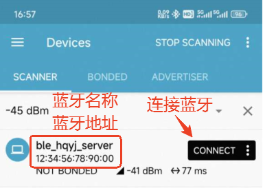

点击CONNECT，连接我们的开发板，可以看到我们添加的服务和属性：

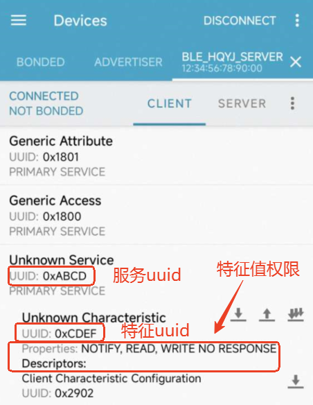

### BLE透传之CLIENT端

#### 实验目的

1.  熟悉如何使用Hispark Studio。

2.  熟悉LiteOS系统的编译流程和设计步骤，能够进行设计、编程、调试。

3.  检测搭建的软件及硬件环境是否可正常使用。

4.  学会Ws63的BLE通信流程。

#### 实验要求

在Ws63模块内，开启BLE功能，扫描上一实验的server端并连接设备，使用串口进行数据的收发。

#### 实验环境

硬件环境：FS_Ws63开发板、USB线。

软件环境：Windows系统、Hispark Studio。

源码位置：【vendor\Hqyj_Ws63\Farsight\ble_02_trans_client】

#### 实验原理

BLE（Bluetooth Low Energy，蓝牙低功耗）是一种低功耗、短距离无线通信技术，主要用于移动设备之间的数据传输。本实验通过开启ble的扫描模式，连接服务端设备，实现无线透明传输。

#### 实验代码

1.  实验源码目录：【fbb_ws63\vendor\Hqyj_Ws63\Farsight\ble_02_trans_client】。

    注意：下面显示出主要代码，其余的请查看源码。

2.  目录下ble\_client.c文件用于存放用户代码；CMakeLists.txt文件用于指定源文件和头文件的路径。

3.  在目录下ble_client.c文件中编写驱动程序：

使能ble协议栈，注册相关回调函数，并初始化ble的client模式：

```
errcode_t ble_client_init(void)
{
    errcode_t ret = ERRCODE_BT_SUCCESS;
    osal_printk("BLE CLIENT ENTRY.\n");
    ret |= ble_gatt_client_callback_register();

    ret |= enable_ble();
    osal_printk("[ ble_client_init ] Enable_ble ret = %x\n", ret);
    ret |= gattc_register_client(&g_client_app_uuid, &g_client_id);
    osal_printk("[ ble_client_init ] Ble_gatt_client_init, ret:%x.\n", ret);
    ret |= ble_cliant_start_scan();
    osal_printk("[ ble_client_init ] Ble_client_start_scan, ret:%x.\n", ret);
    return ret;
}
```

在主函数中调用初始化函数，并在while循环中等待串口数据，如果串口数据不为空，则调用ble_client_write_cmd()函数进行写特征值的操作：

```
void ble_main_task(void *argument)
{
    unused(argument);
    ble_client_init();
    app_uart_init_config();
    while (1)
    {
        msg_data_t msg_data = { 0 };
        int msg_ret = osal_msg_queue_read_copy(g_msg_queue, &msg_data, &msg_rev_size, OSAL_WAIT_FOREVER);
        if (msg_ret != OSAL_SUCCESS) {
            osal_printk("msg queue read copy fail.");
            if (msg_data.value != NULL) {
                osal_vfree(msg_data.value);
            }
            continue;
        }
        if (msg_data.value != NULL) {
            uint16_t write_handle = g_ble_chara_hanle_write_value;
            ble_client_write_cmd(msg_data.value, msg_data.value_len,write_handle);
            osal_vfree(msg_data.value);
        }
    }
}
```

在返回扫描结果回调函数中，定义我们需要寻找的服务端地址，否则会连不上设备。如果扫描到了指定的设备，则进行连接：

```
/* 扫描结果回调函数 */
static void ble_client_scan_result_cbk(gap_scan_result_data_t *scan_result_data)
{
    uint8_t ble_mac[BD_ADDR_LEN] = { 0x00, 0x90, 0x78, 0x56, 0x34, 0x12 };
    if (memcmp(scan_result_data->addr.addr, ble_mac, BD_ADDR_LEN) == 0) {
        osal_printk("[%s]Find The Target Device.\n",__FUNCTION__);
        gap_ble_stop_scan();
        bd_addr_t client_addr = { 0 };
        client_addr.type = scan_result_data->addr.type;
        if (memcpy_s(client_addr.addr, BD_ADDR_LEN, scan_result_data->addr.addr, BD_ADDR_LEN) != EOK) {
            osal_printk(" add server app addr memcpy failed\r\n");
            return;
        }
        gap_ble_connect_remote_device(&client_addr);
    } else {
        osal_printk("\naddr:");
        for (uint8_t i = 0; i < BD_ADDR_LEN; i++) {
            osal_printk(" %02x:", scan_result_data->addr.addr[i]);
        }
    }
}
```

4.  目录下CMakeLists.txt文件用来指定组件的相关源文件和头文件路径。

SOURCES：当前组件的源文件，其中CMAKE_CURRENT_SOURCE_DIR变量标识当前CMakeLists.txt所在的路径。

```
set(SOURCES_LIST
    ${CMAKE_CURRENT_SOURCE_DIR}/ble_client.c
)
set(SOURCES "${SOURCES}" ${SOURCES_LIST} PARENT_SCOPE)
```

#### 编译烧录

1.  点击系统配置选项：


2.  选中相对应的案例：


3.  点击全编译按钮进行编译：


4.  编译完成后，使用USB线连接开发板，点击烧录按钮烧录程序：


#### 实验现象

重启Ws63开发板，打开串口调试助手，即可看到client设备不断在扫描附近符合条件的设备：

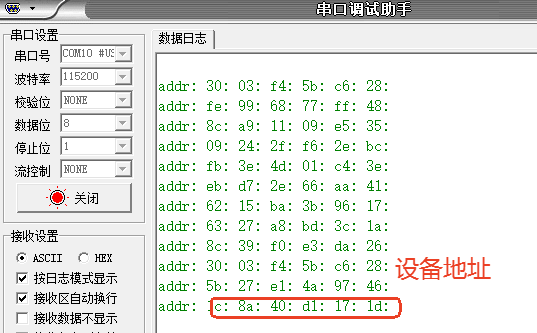

### 透传

通过以上server端和client端设备的初始化，我们可以将两个3863模组进行连接。

#### 连接串口

使用两根USB-C数据线分别连接两个开发板，并连接在电脑上，在设备管理器中查看两个设备的端口号：

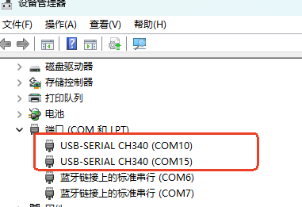

#### 开启串口

打开两个串口助手，并复位开发板，等待两个设备连接成功：

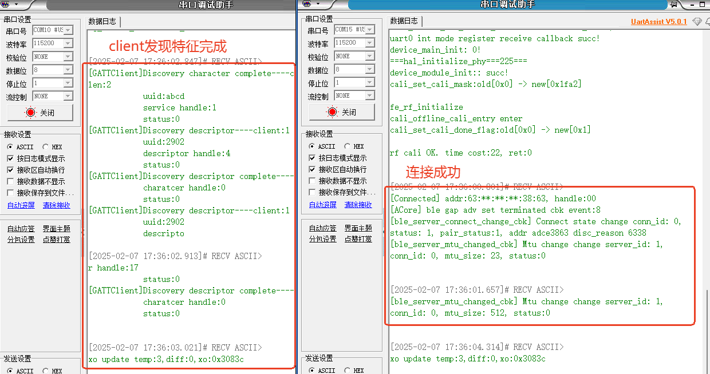

#### 发送数据

连接成功后，即可互相发送数据，此实验一次最大可发送512字节数据：

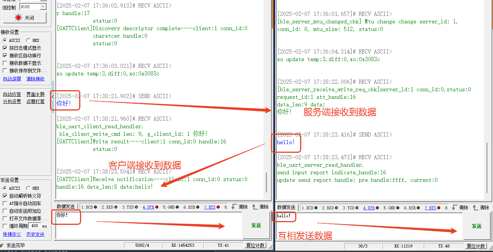

# SLE通信

## SLE基础

### SLE简介

星闪（NearLink）是全栈原创的新一代无线短距通信技术，相关标准由星闪联盟负责制定。面向万物互联时代，星闪引入关键技术和创新理念，赋予智能终端新的连接方式。与传统短距传输技术方案相比，星闪在功耗、速度、覆盖范围和连接性能全面领先，可以在智能终端、智能家居、智能汽车、智能制造等各类细分场景下实现更极致的用户体验。

### 星闪无线通信系统

星闪无线通信系统由星闪接入层、基础服务层以及基础应用层三部分构成，其中，星闪接入层也可被称为星闪底层，基础服务层和基础应用层构成了星闪上层。星闪接入层根据实现功能的不同分为管理节点（G节点）和终端节点（T节点），其中G节点为其 覆盖下的T节点提供连接管理、资源分配、信息安全等接入层服务。目前星闪接入层为星闪上层提供SLB和SLE两种通信接口：

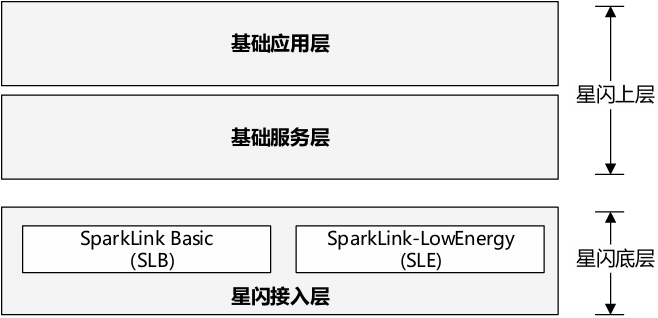

SLB 采用超短帧、多点同步、双向认证、快速干扰协调、双向认证加密、跨层调度优化等多项技术，用于支持具有低时延(20us)、高可靠、精同步、高并发和高安全等传输需求的业务场景。性能指标如下图：

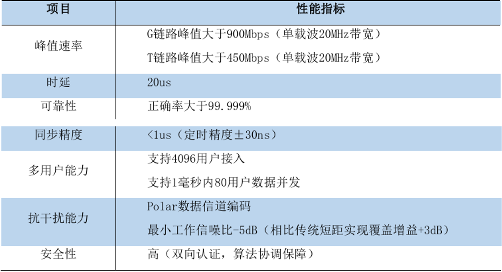

SLE采用Polar信道编码提升传输可靠性，减少重传节省功耗，同时支持最大4MHz传输带宽、最大8PSK调制，支持1对多可靠组播，支持4KHz短时延交互，安全配对，隐私保护等特性，在尽可能保证传输效率的同时，充分考虑了节能因素，用于承载具有低功耗诉求的业务场景。性能指标如下图：


SLB和SLE面向不同业务诉求，提供不同的 传输服务，两者相互补充并且根据业务需求进行持续平滑演进。

### 星闪技术系统架构

星闪无线通信系统针对不同的星闪底层接入技术采用了统一的星闪上层架构。星闪上层由基础服务层和基础应用层构成。其中，基础服务层针对上层业务数据，提供了设备发现、服务管理、连接管理、QoS管理、测量管理、数据传输与适配、信息安全、多域管理与协调以及5G融合等服务功能，用于支撑上层具体业务的从业务触发到业务结束的整个业务周期的连接交互需求。

星闪无线通信系统的整体系统架构如下图所示：

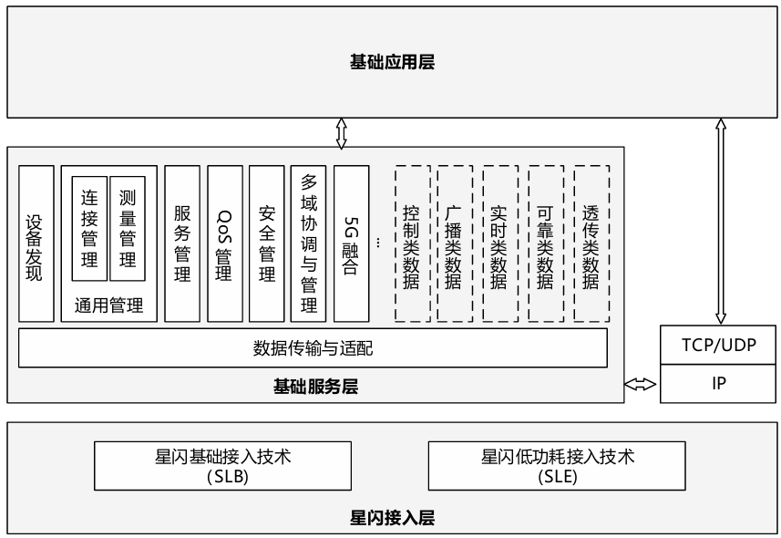

星闪接入层：由星闪基础接入技术SLB和星闪低功耗接入技术SLE两种通信接口组成。星闪接入层为星闪上层提供的SLB和SLE两种通信接口，并为上层提供了相应的接入层安全机制。SLB信息安全定义了星闪设备间SLB安全通信所需的信息安全特征，如认证凭证配置、认证和安全参数协商、空口通信安全保护、密码算法等，提供了强认证鉴权和高信息安全的传输安全保护。SLE信息安全定义了星闪设备间SLE安全通信所需的信息安全特征，如配对和鉴权管理、安全控制、隐私管理、密码算法等，提供了数字比较、免输入、通行码输入、口令验证、带外方式和预配置密钥PSK等6种配对和鉴权方式。

基础服务层：由一系列基础功能单元构成，星闪无线通信系统通过调用不同功能单元实现对于上层应用功能以及系统管理维护的支持。

以上内容来源：星闪无线短距通信技术（SparkLink 1.0）

## SLE透传实验

### SLE透传之SERVER端

#### 实验目的

1.  熟悉如何使用Hispark Studio。

2.  熟悉LiteOS系统的编译流程和设计步骤，能够进行设计、编程、调试。

3.  检测搭建的软件及硬件环境是否可正常使用。

4.  学会Ws63的SLE通信流程。

#### 实验要求

在Ws63模块内，将UART0配置为中断接收，开启SLE功能，将设备配置为server模式，并开启广播，通过串口可向从机发送数据。

#### 实验环境

硬件环境：FS_Ws63开发板、USB线。

软件环境：Windows系统、Hispark Studio。

源码位置：【vendor\Hqyj_Ws63\Farsight\sle_01_trans_server】

#### 实验原理

SLE（SparkLink Low Energy，星闪低功耗接入技术）是星闪（SparkLink）技术的重要组成部分，主要面向低功耗、低时延的应用场景。本实验通过SLE的server端与client连接进行设备间的无线透传。

#### 实验代码

1.  实验源码目录：【fbb_ws63\vendor\Hqyj_Ws63\Farsight\sle_01_trans_server】。

    注意：下面显示出主要代码，其余的请查看源码。

2.  目录下sle_server.c文件用于存放用户代码；CMakeLists.txt文件用于指定源文件和头文件的路径。

3.  在目录下sle_server.c文件中编写驱动程序：

初始化UART0为中断接收模式，通过串口接收外部数据进行发送：

```
/* 串口初始化配置*/
void app_uart_init_config(void)
{
    uart_buffer_config_t uart_buffer_config;
    uapi_pin_set_mode(CONFIG_UART_TXD_PIN, CONFIG_UART_PIN_MODE);
    uapi_pin_set_mode(CONFIG_UART_RXD_PIN, CONFIG_UART_PIN_MODE);
    uart_attr_t attr = {
        .baud_rate = 115200,
        .data_bits = UART_DATA_BIT_8,
        .stop_bits = UART_STOP_BIT_1,
        .parity = UART_PARITY_NONE
        };
    uart_buffer_config.rx_buffer_size = UART_RX_MAX;
    uart_buffer_config.rx_buffer = uart_rx_buffer;
    uart_pin_config_t pin_config = {
        .tx_pin = S_MGPIO0, 
        .rx_pin = S_MGPIO1, 
        .cts_pin = PIN_NONE, 
        .rts_pin = PIN_NONE
        };
    uapi_uart_deinit(CONFIG_UART_ID);
    int res = uapi_uart_init(CONFIG_UART_ID, &pin_config, &attr, NULL, &uart_buffer_config);
    if (res != 0) {
        printf("uart init failed res = %02x\r\n", res);
    }
     if (uapi_uart_register_rx_callback(CONFIG_UART_ID, UART_RX_CONDITION_MASK_IDLE, 1, sle_uart_server_read_handler) == ERRCODE_SUCC) {
        printf("uart%d int mode register receive callback succ!\r\n", CONFIG_UART_ID);
    }
}
```

定义设备广播名称，广播名称需要和client扫描目标名称一致：

```
/* 广播名称 */
static uint8_t sle_local_name[NAME_MAX_LENGTH] = "sle_uart_server";
static uint16_t sle_set_adv_local_name(uint8_t *adv_data, uint16_t max_len)
{
    errno_t ret;
    uint8_t index = 0;

    uint8_t *local_name = sle_local_name;
    uint8_t local_name_len = sizeof(sle_local_name) - 1;
    printf("[%s] local_name_len = %d\r\n", __FUNCTION__, local_name_len);
    printf("[%s] local_name: ", __FUNCTION__);
    for (uint8_t i = 0; i < local_name_len; i++) {
        printf("0x%02x ", local_name[i]);
    }
    printf("\r\n");
    adv_data[index++] = local_name_len + 1;
    adv_data[index++] = SLE_ADV_DATA_TYPE_COMPLETE_LOCAL_NAME;
    ret = memcpy_s(&adv_data[index], max_len - index, local_name, local_name_len);
    if (ret != EOK) {
        printf("[%s] memcpy fail\r\n", __FUNCTION__);
        return 0;
    }
    return (uint16_t)index + local_name_len;
}
```

开启SLE功能，并将设备初始化为server端，开启广播：

```
/* 初始化uuid server */
errcode_t sle_server_init(void)
{
    errcode_t ret;
    /* 使能SLE */
    if (enable_sle() != ERRCODE_SUCC) {
        PRINT("[%s] sle enbale fail !\r\n",__FUNCTION__);
        return -1;
    }
    /* 注册连接管理回调函数 */
    ret = sle_conn_register_cbks();
    if (ret != ERRCODE_SLE_SUCCESS) {
        printf("[%s] sle_conn_register_cbks fail :%x\r\n", __FUNCTION__, ret);
        return ret;
    }
     /* 注册 SSAP server 回调函数 */
    ret = sle_ssaps_register_cbks();
    if (ret != ERRCODE_SLE_SUCCESS) {
        printf("[%s] sle_ssaps_register_cbks fail :%x\r\n", __FUNCTION__, ret);
        return ret;
    }
    /* 注册Server, 添加Service和property, 启动Service */
    ret = sle_server_add();
    if (ret != ERRCODE_SLE_SUCCESS) {
        printf("[%s] sle_server_add fail :%x\r\n", __FUNCTION__, ret);
        return ret;
    }
    ssap_exchange_info_t parameter = { 0 };
    parameter.mtu_size = SLE_MTU_SIZE_DEFAULT;
    parameter.version = 1;
    ssaps_set_info(g_server_id, &parameter);
    /* 设置设备公开，并公开设备 */
    ret = sle_uart_server_adv_init();
    if (ret != ERRCODE_SLE_SUCCESS) {
        printf("[%s] sle_server_adv_init fail :%x\r\n", __FUNCTION__, ret);
        return ret;
    }
    printf("[%s] init ok\r\n", __FUNCTION__);
    return ERRCODE_SLE_SUCCESS;
}
```

4.  目录下CMakeLists.txt文件用来指定组件的相关源文件和头文件路径。

SOURCES：当前组件的源文件，其中CMAKE_CURRENT_SOURCE_DIR变量标识当前CMakeLists.txt所在的路径。

```
set(SOURCES_LIST
    ${CMAKE_CURRENT_SOURCE_DIR}/sle_server.c
    ${CMAKE_CURRENT_SOURCE_DIR}/sle_server_adv.c
)
set(SOURCES "${SOURCES}" ${SOURCES_LIST} PARENT_SCOPE)
```

#### 编译烧录

1.  点击系统配置选项：


2.  选中相对应的案例：


3.  点击全编译按钮进行编译：


4.  编译完成后，使用USB线连接开发板，点击烧录按钮烧录程序：


#### 实验现象

重启Ws63开发板，可以在串口调试助手看到设备初始化的打印信息：

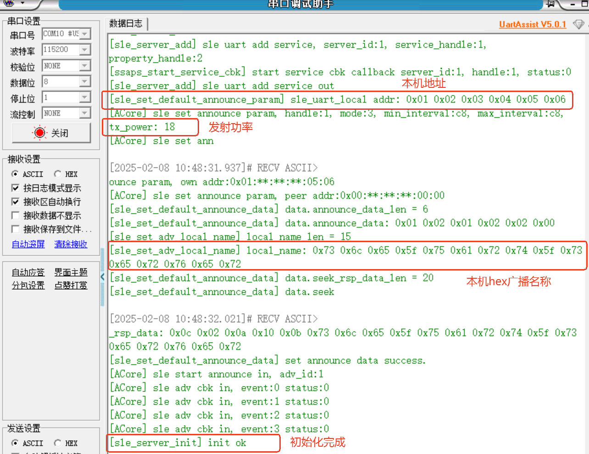

### SLE透传之CLIENT端

#### 实验目的

1.  熟悉如何使用Hispark Studio。

2.  熟悉LiteOS系统的编译流程和设计步骤，能够进行设计、编程、调试。

3.  检测搭建的软件及硬件环境是否可正常使用。

4.  学会Ws63的SLE通信流程。

#### 实验要求

在Ws63模块内，将UART0配置为中断接收，开启SLE功能，将设备配置为client模式，并开启扫描，通过串口可向主机发送数据。

#### 实验环境

硬件环境：FS_Ws63开发板、USB线。

软件环境：Windows系统、Hispark Studio。

源码位置：【vendor\Hqyj_Ws63\Farsight\sle_02_trans_client】

#### 实验原理

SLE（SparkLink Low Energy，星闪低功耗接入技术）是星闪（SparkLink）技术的重要组成部分，主要面向低功耗、低时延的应用场景。本实验通过SLE的server端与client连接进行设备间的无线透传。

#### 实验代码

1.  实验源码目录：【fbb_ws63\vendor\Hqyj_Ws63\Farsight\sle_01_trans_server】。

    注意：下面显示出主要代码，其余的请查看源码。

2.  目录下sle_client.c文件用于存放用户代码；CMakeLists.txt文件用于指定源文件和头文件的路径。

3.  在目录下sle_client.c文件中编写驱动程序：

初始化UART0为中断接收模式，通过串口接收外部数据进行发送：

```
/* 串口初始化配置*/
void app_uart_init_config(void)
{
    uart_buffer_config_t uart_buffer_config;
    uapi_pin_set_mode(CONFIG_UART_TXD_PIN, CONFIG_UART_PIN_MODE);
    uapi_pin_set_mode(CONFIG_UART_RXD_PIN, CONFIG_UART_PIN_MODE);
    uart_attr_t attr = {
        .baud_rate = 115200,
        .data_bits = UART_DATA_BIT_8,
        .stop_bits = UART_STOP_BIT_1,
        .parity = UART_PARITY_NONE
        };
    uart_buffer_config.rx_buffer_size = UART_RX_MAX;
    uart_buffer_config.rx_buffer = uart_rx_buffer;
    uart_pin_config_t pin_config = {
        .tx_pin = S_MGPIO0, 
        .rx_pin = S_MGPIO1, 
        .cts_pin = PIN_NONE, 
        .rts_pin = PIN_NONE
        };
    uapi_uart_deinit(CONFIG_UART_ID);
    int res = uapi_uart_init(CONFIG_UART_ID, &pin_config, &attr, NULL, &uart_buffer_config);
    if (res != 0) {
        printf("uart init failed res = %02x\r\n", res);
    }
     if (uapi_uart_register_rx_callback(CONFIG_UART_ID, UART_RX_CONDITION_MASK_IDLE, 1, sle_uart_server_read_handler) == ERRCODE_SUCC) {
        printf("uart%d int mode register receive callback succ!\r\n", CONFIG_UART_ID);
    }
}
```

定义扫描指定设备名称，扫描名称需要和server端广播名称一致：

| \#define SLE_SERVER_NAME "sle_test" |
| ----------------------------------- |

注册相关功能回调函数，开启SLE功能，并将设备初始化为client端，开启扫描模式：

```
void sle_client_init(void)
{
    printf("sle enable.\r\n");
    sle_client_sample_seek_cbk_register();
    sle_client_sample_connect_cbk_register();
    sle_client_sample_ssapc_cbk_register();
    if (enable_sle() != ERRCODE_SUCC) {
        printf("sle enbale fail !\r\n");
    }
}
```

在扫描过程中，通过回调函数可以得到扫描返回数据，通过比对设备名称进行连接配对：

```
/* 返回扫描结果回调 */
static void sle_client_sample_seek_result_info_cbk(sle_seek_result_info_t *seek_result_data)
{
    printf("[seek_result_info_cbk] scan data : ");//打印扫描到的设备名称 hex
    for(uint8_t i=0;i<seek_result_data->data_length;i++){
        printf("0x%X ", seek_result_data->data[i]);
    }
    printf("\r\n");
    if (seek_result_data == NULL) {
        printf("status error\r\n");
//名称对比成功
    } else if (strstr((const char *)seek_result_data->data, SLE_UART_SERVER_NAME) != NULL) {
        memcpy_s(&g_sle_remote_addr, sizeof(sle_addr_t), &seek_result_data->addr, sizeof(sle_addr_t));//扫描到目标设备，将目标设备的名字拷贝到g_sle_remote_addr
        sle_stop_seek();//停止扫描
    }
}
/* 扫描关闭回调函数 */
static void sle_client_sample_seek_disable_cbk(errcode_t status)
{
    if (status != 0) {
        printf("[%s] status error = %x\r\n", __FUNCTION__, status);
    } else {
        sle_remove_paired_remote_device(&g_sle_remote_addr);//关闭扫描后，先删除之前的配对
        sle_connect_remote_device(&g_sle_remote_addr);//发送连接请求
    }
}
```

4.  目录下CMakeLists.txt文件用来指定组件的相关源文件和头文件路径。

SOURCES：当前组件的源文件，其中CMAKE_CURRENT_SOURCE_DIR变量标识当前CMakeLists.txt所在的路径。

```
set(SOURCES_LIST
    ${CMAKE_CURRENT_SOURCE_DIR}/sle_client.c
)
set(SOURCES "${SOURCES}" ${SOURCES_LIST} PARENT_SCOPE)
```

#### 编译烧录

1.  点击系统配置选项：


2.  选中相对应的案例：


3.  点击全编译按钮进行编译：


4.  编译完成后，使用USB线连接开发板，点击烧录按钮烧录程序：


#### 实验现象

重启Ws63开发板，打开串口调试助手，可以看到client端开始扫描周围的sle设备，通过设备名称的筛选进行连接配对。

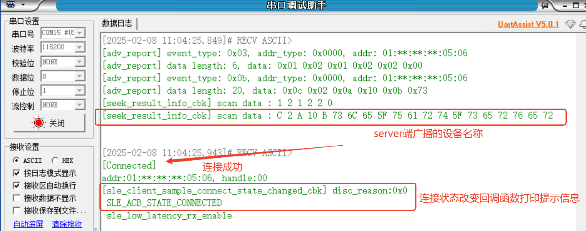

### 透传

通过以上server端和client端设备的初始化，我们可以将两个3863模组进行连接。

#### 连接串口

使用两根USB-C数据线分别连接两个开发板，并连接在电脑上，在设备管理器中查看两个设备的端口号：


#### 开启串口

打开两个串口助手，并复位开发板，等待两个设备连接成功：

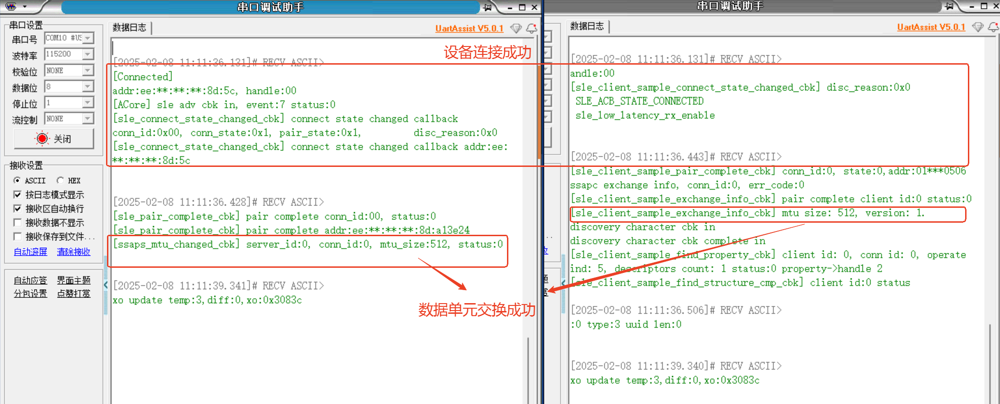

#### 发送数据

连接成功后，即可互相发送数据，此实验一次最大可发送512字节数据：

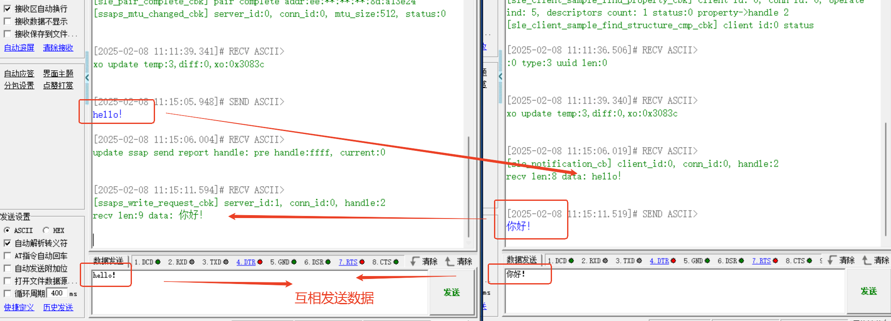
