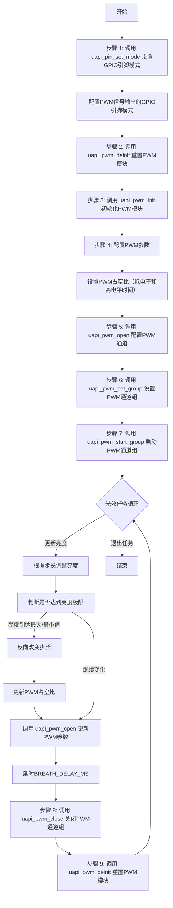

# 硬件 pwm

## 案例提供者

[@ dt-sir}](https://github.com/DtSir700)

## 案例设计

本案例旨在帮助开发者了解如何使用硬件PWM(脉宽调制)功能

### 硬件参考资料

- [HiHope ws63开发板](https://gitee.com/hihopeorg_group/near-link/blob/master/NearLink_Pi_IOT/%E6%98%9F%E9%97%AA%E6%B4%BE%E7%89%A9%E8%81%94%E7%BD%91%E5%BC%80%E5%8F%91%E5%A5%97%E4%BB%B6%E4%BD%BF%E7%94%A8%E8%AF%B4%E6%98%8E%E4%B9%A6_V1.1.pdf)

- [HiHope ws63开发板原理图](https://gitee.com/hihopeorg_group/near-link/blob/master/NearLink_DK_WS63E/NearLink_DK_WS63E%E5%BC%80%E5%8F%91%E6%9D%BF%E5%8E%9F%E7%90%86%E5%9B%BE.pdf)

### 软件参考资料

- [HiHope ws63开发板驱动开发指南](../../../docs/board/WS63V100%20%E8%AE%BE%E5%A4%87%E9%A9%B1%E5%8A%A8%20%E5%BC%80%E5%8F%91%E6%8C%87%E5%8D%97_02.pdf)

  - 参考文档路径: docs/board/WS63V100 设备驱动 开发指南_02.pdf
  - 参考章节: 1.Pinctrl 8.PWM 12.TCXO

- [HiHope ws63开发板IO复用关系表](../../../docs/board/IO复用关系.md)

### 参考头文件

- [pinctrl.h](../../../src/include/driver/pinctrl.h)

- [pwm.h](../../../src/include/driver/pwm.h)

- [tcxo.h](../../../src/include/driver/tcxo.h)

## 实验平台

`HiHope_NearLink_DK_WS63_V03` 开发板

## 实验目的

本实验旨在通过HiHope_NearLink_DK_WS63_V03开发板，帮助开发者掌握硬件PWM即脉宽调制的基本功能和使用方法。具体目标包括：

1. **PWM基本原理与应用**：学习如何通过PWM信号控制LED的亮度变化，掌握PWM控制的基础知识，包括占空比的调整和亮度的渐变效果。
2. **PWM模块的初始化与配置**：理解PWM模块的初始化过程，掌握如何通过接口配置PWM通道、设置引脚模式和控制PWM的输出。
3. **PWM呼吸灯效果的实现**：通过调节PWM的占空比，实现LED的呼吸灯效果，理解如何利用PWM生成周期性的亮度变化，并控制LED的渐变效果。
4. **多线程任务管理**：通过RTOS任务管理，学习如何在多线程环境下执行PWM控制任务，掌握如何创建、调度和管理光效任务。

## 实验原理

### **PWM概述**

- PWM通道数量：

  ：开发板提供8个PWM通道数量(PWM0 ~ PWM7)

- PWM通道GPIO口复用情况：

    从  GPIO_00 ~ GPIO_07 分别对应 PWM0 ~ PWM7
    再从 GPIO_08 ~ GPIO_12 分别对应 PWM0 ~ PWM4
    其他GPIO口不具备PWM功能

- 功能：

  - 支持 8 路 PWM 输出，寄存器单独可配置。
  - 支持 0 电平宽度和 1 电平宽度可调。 
  - 支持固定周期数发送模式。 
  - 支持发送完成中断，支持中断清除和中断查询。 

### API 讲解

1. **`uapi_pwm_init`**
   - **功能**：初始化PWM。
   - **参数**：无
   - **返回值**：成功返回 `ERRCODE_SUCC`，失败返回其他错误码，参考 errcode_t 中的错误码。

2. **`uapi_pwm_deinit`**
   - **功能**：去初始化PWM，即重置。
   - **参数**：无
   - **返回值**：无，函数没有返回值。

3. **`uapi_pwm_open`**
   - **功能**：打开指定配置的PWM通道。
   - **参数**：
     - `channel`：需要使用的PWM通道，参考 pwm_channel_t。
     - `cfg`：需要设置的PWM设备配置，参考 pwm_config_t。
   - **返回值**：成功返回 `ERRCODE_SUCC`，失败返回其他错误码，参考 errcode_t 中的错误码。

4. **`uapi_pwm_close`**
   - **功能**：关闭指定的PWM通道。
   - **参数**：
     - `channel`：需要关闭的PWM通道，参考 pwm_channel_t。
   - **返回值**：成功返回 `ERRCODE_SUCC`，失败返回其他错误码，参考 errcode_t 中的错误码。

5. **`uapi_pwm_start`**
   - **功能**：启动指定的PWM通道。
   - **参数**：
     - `channel`：需要启动的PWM通道，参考 pwm_channel_t。
   - **返回值**：成功返回 `ERRCODE_SUCC`，失败返回其他错误码，参考 errcode_t 中的错误码。

6. **`uapi_pwm_get_frequency`**
   - **功能**：获取PWM通道的工作频率。
   - **参数**：
     - `channel`：需要查询的PWM通道，参考 pwm_channel_t。
   - **返回值**：返回PWM的工作频率，单位为Hz。

7. **`uapi_pwm_stop`**(仅在 CONFIG_PWM_USING_V150 中定义)
   - **功能**：停止指定的PWM通道。
   - **参数**：
    - `channel`：需要停止的PWM通道，参考 pwm_channel_t。
   - **返回值**：成功返回 `ERRCODE_SUCC`，失败返回其他错误码，参考 errcode_t 中的错误码。

8. **`uapi_pwm_update_duty_ratio`**(仅在 CONFIG_PWM_USING_V150 中定义)
   - **功能**：更新已打开PWM通道的占空比。
   - **参数**：
     - `channel`：需要更新占空比的PWM通道，参考 pwm_channel_t。
     - `low_time`：PWM周期中的低电平部分时间，单位为PWM工作时钟周期，频率参考 uapi_pwm_get_frequency()。
     - `high_time`：PWM周期中的高电平部分时间，单位为PWM工作时钟周期，频率参考 uapi_pwm_get_frequency()。
   - **返回值**：成功返回 `ERRCODE_SUCC`，失败返回其他错误码，参考 errcode_t 中的错误码。

9. **`uapi_pwm_isr`**
   - **功能**：PWM中断服务例程。
   - **参数**：
     - `channel`：需要使用的PWM通道，参考 pwm_channel_t。
   - **返回值**：成功返回 `ERRCODE_SUCC`，失败返回其他错误码，参考 errcode_t 中的错误码。

10. **`uapi_pwm_register_interrupt`**
   - **功能**：为PWM通道注册中断回调函数。
   - **参数**：
     - `channel`：需要使用的PWM通道，参考 pwm_channel_t。
     - `callback`：需要注册的回调函数。
   - **返回值**：成功返回 `ERRCODE_SUCC`，失败返回其他错误码，参考 errcode_t 中的错误码。

11. **`uapi_pwm_unregister_interrupt`**
   - **功能**：注销PWM通道的中断回调函数。
   - **参数**：
     - `channel`：需要注销中断回调的PWM通道，参考 pwm_channel_t。
   - **返回值**：成功返回 `ERRCODE_SUCC`，失败返回其他错误码，参考 errcode_t 中的错误码。

12. **`uapi_pwm_set_group`**(仅在 CONFIG_PWM_USING_V151 中定义)
   - **功能**：将多个PWM通道分组为一个组。
   - **参数**：
     - `group`：PWM组的ID，范围从0 到 CONFIG_PWM_GROUP_NUM。
     - `channel_set`：需要分组的PWM通道集合。
     - `channel_set_len`：PWM通道集合的长度。
   - **返回值**：成功返回 `ERRCODE_SUCC`，失败返回其他错误码，参考 errcode_t 中的错误码。

13. **`uapi_pwm_clear_group`**(仅在 CONFIG_PWM_USING_V151 中定义)
   - **功能**：清理指定PWM组的通道。
   - **参数**：
     - `group`：需要清理的PWM组ID，范围从0 到 CONFIG_PWM_GROUP_NUM。
   - **返回值**：成功返回 `ERRCODE_SUCC`，失败返回其他错误码，参考 errcode_t 中的错误码。

14. **`uapi_pwm_start_group`**(仅在 CONFIG_PWM_USING_V151 中定义)
   - **功能**：启动指定PWM组的所有通道。
   - **参数**：
     - `group`：需要启动的PWM组ID，范围从0 到 CONFIG_PWM_GROUP_NUM。
   - **返回值**：成功返回 `ERRCODE_SUCC`，失败返回其他错误码，参考 errcode_t 中的错误码。

15. **`uapi_pwm_stop_group`**(仅在 CONFIG_PWM_USING_V151 中定义)
   - **功能**：停止指定PWM组的所有通道。
   - **参数**：
     - `group`：需要停止的PWM组ID，范围从0 到 CONFIG_PWM_GROUP_NUM。
   - **返回值**：成功返回 `ERRCODE_SUCC`，失败返回其他错误码，参考 errcode_t 中的错误码。

16. **`uapi_pin_set_mode`**
   - **功能**：设置引脚的复用模式。
   - **参数**：
     - `pin`：指定的IO引脚，参考 pin_t 类型，表示具体的引脚编号或配置。
     - `mode`：引脚的复用模式，参考 pin_mode_t 类型，表示该引脚的复用配置（例如输入、输出、PWM、ADC等模式）。
   - **返回值**：成功返回 `ERRCODE_SUCC`，失败返回其他错误码，参考 errcode_t 中的错误码。

17. **`uapi_tcxo_delay_ms`**
   - **功能**：设置延迟时间（毫秒）。
   - **参数**：
     - `m_delay`：延迟的毫秒数，指定程序暂停的时间。
   - **返回值**：成功返回 `ERRCODE_SUCC`，失败返回其他错误码，参考 errcode_t 中的错误码。

---

### api使用流程图（Mermaid）



---

### 流程图说明

- **步骤 1**：调用 `uapi_pin_set_mode` 接口，设置GPIO引脚模式，为PWM信号输出做准备。
- **步骤 2**：调用 `uapi_pwm_deinit` 接口，重置PWM模块，清除之前的PWM配置。
- **步骤 3**：调用 `uapi_pwm_init` 接口，初始化PWM模块。
- **步骤 4**：配置PWM参数，设置PWM信号的低电平时间和高电平时间，控制LED亮度的变化。
- **步骤 5**：调用 `uapi_pwm_open` 接口，打开PWM通道并应用配置的PWM参数。
- **步骤 6**：调用 `uapi_pwm_set_group` 接口，将PWM通道设置为某个通道组。
- **步骤 7**：调用 `uapi_pwm_start_group` 接口，启动PWM通道组，开始PWM信号的输出。
- 光效任务循环：
  - 更新亮度：根据步长调整LED亮度，在最大亮度和最小亮度之间循环。
  - 判断亮度极限：当亮度达到最大值或最小值时，反向改变步长，使亮度逐步增减，形成渐变效果。
  - 延时：使用 BREATH_DELAY_MS 延时，以模拟亮度的平滑过渡。
- **步骤 8**：调用 `uapi_pwm_close` 接口，关闭PWM通道组，停止PWM信号输出。
- **步骤 9**：调用 `uapi_pwm_deinit` 接口，重置PWM模块，确保任务退出时关闭PWM资源。

## PWM配置注意事项

### PWM接口调用顺序

- 在调用 `uapi_pwm_deinit` 接口之前，必须先调用 `uapi_pwm_close` 接口，以确保PWM通道正确关闭并释放相关资源。

### PWM操作限制

- **中断中操作限制**：在调用 `uapi_pwm_stop` 或 `uapi_pwm_close` 时，不支持在中断中调用，以避免在中断处理过程中发生错误。
- **占空比限制**：PWM 不支持占空比为0，因此设置占空比时需要确保其大于0。
- **互补输出限制**：PWM 不支持多路互补输出，请避免在使用多路PWM时将其配置为互补输出。

### 深睡唤醒后的PWM配置

- 在深度睡眠唤醒后，需要先配置复用关系，然后调用 `uapi_pwm_deinit` 接口进行初始化，再调用 `uapi_pwm_init` 接口重新初始化PWM模块。

## 实验步骤

### 安装例程程序

在Hispark Studio中将本例程的代码放置到之前创建好的demo文件夹下面[//src/application/samples/demo/pwm_blinky.c](../../../src/application/samples/demo/pwm_blinky.c)

然后按照正常的改写CMakeLists.txt，并编译烧录即可

### 例程代码

[pwm_blinky.c](./pwm_blinky.c)

```c
/**
 * Copyright (c) dt-sir
 *
 * Description: Blinky with PWM Sample Source. \n
 *              This file implements a LED blinking example using function of PWM. \n
 *              Using PWM to control the average current size by periodically and quickly adjusting the duty cycle of the LED power-on time. \n
 *              So as to form a brightness gradient effect under the temporary effect of human vision. \n
 *
 * History: \n
 * 2025-02-19, Create file. \n
 */

#include "cmsis_os2.h"           // 引入CMSIS RTOS2库，用于多线程处理
#include "app_init.h"            // 引入应用初始化的头文件
#include "pinctrl.h"             // 引入引脚控制头文件
#include "tcxo.h"                // 引入TCXO相关头文件
#include "pwm.h"                 // 引入PWM控制头文件

#define LIGHT_TASK_STACK_SIZE 0x1000        // 定义光效任务的栈大小
#define LIGHT_TASK_PRIO (osPriority_t)(17)  // 定义光效任务的优先级
#define BREATH_MAX_BRIGHTNESS 300           // 定义呼吸灯的最大亮度
#define BREATH_MIN_BRIGHTNESS 50            // 定义呼吸灯的最小亮度
#define BREATH_STEP 10                      // 定义每次亮度变化的步长
#define BREATH_DELAY_MS 50                  // 定义亮度变化的延迟时间
#define PWM_GPIO 7                          // 定义PWM信号的GPIO引脚
#define PWM_PIN_MODE 1                      // 定义引脚模式为
#define PWM_CHANNEL 7                       // 定义PWM使用的通道
#define PWM_GROUP_ID 0                      // 定义PWM组的ID

// 定义光效任务函数
static void *light_task(const char *arg)
{
    UNUSED(arg);  // 防止编译器警告，未使用的参数

    // 初始化亮度、步长等参数
    int brightness = BREATH_MIN_BRIGHTNESS;                 // 亮度从最小值开始
    int step = BREATH_STEP;                                 // 步长设为10
    
    pwm_config_t cfg_repeat = {50, 300, 0, 0, true};        // 配置PWM参数
    
    uapi_pin_set_mode(PWM_GPIO, PWM_PIN_MODE);              // 配置指定GPIO引脚的模式

    // 循环执行PWM呼吸灯效果
    while (1)
    {
        uapi_pwm_deinit();  // 重置PWM
        uapi_pwm_init();    // 初始化PWM模块

        // 配置PWM占空比
        cfg_repeat.low_time = brightness;                           // 设置低电平持续时间
        cfg_repeat.high_time = BREATH_MAX_BRIGHTNESS - brightness;  // 设置高电平持续时间
        uapi_pwm_open(PWM_CHANNEL, &cfg_repeat);                    // 打开PWM通道并配置参数

        uint8_t channel_id = PWM_CHANNEL;
        uapi_pwm_set_group(PWM_GROUP_ID, &channel_id, 1);   // 设置 PWM 通道组
        uapi_pwm_start_group(PWM_GROUP_ID);                 // 启动 PWM 通道组

        // 更新亮度值，逐步增加或减少
        brightness += step;

        // 判断是否达到亮度极限，反向改变步长
        if (brightness >= BREATH_MAX_BRIGHTNESS || brightness <= BREATH_MIN_BRIGHTNESS)
        {
            step = -step;  // 反向变化亮度
        }

        uapi_tcxo_delay_ms((uint32_t)BREATH_DELAY_MS);      // 延迟指定的时间，模拟呼吸灯的渐变效果
        uapi_pwm_close(PWM_GROUP_ID);                       // 关闭PWM通道组
        uapi_pwm_deinit();                                  // 重置PWM
    }

    uapi_pwm_close(PWM_GROUP_ID);                           // 确保退出时关闭PWM通道组
    uapi_pwm_deinit();                                      // 重置PWM
    
    return NULL;
}

// 启动 PWM 呼吸灯任务的入口函数
static void pwm_breathing_light_entry(void)
{
    osThreadAttr_t attr;                        // 定义线程属性结构体
    attr.name = "PWM_Breathing_light_Task";     // 设置线程名称
    attr.attr_bits = 0U;                        // 设置线程属性位，0表示无特殊属性
    attr.cb_mem = NULL;                         // 设置线程控制块内存为NULL
    attr.cb_size = 0U;                          // 设置线程控制块大小为0
    attr.stack_mem = NULL;                      // 设置线程栈内存为NULL
    attr.stack_size = LIGHT_TASK_STACK_SIZE;    // 设置线程栈大小
    attr.priority = LIGHT_TASK_PRIO;            // 设置线程优先级

    // 创建PWM呼吸灯任务
    if (osThreadNew((osThreadFunc_t)light_task, NULL, &attr) == NULL)
    {
        printf("Error: Failed to create PWM Breathing Light Task.\n");  // 如果创建任务失败输出错误信息
    }
}

// 应用启动函数
app_run(pwm_breathing_light_entry);
```

### 例程讲解

- **`light_task`**：通过控制PWM信号的亮度变化，创建一个循环的呼吸灯效果，使LED灯在指定亮度范围内逐渐增亮和变暗。

- **`pwm_breathing_light_entry`**：PWM控制呼吸灯任务的入口函数，创建任务调度并运行任务入口函数。

## 实验结果

红色LED灯随着时间逐渐变亮再变暗，实现了pwm控制LED的呼吸灯效果。