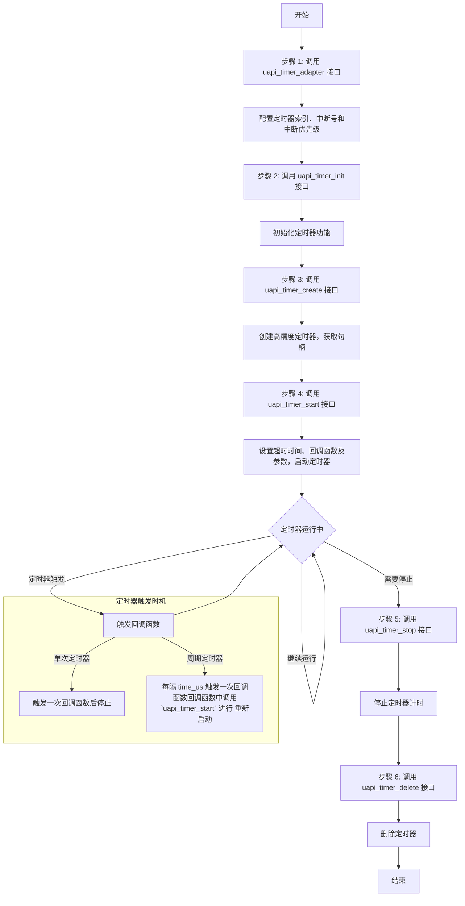

# 硬件 timer

## 案例提供者

[@ sanchuanhehe](https://github.com/sanchuanhehe)

## 案例设计

本案例旨在帮助开发者了解如何使用硬件定时器功能

### 硬件参考资料

- [HiHope ws63开发板](https://gitee.com/hihopeorg_group/near-link/blob/master/NearLink_Pi_IOT/%E6%98%9F%E9%97%AA%E6%B4%BE%E7%89%A9%E8%81%94%E7%BD%91%E5%BC%80%E5%8F%91%E5%A5%97%E4%BB%B6%E4%BD%BF%E7%94%A8%E8%AF%B4%E6%98%8E%E4%B9%A6_V1.1.pdf)

- [HiHope ws63开发板原理图](https://gitee.com/hihopeorg_group/near-link/blob/master/NearLink_DK_WS63E/NearLink_DK_WS63E%E5%BC%80%E5%8F%91%E6%9D%BF%E5%8E%9F%E7%90%86%E5%9B%BE.pdf)

### 软件参考资料

- [HiHope ws63开发板驱动开发指南](../../../../docs/board/WS63V100%20%E8%AE%BE%E5%A4%87%E9%A9%B1%E5%8A%A8%20%E5%BC%80%E5%8F%91%E6%8C%87%E5%8D%97_02.pdf)

  - 参考文档路径: docs/board/WS63V100 设备驱动 开发指南_02.pdf
  - 参考章节: 2.GPIO 10.Timer

### 参考头文件

- [timer_porting.h](../../../../src/drivers/chips/ws63/rom/drivers/chips/ws63/porting/timer/timer_porting.h)

- [timer.h](../../../../src/include/driver/timer.h)

## 实验平台

`HiHope_NearLink_DK_WS63E_V03` 开发板

## 实验目的

本实验旨在通过HiHope_NearLink_DK_WS63E_V03开发板，帮助开发者掌握硬件定时器的基本功能和使用方法。具体目标包括：

1. **软件定时器的创建与启动**：学习如何通过uapi层接口创建和启动软件定时器，理解定时器的基本工作原理。
2. **单次软件定时器的使用**：掌握单次软件定时器的配置与触发机制，理解其在特定时间点触发一次事件的应用场景。
3. **周期软件定时器的使用**：学习如何配置和使用周期软件定时器，理解其周期性触发事件的特性，并掌握如何手动停止定时器或通过其他软件条件终止其运行。
4. **定时器事件的处理**：通过实验，熟悉定时器事件的触发与处理流程，掌握在实际应用中如何利用定时器实现时间相关的功能。

## 实验原理

### **定时器模块概述**

- 定时器数量

  ：开发板提供3个定时器（Timer0～Timer2）。

  - **Timer0**：用于支撑系统时钟，禁止使用 `uapi` 接口配置。
  - Timer1和Timer2：提供给业务使用。
    - Timer1 提供6个软件定时器。
    - Timer2 提供4个软件定时器。

- **计数器**：每个定时器提供一个32位寄存器用于计数。

- 功能：

  - 支持超时中断。
  - 支持重装载值（周期性定时器）。

- **时间单位**：定时器的超时时间单位为微秒（μs）。

### API 讲解

1. **`uapi_timer_adapter`**
   - **功能**：配置硬件定时器的索引、中断号和中断优先级。
   - **参数**：
     - `index`：硬件定时器索引。
     - `int_id`：硬件定时器中断ID。
     - `int_priority`：硬件定时器中断优先级。
   - **返回值**：成功返回 `ERRCODE_SUCC`，失败返回其他错误码。

2. **`uapi_timer_init`**
   - **功能**：初始化软件定时器调度系统功能(全局只需要一次),能自动保证原子化。
   - **返回值**：成功返回 `ERRCODE_SUCC`，失败返回其他错误码。

3. **`uapi_timer_create`**
   - **功能**：创建一个高精度定时器，并返回定时器句柄。
   - **参数**：
     - `index`：硬件定时器索引。
     - `timer`：返回的定时器句柄,表示一个软件定时器实例。
   - **返回值**：成功返回 `ERRCODE_SUCC`，失败返回其他错误码。

4. **`uapi_timer_start`**
   - **功能**：启动定时器，设置超时时间、回调函数及参数。
   - **参数**：
     - `timer`：定时器句柄。
     - `time_us`：超时时间（微秒）,用于表示定时器开始到回调函数触发的时间间隔,单位为微秒,最大值由`uapi_timer_get_max_us`获取。
     - `callback`：定时器回调函数。
     - `data`：传递给回调函数的参数。
   - **返回值**：成功返回 `ERRCODE_SUCC`，失败返回其他错误码。

5. **`uapi_timer_stop`**
   - **功能**：停止定时器，不触发回调函数。
   - **参数**：
     - `timer`：定时器句柄。
   - **返回值**：成功返回 `ERRCODE_SUCC`，失败返回其他错误码。

6. **`uapi_timer_delete`**
   - **功能**：删除定时器，释放相关资源。
   - **参数**：
     - `timer`：定时器句柄。
   - **返回值**：成功返回 `ERRCODE_SUCC`，失败返回其他错误码。

7. **`uapi_timer_get_max_us`**
   - **功能**：获取定时器支持的最大超时时间（微秒）。
   - **返回值**：最大超时时间（微秒）。

8. **`uapi_timer_get_current_time_us`**
   - **功能**：获取指定底层定时器的当前时间（微秒）。
   - **参数**：
     - `index`：硬件定时器索引。
     - `current_time_us`：返回的当前时间（微秒）。
   - **返回值**：成功返回 `ERRCODE_SUCC`，失败返回其他错误码。

9. **`uapi_timer_suspend` 和 `uapi_timer_resume`**
   - **功能**：挂起和恢复定时器（仅在支持低功耗模式时可用）。
   - **参数**：
     - `arg`：挂起或恢复所需的参数。
   - **返回值**：成功返回 `ERRCODE_SUCC`，失败返回其他错误码。

---

### api使用流程图（Mermaid）



---

### 流程图说明

- **步骤 1**：调用 `uapi_timer_adapter` 接口，配置定时器的硬件参数（索引、中断号和中断优先级）。
- **步骤 2**：调用 `uapi_timer_init` 接口，初始化定时器功能。
- **步骤 3**：调用 `uapi_timer_create` 接口，创建高精度定时器，并获取定时器句柄。
- **步骤 4**：调用 `uapi_timer_start` 接口，设置超时时间（`time_us`）、回调函数及其参数，并启动定时器。
- 定时器运行中：
  - 如果定时器是**单次定时器**，则在 `time_us` 时间后触发一次回调函数，然后停止。
  - 如果定时器是**周期定时器**，则每隔 `time_us` 时间触发一次回调函数,回调函数中启用新的定时器，直到手动停止。
- **步骤 5**：调用 `uapi_timer_stop` 接口，停止定时器计时。
- **步骤 6**：调用 `uapi_timer_delete` 接口，删除定时器并释放资源。
- **结束**：流程完成。

## 定时器配置注意事项

### 定时器资源限制

- **Timer0**：默认作为系统时钟源，禁止使用 `uapi` 接口配置。

- Timer1和Timer2：
  - Timer1 提供6个软件定时器。
  - Timer2 提供4个软件定时器。
  - 默认最多可同时创建2个高精度定时器（Timer1 和 Timer2）。

### 定时器超时时间

- **时间单位**：定时器的超时时间单位为微秒（μs）。最大超时时间由 `uapi_timer_get_max_us` 获取。

### 定时器回调函数

- 禁止在回调函数中调用以下接口：
  - `uapi_timer_stop`
  - `uapi_timer_delete`
  - 原因：这些接口可能会导致定时器状态不一致或资源释放问题。

## 实验步骤

### 安装例程程序

将本例程的代码放置到[//src/application/samples/peripheral/blinky/blinky_demo.c](../../../../src/application/samples/peripheral/blinky/blinky_demo.c)

或使用在仓库根目录下使用命令

```bash
git apply vendor/sanchuanhehe/timer_blinky/timer_blinky.patch 
```

安装例程代码

使用命令

```bash
./build.py menuconfig ws63-liteos-app
```

修改配置，选择`Application` -> `Enable Sample` -> `Enable the Sample of peripheral.` -> `Support BLINKY Sample.`

再次选择`Blinky Sample Configuration  --->` -> `Choose blinky pin.` -> 开发板上的红灯是gpio7 -> 选择`GPIO7` -> `Save`

### 例程代码

[timer_blinky.c](./timer_blinky.c)

```c
/**
 * Copyright (c) sanchuanhehe
 *
 * Description: Blinky with Timer Sample Source. \n
 *              This file implements a LED blinking example using a timer.
 *              The LED toggles its state at a fixed interval controlled by a timer. \n
 *
 * History: \n
 * 2025-01-22, Create file. \n
 */

#include "pinctrl.h"       // 引脚控制相关头文件
#include "gpio.h"          // GPIO操作相关头文件
#include "soc_osal.h"      // 操作系统抽象层头文件
#include "app_init.h"      // 应用程序初始化头文件
#include "timer.h"         // 定时器相关头文件
#include "osal_debug.h"    // 调试打印相关头文件
#include "chip_core_irq.h" // 芯片核心中断相关头文件

#define BLINKY_DURATION_MS 500       // LED闪烁间隔时间，单位为毫秒
#define TIMER_TASK_STACK_SIZE 0x1000 // 任务栈大小
#define TIMER_TASK_PRIO 17           // 任务的优先级，数值越小优先级越高
#define TIMER_INDEX 1                // 定时器索引
#define TIMER_PRIO 1                 // 定时器优先级

static timer_handle_t timer_handle = NULL; // 定时器句柄

/**
 * @brief 定时器触发时的回调函数
 * @param data 传递给回调函数的参数（未使用）
 */
void TimerCallback(uintptr_t data)
{
    unused(data); // 标记未使用的参数，避免编译器警告

    // 切换LED状态
    uapi_gpio_toggle(CONFIG_BLINKY_PIN); // 切换指定GPIO引脚的电平状态
    osal_printk("LED toggled.\r\n");     // 打印调试信息，表示LED状态已切换

    // 重新启动定时器，实现周期性闪烁
    uapi_timer_start(timer_handle, BLINKY_DURATION_MS * 1000, TimerCallback, 0);
}

/**
 * @brief 定时器控制LED闪烁任务的主入口函数
 * @param arg 任务参数（未使用）
 * @return 无返回值
 */
static void *blinky_timer_task(const char *arg)
{
    unused(arg); // 标记未使用的参数，避免编译器警告

    // 初始化GPIO
    uapi_pin_set_mode(CONFIG_BLINKY_PIN, HAL_PIO_FUNC_GPIO);     // 设置引脚为GPIO功能
    uapi_gpio_set_dir(CONFIG_BLINKY_PIN, GPIO_DIRECTION_OUTPUT); // 设置引脚为输出模式
    uapi_gpio_set_val(CONFIG_BLINKY_PIN, GPIO_LEVEL_LOW);        // 设置引脚初始电平为低

    // 初始化定时器
    uapi_timer_init();                                         // 初始化定时器模块
    uapi_timer_adapter(TIMER_INDEX, TIMER_1_IRQN, TIMER_PRIO); // 配置定时器适配器

    // 创建定时器
    uapi_timer_create(TIMER_INDEX, &timer_handle); // 创建定时器，并获取定时器句柄

    // 启动定时器
    uapi_timer_start(timer_handle, BLINKY_DURATION_MS * 1000, TimerCallback, 0); // 启动定时器，设置触发时间和回调函数

    return NULL; // 任务函数返回
}

/**
 * @brief 定时器控制LED闪烁任务的入口函数
 */
static void blinky_timer_entry(void)
{
    uint32_t ret;
    osal_task *taskid;

    // 创建任务调度
    osal_kthread_lock(); // 加锁，确保任务创建过程是原子的

    // 创建任务
    taskid = osal_kthread_create((osal_kthread_handler)blinky_timer_task, NULL, "blinky_timer_task",
                                 TIMER_TASK_STACK_SIZE); // 创建任务，指定任务函数、参数、名称和栈大小
    ret = osal_kthread_set_priority(taskid, TIMER_TASK_PRIO); // 设置任务优先级
    if (ret != OSAL_SUCCESS) {
        printf("create task failed .\n"); // 如果任务创建失败，打印错误信息
    }

    osal_kthread_unlock(); // 解锁
}

/* Run the blinky_timer_entry. */
app_run(blinky_timer_entry); // 运行任务入口函数
```

### 例程讲解

- **`TimerCallback`**：定时器触发时的回调函数，用于切换LED状态并重新启动定时器。

- **`blinky_timer_task`**：定时器控制LED闪烁任务的主入口函数，初始化GPIO和定时器，并创建、启动定时器。

- **`blinky_timer_entry`**：定时器控制LED闪烁任务的入口函数，创建任务调度并运行任务入口函数。

## 实验结果

红色LED灯每隔500ms闪烁一次，实现了定时器控制LED的闪烁效果。
